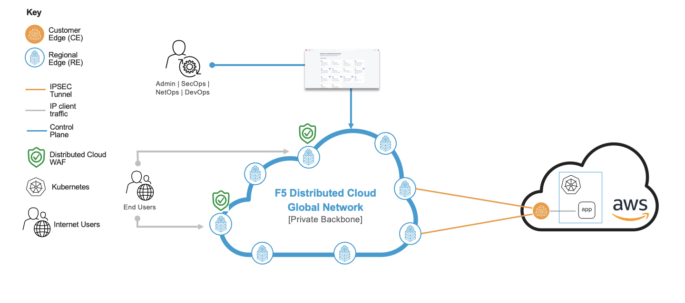

Protect LLM applications against Model Denial of Service 
=============================

--------------

.. contents:: **Table of Contents**

Overview
#########

This demo guide provides step-by-step walkthrough for configurring API Rate Limiting on XC WAF (RE) to protect against Model Denial of Service (OWASP LLM04) a Large Language Model application deployed in a Managed Kubernetes environment (XC CE AppStack site). This demo guide showcases a manual deployment using XC console, while the guide for the terraform scripts to automate the deployment can be found in the `F5 Distributed Cloud Automation Workflow <./automation-demo-guide.rst>`__. For more information on different WAAP deployment modes, refer to the devcentral article: `Deploy WAF on any Edge with F5
Distributed Cloud <https://community.f5.com/t5/technical-articles/deploy-waf-on-any-edge-with-f5-distributed-cloud/ta-p/313079>`__.

**Note:** Even though the scenario here focuses on XC API Security, customers can enable any security services in the same setup, such as WAF, Bot Defense, DoS/DDOS and Fraud, as per their needs.

Setup Diagram
#############

Workflow Instructions
######################

`F5 Distributed Cloud Console Workflow <./xc-console-demo-guide.rst>`__

`F5 Distributed Cloud Automation Workflow <./automation-demo-guide.rst>`__

