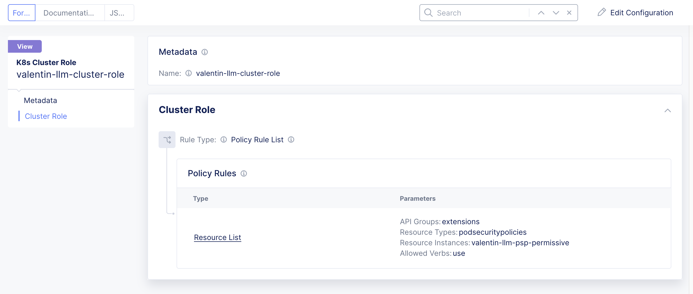
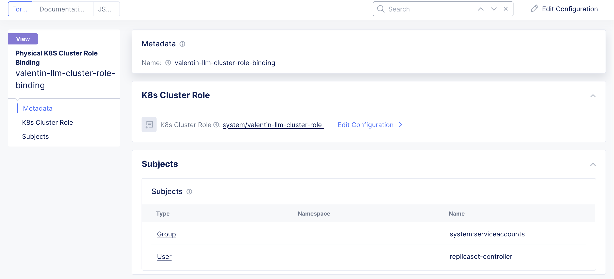
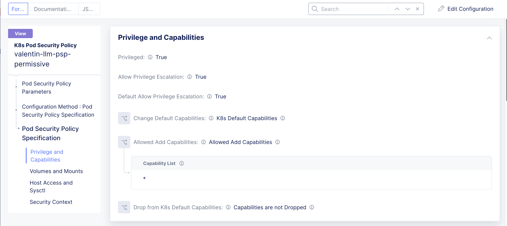
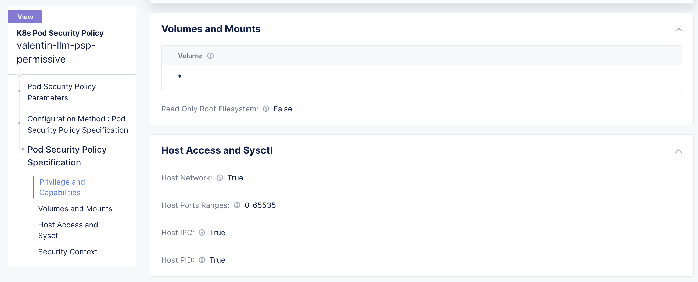
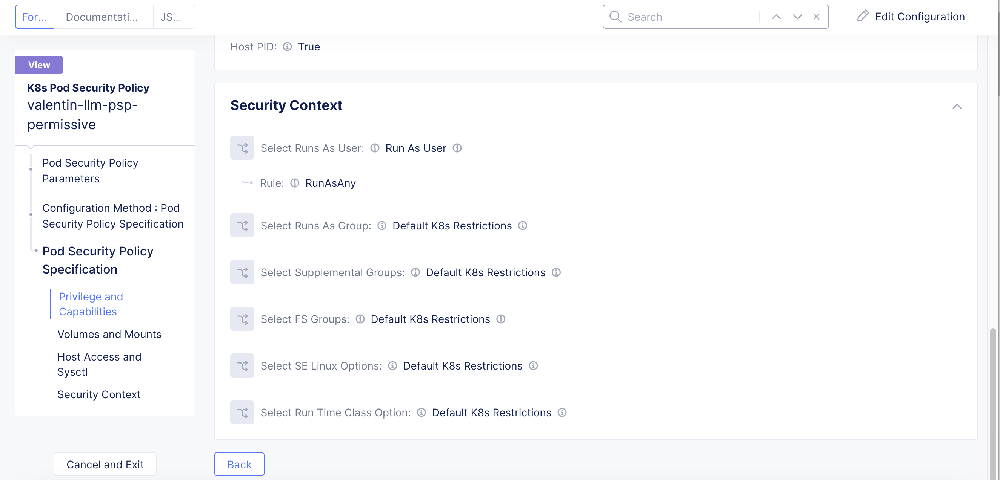
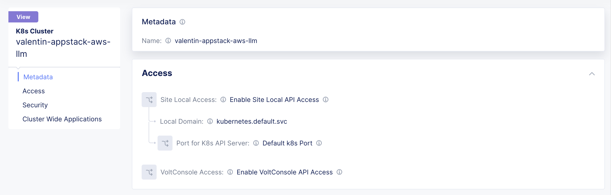
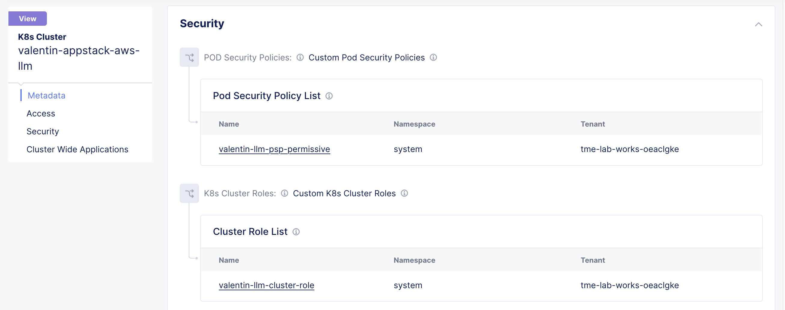
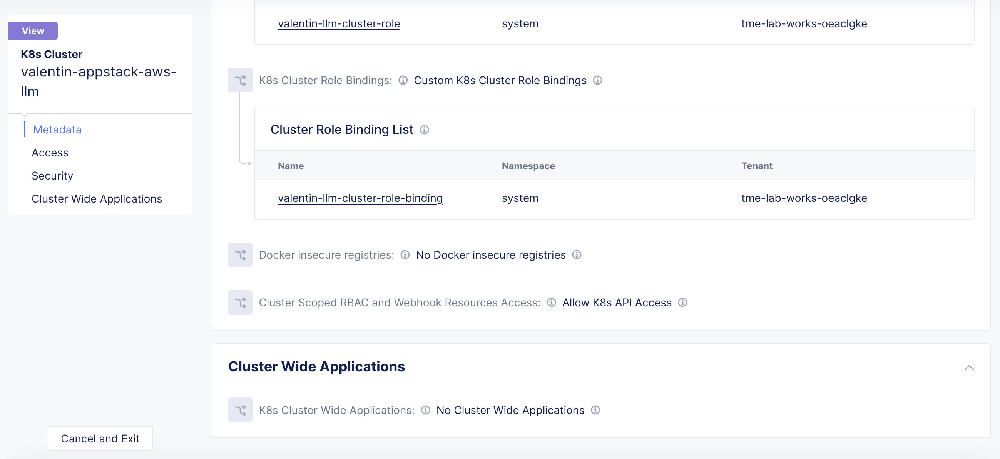

Manual step by step process for the deployment
===============================================

Prerequisites
**************
- Access to an AWS account 
- Access to F5 XC console  
- Install Postman for testing the setup 

Deployment Steps
*****************

1. Create credential for AWS by following the steps mentioned in the `Creating a Credential in F5 Distributed Cloud to use with AWS <https://community.f5.com/t5/technical-articles/creating-a-credential-in-f5-distributed-cloud-to-use-with-aws/ta-p/298111>`_ DevCentral article

2. In 'Distributed Apps' service, go to 'Manage' -> 'Manage K8s' and create a 'K8s Cluster Role':

3. In 'Distributed Apps' service, go to 'Manage' -> 'Manage K8s' and create a 'K8s Cluster Role Binding':

4. In 'Distributed Apps' service, go to 'Manage' -> 'Manage K8s' and create a 'K8s Pod Security Policy':

5. In 'Distributed Apps' service, go to 'Manage' -> 'Manage K8s' and create a 'K8s Cluster':

3. Create Azure AKS cluster. 
      i. From Azure console search for “Kubernetes services”
      ii. Click on Create button and select "Create Kubernetes cluster"
      iii. Select your subscription and set the above created resource group
      iv. Fill in the remaining cluster details and primary node pool fields as needed 
      v. Navigate to “Networking” tab and click on "Bring your own virtual network"
      vi. Select the Virtual network created in Step 2
      vii. Click “Review + create” and create the cluster

4. Select the created AKS cluster and click connect. Follow the instructions to connect to the AKS cluster 

5. Deploy Online boutique demo application using the `manifest file <https://github.com/GoogleCloudPlatform/microservices-demo/blob/main/release/kubernetes-manifests.yaml>`_
            i. Execute ``kubectl apply -f <your_manifest.yaml>`` (Note: we have slightly modified the manifest file)
            ii. Check the status of the pods, execute ``kubectl get pods``

.. figure:: assets/kubectl.JPG

6. Create Azure Vnet site from F5 XC console: 
      i. From the Console homepage, select "Multi-Cloud Network Connect".
      ii. Select "Manage > Site Management", select "Azure VNET Sites" and click on "Add Azure VNET Site".
      iii. Enter a name, optionally select a label and add a description.
      iv. In the Site Type Selection section: 
            a. Enter a new Azure resource group name in the “Resource Group” field, make sure to avoid naming existing resource group names.
            b. Select a region from the Recommended or Alternate Azure Region Names.
            c. Configure Vnet field by selecting "Existing Vnet" and filling in Existing Vnet Resource Group and Existing Vnet Name.
            d. Configure the ingress or ingress/egress gateways.
            e. Select the Azure cloud credentials created in Step 1 
      v. Add a public ssh key in Site Node Parameters section 
      vi. Toggle Show Advanced Fields button for Advanced Configuration section then select “Allow access to DNS, SSH services on Site” for Services to be blocked on site field, Save and Exit. Click Apply. **Note:** It will take 15-20 mins for the site to come online. You can monitor your site health score by navigating to Home > Multi-Cloud Network Connect > Overview > Sites 
      vii. For a more detailed explanation about Azure site creation, refer to the `document <https://docs.cloud.f5.com/docs/how-to/site-management/create-azure-site>`_

.. figure:: assets/az-site.JPG

7. Now, create service discovery object, origin pool and HTTP LB in F5 XC console
            i. Select Multi-Cloud App Connect service 
            ii. Select Manage > Service Discoveries and Click "Add Discovery"
            iii. Add a Name, select vnet site created in Step 6 and select network type as "Site Local Network" 
            iv. Select Discovery Method as "K8S Discovery Configuration" 
            v. Select Kubernetes Credentials as Kubeconfig, and add the Kubeconfig file of AKS Cluster created in Step 3, Apply the changes.
            vi. Select Manage > Load Balancers > HTTP Load Balancers and click Add HTTP Load Balancer 
            vii. Enter a name for the new load balancer. Optionally, select a label and enter a description. 
            viii. In the Domains field, enter a domain name 
            ix. From the Load Balancer Type drop-down menu, select HTTP 
            x. Configure origin pools:
                  a. In the Origins section, click Add Item to create an origin pool.
                  b. In the origin pool field dropdown, click Add Item 
                  c. Enter name, in origin server section click Add Item 
                  d. Select “K8s Service Name of Origin Server on given Sites”: 
                              * Add the service name of frontend microservice as "frontend.default"
                              * Select the Azure Vnet site created in Step 6
                              * Select Network on the site as "Outside Network"      
                  e. In Origin server port add port number "80" of the discovered frontend service , Click continue and then Apply

.. figure:: assets/service-discovery.JPG

.. figure:: assets/origin-server.JPG

* Enable WAF, create and attach a WAF policy in Blocking mode
* Scroll down to “Other settings” section: 
                        a. In VIP Advertisement field select custom 
                        b. Click Configure and then Add Item 
                        c. Select Where to Advertise field to site and add the Azure site created in step2 
                        d. Select Site network to outside, Click Apply, Save and Exit 

.. figure:: assets/vip-advertise.JPG

.. figure:: assets/lb.JPG

Testing
********

1. Open postman 
2. Enter the public IP of the Azure CE site in the URL field 
3. Uncheck the default host header value and create a custom host header with its value as the domain of F5 XC LB 
4. Generate a GET request and monitor the request logs from F5 XC UI dashboard 

.. figure:: assets/request.JPG

.. figure:: assets/request-log.JPG

5. Generate a XSS attack by adding <script> tag as a query parameter in the above GET request and monitor the security event logs from F5 XC UI dashboard 

.. figure:: assets/attack.JPG

.. figure:: assets/security-event.JPG

Step by step process using automation scripts
#############################################

Please refer `automation-demo-guide.rst <./automation-demo-guide.rst>`__ for more details.

**Support**
############

For support, please open a GitHub issue. Note, the code in this repository is community supported and is not supported by F5 Networks. 
