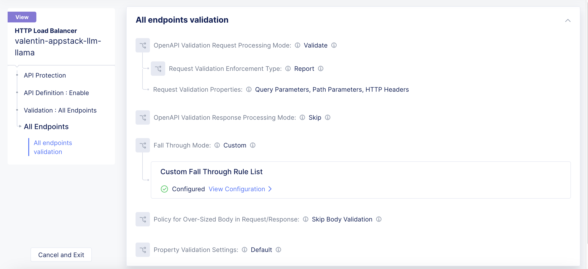

Manual step by step process for the deployment
===============================================

Prerequisites
**************
- Access to an AWS account 
- Access to F5 XC console 
- A LLM inference engine docker image (for the purpose of this experiment llama.cpp was used)
- A K8s deployment (referencing the docker image) and service definition for the LLM workload
- Install Postman for testing the setup 

Deployment Steps
*****************

1. Create credential for AWS by following the steps mentioned in the `Creating a Credential in F5 Distributed Cloud to use with AWS <https://community.f5.com/t5/technical-articles/creating-a-credential-in-f5-distributed-cloud-to-use-with-aws/ta-p/298111>`_  DevCentral article

2. In 'Administration' service, go to 'Personal management' -> 'My Namespeaces' and create a new namespace.
Note: For the K8s service to be discovered, the XC namespace name will need to be the same as the Managed K8s namespace where the LLM workload will be deployed 

3. In 'Distributed Apps' service, go to 'Manage' -> 'Manage K8s' and create a 'K8s Cluster Role':

4. In 'Distributed Apps' service, go to 'Manage' -> 'Manage K8s' and create a 'K8s Cluster Role Binding':

5. In 'Distributed Apps' service, go to 'Manage' -> 'Manage K8s' and create a 'K8s Pod Security Policy':

6. In 'Distributed Apps' service, go to 'Manage' -> 'Manage K8s' and create a 'K8s Cluster':

.. figure:: assets/k8s_cluster_2.png

.. figure:: assets/k8s_cluster_3.png

7. In 'Multi-Cloud Network Connect' service, go to 'Manage' -> 'Site Management' and create an 'AWS VPC Site':

Note: 
      1. Add the 'Public SSH Key', step not shown here.
      2. For this example AWS instance type was set to t3.xlarge 

8. In 'Multi-Cloud Network Connect' service, go to 'Manage' -> 'Site Management' and deploy the newly created 'AWS VPC Site'

9. Wait until the 'AWS VPC Site' has been successfully deployed

.. figure:: assets/aws_vpc_site_deployed.png

10. In 'Distributed Apps' service, go to 'Managed K8s' -> 'Overview' and download the 'Global Kubeconfig':

11. Using the kubectl utility and the 'Global Kubeconfig' file, apply the LLM deployment and service

Note: For the K8s service to be discovered, the K8s namespace where the LLM workload will be deployed will need to be the same as the existing XC namespace name  

12. In 'Web App & API Protection' service, go to 'Manage' -> 'Load Balancers' -> 'Origin Pools' and add a new 'Origin Pool':

12. In 'Web App & API Protection' service, go to 'Manage' -> 'Load Balancers' -> 'HTTP Load Balancers', add a new 'HTTP Load Balancer', add your own domain name (configuration shown here is for the purpose of this test only), point to the origin pool created earlier and enable the Web Application Firewall with the default profile:

13. In the 'API Protection' section, enable the "API Definition", add the Swagger spec file (for the purpose of this demo, we used the OpenAI Swagger spec) and configure 'Validation' of API calls to deny all calls under path 'v1' which are not found within the Swagger spec:

.. figure:: assets/api_sec_2.png

14. In the 'Common Security Controls', enable 'Rate Limiting' and configure a treshold of 4 requests per minute for API Endpoint 'v1/chat/completions'

Testing
********

1. Open Postman and send a request to 'v1/chat/completions', for example asking what is the capital of France:

.. figure:: assets/postman_1.png

2. Open Postman Runner and run the same request for 100 iterations with a delay of 1 second (1000 ms) beween each request:

You can see the 429 'Too Many Requests' response received from F5 Dsitributed Cloud, enforcing the rate limit configured for '/v1/char/completions' API endpoint.

Step by step process using automation scripts
#############################################

Please refer `automation-demo-guide.rst <./automation-demo-guide.rst>`__ for more details.

**Support**
############

For support, please open a GitHub issue. Note, the code in this repository is community supported and is not supported by F5 Networks. 
