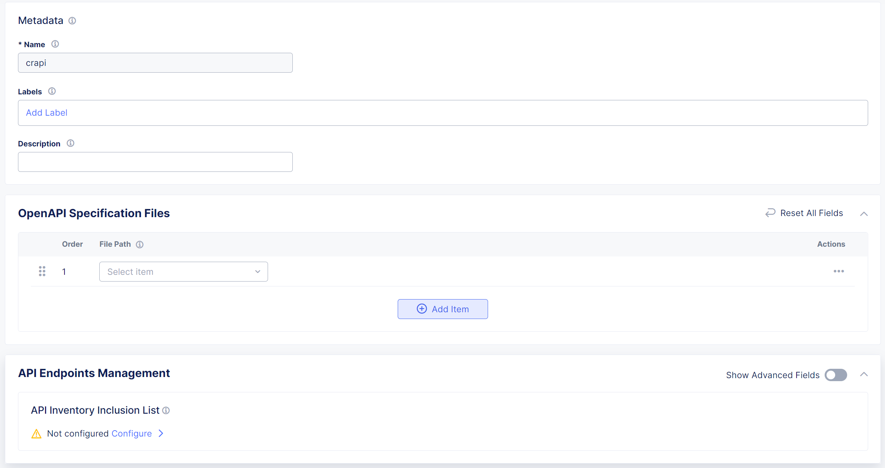
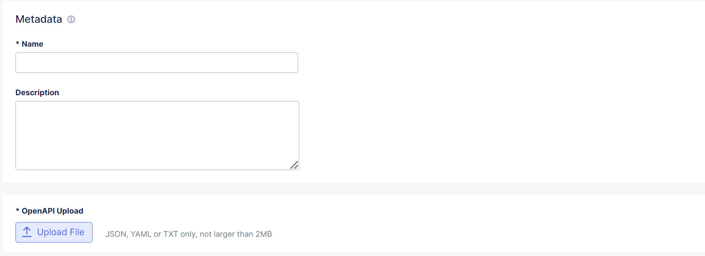

**Deploy F5XC API Security on Customer Edge in AWS EKS Console Guide**
==================================================================

Prerequisites:
--------------

1. AWS (Amazon Web Services) account with CLI credentials
2. eksctl, kubectl and awscli tools already configured in a linux instance
3. .yml files needed for deployment (these files are available in workflow-guides/waf/f5-xc-apisec-on-ce-k8s/assets folder)
4. Access to F5 XC account

EKS and CE Steps:
-----------------

**STEP 1:**  Set aws credentials as environment variables. If k8s cluster (EKS) is not already available, then from Linux terminal, check below command to deploy EKS. If needed update it as per you requirements.
    ``eksctl create cluster --name ce-eks-new --version 1.29 --region us-west-1 --nodegroup-name standard-workers --node-type t3.xlarge --nodes 1 --managed --kubeconfig admin.conf``

**STEP 2:**  Create an IAM OIDC identity provider ( for configuration steps click `here <https://docs.aws.amazon.com/eks/latest/userguide/enable-iam-roles-for-service-accounts.html>`__ ) and an IAM role with permission policy: "AmazonEBSCSIDriverPolicy" ( for configuration steps click `here <https://docs.aws.amazon.com/eks/latest/userguide/csi-iam-role.html>`__ follow this document till step 10).

**STEP 3:**  Add "Amazon EBS CSI driver" add-on to the created EKS cluster and attach the IAM role created in STEP 2 to this add-on.

**STEP 4:**  Once done, run below command to obtain kubeconfig. If you want to use existing EKS, then update name and region in below command.
    ``aws eks update-kubeconfig --name ce-eks-new --region us-west-1``

**STEP 5:**  Login to your F5 XC console and navigate to “Multi-Cloud Network Connect”, next to “Manage” tab “Site Management” menu and then to “Site Tokens” drop-down. Create a new site token and copy the UID.

**STEP 6:**  Download ce_k8s.yml file from `here <https://raw.githubusercontent.com/f5devcentral/f5-xc-terraform-examples/main/workflow-guides/waf/f5-xc-waf-on-k8s/assets/ce_k8s.yml>`__. Open the ce_k8s.yml file and update Latitude, Longitude, token ID & other fields (from lines 143-158) as per your infrastructure.

**STEP 7:**  Run this command to deploy the CE site - ``kubectl apply -f ce_k8s.yml``

**STEP 8:**  In F5 XC console navigate to Multi-Cloud Network Connect -> Manage -> Site management –> then to Registrations tab and approve the pending record

**STEP 9:**  Wait for 10-15 mins and check all XC related pods are running in "ves-system" namespace of EKS cluster. Also check if this new CE site comes up as online with health score as '100' in F5 XC console sites list. (Navigate to Multi-Cloud Network Connect -> Overview -> Sites)

**STEP 10:**  Clone the `repo <https://github.com/OWASP/crAPI>`__, run command: ``git clone https://github.com/OWASP/crAPI.git``

**STEP 11:**  Install the helm chart:
    ``cd deploy/helm
    helm install --namespace crapi crapi . --values values.yaml``

**STEP 12:**  If crapi namespace is not getting created, run ``kubectl create ns crapi`` and re-run command ``helm install --namespace crapi crapi . --values values.yaml``.

XC HTTP Load Balancer
---------------------

**STEP 1:** Log in to the F5 Distributed Cloud Console and naviate to ``Web App & API Protection``.

**STEP 2:** Once in Web App and API Protection Select ``Manage > Load Balancers > HTTP Load Balancers`` and then ``Add HTTP Load Balancer``

**STEP 3** In the HTTP Load Balancer pane, under Metadata give the Load Balancer a name and under ``Domains and LB Type`` provide the Fully Qualified Domain Name(FQDN) of your applicaiton in the ``Domains`` field and under Load Balancer Type, ensure ``HTTP Redirect to HTTPS`` is selected.

XC Origin Pool
--------------

a. Select k8s service name and provide value as "crapi-web.crapi".
b. In Sites section, select newly created CE site from drop-down.
c. In network option, select "Outside network".
d. Save above configs and in port section provide 80 as port number.

**STEP 1** In the ``Origins`` section of the HTTP Load Balaner creation pane, select ``Add Item`` to bring up the Origin Pool addition page.

**STEP 2** In the Origin Pool addition page, under ``Origin Pool with Weight and Priority`` use the ``Origin Pool`` dropdown to select select ``Add Item`` to bring up the Origin Pool creation Page.

**Step 3** In the Origin Pool creation page, provide a name under ``Metadata``, choose ``Add Item`` in ``Origin Servers`` section.

**Step 4** Use the ``Select Type of Origin Server`` dropdown and select  ``K8s Service Name of Origin Server on given Sites``. Set the ``Service Name`` field to "crapi-web.crapi", use the ``Site`` dropdown and choose the newly created site, change the ``Select Network on the Site`` dropdown to ``Outside Network``, and then click the ``Apply`` button at the bottom of the page.

**Step 5** In the Origin Pool creation page, set port as "80", click ``Continue`` followed by ``Apply``.

XC API Protection
-----------------

**STEP 1** Use the Navigation Panel on the left and select ``API Protection``, then click the ``API Definition`` dropdown and select ``Enable``.

**STEP 3** Click the ``API Definition`` selection dropdown and click ``Add Item`` to bring up the API Definition creation page.

**STEP 4** Give the API Definition a name and then under ``Swagger Specs`` use the dropdown and click ``Upload Swagger File`` to bring up the Open API Spec(OAS) creation page.

**STEP 6** Give the Swagger(OAS) file a name and under ``Swagger Upload``, choose ``Upload File`` to upload the OAS associated with `Bookinfo <https://raw.githubusercontent.com/istio/istio/master/samples/bookinfo/swagger.yaml>`__ and then select ``Continue`` at the bottom of the page.

**STEP 7** To enable OAS request validation, select the ``Validation`` dropdown and choose ``All Endpoints``.(This can also be configured based on API Groups, base paths, or specific API endpoints using ``Custom List``)

**STEP 8** The request validation properties for ``All Endpoints`` will be configured with defaults values. To enable response validation and customize the properties, click ``View Configuration``.

**STEP 9** To customize request validation, on the all endpoints validation page choose your ``Request Validation Enforcement Type``\ (Report or Block) and click ``Request Validation Properties`` dropdown to select the additional validation properties that best suit the deployed application.

**STEP 10** To enable response validation, click the ``OpenAPI Validation Response Processing Mode`` dropdown and select validate, then choose your ``Response Validation Enforcement Type``\ (Report or Block) and click ``Response Validation Properties`` dropdown to select the additional properties that best suit the deployed application.

.. image:: assets/14-api-pro-val4.png

**STEP 11** Select the ``Fall Through Mode`` dropdown and choose ``Custom``, then under ``Custom Fall Through Rule List`` click ``Configure``.

**STEP 12** Select ``Add Item`` to bring up the Custom Fall Through Rule List creation page.

**STEP 13** Give the rule a name, choose the desired Rule Action(Block, Report, or Skip), and under ``Type`` choose ``Base Path`` and enter ``/`` into the ``Base Path`` field.(This can also be configured based on API Groups or specific API endpoints)

**STEP 14** Select the ``API Discovery`` dropdown and choose ``Enable``. To also enable learning based on HTTP response codes of 300, select the ``Learn from Traffic with Redirect Reponse`` and choose ``Enable``. Click ``Apply`` and the bottom of the page to return to the HTTP Load Balancer creation page.

**STEP 15** To complete the configuration, navigate to the bottom of the HTTP Load Balancer creation page and click ``Save and Exit``.

**NOTE** If needed, please delete all resources created manually from bottom to cleanup the infra for ex. XC resources first then EKS and finally AWS resources.

Development
-----------

Outline any requirements to setup a development environment if someone would like to contribute. You may also link to another file for this information.

Support
-------

For support, please open a GitHub issue. Note, the code in this repository is community supported and is not supported by F5 Networks.
