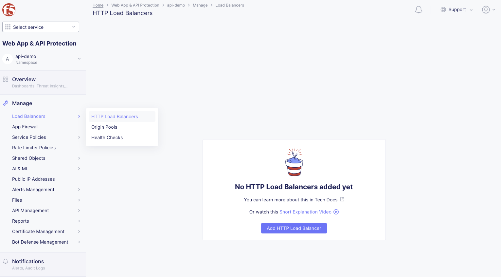
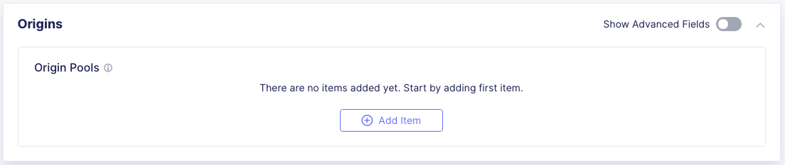
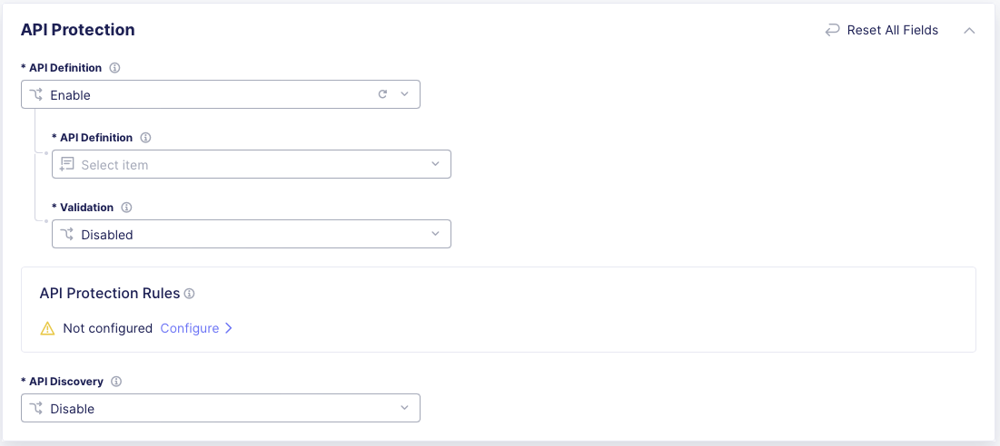
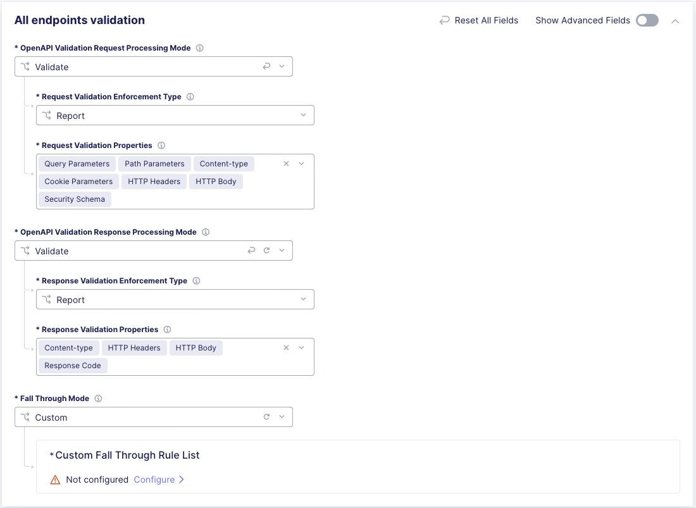
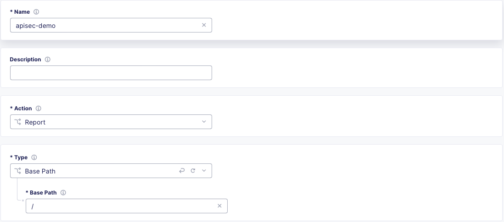
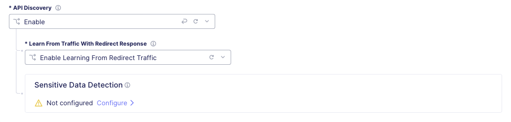
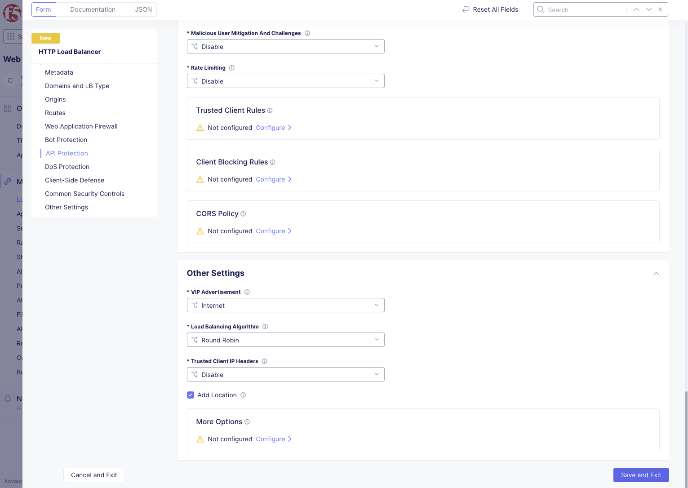

# F5 Distributed Cloud API Security Console Deployment

These instructions are for Deploying API Security on F5 Distributed Cloud (XC) based on the demo assocaited with [Out of the Shadows: API Discovery and Security](https://community.f5.com/t5/technical-articles/out-of-the-shadows-api-discovery-and-security/ta-p/303789) and is not inclusive of all available options. Further information and How-Tos are available on the [F5 Distributed Cloud](https://docs.cloud.f5.com/docs/how-to/app-security) documentation site.

## Prerequisites

[AWS Infra and EKS Deployment Instructions](https://github.com/f5devcentral/f5-xc-waap-terraform-examples/blob/main/aws/console.md)

### Console

* [F5 Distributed Cloud Account (F5XC)](https://console.ves.volterra.io/signup/usage_plan)
  * [User Domain delegated](https://docs.cloud.f5.com/docs/how-to/app-networking/domain-delegation)
  * API Deployed and [Added as a pool in F5 Distributed Cloud](https://docs.cloud.f5.com/docs/how-to/app-networking/origin-pools)

## Assets

* **xc:**        F5 Distributed Cloud WAAP

## Console Workflow

**Kubernetes Deployment**

**Origin Pool Creation**

**HTTP Load Balancer**

**STEP 1:** Log in to the F5 Distributed Cloud Console and naviate to `Web App & API Protection`.

**STEP 2:** Once in Web App and API Protection Select `Manage > Load Balancers > HTTP Load Balancers` and then `Add HTTP Load Balancer`

**STEP 3** In the HTTP Load Balancer pane, under Metadata give the Load Balancer a name and under `Domains and LB Type` provide the Fully Qualified Domain Name(FQDN) of your applicaiton in the `Domains` field and under Load Balancer Type, ensure `HTTP Redirect to HTTPS` is selected.

**Origin Pool**

**STEP 1** In the `Origins` section of the HTTP Load Balaner creation pane, select `Add Item` to bring up the Origin Pool creation page.

**STEP 2** In the Origin Pool creation page, under `Origin Pool with Weight Priority` use the `Origin Pool` dropdown to select your pool and then click the `Apply` button at the bottom of the page.

**API Protection**

**STEP 1** Use the Navigation Panel on the left and select `API Protection`, then click the `API Definition` dropdown and select `Enable`.

**STEP 3** Click the `API Definition` selection dropdown and click `Add Item` to bring up the API Definition creation page.

**STEP 4** Give the API Definition a name and then under `Swagger Specs` use the dropdown and click `Upload Swagger File` to bring up the Open API Spec(OAS) creation page.

**STEP 6** Give the Swagger(OAS) file a name and under `Swagger Upload`, choose `Upload File` to upload the OAS associated with your deployed application and then select `Continue` at the bottom of the page.

**STEP 7** To enable OAS request validation, select the `Validation` dropdown and choose `All Endpoints`.(This can also be configured based on API Groups, base paths, or specific API endpoints using `Custom List`)

**STEP 8** The request validation properties for `All Endpoints` will be configured with defaults values.  To enable response validation and customize the properties, click `View Configuration`.

**STEP 9** To customize request validation, on the all endpoints validation page choose your `Request Validation Enforcement Type`(Report or Block) and click `Request Validation Properties` dropdown to select the additional validation properties that best suit the deployed application.

**STEP 10** To enable response validation, click the `OpenAPI Validation Response Processing Mode` dropdown and select validate, then choose your `Response Validation Enforcement Type`(Report or Block) and click `Response Validation Properties` dropdown to select the additional properties that best suit the deployed application.

**STEP 11** Select the `Fall Through Mode` dropdown and choose `Custom`, then under `Custom Fall Through Rule List` click `Configure`.

**STEP 12** Select `Add Item` to bring up the Custom Fall Through Rule List creation page.

**STEP 13** Give the rule a name, choose the desired Rule Action(Block, Report, or Skip), and under `Type` choose `Base Path` and enter `/` into the `Base Path` field.(This can also be configured based on API Groups or specific API endpoints)  

**STEP 14** Select the `API Discovery` dropdown and choose `Enable`.  To also enable learning based on HTTP response codes of 300, select the `Learn from Traffic with Redirect Reponse` and choose `Enable`.  Click `Apply` and the bottom of the page to return to the HTTP Load Balancer creation page.

**STEP 15** To complete the configuration, navigate to the bottom of the HTTP Load Balancer creation page and click `Save and Exit`.

**NOTE** This completes the configuration shown in the [Out of the Shadows: API Discovery and Security](https://community.f5.com/t5/technical-articles/out-of-the-shadows-api-discovery-and-security/ta-p/303789) article and demo video.  This is not inclusive of all available configuration options.
