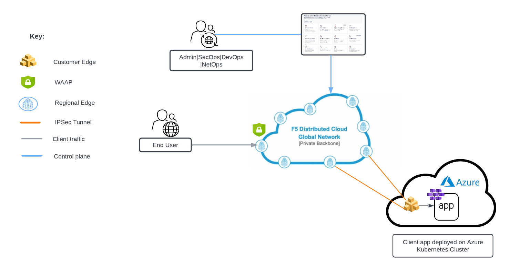

F5XC API Security + AppConnect in Kubernetes Cluster Deployment
=============================================================
 
F5 Distributed Cloud API Security is a comprehensive solution to securely manage APIs across any data center or cloud using a simple, fast, and scalable architecture. It helps drive business velocity by enabling automated API deployments and management, while also protecting against API-specific threats. Distributed Cloud API Security, part of the F5 Distributed Cloud Web App and API Protection (WAAP) solution, delivers a broad approach to API security with a combination of management, monitoring, and enforcement functionality.

Distributed Cloud API Security allows organizations to easily and effectively discover unknown APIs, as well as monitor and secure APIs with continuous learning, inspection, and schema enforcement capabilities. With the service in place, organizations can quickly discover, learn, and map an app's API endpoints and communication paths, including unknown/shadow or old, outdated APIs. This delivers a complete view into all the connections within an app's ecosystem.

Introduction :
---------------
WAAP is a set of security services which protects applications from known application threats thereby providing WAF, DDOS prevention, API Security and bot mitigation solution. To safeguard our modern applications which are residing inside a k8s cluster, we have to integrate this solution as part of data plane workflow. In this article we are going to provide a possible solution for deploying WAF in the customer existing k8s infra using F5 XC. 

Use this repo configuration files and work-flow guides for the deployment for WAAP (on RE)+ AppConnect scenario in which application is deployed in Kubernetes Cluster. 
Please check `Out of the Shadows: API Discovery and Security article <https://community.f5.com/kb/technicalarticles/out-of-the-shadows-api-discovery-and-security/303789>`__ 
for more inforation on F5 Distributed Cloud API Protection.

Architectural diagram :
------------------------

Step by step process for F5 XC console based deployment:
--------------------------------------------------------
`Console Workflow <./console.rst>`

Step by step process for Terraform based deployment:
----------------------------------------------------
`Automation Workflow <./automation.rst>`
