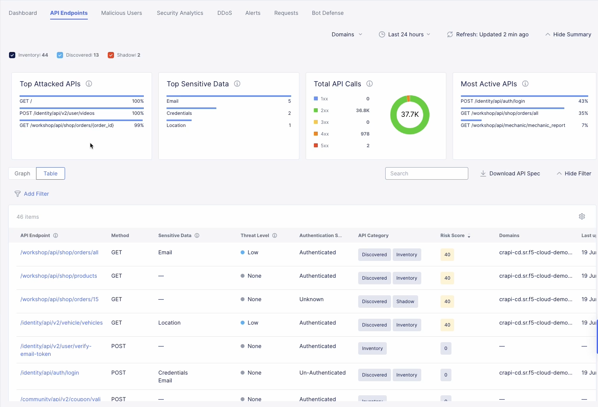

# F5 Distributed Cloud API Security 

F5 Distributed Cloud API Security is a comprehensive solution to securely manage APIs across any data center or cloud using a simple, fast, and scalable architecture. It helps drive business velocity by enabling automated API deployments and management, while also protecting against API-specific threats. Distributed Cloud API Security, part of the F5 Distributed Cloud Web App and API Protection (WAAP) solution, delivers a broad approach to API security with a combination of management, monitoring, and enforcement functionality.

Distributed Cloud API Security allows organizations to easily and effectively discover unknown APIs, as well as monitor and secure APIs with continuous learning, inspection, and schema enforcement capabilities. With the service in place, organizations can quickly discover, learn, and map an app's API endpoints and communication paths, including unknown/shadow or old, outdated APIs. This delivers a complete view into all the connections within an app's ecosystem.

## Overview

This repo contains detailed information and instructions on Deploying API Security on F5 Distributed Cloud (XC) on F5's Regional Edge. Refer to [Out of the Shadows: API Discovery and Security](https://community.f5.com/t5/technical-articles/out-of-the-shadows-api-discovery-and-security/ta-p/303789) for a quick summary and any additional resources.

## Instructions

[F5 Distributed Cloud Console Workflow](https://github.com/f5devcentral/f5-xc-waap-terraform-examples/blob/main/workflow-guides/api-security/f5-xc-apisec-on-re/console.md)

[F5 Distributed Cloud Automation Workflow](https://github.com/f5devcentral/f5-xc-waap-terraform-examples/blob/main/workflow-guides/api-security/f5-xc-apisec-on-re/automation.md)
