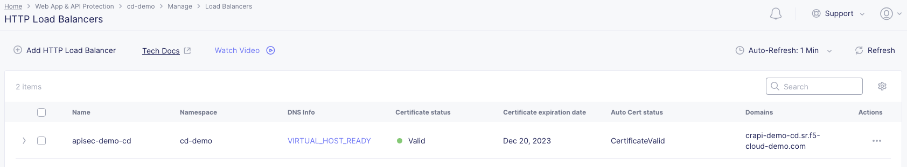
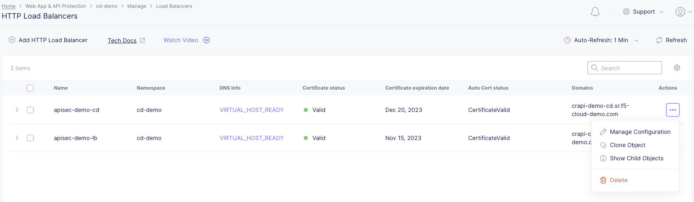

# F5 Distributed Cloud API Security Console Deployment

## Prerequisites

### Console

* [F5 Distributed Cloud Account (F5XC)](https://console.ves.volterra.io/signup/usage_plan)
  * [User Domain delegated](https://docs.cloud.f5.com/docs/how-to/app-networking/domain-delegation)
  * API Deployed and [Added as a pool in F5 Distributed Cloud](https://docs.cloud.f5.com/docs/how-to/app-networking/origin-pools)

## Assets

* **xc:**        F5 Distributed Cloud WAAP

## Console Workflow

**STEP 1:** Log in to the F5 Distributed Cloud Console and naviate to Web App & API Protection.

**STEP 2:** From Web App and API Protection Select Manage > Load Balancers > HTTP Load Balancers

**STEP 3** Under Actions click the three dots next to your Load Balancer and select Manage Configuration

**STEP 4** 