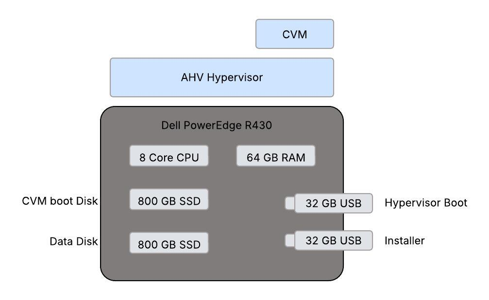
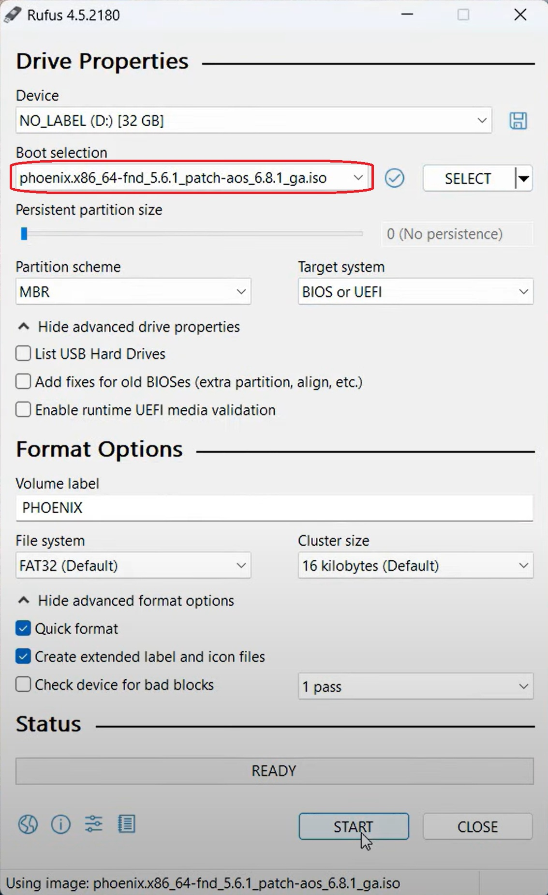

Installation of Nutanix Community Edition 2.1 on Bare Metal
==========================================================================

Introduction:
***************
Nutanix Community Edition (CE) 2.1 is a community supported version of Nutanix’s hyperconverged software. It allows to deploy and testing new workloads using Nutanix’s Acropolis Hypervisor (AHV). AHV offers an intuitive and easy way to manage virtual environments with optimized performance and reliability.

Recommended Hardware:
***************
Below are the following hardware requirements for running CE in our environment, 

* CPU: Intel Sandy Bridge (VT-x or AVX), or AMX Zen or later, 4 cores minimum
* Memory: 32 GB minimum, 64 GB or greater recommended 
* NIC: Intel or Realtek, 1 GbE or 2.5 GbE 

* HBA: AHCI SATA or LSI Controller with IT mode (best) or IR mode (Passthrough or Raid-O) 

* Storage device: Data disk with 500 GB minimum, 18 TB maximum (can be SSD or HDD) 

* Storage device: CVM (hot-tier flash) with 200 GB minimum (must be SSD) 

* Hypervisor Boot Disk: 32GB minimum (for external drives, use USB 3.0) 

* Imaging Software: Open-source imaging software such as Rufus. 

Reference page for `Recommended Hardware for Community Edition <https://portal.nutanix.com/page/documents/details?targetId=Nutanix-Community-Edition-Getting-Started-v2_1:top-sysreqs-ce-r.html>`__ section. 

My setup:
***************

For my setup, I installed single node cluster on Dell PowerEdge R430 with Intel NIC with following specs,

* CPU: 2 x Intel® Xeon® CPU E5-2620 v4 

* Memory: 64 GB 

* NIC: Intel NIC 10 GbE 4P X710 Adapter 

* HBA: AHCI SATA 

* Storage device: Data disk of SSD with 800 GB 

* Storage device: CVM of SSD with 800 GB 

* Hypervisor Boot disk: 32 GB USB 3.0 device 

* Imaging Software: Nutanix ISO booted using Rufus to USB 3.0 drive 

Above screenshot shows the Dell PowerEdge R430 HW that I brought up to install Nutanix CE. After connecting necessary USB drives such as Installer and Hypervisor boot and other HW, I have installed AHV Hypervisor followed by Controller Virtual Machine (CVM) for managing the storing and providing the management plane. Once everything is up and running, we login to CVM or cluster’s external IP address to create virtual machines.

Detailed process of Nutanix CE installation is below.

Procedure to Install Nutanix CE 2.1:
***************

Below are the series of steps to be followed to install CE on any Bare Metal server,

Make sure that you have a valid `Nutanix Community <https://next.nutanix.com/>`__ account, if not sign up to `Nutanix registration page <https://my.nutanix.com/page/signup>`__.  

1. Prepare installation media 

2. Install Nutanix Community Edition 

3. Create and configure a single-node cluster 

4. Access the Web Console 

Step 1: Preparing installation media

After registering to Nutanix account, go to the `Community Edition discussion forum <https://next.nutanix.com/discussion-forum-14>`__and click the **Download Community Edition** topic.

**Note:** Nutanix recommends using drive with USB 3.0 or later to avoid networking and installation timeouts, but you can use virtual media to perform installation. Nutanix recommends a smaller capacity than all the other drivers (Data & CVM) on the node.

Under **Installer ISO**, click the download link. Image the installation device with the installer ISO file.

Download the latest edition of `Rufus <https://rufus.ie/en/>`__` here and open the application. Select the downloaded ISO image and rest of the configs were set to default, click on start button to image. Once the process is done, eject the USB drive and insert it to selected Bare Metal HW.

Before proceeding installing Nutanix CE, gather the following information that is required during installation process,

* Host IP address (for CE hypervisor host) 

* Controller VM (CVM) IP address 

* Subnet mask 

* Gateway 

* DNS, NTP, and proxy server IP addresses (if applicable)

Step 2: Installing Nutanix CE 2.1 

