Installing Nutanix Community Edition 2.1 on VMware 
==========================================================================

Nutanix on VMware: 
***************
Nutanix is a unified platform to run applications and manage data across on-premises datacenters, public clouds. This helps in compute, storage, virtualization, and networking. In this documentation, we explain the steps to install Nutanix Community Edition (CE) on VMware ESXi.

Recommended Resources: 
***************
Below are the following resources requirements for running CE in our environment,

* Memory: 32 GB minimum, 64 GB or greater recommended  
* 4 CPU core minimum 
* 64 GB boot disk minimum 
* 200 GB Hot Tier Disk minimum for CVM 
* 500 GB Cold Tier Disk minimum for Data 

Reference page for `Recommended Hardware for Community Edition <https://portal.nutanix.com/page/documents/details?targetId=Nutanix-Community-Edition-Getting-Started-v2_1:top-sysreqs-ce-r.html>`__ section.  

Procedure to install Nutanix CE 2.1 on VMware: 
***************
Below are the series of steps to be followed to install CE on any VMware ESXi host, similar steps applicable for vSphere client as well. 

Make sure that you have a valid `Nutanix Community <https://next.nutanix.com/>`__ account, if not sign up to Nutanix `registration page <https://my.nutanix.com/page/signup>`__.  

1. Upload Image to datastore 
2. Create a virtual machine 
3. Install Nutanix CE 
4. Access the web console

**Step 1: Uploading Image to datastore**

At first, we need to download the image from `Community Edition Discussion Form <https://next.nutanix.com/discussion-forum-14>`__ and click the Download Community Edition topic. Under Installer ISO, click the download link and Image gets downloaded to the local machine. 

Once the download is successful, Login to VMware ESXi host with credentials and navigate to Storage > Datastores, select the target datastore, open the Datastore browser, click Upload, and then select the ISO file from your local machine to begin the transfer.

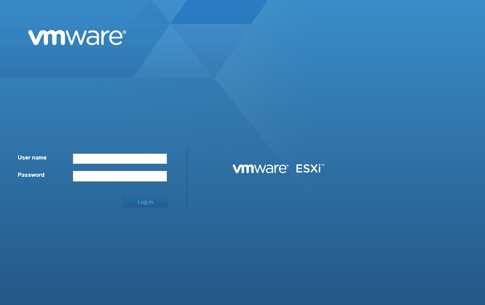

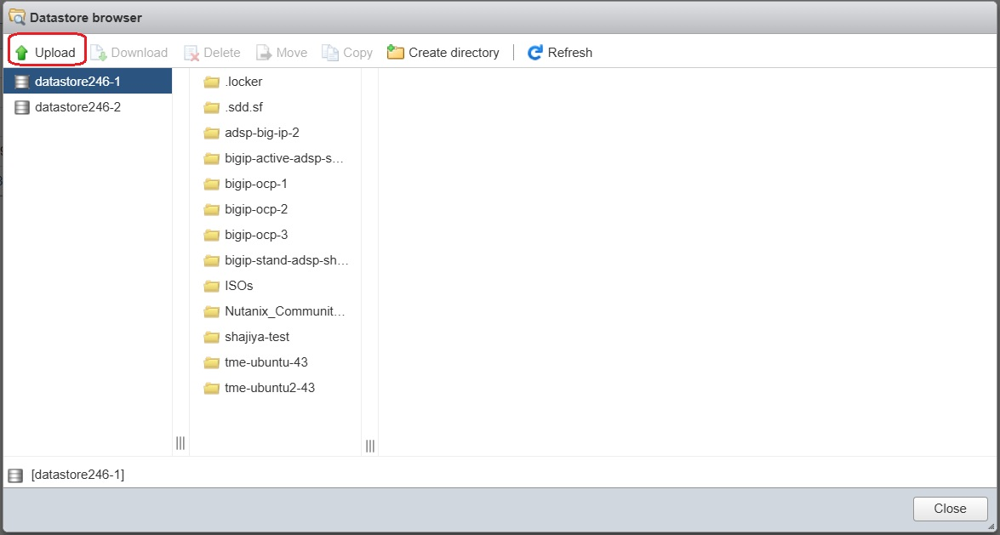

Once the upload is complete, refresh the Datastore Browser to see the uploaded ISO file. 

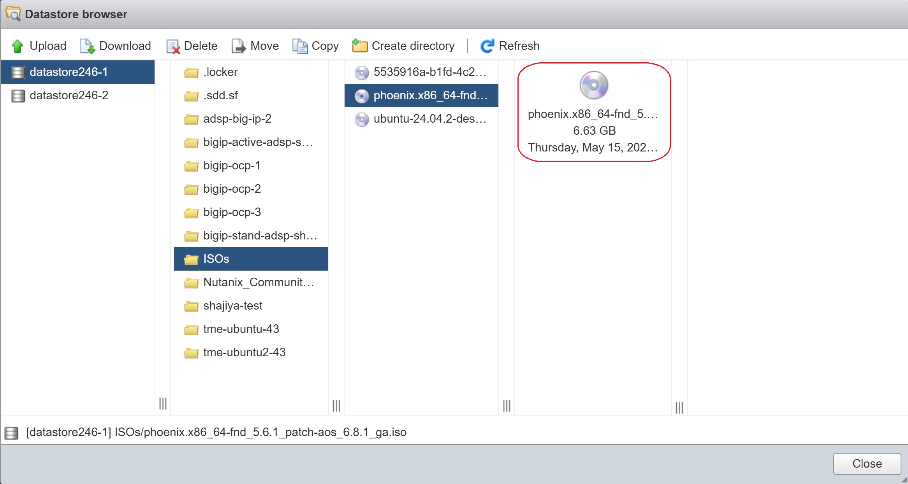

**Step 2: Creating a virtual machine**

Below are the steps to create a virtual machine with Nutanix CE ISO uploaded to VMware ESXi machine, 

* From the ESXi login, click the Create/Register VM button.

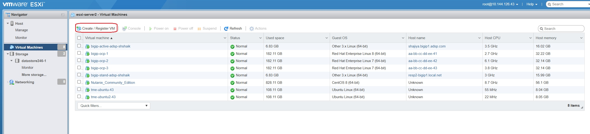

* Click on create a new virtual machine and click next.

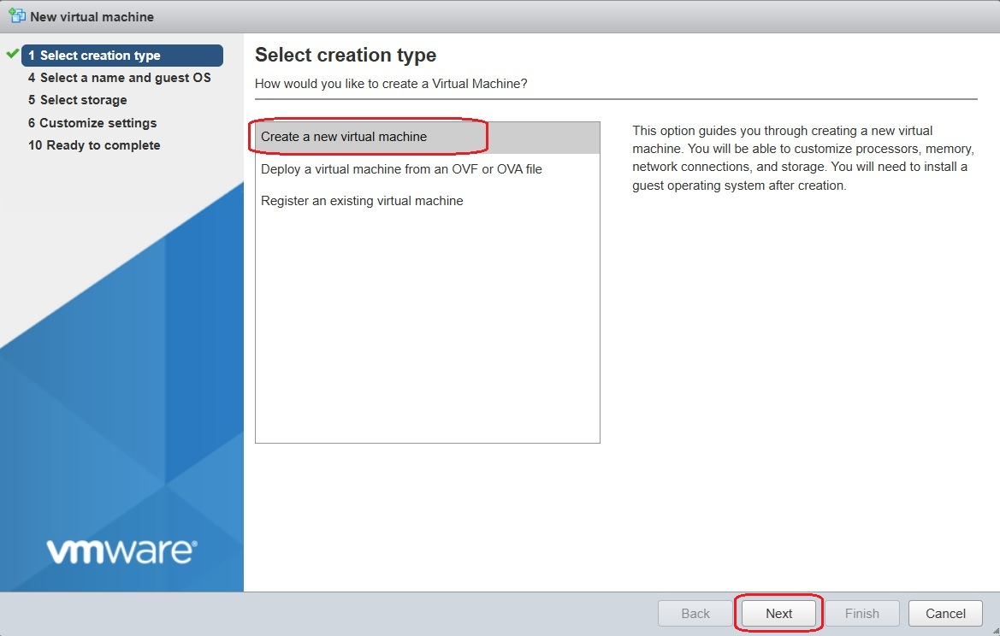

* Enter a valid name for your virtual machine. 
* Select the appropriate compatibility for your environment, I have selected ESXi 6.7 virtual machine. 
* Choose Guest OS family as Linux. 
* Select guest OS version as Centos 7 (64-bit) or above. I have selected Centos 8 (64-bit). Click on Next. 

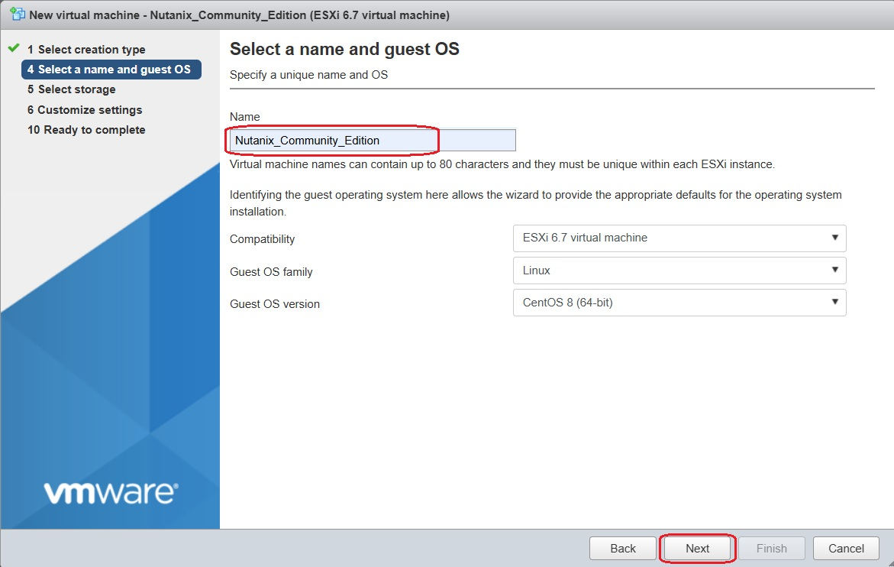

* From the Select Storage, choose the datastore where the virtual machine’s configuration and disk files will be stored. Click on Next. 

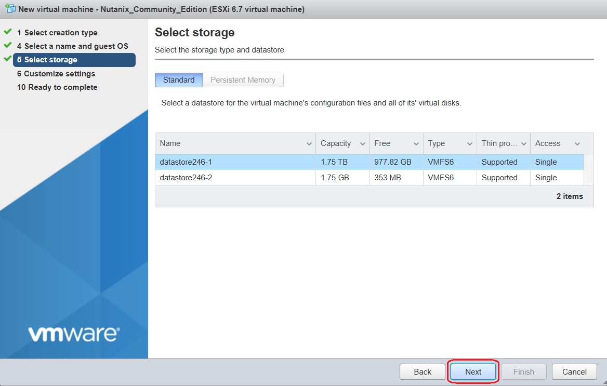

* On the following screen of customize settings, CPU, Memory, hard disks as mentioned in Recommended Resource section above. Click on “Add hard disk” button to add additional Hard disk for CVM and data.
* I have selected CPU as 4, Memory is 32, 3 hard disk with 64 GB, 200 GB, 500 GB each. 
* Select the Network Adapter 1 as Network that has internet connectivity. In my case, my network is “VM Network”.

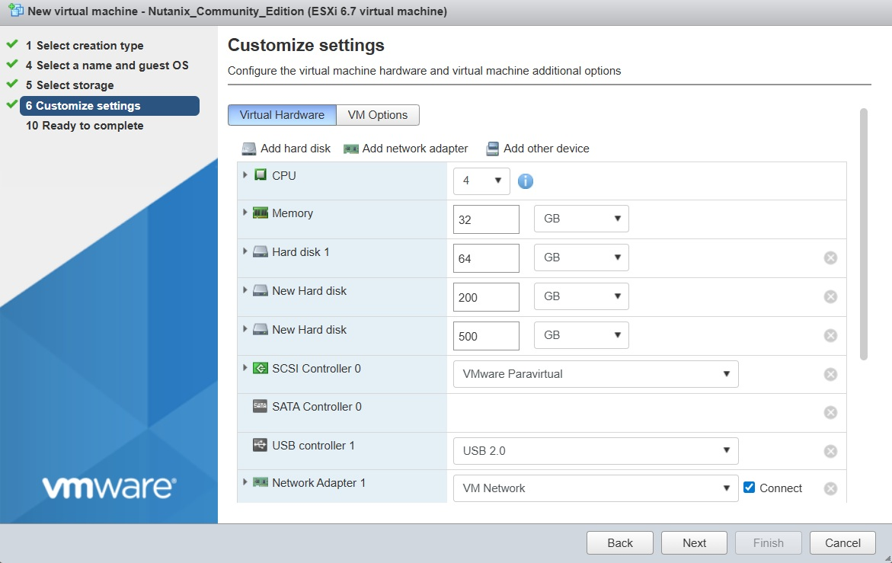

* Scroll down a bit and hover over to CD/DVD Drive 1 and select Datastore ISO file from the dropdown menu. 

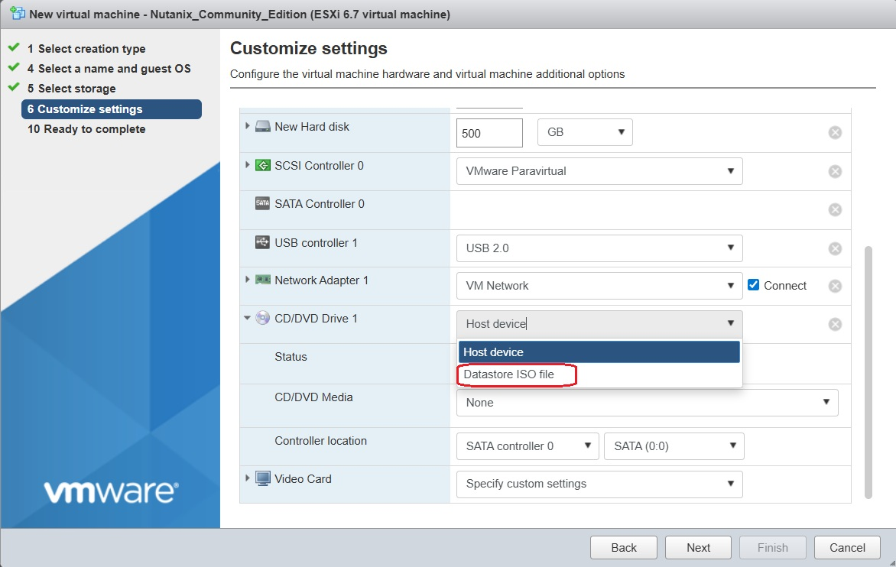

* Select the ISO file that was uploaded at step 1. 

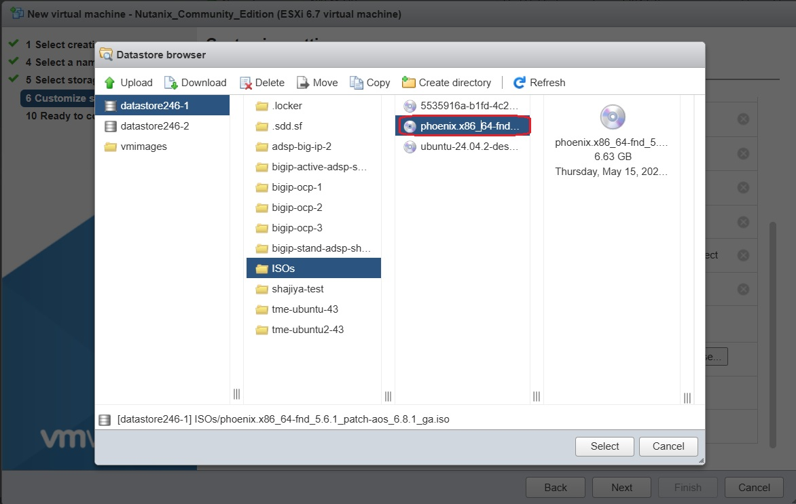

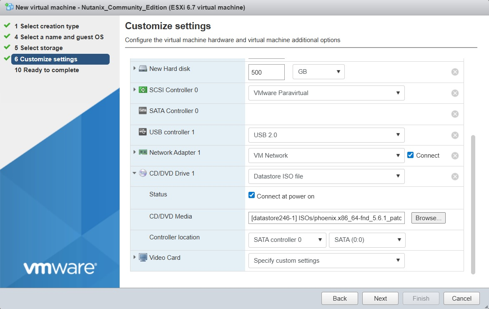

* Click on VM options to add disk.EnableUUID=TRUE in the VMX file manually. This is needed to get the disk serials populated during Nutanix bootup process. 

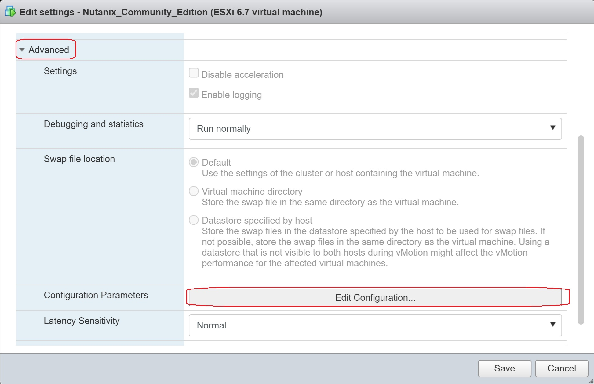

* Under the Advanced section, Click on Edit Configuration.
* Scroll down to the bottom and Click on Add Parameter, you can able to see Click to edit key and click to edit value. 

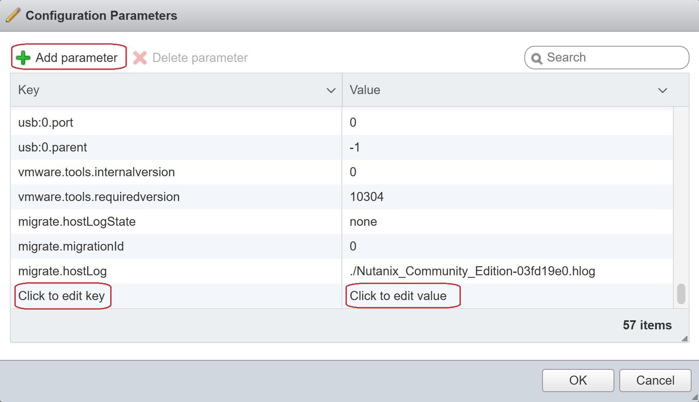

* Enter the key as disk.EnableUUID and value as TRUE. 

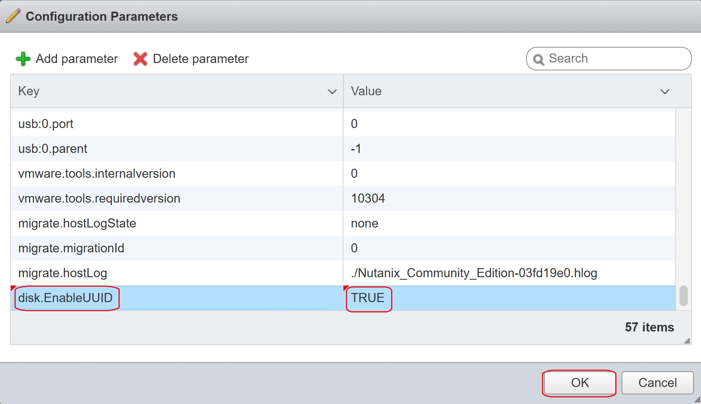

* Click on okay.

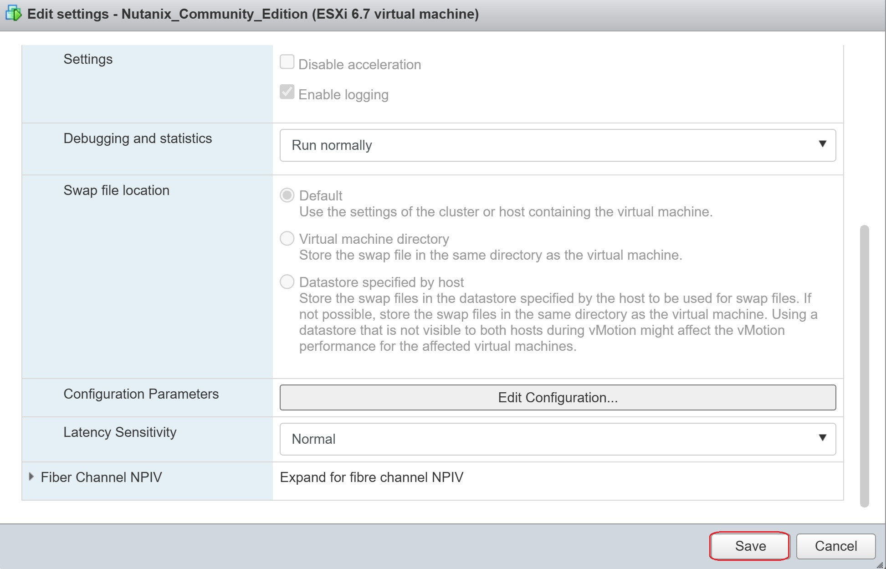

* Click on Save.  
* Click on Power on to switch on the virtual machine. 

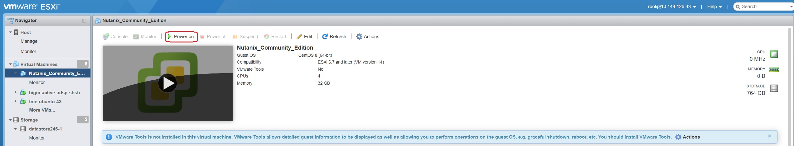

Once instance is powered on, click on console to access the instance for CE installation. 
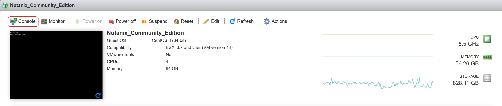

Logs show the installation on Nutanix CE and take couple of minutes to get to installer screen. 

**Note:** Make sure you set Promiscuous mode, MAC address changes, Forged transmit to Accept in virtual switch settings, 

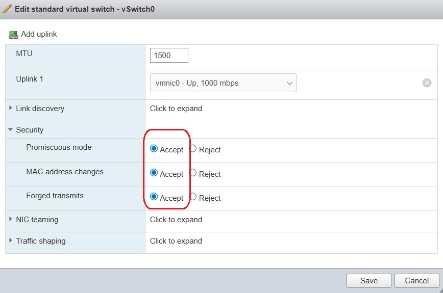

**Step 3: Installing Nutanix CE on VMware**
    **Step 3.1: Installing CE on VMware**
    Below are the steps gives detailed steps to configure single node cluster on VMware ESXi. 
    Before proceeding for the installation, make sure you have a list of IP-Addresses available on your own LAN, 

    * 2 IP addresses for AHV and CVM
    * 1 IP address for cluster 
    * Gateway and Netmask address details 

    These IP addresses should be on the same network as where your machine is available in. We are going to use the bridge network functionality from VMware ESXi so that AHV, CVM and cluster IP are available on your network.

    I have configured my setup details as below,

        * 10.144.126.61, 10.144.125.62 for AHV and CVM 
        * 10.144.126.63 for Cluster IP 
        * 10.144.126.254 and 255.255.255.0 as Gateway and Netmask 

    Installer screen logs shown as below, 

    .. figure:: Assets/ce-install.jpg
    
    When the boot sequence finishes, the CE installer dialog appears,

    .. figure:: Assets/ce-install-dialog.jpg

    In the screenshot mentioned above, Hypervisor selection is AHV, and Hard disks were selected for CVM boot disk and others as Data disk. Use Tab to navigate to the Disk Selection field.  
    
    Use the up arrow and down arrow keys to navigate between the disk selection, use C to confirm the CVM boot disk, H to confirm the hypervisor boot disk selection, Similarly D for Data Disk. 
    
    Provide the networking information such as Host IP address, CVM IP Address, Subnet Mask and Gateway that you gathered. 
    
    Press Tab to select Next Page and press Enter. 

    Read the end-user license agreement (EULA). Use the up arrow and down arrow keys to scroll. Press Tab to navigate to the I accept the end user license agreement checkbox.

    .. figure:: Assets/eula-license-aggrement.jpg

    Press the spacebar to select the checkbox. Use the arrow keys to navigate to Start and press Enter to start the installation process. 

    Installation process as follows, 

    .. figure:: Assets/ce-install-process-1.jpg

    .. figure:: Assets/ce-install-process-2.jpg

    .. figure:: Assets/ce-install-process-3.jpg
    
    Before proceeding to the bootup, need to initiate the boot sequence from AHV virtual disk, to get it done, we are going to disable the CD/DVD drive 1 from which initial boot sequence was initiated. 

    * Disabled Connect at power on checkbox. 
    
    .. figure:: Assets/ce-install-disable-power-on.jpg
    
    * A pop up shows, ejecting the CD-ROM to initiate the bootup process, 

    * Click on Yes and click on Answer. 

    .. figure:: Assets/ce-install-dialog-answer.jpg

    * Enter the Y key and press Enter. 

    .. figure:: Assets/ce-install-enable-y.jpg
    
    Now the VM will be booted with AHV. 

    .. figure:: Assets/nutanix_ce_install.jpg

    **Step 3.2: Creating and configuring single node cluster**

    Once you are at the AHV, you can see the login prompt, you can login with default credentials with username as root and password as nutanix/4u 

    It takes sometimes to come up for creating of cluster. 

    .. figure:: Assets/cluster-creation-login.jpg

    Now, ssh to CVM with the CVM IP address (you can also use CVM internal IP 192.168.5.2) with username: nutanix and password as nutanix/4u

    .. figure:: Assets/cluster-creation-process-1.jpg
    
        * Execute “watch -d genesis status” command to check if genesis is running. 
    
    .. figure:: Assets/cluster-creation-genesis-status.jpg

    This confirms genesis is running (there are pids behind the service name). Press CTRL + C to quit watch. 

    Now, we are good to execute command for single node creation, 

        * For a single node cluster, the command is: **cluster -s <cvm_ip> --redundancy_factor=1 –-cluster_external_ip=<cluster_ip>**

    It may take a while as the cluster is created, and all services are started on the CVM.

    .. figure:: Assets/cluster-creation-cluster-cmd.jpg

    .. figure:: Assets/cluster-creation-cluster-success.jpg

    This confirms cluster is successfully created as shown in above screenshot. 

        * Execute the ncli cluster cmd to add name server to the cluster: **ncli cluster add-to-name-servers servers=<name_server_ip>**

    .. figure:: Assets/cluster-creation-name-server.jpg

    Cluster is created successfully and ready to be accessed.

**Step 4: Accessing the Web Console**

We can be able to access the Nutanix console using CVM IP or External IP provided during cluster creation. 

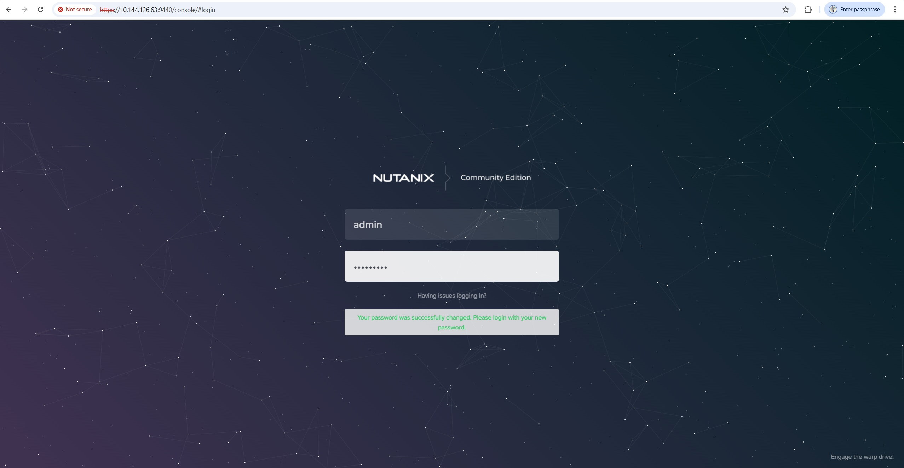

Sign in with default admin account username and password. 
    * Username: admin 
    * Password: nutanix/4u 

When prompted, change the default password. 

Sign in with the admin account username and the new password. 

After login with the new password, you will see the page details as below, 

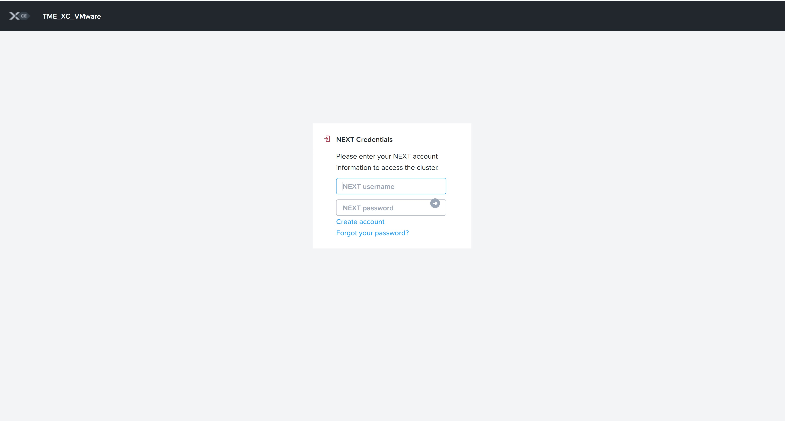

You need to login with your Nutanix Community account.  

Click Create account if you have not joined the Next Community. Community Edition check to ensure that the Community Edition role associated with your account is enabled. To enable the community Edition role, register at `Nutanix Website <https://www.nutanix.com/products/register>`__. 

If you have already registered to the Nutanix community, Click on Activate button on Community Edition tile and enter your registered email id for registration. 

Now, login to above prompt with Nutanix credentials and page takes you to Nutanix dashboard.

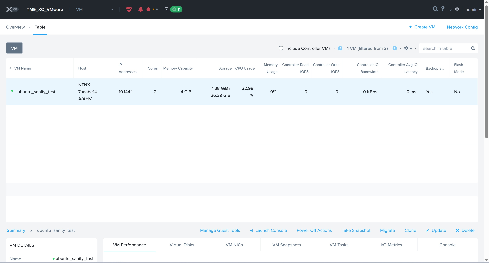

Now, VM instance can be created from the console. 

**Conslusion:**

Creating virtual machines becomes easier within Nutanix Community Edition and helps in connecting these services to Nutanix Cloud Cluster (NC2) as well. As mentioned in this documentation on creating Nutanix CE with detailed steps helps in bringing up the setup for deploying virtual machines in it. 

**Additional Links:**

For more details, guidance on Nutanix CE installation, refer to the official documentation below,

https://www.jeroentielen.nl/installing-nutanix-community-edition-ce-on-vmware-workstation/

https://next.nutanix.com/ 

https://my.nutanix.com/page/signup 

https://www.nutanix.com/products/community-edition/register 

https://portal.nutanix.com/page/documents/details?targetId=Nutanix-Community-Edition-Getting-Started:top-sysreqs-ce-r.html 

https://portal.nutanix.com/page/documents/details?targetId=Nutanix-Community-Edition-Getting-Started-v2_1:top-installing-ce-t.html 

https://portal.nutanix.com/page/documents/details?targetId=Nutanix-Community-Edition-Getting-Started-v2_1:top-cluster-creating-ce-c.html 

    

    

    