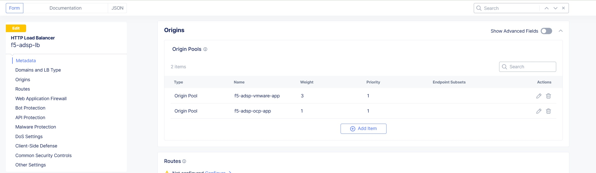
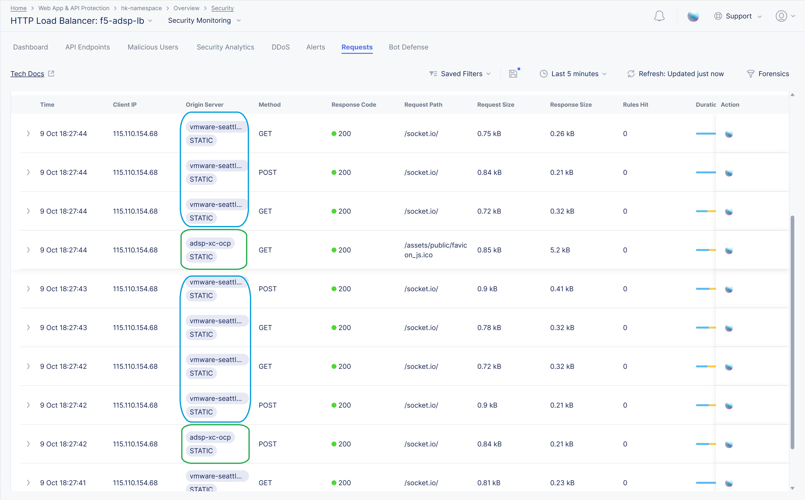
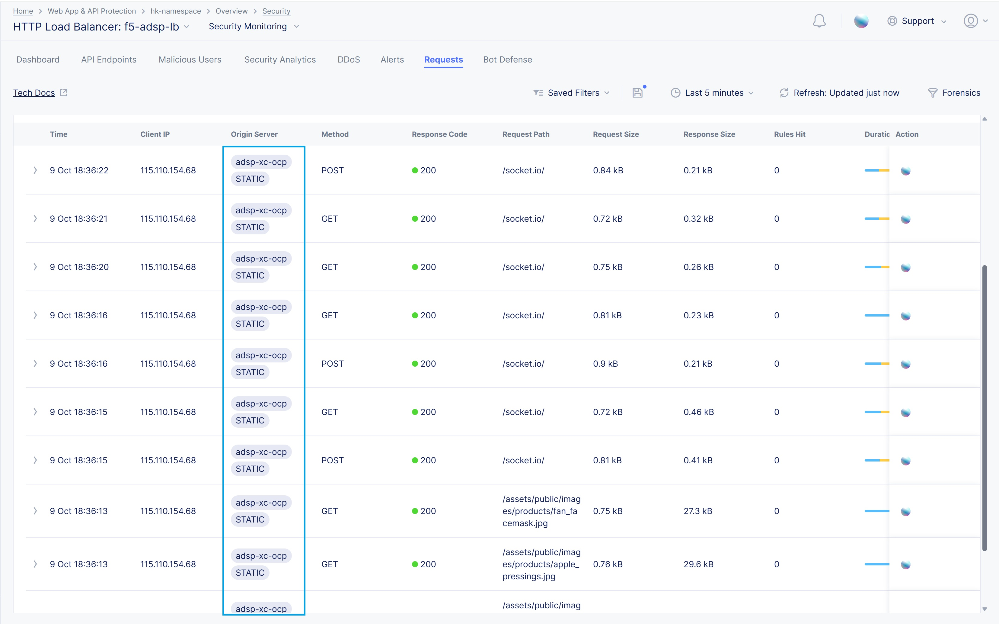
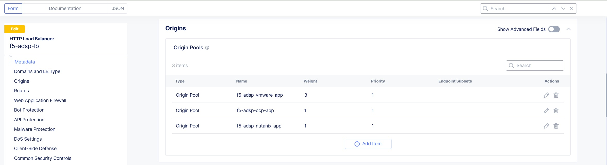
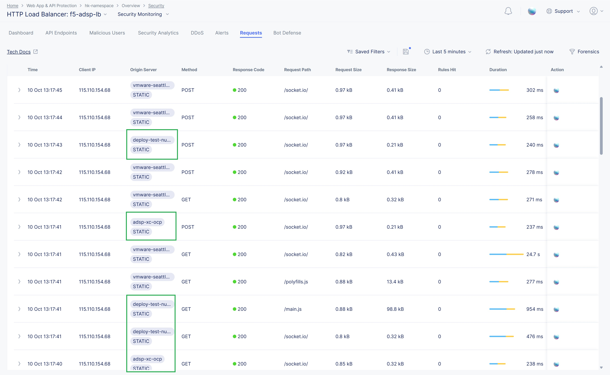
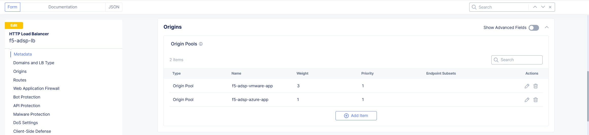
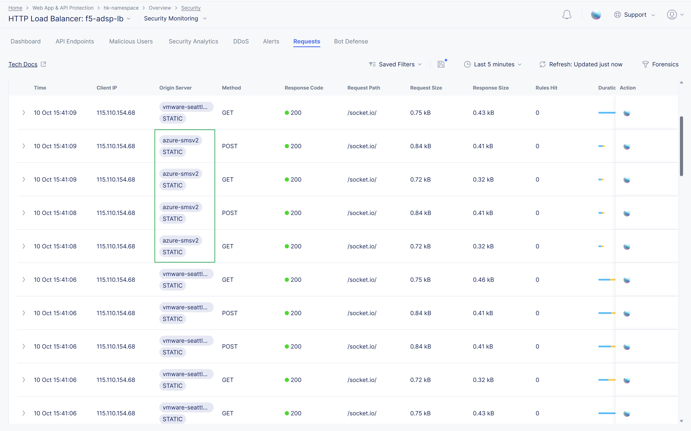
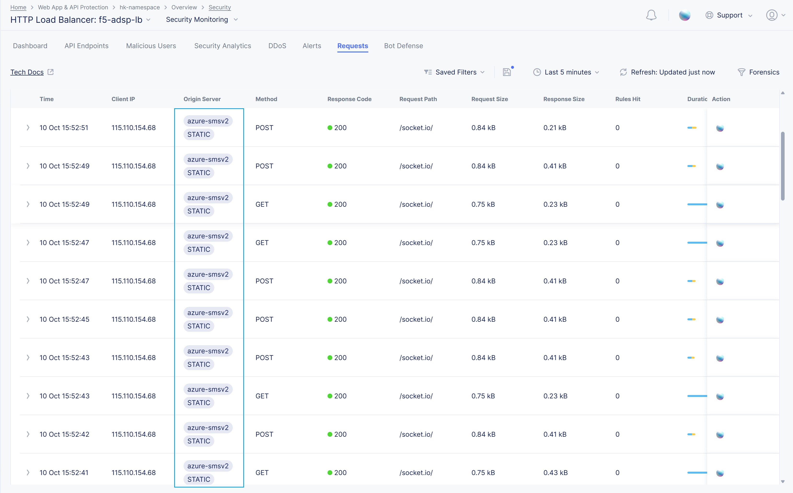

F5 Distributed Cloud Application Migration across Heterogeneous Environments
#########################################################
Scope
--------------
As enterprises evolve their infrastructure strategies, migrating application traffic across heterogeneous environments becomes critical for modernization, cost optimization, compliance, or decommissioning legacy platforms. Often, the same application is deployed across multiple platforms—including VMware, Nutanix, OpenShift, and public clouds—creating a foundation for flexible and resilient traffic distribution.

F5 Distributed Cloud simplifies application traffic migration by enabling unified traffic management through its global load balancing and Origin Pool capabilities. By including multiple environments within the same Origin Pool and adjusting traffic weights, organizations can dynamically shift user traffic from one environment to another—whether gradually or instantly—without impacting application availability or performance. This approach ensures controlled, secure, and observable migration of workloads across cloud and on-premises infrastructures.

Introduction
--------------
This article examines the challenges and strategies for migrating application traffic across heterogeneous environments in enterprise-scale infrastructures. Common migration scenarios include:

- Moving critical applications from VMware on-prem to Nutanix infrastructure, optimizing for performance, availability, and cost efficiency while maintaining security and compliance.

- Migrating workloads from VMware on-premises to OpenShift Container Platform (OCP), ensuring smooth transitions between traditional VMware environments and modern Kubernetes-based platforms.

- Shifting applications from VMware clusters to public clouds (AWS, GCP, and Azure), enabling greater scalability, global reach, and flexibility while ensuring minimal disruption during migration.

F5 Distributed Cloud enables organizations to seamlessly manage traffic migration by dynamically adjusting routing policies without affecting application performance or security. By utilizing Origin Pools and traffic weighting within the F5 Distributed Cloud Console, enterprises can migrate user traffic between environments such as AWS, Azure, GCP, VMware, Nutanix, and OpenShift with complete visibility and control.

As shown in the diagram under each scenario, when migrating traffic between different platforms, F5 Distributed Cloud orchestrates the smooth handoff of traffic, ensuring consistency in security policies, real-time observability, and the continued performance of applications during the migration process.

Architecture Overview
--------------
.. image:: ../workload/assets/ADSP-Growth-Architecture-New.png

**VMware:** VM is created in VMware ESXi deployed in Dell PowerEdge-R640 bare metal. The VM is booted using the OVF image of SMSv2 CE downloaded from F5 Distributed Cloud. Once the CE VM is up and site is online, VM running application workloads is also deployed in the same ESXi and connected to CE using Site Local Inside (SLI) subnet and interface, so that applications are not exposed directly.

*Note: This scenario uses VMware On-Prem, but it can also be deployed on GCP and Azure.*

`F5 Distributed Cloud Application Migration Setup on VMware | F5 XC Solutions <https://github.com/f5devcentral/f5-xc-terraform-examples/blob/main/workflow-guides/application-delivery-security/migration/application-migration-setup-vmware.rst>`__

**OpenShift Container Platform (OCP):** 3-node OCP cluster is created on VMware. SMSv2 CE as VM is deployed using KVM (qcow) image in OCP cluster virtualization. VM running application workloads is also deployed and connected to CE using Site Local Inside (SLI) subnet and interface, so that applications are not exposed directly.

*Note: This scenario uses OCP Datacenter (On-Prem), but it can also be deployed on AWS, GCP, IBM and Azure.*

`Installation of Red Hat OpenShift Infra Setup on VMware ESXi | F5 XC Learn <https://github.com/f5devcentral/f5-xc-terraform-examples/blob/main/workflow-guides/application-delivery-security/workload/ocp-infra-setup.rst>`__

`F5 Distributed Cloud Application Migration Setup on OCP | F5 XC Solutions <https://github.com/f5devcentral/f5-xc-terraform-examples/blob/main/workflow-guides/application-delivery-security/migration/application-migration-setup-ocp.rst>`__

**Nutanix on VMware:** Nutanix Community Edition 2.1 is installed as VM in VMware ESXi. Nutanix console can be accessed by accessing this VM. This gives flexibility to scale RAM, hard disk to the Nutanix VM, and helps in adding multiple application instances in it. A CE node using SMSv2 is deployed in Nutanix along with an application(s) and is connected using SLI there by protecting application(s) in the Nutanix platform. F5 XC protects these application VMs deployed in Nutanix using XC security solutions such as WAF, DDoS, API and Bot defense etc.

`Installation of Nutanix Community Edition on VMware ESXi | F5 XC Learn <https://github.com/f5devcentral/f5-xc-terraform-examples/blob/main/workflow-guides/application-delivery-security/Nutanix_on_VMware/Nutanix_CE_2.1_installation_on_VMware.rst>`__

`F5 Distributed Cloud Workload Deployment on Nutanix on VMware ESXi | F5 XC Solutions <https://github.com/f5devcentral/f5-xc-terraform-examples/blob/main/workflow-guides/smsv2-ce/Secure_Mesh_Site_v2_in_Nutanix/secure_mesh_site_v2_in_nutanix.rst>`__

**Cloud Env:** For this demo Azure is chosen for deploying SMSv2 CE site. In the same resource group where CE VM is deployed, VM running application workloads is also deployed and connected to CE using Site Local Inside (SLI) subnet and interface, so that applications are not exposed directly.

*Note: Similarly, this deployment can be achieved in GCP and AWS using the links below.*

- AWS -> `Deploy Secure Mesh Site v2 on AWS <https://docs.cloud.f5.com/docs-v2/multi-cloud-network-connect/how-to/site-management/deploy-sms-aws-clickops>`__
- Azure -> `Deploy Secure Mesh Site v2 on Azure <https://docs.cloud.f5.com/docs-v2/multi-cloud-network-connect/how-to/site-management/deploy-sms-az-clickops>`__
- GCP -> `Deploy Secure Mesh Site v2 on GCP <https://docs.cloud.f5.com/docs-v2/multi-cloud-network-connect/how-to/site-management/deploy-sms-gcp-clickops>`__

Note: `Customer Edge Site Sizing Reference <https://docs.cloud.f5.com/docs-v2/multi-cloud-network-connect/reference/ce-site-size-ref>`__

`F5 Distributed Cloud Application Migration Setup on Azure | F5 XC Solutions <https://github.com/f5devcentral/f5-xc-terraform-examples/blob/main/workflow-guides/application-delivery-security/migration/application-migration-setup-azure.rst>`__

Scenario:
--------------
Migration use case – Common application (Juice shop) is deployed across all the environments (VMware, Nutanix, OCP and Azure), using F5 Distributed Cloud Console migration can be carried out by including the environments in Origin Pool and adjusting the weights based on which user traffic will be routed.

Scenario 1: Migration from VMware to Nutanix
--------------

.. image:: ./assets/1.png

In this scenario, application traffic is being migrated from VMware (On-Prem) environment to Nutanix (On-Prem) environment. This is achieved by deploying the same application in both environments and gradually shifting traffic by adjusting the weight assigned to each environment. At first, we start sending the traffic to newly integrated platform, which is Nutanix in this case, upon success, then we steer the traffic proportionally. We set weights initially as follows:

    VMware weight - 3 and Nutanix weight - 1

.. image:: ./assets/origin_pool_configs.jpg

.. image:: ./assets/start_traffic_to_vmware.jpg

From the above screenshot, you can able to see a small portion (highlighted in green) of traffic is reaching the Nutanix platform and application in it is well accessible using F5 XC.

Now, we further steer more traffic to the Nutanix by modifying the weight as below, which will lead to complete migration of traffic from VMware to Nutanix platform,

    VMware weight - 0 and Nutanix weight - 1

.. image:: ./assets/migrated_to_nutanix.jpg

As we can see from the above screenshot, all the traffic is migrated to Nutanix platform and no request is flowing through VMware.

Verifying WAF security
~~~~~~~~~~
In this step, we verify that the F5 Distributed Cloud WAF continues to protect the integrated platform from attacks before, during, and after migration. To validate this, we send a series of malicious requests that should be consistently blocked by the WAF to ensure continuous delivery and security.

.. image:: ./assets/curl-malicious.png

.. image:: ./assets/1-3.png

From the “Requests” section in Distributed Cloud console for the LB, we can see that malicious requests are blocked by Web Application Firewall (WAF) which won’t reach the origin server.

Scenario 2: Migration from VMware to OCP
--------------

.. image:: ./assets/2.png

In this scenario, application traffic is being migrated from VMware (On-Prem) environment to OpenShift Container Platform (On-Prem) environment. This is achieved by deploying the same application in both environments and gradually shifting traffic by adjusting the weight assigned to each environment. Initially, we start sending traffic to newly integrated platform, which is OCP in this case, then we steer traffic proportionally. we have set the weights as follows:

    VMware weight - 3 and OCP weight - 1

From the above screenshot, you can able to see a small portion of traffic is reaching the OCP platform and application in it is well accessible using F5 XC.

Now, we further steer more traffic to OCP by modifying the weight as below, which will lead to complete migration of traffic from VMware to OCP platform,

    VMware weight - 0 and OCP weight - 1

As we can see from the above screenshot, all the traffic is migrated to OCP platform and no request is flowing through VMware.

Verifying WAF security
~~~~~~~~~~
In this step, we verify that the F5 Distributed Cloud WAF continues to protect the integrated platform from attacks before, during, and after migration. To validate this, we send a series of malicious requests that should be consistently blocked by the WAF to ensure continuous delivery and security.

.. image:: ./assets/curl-malicious.png

.. image:: ./assets/2-3.png

From the “Requests” section in Distributed Cloud console for the LB, we can see that malicious requests are blocked by Web Application Firewall (WAF) which won’t reach the origin server.

**For detailed steps, follow the below link**

`Migrating Applications Traffic from VMware to OCP <https://github.com/f5devcentral/f5-xc-terraform-examples/blob/main/workflow-guides/application-delivery-security/migration/migrating-traffic-from-vmware-to-ocp.rst>`__

Scenario 3: Migration from VMware to Nutanix + OpenShift Container Platform (OCP)
--------------

.. image:: ./assets/3.png

In this scenario, application traffic is being migrated from VMware (On-Prem) environment to Nutanix (On-Prem) + OCP (On-Prem) environment. This is achieved by deploying the same application in all the 3 environments and gradually shifting traffic by adjusting the weight assigned to each environment. Initially, we start sending traffic to newly integrated platforms, which is Nutanix and OCP in this case, then we steer traffic proportionally. we have set the weights as follows:

    VMware weight - 3, Nutanix weight - 1 and OCP weight - 1

From the above screenshot, you can able to see a small portion of traffic (highlighted above) is reaching Nutanix and OCP platforms and application in it is well accessible using F5 XC.

Now, we further steer more traffic to Nutanix and OCP by modifying the weight as below, which will lead to complete migration of traffic from VMware to OCP platform,

     VMware weight - 0, Nutanix weight - 1 and OCP weight - 1

.. image:: ./assets/logs_vmware_to_nutanix_ocp.jpg

As we can see from the above screenshot, all the traffic is migrated to Nutanix and OCP platform and no request is flowing through VMware.

Verifying WAF security
~~~~~~~~~~
In this step, we verify that the F5 Distributed Cloud WAF continues to protect the integrated platform from attacks before, during, and after migration. To validate this, we send a series of malicious requests that should be consistently blocked by the WAF to ensure continuous delivery and security.

.. image:: ./assets/curl-malicious.png

.. image:: ./assets/3-3.png

From the “Requests” section in Distributed Cloud console for the LB, we can see that malicious requests are blocked by Web Application Firewall (WAF) which won’t reach the origin server.

Scenario 4: Migration from VMware to Azure
--------------

.. image:: ./assets/4.png

In this scenario, application traffic is being migrated from VMware (On-Prem) environment to Azure environment. This is achieved by deploying the same application in both environments and gradually shifting traffic by adjusting the weight assigned to each environment. Initially, we start sending traffic to newly integrated platform, which is Nutanix and OCP in this case, then we steer traffic proportionally. we have set the weights as follows:

    VMware weight - 3 and Azure weight - 1

From the above screenshot, you can able to see a small portion of traffic is reaching Azure and application in it is well accessible using F5 XC.

Now, we further steer more traffic to Azure by modifying the weight as below, which will lead to complete migration of traffic from VMware to Azure,

    VMware weight - 0 and Azure weight - 1

As we can see from the above screenshot, all the traffic is migrated to Azure and no request is flowing through VMware.

Verifying WAF security
~~~~~~~~~~
In this step, we verify that the F5 Distributed Cloud WAF continues to protect the integrated platform from attacks before, during, and after migration. To validate this, we send a series of malicious requests that should be consistently blocked by the WAF to ensure continuous delivery and security.

.. image:: ./assets/curl-malicious.png

.. image:: ./assets/4-3.png

From the “Requests” section in Distributed Cloud console for the LB, we can see that malicious requests are blocked by Web Application Firewall (WAF) which won’t reach the origin server.

Conclusion:
--------------
In summary, F5 Distributed Cloud provides a simple, repeatable pattern for migrating application traffic across heterogeneous environments with confidence and control. By leveraging global load balancing, origin pools, and traffic weighting, enterprises can gradually or instantly shift users between VMware, Nutanix, OpenShift, and public clouds while preserving security policies, compliance, and performance.  With unified observability and policy consistency across sites, teams can modernize, optimize costs, and decommission legacy platforms at their own pace—reducing risk and accelerating transformation across hybrid and multicloud infrastructures.

References:
--------------
For more details, guidance on deploying XC CE on On-Prem and cloud platforms and configuring Origin Pool and Load balancer, refer to the official documentation below,

`Create Origin Pools <https://docs.cloud.f5.com/docs-v2/multi-cloud-app-connect/how-to/create-manage-origin-pools>`__

`Create HTTP Load Balancer <https://docs.cloud.f5.com/docs-v2/multi-cloud-app-connect/how-to/load-balance/create-http-load-balancer>`__

`Create Web Application Firewall <https://docs.cloud.f5.com/docs-v2/web-app-and-api-protection/how-to/app-security/application-firewall>`__

