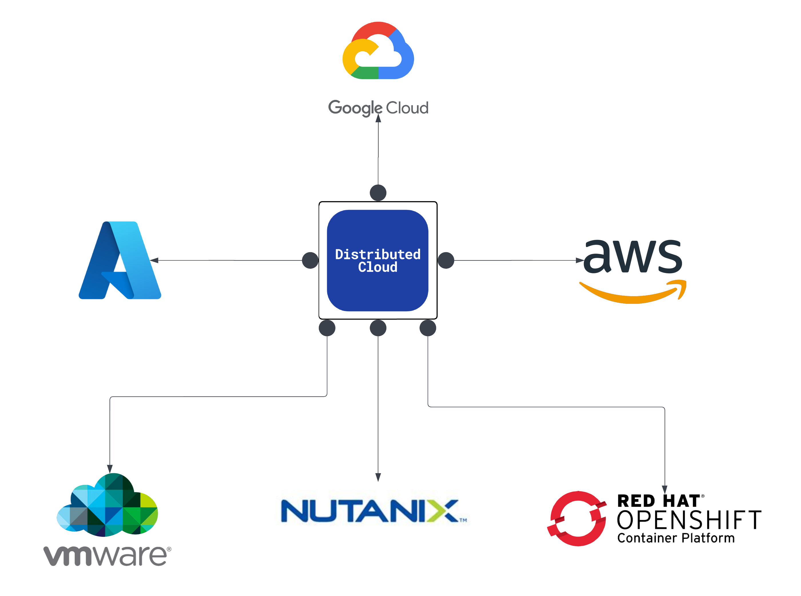
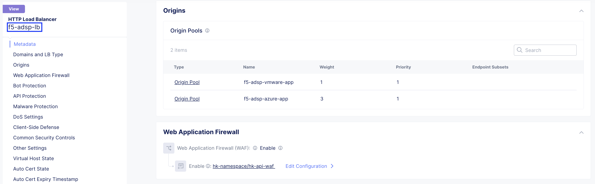

F5 Distributed Cloud Application Migration across Heterogeneous Environments
#########################################################
Scope
--------------
As enterprises evolve their infrastructure strategies, migrating application traffic across heterogeneous environments becomes critical for modernization, cost optimization, compliance, or decommissioning legacy platforms. Often, the same application is deployed across multiple platforms—including VMware, Nutanix, OpenShift, and public clouds—creating a foundation for flexible and resilient traffic distribution.

F5 Distributed Cloud simplifies application traffic migration by enabling unified traffic management through its global load balancing and Origin Pool capabilities. By including multiple environments within the same Origin Pool and adjusting traffic weights, organizations can dynamically shift user traffic from one environment to another—whether gradually or instantly—without impacting application availability or performance. This approach ensures controlled, secure, and observable migration of workloads across cloud and on-premises infrastructures.

Introduction
--------------
This article examines the challenges and strategies for migrating application traffic across heterogeneous environments in enterprise-scale infrastructures. Common migration scenarios include:

- Moving critical applications from VMware on-prem to Nutanix infrastructure, optimizing for performance, availability, and cost efficiency while maintaining security and compliance.

- Migrating workloads from VMware on-premises to OpenShift Container Platform (OCP), ensuring smooth transitions between traditional VMware environments and modern Kubernetes-based platforms.

- Shifting applications from VMware clusters to public clouds (AWS, GCP, and Azure), enabling greater scalability, global reach, and flexibility while ensuring minimal disruption during migration.

F5 Distributed Cloud enables organizations to seamlessly manage traffic migration by dynamically adjusting routing policies without affecting application performance or security. By utilizing Origin Pools and traffic weighting within the F5 Distributed Cloud Console, enterprises can migrate user traffic between environments such as AWS, Azure, GCP, VMware, Nutanix, and OpenShift with complete visibility and control.

As shown in the diagram under each scenario, when migrating traffic between different platforms, F5 Distributed Cloud orchestrates the smooth handoff of traffic, ensuring consistency in security policies, real-time observability, and the continued performance of applications during the migration process.

Architecture Overview
--------------

**VMware:** VM is created in VMware ESXi deployed in Dell PowerEdge-R640 bare metal. The VM is booted using the OVF image of SMSv2 CE downloaded from F5 Distributed Cloud. Once the CE VM is up and site is online, VM running application workloads is also deployed in the same ESXi and connected to CE using Site Local Inside (SLI) subnet and interface, so that applications are not exposed directly.

*Note: This scenario uses VMware On-Prem, but it can also be deployed on GCP and Azure.*

`F5 Distributed Cloud Application Migration Setup on VMware <https://github.com/f5devcentral/f5-xc-terraform-examples/blob/main/workflow-guides/application-delivery-security/migration/application-migration-setup-vmware.rst>`__

**OpenShift Container Platform (OCP):** 3-node OCP cluster is created on VMware. SMSv2 CE as VM is deployed using KVM (qcow) image in OCP cluster virtualization. VM running application workloads is also deployed and connected to CE using Site Local Inside (SLI) subnet and interface, so that applications are not exposed directly.

*Note: This scenario uses OCP Datacenter (On-Prem), but it can also be deployed on AWS, GCP, IBM and Azure.*

`OCP Infra Setup on VMware <https://github.com/f5devcentral/f5-xc-terraform-examples/blob/main/workflow-guides/application-delivery-security/workload/ocp-infra-setup.rst>`__

`F5 Distributed Cloud Application Migration Setup on OCP <https://github.com/f5devcentral/f5-xc-terraform-examples/blob/main/workflow-guides/application-delivery-security/migration/application-migration-setup-ocp.rst>`__

**Nutanix on Bare Metal:** Nutanix Community Edition is used as Hypervisor and deployed in Dell PowerEdge-R430 bare metal. A VM is created and booted using the qcow2 image of SMSv2 CE downloaded from F5 Distributed Cloud. Once the CE VM is up and site is online, VM running application workloads are also deployed and connected to CE using Site Local Inside (SLI) subnet and interface, so that applications are not exposed directly.

*Note: This scenario uses Nutanix On-Prem, but it can also be deployed on AWS and Azure.*

`Nutanix Infra Setup[coming soon] <coming soon>`__

`F5 Distributed Cloud Application Migration Setup on Nutanix[coming soon] <coming soon>`__

**Nutanix on VMware:** <Coming Soon>

**Cloud Env:** For this demo Azure is chosen for deploying SMSv2 CE site. In the same resource group where CE VM is deployed, VM running application workloads is also deployed and connected to CE using Site Local Inside (SLI) subnet and interface, so that applications are not exposed directly.

*Note: Similarly, this deployment can be achieved in GCP and AWS using the links below.*

- AWS -> `Deploy Secure Mesh Site v2 on AWS <https://docs.cloud.f5.com/docs-v2/multi-cloud-network-connect/how-to/site-management/deploy-sms-aws-clickops>`__
- Azure -> `Deploy Secure Mesh Site v2 on Azure <https://docs.cloud.f5.com/docs-v2/multi-cloud-network-connect/how-to/site-management/deploy-sms-az-clickops>`__
- GCP -> `Deploy Secure Mesh Site v2 on GCP <https://docs.cloud.f5.com/docs-v2/multi-cloud-network-connect/how-to/site-management/deploy-sms-gcp-clickops>`__

Note: `Customer Edge Site Sizing Reference <https://docs.cloud.f5.com/docs-v2/multi-cloud-network-connect/reference/ce-site-size-ref>`__

`F5 Distributed Cloud Application Migration Setup on Azure[coming soon] <coming soon>`__

Scenario:
--------------
Migration use case – Common application (NGINX) is deployed across all the environments (VMware, Nutanix, OCP and Azure), using F5 Distributed Cloud Console migration can be carried out by including the environments in Origin Pool and adjusting the weights based on which user traffic will be routed.

Scenario 1: Migration from VMware to Nutanix
--------------

.. image:: ./assets/1.png

In this scenario, application traffic is being migrated from VMware (On-Prem) environment to Nutanix (On-Prem) environment. This is achieved by deploying the same application in both environments and gradually shifting traffic by adjusting the weight assigned to each environment. At fist, we start sending the traffic to newly integrated platform, which is Nutanix in this case, upon success, we steer the traffic propotionally. We set weights initially as follows:

    VMware weight - 3 and Nutanix weight - 1

.. image:: ./assets/origin_pool_configs.jpg

.. image:: ./assets/start_traffic_to_vmware.jpg

From the above screenshot, you can able to see a small portion (highlighted in green) of traffic is reaching the Nutanix platform and application in it is well accessible using F5 XC.

Now, we further steer more traffic to the Nutanix by modifying the weight as below, which will lead to complete migration of traffic from VMware to Nutanix platform,

    VMware weight - 0 and Nutanix weight - 3

.. image:: ./assets/migrated_to_nutanix.jpg

Scenario 1: Case A – Genuine requests
~~~~~~~~~~
Once the setup including the site, origin pool, and load balancer is complete and weights are assigned, genuine requests reaching the load balancer are distributed across environments based on those weights. Here, cURL is used to demonstrate sending multiple requests to the load balancer.

**Case A Observation** - From the ”Requests” section in Distributed Cloud console for the LB, majority of the requests are directed towards Nutanix which has higher weightage

Scenario 1: Case B – Malicious requests
~~~~~~~~~~
In this case, we'll send malicious requests to the same load balancer and observe how F5 Distributed Cloud mitigates them.

.. image:: ./assets/curl-malicious.png

**Case B Observation** - From the “Requests” section in Distributed Cloud console for the LB, malicious requests blocked by Web Application Firewall (WAF) which won’t reach the origin server.

Scenario 2: Migration from VMware to OCP
--------------

.. image:: ./assets/2.png

In this scenario, application traffic is being migrated from VMware (On-Prem) environment to OpenShift Container Platform (On-Prem) environment. This is achieved by deploying the same application in both environments and gradually shifting traffic by adjusting the weight assigned to each environment. For this migration, we have set the weights as follows:

    VMware weight - 1 and OCP weight - 3

Scenario 2: Case A – Genuine requests
~~~~~~~~~~
Once the setup including the site, origin pool, and load balancer is complete and weights are assigned, genuine requests reaching the load balancer are distributed across environments based on those weights. Here, cURL is used to demonstrate sending multiple requests to the load balancer.

**Case A Observation** - From the ”Requests” section in Distributed Cloud console for the LB, majority of the requests are directed towards OCP which has higher weightage

Scenario 2: Case B – Malicious requests
~~~~~~~~~~
In this case, we'll send malicious requests to the same load balancer and observe how F5 Distributed Cloud mitigates them.

.. image:: ./assets/curl-malicious.png

**Case B Observation** - From the “Requests” section in Distributed Cloud console for the LB, malicious requests blocked by Web Application Firewall (WAF) which won’t reach the origin server.

Scenario 3: Migration from VMware to Nutanix + OpenShift Container Platform (OCP)
--------------

.. image:: ./assets/3.png

In this scenario, application traffic is being migrated from VMware (On-Prem) environment to Nutanix (On-Prem) + OCP (On-Prem) environment. This is achieved by deploying the same application in all the 3 environments and gradually shifting traffic by adjusting the weight assigned to each environment. For this migration, we have set the weights as follows:

    VMware weight - 1, Nutanix weight - 3 and OCP weight - 3

Scenario 3: Case A – Genuine requests
~~~~~~~~~~
Once the setup including the site, origin pool, and load balancer is complete and weights are assigned, genuine requests reaching the load balancer are distributed across environments based on those weights. Here, cURL is used to demonstrate sending multiple requests to the load balancer.

**Case A Observation** - From the ”Requests” section in Distributed Cloud console for the LB, majority of the requests are directed towards Nutanix and OCP which has higher weightage

Scenario 3: Case B – Malicious requests
~~~~~~~~~~
In this case, we'll send malicious requests to the same load balancer and observe how F5 Distributed Cloud mitigates them.

.. image:: ./assets/curl-malicious.png

**Case B Observation** - From the “Requests” section in Distributed Cloud console for the LB, malicious requests blocked by Web Application Firewall (WAF) which won’t reach the origin server.

Scenario 4: Migration from VMware to Azure
--------------

.. image:: ./assets/4.png

In this scenario, application traffic is being migrated from VMware (On-Prem) environment to Azure environment. This is achieved by deploying the same application in both environments and gradually shifting traffic by adjusting the weight assigned to each environment. For this migration, we have set the weights as follows:

    VMware weight - 1 and Azure weight - 3

Scenario 4: Case A – Genuine requests
~~~~~~~~~~
Once the setup including the site, origin pool, and load balancer is complete and weights are assigned, genuine requests reaching the load balancer are distributed across environments based on those weights. Here, cURL is used to demonstrate sending multiple requests to the load balancer.

.. image:: ./assets/4-2.png

**Case A Observation** - From the ”Requests” section in Distributed Cloud console for the LB, majority of the requests are directed towards Azure which has higher weightage

Scenario 4: Case B – Malicious requests
~~~~~~~~~~
In this case, we'll send malicious requests to the same load balancer and observe how F5 Distributed Cloud mitigates them.

.. image:: ./assets/curl-malicious.png

.. image:: ./assets/4-3.png

**Case B Observation** - From the “Requests” section in Distributed Cloud console for the LB, malicious requests blocked by Web Application Firewall (WAF) which won’t reach the origin server.

Conclusion:
--------------
In summary, F5 Distributed Cloud provides a simple, repeatable pattern for migrating application traffic across heterogeneous environments with confidence and control. By leveraging global load balancing, origin pools, and traffic weighting, enterprises can gradually or instantly shift users between VMware, Nutanix, OpenShift, and public clouds while preserving security policies, compliance, and performance.  With unified observability and policy consistency across sites, teams can modernize, optimize costs, and decommission legacy platforms at their own pace—reducing risk and accelerating transformation across hybrid and multicloud infrastructures.

References:
--------------
`F5 Application Delivery and Security Platform <https://www.f5.com/products/f5-application-delivery-and-security-platform>`__

`F5 CE Data Sheet <https://www.f5.com/pdf/data-sheet/f5-distributed-cloud-customer-edge-ce-deployable-software.pdf>`__

`F5 CE Docs <https://docs.cloud.f5.com/docs-v2/multi-cloud-network-connect/concepts/f5-xc-customer-edge>`__
