Migrating Application Traffic from VMware to Nutanix
#########################################################

Objective:
--------------
This document provides the step by step process to migrate the traffic from applicaiton running in VMware to application running in Nutanix.

General Prerequisites:
--------------
Deployment of applicaiton on VMware using SMSv2 is covered in the document `F5 XC CE deploy on VMware using SMSv2(SaaS Console) | F5 XC Solutions  <https://github.com/f5devcentral/f5-xc-terraform-examples/blob/main/workflow-guides/application-delivery-security/migration/application-migration-setup-vmware.rst>`__

Similarly, deployment of application on Nutanix platform using SMSv2 is covered in the document `F5 XC CE deploy on Nutanix using SMSv2(SaaS Console) | F5 XC Solutions <https://github.com/f5devcentral/f5-xc-terraform-examples/blob/main/workflow-guides/smsv2-ce/Secure_Mesh_Site_v2_in_Nutanix/secure_mesh_site_v2_in_nutanix.rst>`__

Configuration Overview:
--------------
Below are the series of steps required to integrate Nutanix to VMware Load Balancer

1. Configure Load balancer for VMware
2. Integrate Nutanix origin pool to VMware load balancer
3. Migrate the traffic from VMware to Nutanix

**Step 1: Configuring Load balancer for VMware**

From F5 Distributed Cloud (XC) console, select **Multi-Cloud Network Connect** and navigate to Manage > Load Balancers and select Add HTTP Load Balancer.

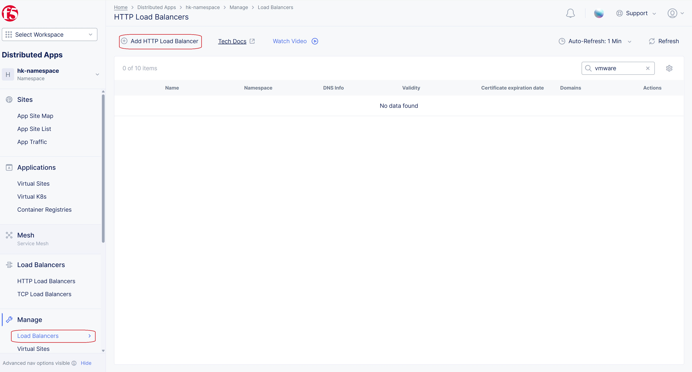

In the name field, Enter the name for the load balancer. In the Domains field, enter a domain name. 
At the Origins section, click on Add Item button.

.. image:: ./assets/mig_vmware_to_nutanix_origin_pool.jpg

Select the name of the origin pool created in the VMware document mentioned above.

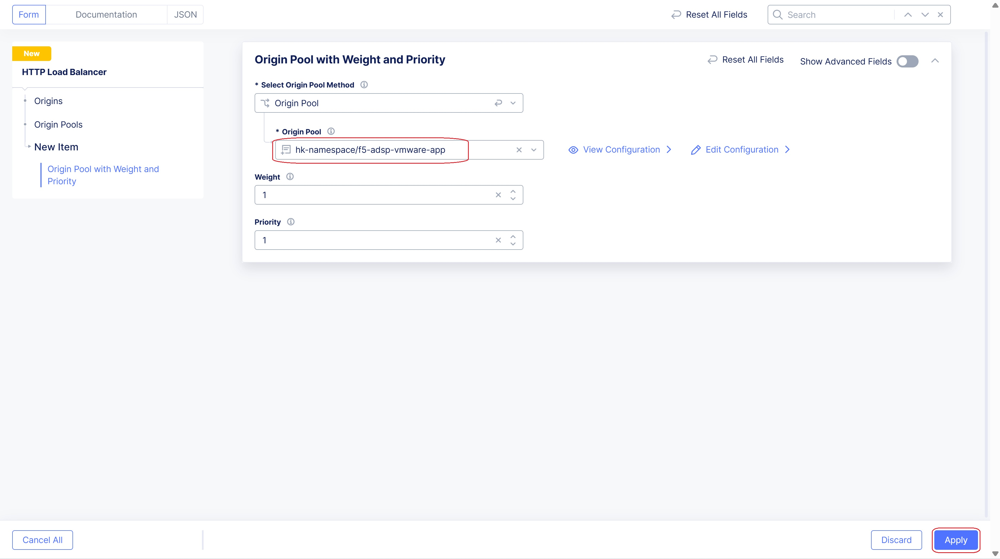

Click on Apply button.

Enable the Web Application Firewall (WAF) at **Web Application Firewall** section.

Select the WAF firewall created and click on **Add HTTP Load Balancer** to create the load balancer.

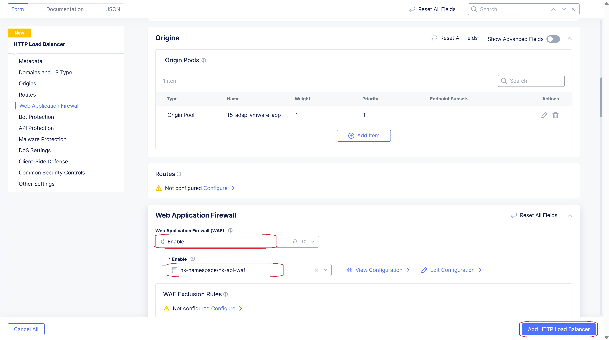

Load balancer is created successfully and accessible.

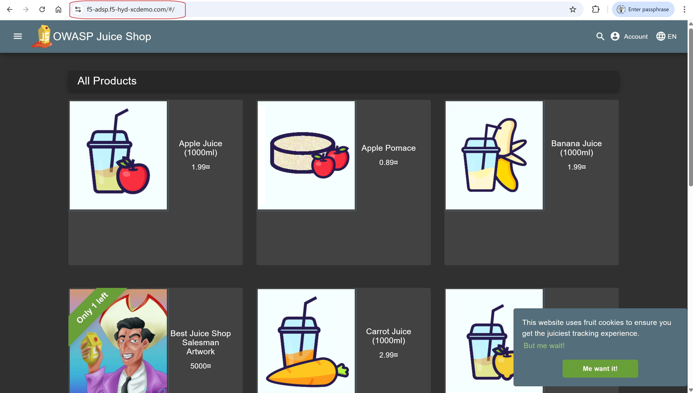

**Step 2: Integrating Nutanix origin pool to the VMware load balancer**

From **Multi-Cloud Network Connect** and navigate to Manage > Origin Pools to create an origin pool.

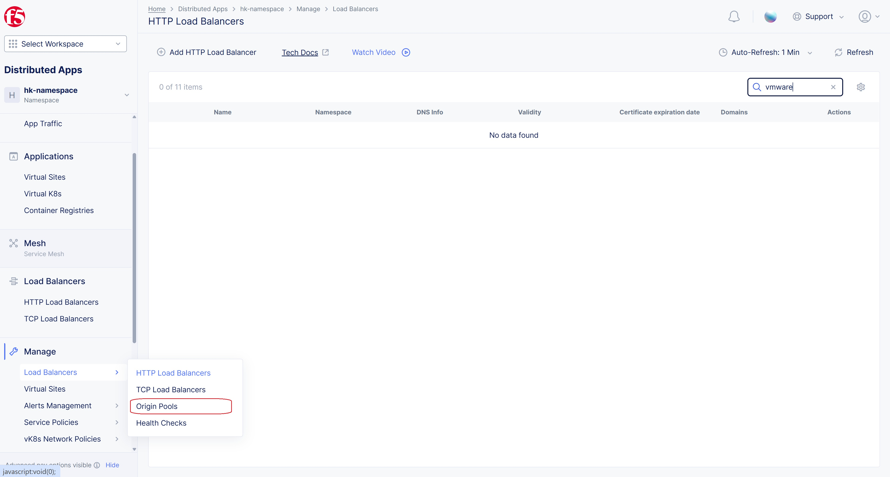

Click on Add Origin Pool button.

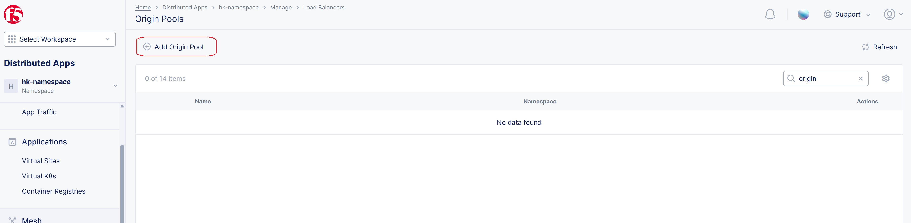

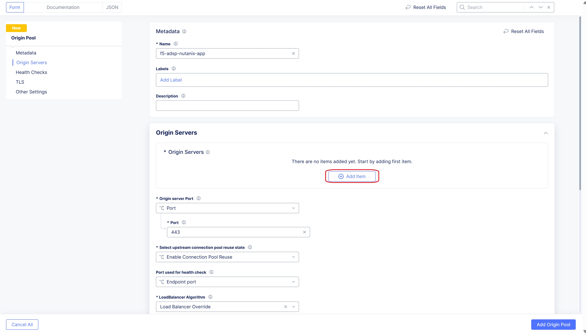

Provide the details of the application in document above,

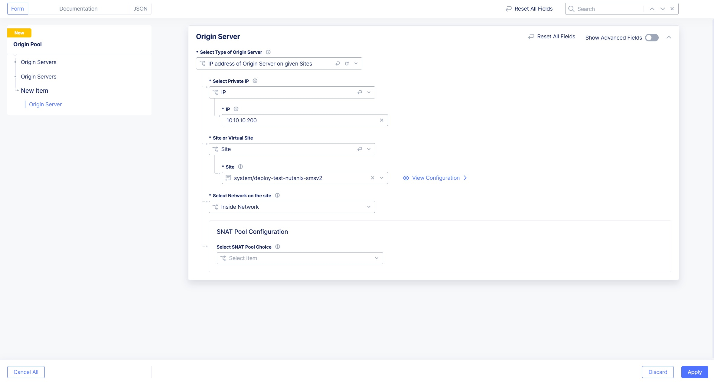

Click on Apply and enter the port number at which application is running and click on Save origin pool.

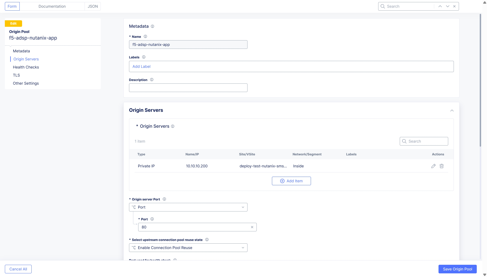

**Step 3: Migrating the traffic from VMware to Nutanix**

From **Multi-Cloud Network Connect** and navigate to Manage > Load Balancers and select the load balancer created above.

Click on Add Item button 

.. image:: ./assets/mig_vmware_to_nutanix_op_add.jpg

Select the origin pool created in above step and click on Apply

.. image:: ./assets/mig_vmware_to_nutanix_add_op_to_lb.jpg

Select the pencil icon for the VMware origin pool under Origin Pool section to update the weight,

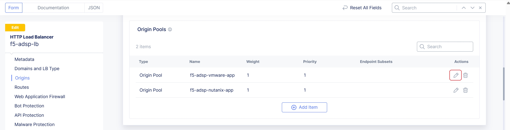

Update the weight to 3, which defines majority of the traffic will be flowing to VMware and a small portion of traffic will be flowing through Nutanix. Click on Apply.

.. image:: ./assets/mig_vmware_to_nutanix_weight.jpg

Click on Save HTTP Load Balancer button to save the configs.

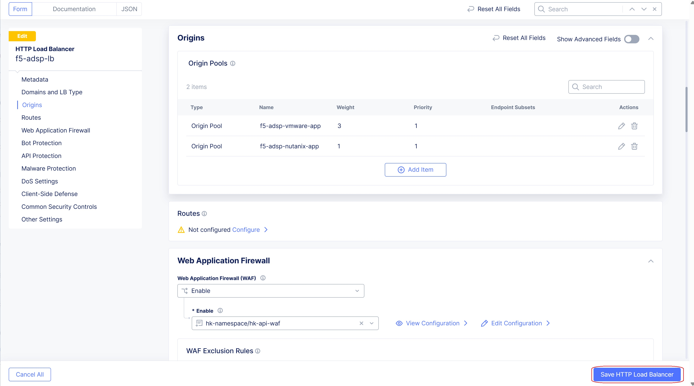

On accessing the domain name of the LB, most of the traffic flows to the existing application residing in VMware and a small portion of traffic is made to pass through Nutanix, based on F5 XC LB configurations,

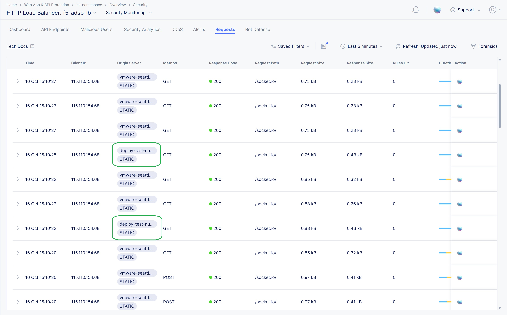

By further steering the traffic to the Nutanix, traffic increases proportionally and by further adjusting the weights i.e origin pool associating to VMware is set to 0 and Nutanix to 1, results in complete migration of traffic from VMware to Nutanix,

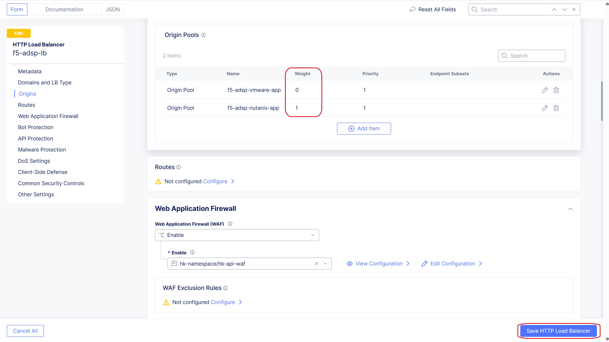

Image shows below represents complete migration of traffic, this results in migrating from VMware to Nutanix.

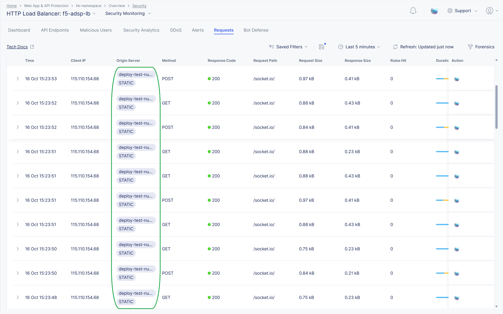

Conclusion:
--------------
As mentioned in this document, following steps mentioned above results in migrating from VMware to Nutanix. 

