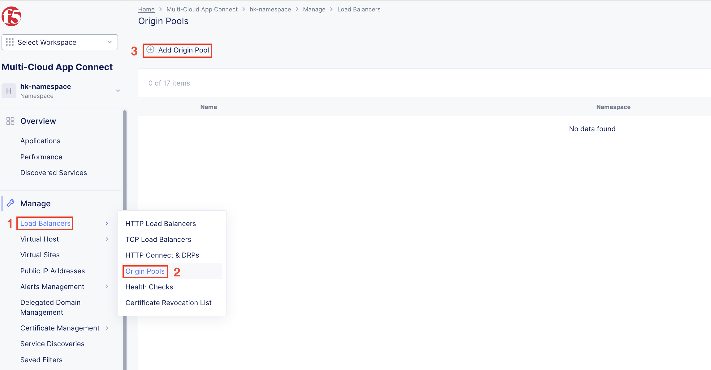

F5 Distributed Cloud Application Migration on OCP
#########################################################
This article serves as the initial setup for the OCP platform in “F5 Distributed Cloud Application Migration across Heterogeneous Environments” scenario. This document covers:

- Customer Edge (CE) Setup
- Client VM Installation
- Creating Origin Pool

OCP cluster used in this demonstration is deployed on VMware ESXi hypervisor. Once the OCP cluster is up and running, the next step is to deploy SMSv2 CE.

Steps to Deploy Secure Mesh Site v2 on OCP
--------------
*Note 1: KVM image is used for this demonstration of OCP*

*Note 2: Resources required to create CE VM: Minimum 8 vCPUs, 32 GB RAM, and 80 GB disk storage, please refer below link for more details on sizing and resources:*

`Customer Edge Site Sizing Reference <https://docs.cloud.f5.com/docs-v2/multi-cloud-network-connect/reference/ce-site-size-ref>`__

Create Site Object
--------------
Create a secure mesh site object in the Distributed Cloud Console and select VMware as the provider.

**Step 1: Enter metadata information for site.**

- Login to **Distributed Cloud Console**
- In Distributed Cloud Console, select **Multi-Cloud Network Connect**
- Navigate to **Manage > Site Management > Secure Mesh Sites v2**
- Select **Add Secure Mesh Site** to open the configuration form.
- In the **Metadata** section, enter a name for the site.
- Optionally, select labels and add a description.

**Step 2: Select the provider name as KVM (EA).**

- Set the Provider Name option to KVM (EA). Keep all other default values.

- Click **Add Secure Mesh Site**

Download Node Image
--------------

KVM uses qcow2 file to store various files associated with a Virtual Machine (VM). F5 Distributed Cloud packages Customer Edge node software in a qcow2 template file that lets you add a pre-configured virtual machine in the OCP cluster.

- Navigate to **Manage > Site Management > Secure Mesh Sites v2**

- From the Secure Mesh Sites page, for your site, click ... > **Download Image** and then save the image locally.

.. image:: ../workload/assets/assets-ocp/2.png

Create Nodes (Virtual Machines)
--------------
Follow the steps below to deploy a CE node as a virtual machine (VM) using the qcow2 software image that was downloaded in the previous section.

**Generate Node Token**

A node token is required to register a CE Site node to the Distributed Cloud Console.

- In Distributed Cloud Console, select the **Multi-Cloud Network Connect** workspace
- Navigate to **Manage > Site Management > Secure Mesh Sites v2**
- For your site, click ... > **Generate Node Token**

- Click **Copy cloud-init**

- Save the value locally. This token is used later. The token value is hidden for security purposes.

- Click Close

**Create a CE Node (Virtual Machine)**

- SMSv2 CE VM will be created using the .qcow2 image file downloaded earlier from F5 Distributed Cloud Console after creating site object.

Once the image is downloaded follow the below steps:

1. Login to node
    List the nodes by executing **oc get node** and you'll get node name

        - oc debug node/<node-name>
        - chroot /host

    Create new interface for SLI

        - sudo ip link add name br-extvm-1 type bridge
        - sudo ip link set dev br-extvm-1 up

    *Note – Interface was already added, so “File exists” is showing, when executed for the first time you won’t see this*

    .. image:: ../workload/assets/assets-ocp/5.png

    Create a directory and provide necessary permission (777) for PV to write content in the node directory

        - mkdir -p /mnt/data/v1
        - chmod 777 /mnt/data/v1
        - exit
        - exit

2. Create a “Storage Class” with the configuration below.

3. Create Persistent Volumes with 100GB capacity and local storage (so that image gets stored in the node path given)

    Save the below configuration as **f5-ce-pv.yaml**

.. code-block:: python

    apiVersion: v1
    kind: PersistentVolume
    metadata:
      name: f5-xc-sms-pv1
    spec:
      capacity:
        storage: 100Gi
      accessModes:
        - ReadWriteOnce
      persistentVolumeReclaimPolicy: Retain
      storageClassName: tme-storage
      local:
        path: /mnt/data/v1  # Change this to your actual local storage path
      nodeAffinity:
        required:
          nodeSelectorTerms:
            - matchExpressions:
                - key: kubernetes.io/hostname
                  operator: In
                  values:
                    - <node-name>  # The node you want to use
      volumeMode: Filesystem

    ---

    apiVersion: v1
    kind: PersistentVolume
    metadata:
      name: f5-xc-sms-pv2
    spec:
      capacity:
        storage: 100Gi
      accessModes:
        - ReadWriteOnce
      persistentVolumeReclaimPolicy: Retain
      storageClassName: tme-storage
      local:
        path: /mnt/data/v1  # Change this to your actual local storage path
      nodeAffinity:
        required:
          nodeSelectorTerms:
            - matchExpressions:
                - key: kubernetes.io/hostname
                  operator: In
                  values:
                    - <node-name>  # The node you want to use
      volumeMode: Filesystem

4. After creating bridge interface and storage for CE VM in the node, apply the OC apply command to create PV using the above .yaml file

    **oc apply –f f5-ce-pv.yaml**

5. Now under “Bootable volumes” create volume for the CE image downloaded (from F5 Distributed Cloud site creation) by uploading it.

6. Persistent Volume Claims will be created for the volume uploaded and this PVC will be bound to the PVs created earlier, if not upload will fail.

7. Once the image is uploaded and available under “Bootable volumes”, VM needs to be created using that volume.

8. A Network Attachment Definition with type “bridge” is required for having SLI interface on CE VM and IP for SLI

    Save the below configuration as **f5-ce-nad.yaml**

    Apply by executing **oc apply -f f5-ce-nad.yaml**
.. code-block:: python

    apiVersion: "k8s.cni.cncf.io/v1"
    kind: NetworkAttachmentDefinition
    metadata:
      name: br-extvm-net-1
      namespace: default
    spec:
      config: '{
        "cniVersion": "0.3.1",
        "type": "bridge",
        "bridge": "br-extvm-1",
        "ipam": {
      "type": "whereabouts",
      "range": "192.168.200.100/24",
      "gateway": "192.168.200.1"
    }
      }'

9. YAML file is used for creating the VM which will have PVC name of image, network and token (obtained while F5 Distributed Cloud site creation) details.

    Save the below configuration as **f5-ce-vm.yaml**

    Apply by executing **oc apply -f f5-ce-vm.yaml**
.. code-block:: python

    apiVersion: kubevirt.io/v1
    kind: VirtualMachine
    metadata:
      name: xc-ce-ocp-vm
      namespace: default
    spec:
      runStrategy: Always
      template:
        metadata:
          labels:
            kubevirt.io/domain: xc-ce-ocp-vm
          annotations:
            k8s.v1.cni.cncf.io/networks: |
              [
                {
                  "name": "br-extvm-net-1",
                  "interface": "br-extvm-net-1",
                  "ips": ["192.168.200.103/24"]
                }
              ]
        spec:
          nodeSelector:
            kubernetes.io/hostname: <node-name>
          domain:
            memory:
              guest: 16Gi
            cpu:
              cores: 8
            devices:
              disks:
                - name: rootdisk
                  disk:
                    bus: virtio
                - name: cloudinitdisk
                  disk:
                    bus: virtio
              interfaces:
                - name: default
                  masquerade: {}
                - name: br-extvm-net-1        # MUST match annotation.interface and networks.name
                  bridge: {}
            machine:
              type: pc-q35-rhel9.6.0
          volumes:
            - name: rootdisk
              persistentVolumeClaim:
                claimName: xc-ce-volume             #PVC name
            - name: cloudinitdisk
              cloudInitNoCloud:
                userData: |
                  #cloud-config
                  write_files:
                    - path: /etc/vpm/user_data
                      permissions: 644
                      owner: root
                      content: |
                        token: <your token>             #token needs to be added
                        #slo_ip: Un-comment and set Static IP/mask for SLO if needed.
                        #slo_gateway: Un-comment and set default gateway for SLO when static IP is  needed.
          networks:
            - name: default
              pod: {}
            - name: br-extvm-net-1          # MUST match interfaces.name and annotation.interface
              multus:
                networkName: default/br-extvm-net-1

10. Once the VM starts running, it’ll establish a connection to the F5 Distributed Cloud and the registration process will begin. It’ll take ~30 minutes for the CE site to come up online with all components.

11. Once the CE is up, interfaces can be verified in “Infrastructure” tab

Steps to install VM (Client VM) running application workloads
--------------
Now one more VM to run application workloads needs to be deployed. AlpineOS is used for this demonstration as it is lightweight.

AlpineOS ISO can be downloaded from this `link <https://alpinelinux.org/downloads/>`__

*Note: For this demonstration, virtual x86_64 image is chosen.*

*Note : Before creating PV, login to node, create a new directory (v2 and v3) in the same node where CE is present and provide necessary permission (777) for PV to write content in the node directory.*

    - oc debug node/<node-name>
    - chroot /host
    - mkdir -p /mnt/data/v2 /mnt/data/v3
    - chmod 777 /mnt/data/v2 /mnt/data/v3
    - exit
    - exit

1. Create PV with 5 GB space, to store ISO image.

    Save the below configuration as **f5-ce-pv2.yaml**

    Apply by executing **oc apply -f f5-ce-pv2.yaml**
.. code-block:: python

    apiVersion: v1
    kind: PersistentVolume
    metadata:
      name: f5-xc-sms-pv3
    spec:
      capacity:
        storage: 5Gi
      accessModes:
        - ReadWriteOnce
      persistentVolumeReclaimPolicy: Retain
      storageClassName: tme-storage
      local:
        path: /mnt/data/v2  # Change this to your actual local storage path
      nodeAffinity:
        required:
          nodeSelectorTerms:
            - matchExpressions:
                - key: kubernetes.io/hostname
                  operator: In
                  values:
                    - <node-name>  # The node you want to use
      volumeMode: Filesystem
    ---
    apiVersion: v1
    kind: PersistentVolume
    metadata:
      name: f5-xc-sms-pv4
    spec:
      capacity:
        storage: 5Gi
      accessModes:
        - ReadWriteOnce
      persistentVolumeReclaimPolicy: Retain
      storageClassName: tme-storage
      local:
        path: /mnt/data/v2  # Change this to your actual local storage path
      nodeAffinity:
        required:
          nodeSelectorTerms:
            - matchExpressions:
                - key: kubernetes.io/hostname
                  operator: In
                  values:
                    - <node-name>  # The node you want to use
      volumeMode: Filesystem

2. Creating new “Storage Class” is not required, as “tme-storage” created earlier will be used

3. Create new volume for Alpine under “Bootable volumes” and upload the image

4. Create a new PV with 20-30 GB space for alpine installation

    Save the below configuration as **f5-ce-pv3.yaml**

    Apply by executing **oc apply -f f5-ce-pv3.yaml**
.. code-block:: python

    apiVersion: v1
    kind: PersistentVolume
    metadata:
      name: f5-xc-sms-pv5
    spec:
      capacity:
        storage: 20Gi
      accessModes:
        - ReadWriteOnce
      persistentVolumeReclaimPolicy: Retain
      storageClassName: tme-storage
      local:
        path: /mnt/data/v3  # Change this to your actual local storage path
      nodeAffinity:
        required:
          nodeSelectorTerms:
            - matchExpressions:
                - key: kubernetes.io/hostname
                  operator: In
                  values:
                    - <node-name>  # The node you want to use
      volumeMode: Filesystem

5. Create a new PVC for storing the alpine installation, which will bound to the PV created above

    Save the below configuration as **f5-ce-pvc.yaml**

    Apply by executing **oc apply -f f5-ce-pvc.yaml**
.. code-block:: python

    apiVersion: v1
    kind: PersistentVolumeClaim
    metadata:
      name: alpine-install-pvc  # New PVC name
      namespace: default
    spec:
      accessModes:
        - ReadWriteOnce
      resources:
        requests:
          storage: 20Gi
      storageClassName: tme-storage
      volumeMode: Filesystem

6. Create the Alpine VM using below yaml file

    Save the below configuration as **f5-ce-vm2.yaml**

    Apply by executing **oc apply -f f5-ce-vm2.yaml**
.. code-block:: python

    apiVersion: kubevirt.io/v1
    kind: VirtualMachine
    metadata:
      name: alpine-vm1
      namespace: default
    spec:
      runStrategy: Always
      template:
        metadata:
          labels:
            kubevirt.io/domain: alpine-vm1
          annotations:
            k8s.v1.cni.cncf.io/networks: |
              [
                {
                  "name": "br-extvm-net-1",
                  "interface": "br-extvm-net-1",
                  "ips": ["192.168.200.103/24"]
                }
              ]
        spec:
          nodeSelector:
            kubernetes.io/hostname: <node-name>
          domain:
            cpu:
              cores: 2
            memory:
              guest: 4Gi
            devices:
              interfaces:
                - name: default
                  masquerade: {}
                - name: br-extvm-net-1        # MUST match annotation.interface and networks.name
                  bridge: {}
              disks:
                - name: rootdisk
                  disk:
                    bus: virtio
                - name: install-disk    # New disk for installation
                  disk:
                    bus: virtio
            machine:
              type: q35
          volumes:
            - name: rootdisk
              persistentVolumeClaim:
                claimName: alpine-volume        # Alpine PVC name
            - name: install-disk
              persistentVolumeClaim:
                claimName: alpine-install-pvc   # New PVC for installation disk
          networks:
            - name: default
              pod: {}
            - name: br-extvm-net-1          # MUST match interfaces.name and annotation.interface
              multus:
                networkName: default/br-extvm-net-1

7. After applying the above config and VM is running, follow the steps in this `article <https://itsfoss.com/alpine-linux-virtualbox/>`_ to setup Alpine (from step 3 in link)

*Note: While configuring network, please provide static IP on the same subnet of CE VM or select DHCP which will automatically assign IP from same subnet.*

.. image:: ../workload/assets/assets-ocp/13.png

8. At the end of the setup, the VM will prompt you to reboot for the installation to complete and boot from the new disk. The configurations highlighted in “RED” in the above VM YAML file need to be removed to prevent the VM from booting the ISO again.

9. To remove them, go to the “YAML” tab under the VM, delete the highlighted configurations, save the changes, and then restart the VM.

10. Login with new username and password set during installation.

11. Verify the connectivity between CE and Alpine by pinging the IPs.

12. Once connectivity is verified, install required applications (use docker if multiple applications are required to be run on the same VM)

13. To install "docker" in alpine VM

    - vi /etc/apk/repositories
    - append this URL -> http://dl-cdn.alpinelinux.org/alpine/edge/community
    .. image:: ../workload/assets/assets-ocp/16.png
    - apk update
    - apk add docker
    - service docker start
    .. image:: ../workload/assets/assets-ocp/17.png

14. Once docker is installed, for this demo “web-dvwa” application is being installed using below docker command

    **$ docker run -d -p 3001:80 vulnerables/web-dvwa**

..    .. image:: ../workload/assets/assets-ocp/18.png

Create an Origin Pool for the application
--------------
To access the applications installed in the Client machine through SMSv2 Customer Edge (CE), an origin pool needs to be created.

1. Under “Multi-Cloud App Connect”, select Load Balancers-> Origin Pools. Click “Add Origin Pool

2. Provide a name to the Origin Pool and click “Add Item” under Origin Servers

.. image:: ../workload/assets/assets-ocp/uc2-ocp-1.png

3. Select Origin Server Type IP address of Origin Server on given Sites and provide IP, select VMware site created from the dropdown and make sure Select Network on the site is set to “Inside Network” and click “Apply”

*Note : IP address and Site or Virtual Site might vary based on your configuration*

4. Origin Server details will populate in the Origin Pool page, provide the port of the Ubuntu machine where the application is exposed (in this case 3000)

.. image:: ../workload/assets/assets-ocp/uc2-ocp-2.png

5. After creating the Origin Pool, this can be used in Load Balancer to access the application.

References:
--------------
`Create Origin Pools <https://docs.cloud.f5.com/docs-v2/multi-cloud-app-connect/how-to/create-manage-origin-pools>`__

