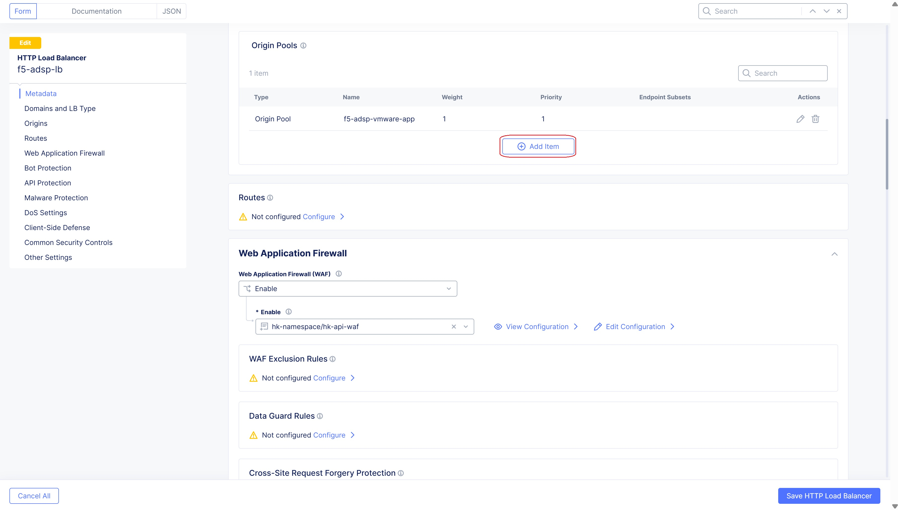
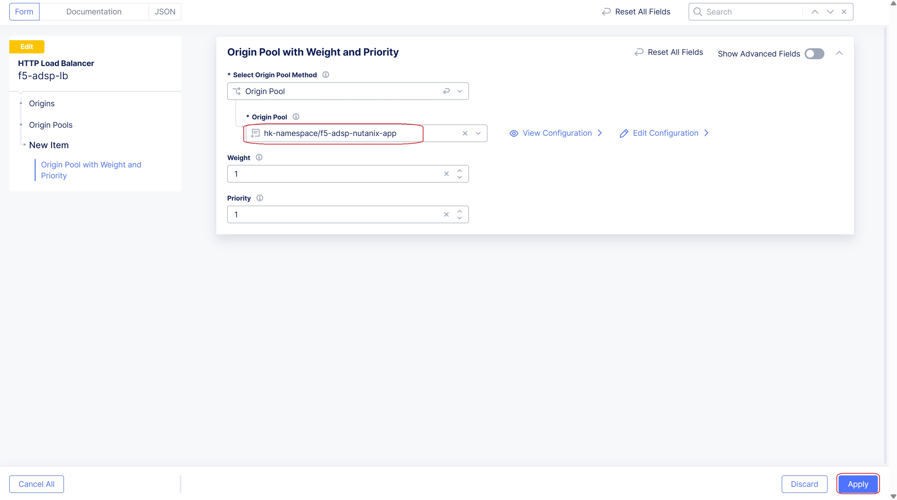
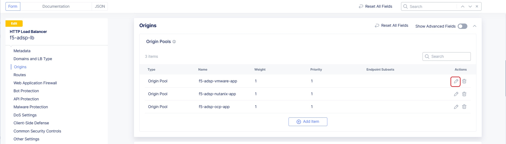
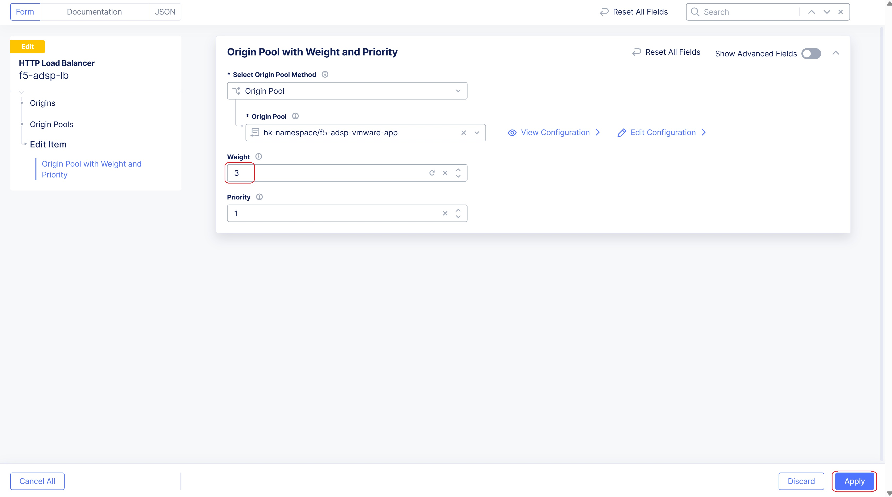
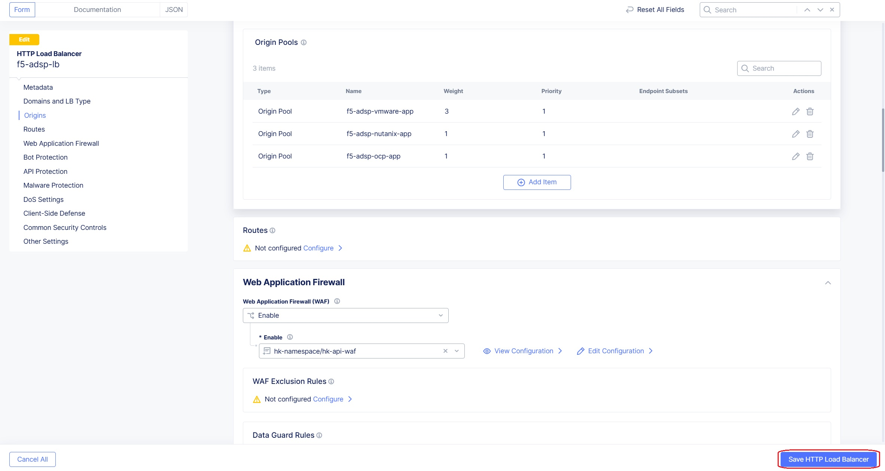
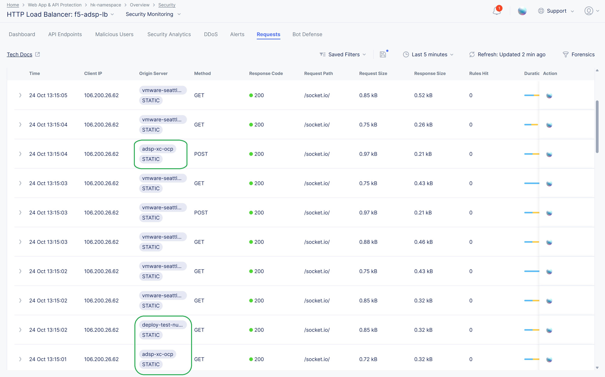
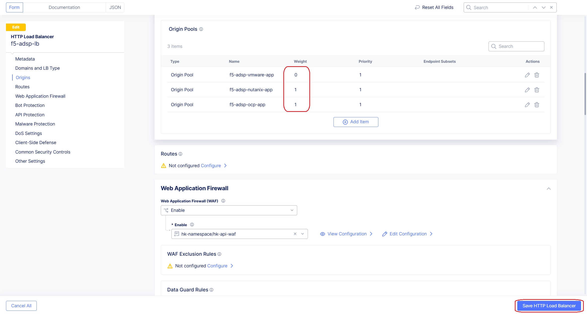
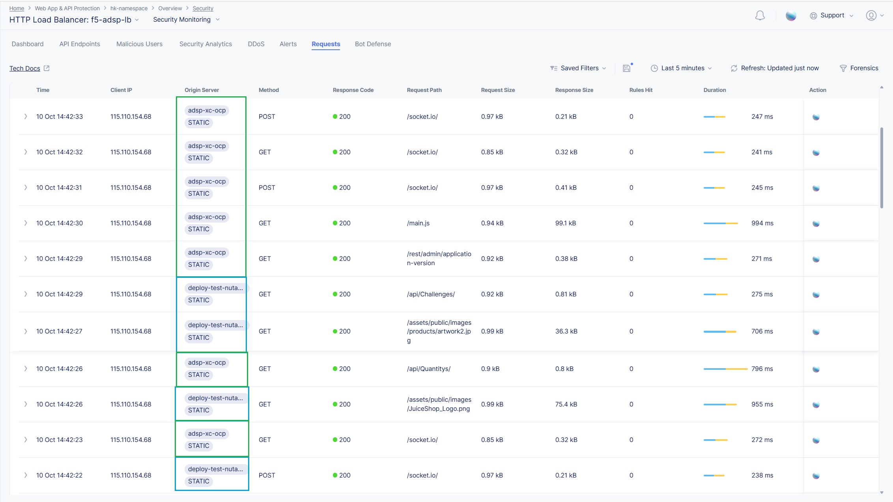

Migrating Application Traffic from VMware to Nutanix and OCP
#########################################################

Objective:
--------------
This document provides the step by step process to migrate the traffic from application running in VMware to load balance the traffic among Nutanix and OCP cloud platforms.

General Prerequisites:
--------------
Deployment of applicaiton on VMware using SMSv2 is covered in the document `F5 XC CE deploy on VMware using SMSv2 (SaaS Console) | F5 XC Solutions  <https://github.com/f5devcentral/f5-xc-terraform-examples/blob/main/workflow-guides/application-delivery-security/migration/application-migration-setup-vmware.rst>`__

Deployment of application on Nutanix platform using SMSv2 is covered in the document `F5 XC CE deploy on Nutanix using SMSv2 (SaaS Console) | F5 XC Solutions <https://github.com/f5devcentral/f5-xc-terraform-examples/blob/main/workflow-guides/smsv2-ce/Secure_Mesh_Site_v2_in_Nutanix/secure_mesh_site_v2_in_nutanix.rst>`__

Similarly, deployment of application on OCP platform using SMSv2 is covered in the document `F5 XC CE deploy on OCP using SMSv2 (SaaS console) <https://github.com/f5devcentral/f5-xc-terraform-examples/blob/main/workflow-guides/application-delivery-security/migration/application-migration-setup-ocp.rst>`__

Configuration steps:
--------------
Below are the steps should be followed to migrate the traffic from VMware to Nutanix and OCP.

At first, we add origin pools of Nutanix and OCP created as mentioned in above links, to the existing VMware load balancer.

Click on **Add Item** button at the Origin Pool section. 

From the Origin Pool dropdown select the Nutanix Origin pool and click on Apply button.

Similarly, Add the OCP to the Origin pool list as well.

Click on Pencil icon of VMware origin pool to update the weight, so that majority portion of traffic flows through VMware and small portion of traffic flows through Nutanix and OCP.

Update the Weight to 3, and click on Apply button.

On accessing the domain name of this Load balancer, we can able to see a small portion of traffic flowing through the Nutanix and OCP, but majority still flows through VMware.

We can steer proportionally by adjusting the weights, but now we will set the weight of VMware origin pool to 0, but the weights of Nutanix and OCP origin pool remains same, i.e 1 and save the Load Balancer.

By sending traffic, we can able to see all the requests reaches Nutanix and OCP but not to VMware.

Conclusion:
--------------
As mentioned in this document, following steps mentioned above results in migration from VMware to Nutanix and OCP.

