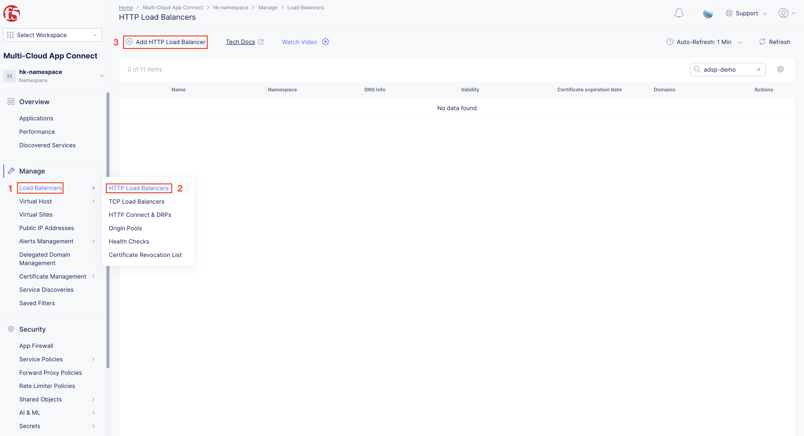
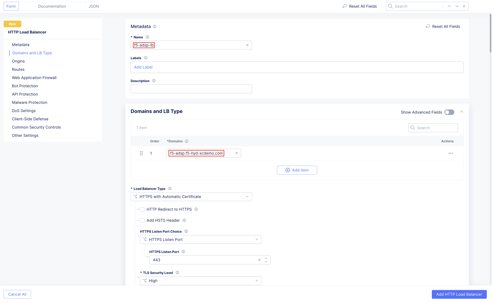
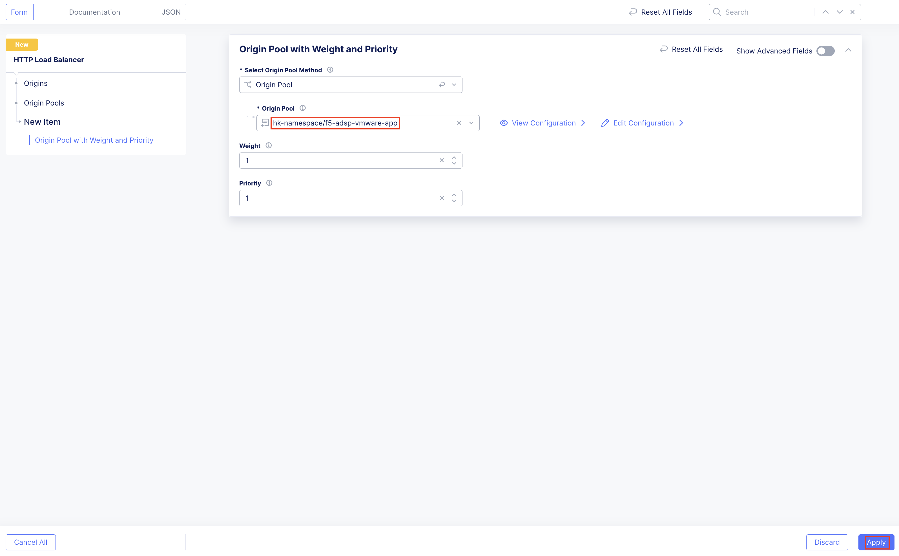
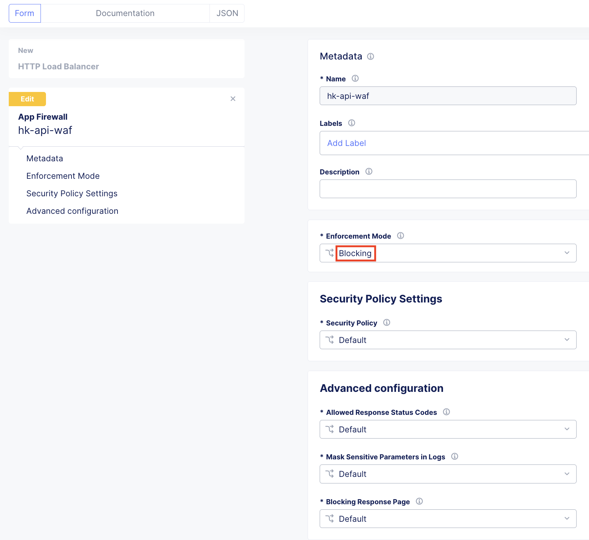
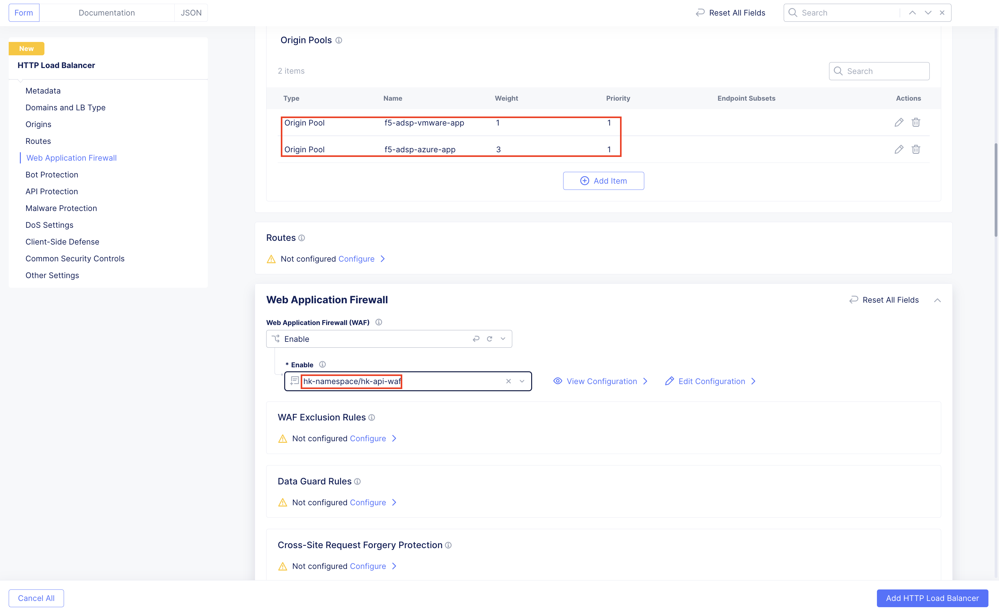
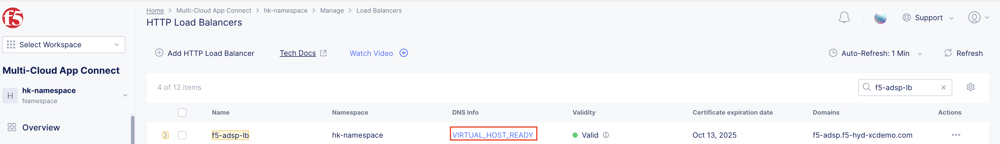
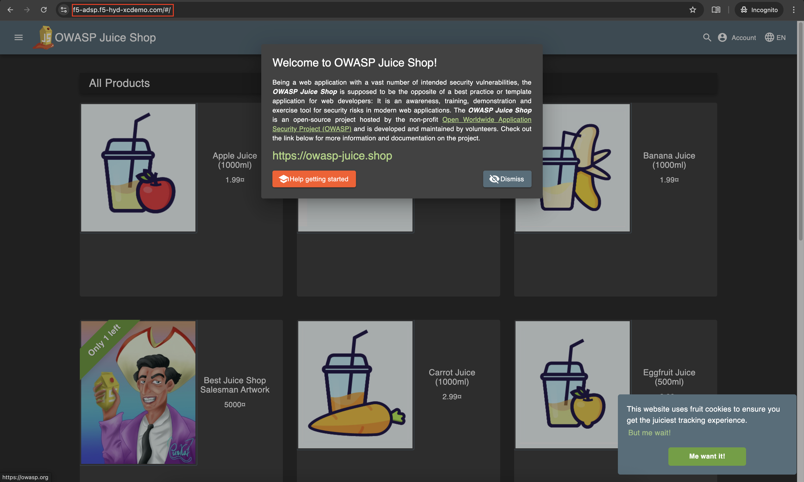
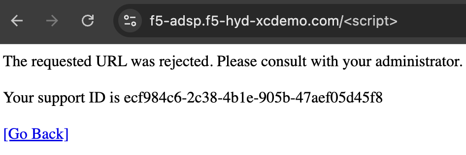
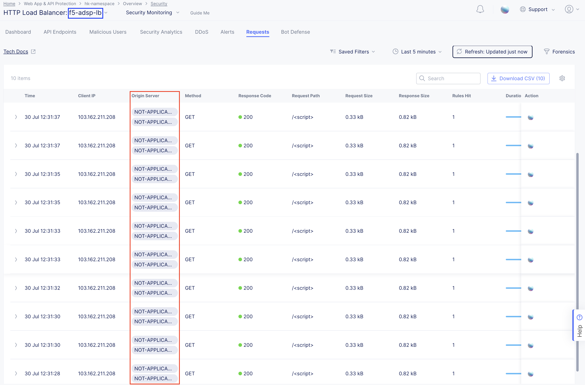

Migrating Applications Traffic from VMware to Azure
#########################################################

Accessing applications through Load Balancers
----
Origin pools are created for applications deployed in VMware and Azure CE site. Origin pools will be used in load balancer to migrate traffic based on weights.

Creating Load Balancer
----
1. Under “Multi-Cloud App Connect”, select Load Balancers-> HTTP Load Balancers. Click “Add HTTP Load Balancer”

2. Provide name for LB and domain with valid sub-domain
Note: You should be having domain to use for LB and it should be able to resolve for the FQDN to be accessible

3. Click on “Add Item” under Origin Pool

.. image:: ../workload/assets/assets-ocp/25.png

4. Select the origin pools created earlier for VMware (Weight - 1) and OCP (Weight - 3) environment and click “Apply”
Note : OCP is the new environment where traffic needs to be migrated, so more weight is given.

5. Enable “Web Application Firewall (WAF)” and click “Add item”

.. image:: ../workload/assets/assets-ocp/27.png

6. Create a new WAF with below configurations and click “Add App Firewall”

7. Select the WAF added and verify the Origin Pool and WAF in LB configuration

8. Click “Add HTTP Load Balancer” and wait for around ~5 minutes for LB to provision and come up completely.

Verifying the Migration
----
1. Access the LB URL and Juice-Shop application should be available which is deployed in Azure Ubuntu VM port 3000 using docker

2. Access the URL/application multiple times and observe the traffic distributed across environments based on weights assigned

.. image:: ./assets/vmw-to-ocp/UC2-S2-Req.png

3. Now access the application with some malicious requests and observe requests are being blocked

4. Send multiple malicious requests and F5 Distributed Cloud WAF will block these requests, and these requests won’t reach the origin server

Conclusion
----
This process demonstrates a seamless approach to migrating application traffic from a VMware environment to an Azure environment using F5 Distributed Cloud. By leveraging weighted origin pools in HTTP Load Balancers, traffic can be gradually shifted. The integration of Web Application Firewall (WAF) ensures that security is maintained consistently before, during, and after migration. Through validation steps, we confirmed that malicious requests are effectively blocked by the WAF, providing robust protection while supporting continuous delivery. This approach enables secure, flexible, and controlled application migration across hybrid environments.

References:
--------------
`Create Origin Pools <https://docs.cloud.f5.com/docs-v2/multi-cloud-app-connect/how-to/create-manage-origin-pools>`__

`Create HTTP Load Balancer <https://docs.cloud.f5.com/docs-v2/multi-cloud-app-connect/how-to/load-balance/create-http-load-balancer>`__

`Create Web Application Firewall <https://docs.cloud.f5.com/docs-v2/web-app-and-api-protection/how-to/app-security/application-firewall>`__

`F5 Distributed Cloud Application Migration Setup on VMware <https://github.com/f5devcentral/f5-xc-terraform-examples/blob/main/workflow-guides/application-delivery-security/migration/application-migration-setup-vmware.rst>`__

`Installation of Red Hat OpenShift Infra Setup on VMware ESXi <https://github.com/f5devcentral/f5-xc-terraform-examples/blob/main/workflow-guides/application-delivery-security/workload/ocp-infra-setup.rst>`__

`F5 Distributed Cloud Application Migration Setup on Azure <https://github.com/f5devcentral/f5-xc-terraform-examples/blob/main/workflow-guides/application-delivery-security/migration/application-migration-setup-azure.rst>`__
