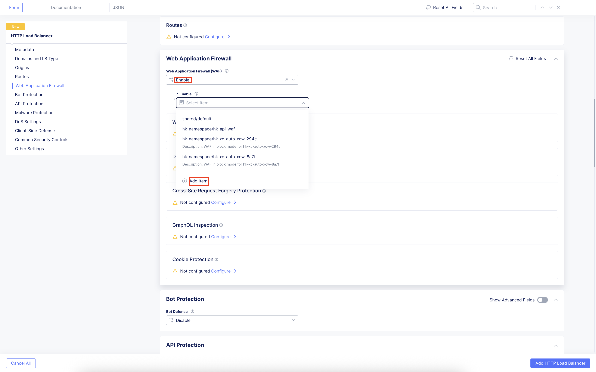

Migrating Applications Traffic from VMware to OCP
#########################################################

Accessing applications through Load Balancers
----
Origin pools are created for applications deployed in VMware and OCP CE site. Origin pools will be used in load balancer to migrate traffic based on weights.

Creating Load Balancer
----
1. Under “Multi-Cloud App Connect”, select Load Balancers-> HTTP Load Balancers. Click “Add HTTP Load Balancer”

.. image:: ../workload/assets/assets-ocp/23.png

2. Provide name for LB and domain with valid sub-domain
Note: You should be having domain to use for LB and it should be able to resolve for the FQDN to be accessible

.. image:: ./assets/vmw-to-ocp/uc2-lb-1.png

3. Click on “Add Item” under Origin Pool

.. image:: ../workload/assets/assets-ocp/25.png

4. Select the origin pools created earlier for VMware (Weight - 1) and OCP (Weight - 3) environment and click “Apply”
Note : OCP is the new environment where traffic needs to be migrated, so more weight is given.

.. image:: ./assets/vmw-to-ocp/uc2-lb-2.png

.. image:: ./assets/vmw-to-ocp/uc2-lb-3.png

5. Enable “Web Application Firewall (WAF)” and click “Add item”

6. Create a new WAF with below configurations and click “Add App Firewall”

.. image:: ../workload/assets/assets-ocp/28.png

7. Select the WAF added and verify the Origin Pool and WAF in LB configuration

.. image:: ./assets/vmw-to-ocp/uc2-lb-4.png

8. Click “Add HTTP Load Balancer” and wait for around ~5 minutes for LB to provision and come up completely.

.. image:: ./assets/vmw-to-ocp/uc2-lb-5.png

Verifying the Migration
----
1. Access the LB URL and Juice-Shop application should be available which is deployed in port 3000 in Client VM using docker

.. image:: ./assets/vmw-to-ocp/uc2-lb-6.png

2. Access the URL/application multiple times and observe the traffic distributed across environments based on weights assigned

.. image:: ./assets/vmw-to-ocp/UC2-S2-Req.png

3. Now access the application with some malicious requests and observe requests are being blocked

.. image:: ./assets/vmw-to-ocp/uc2-lb-6.png

4. Send multiple malicious requests and F5 Distributed Cloud WAF will block these requests, and these requests won’t reach the origin server

.. image:: ./assets/vmw-to-ocp/UC2-S2-Req2.png
