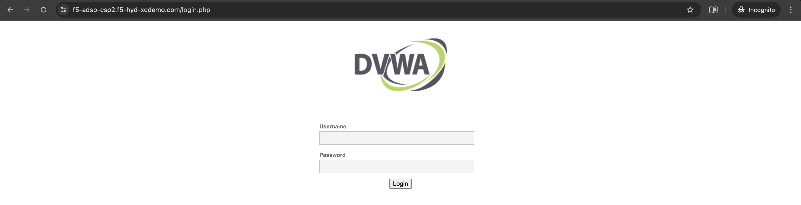

App Delivery & Security for Hybrid Environments using F5 Distributed Cloud
#########################################################
Scope
--------------
As enterprises modernize and expand their digital services, they increasingly deploy multiple instances of the same applications across diverse infrastructure environments—such as VMware, OpenShift, Nutanix, and public clouds—to support distributed teams, regional data sovereignty, redundancy, or environment-specific compliance needs. These application instances often integrate into service chains that span across clouds and data centers, introducing both scale and operational complexity.

F5 Distributed Cloud provides a unified solution for secure, consistent application delivery and security across hybrid and multi-cloud environments. It enables organizations to add workloads seamlessly—whether for scaling, redundancy, or localization—without sacrificing visibility, security, or performance.

Introduction
--------------
This article examines enterprise-scale application deployment patterns that result in multiple instances of the same workloads across heterogeneous environments. Common enterprise scenarios include:

- Running identical customer-facing services in VMware-based private data centers and OpenShift-based development or staging clusters.

- Deploying business-critical applications across Nutanix on-prem infrastructure for edge locations and public clouds (AWS, Azure, GCP) for global reach.

- Supporting multi-region high availability by duplicating services across on-premises VMware clusters and cloud-native Kubernetes platforms.

F5 Distributed Cloud helps organizations manage these deployments by ensuring uniform application delivery and security policies across all instances—regardless of the underlying platform.

Architecture Overview
--------------
.. image:: ./assets/ADSP-Growth-Architecture-New.png

As illustrated in the diagram above, when new application workloads are provisioned across environments such as AWS, Azure, GCP, VMware (on-prem), Nutanix (on-prem), and OpenShift Container Platform (on-prem), F5 Distributed Cloud ensures seamless integration with existing services. Using Secure Mesh Site v2 (SMSv2) with Customer Edge (CE) nodes, each location maintains secure, low-latency connectivity with F5’s globally distributed Regional Edges (RE) to support real-time traffic management, security enforcement, and observability.

Distributed Cloud CE is managed centrally using the Distributed Cloud Console. Distributed Cloud CE can be deployed as a standalone virtual machine (VM) or as a Kubernetes containerized service in any environment. It orchestrates the local control plane and data plane components to route, encrypt, and secure traffic. Distributed Cloud CE operates as a highly available edge gateway that can securely extend application connectivity and networks across sites, without the need to establish additional physical connectivity.

**VMware:** VM is created in VMware ESXi deployed in Dell PowerEdge-R640 bare metal. The VM is booted using the OVF image of SMSv2 CE downloaded from F5 Distributed Cloud. Once the CE VM is up and site is online, VM running application workloads is also deployed in the same ESXi and connected to CE using Site Local Inside (SLI) subnet and interface, so that applications are not exposed directly.

*Note: This scenario uses VMware On-Prem, but it can also be deployed on GCP and Azure.*

`F5 Distributed Cloud Workload Deployments on VMware | F5 XC Solutions <https://github.com/f5devcentral/f5-xc-terraform-examples/blob/main/workflow-guides/application-delivery-security/workload/workload-deployments-on-vmware.rst>`__

**OpenShift Container Platform (OCP):** 3-node OCP cluster is created on VMware. SMSv2 CE as VM is deployed using KVM (qcow) image in OCP cluster virtualization. VM running application workloads is also deployed and connected to CE using Site Local Inside (SLI) subnet and interface, so that applications are not exposed directly.

*Note: This scenario uses OCP Datacenter (On-Prem), but it can also be deployed on AWS, GCP, IBM and Azure.*

`Installation of Red Hat OpenShift Infra Setup on VMware ESXi | F5 XC Learn <https://github.com/f5devcentral/f5-xc-terraform-examples/blob/main/workflow-guides/application-delivery-security/workload/ocp-infra-setup.rst>`__

`F5 Distributed Cloud Workload Deployments on Red Hat OpenShift | F5 XC Solutions <https://github.com/f5devcentral/f5-xc-terraform-examples/blob/main/workflow-guides/application-delivery-security/workload/workload-deployments-on-ocp.rst>`__

**Nutanix on Bare Metal:** Nutanix Community Edition with Acropolis Hypervisor (AHV) is deployed on Dell PowerEdge-R430 bare metal. A VM is created and booted using the qcow2 image of SMSv2 CE downloaded from F5 Distributed Cloud. Once the CE VM is up and site is online, VM running application workloads are also deployed and connected to CE using Site Local Inside (SLI) subnet and interface, so that applications are not exposed directly.

*Note: This scenario uses Nutanix On-Prem, but it can also be deployed on AWS and Azure.*

`Installation of Nutanix Community Edition on Bare Metal | F5 XC Learn <https://github.com/f5devcentral/f5-xc-terraform-examples/blob/main/workflow-guides/application-delivery-security/Nutanix/nutanix_community_edition_2.1_installation.rst>`__

`F5 Distributed Cloud Workload Deployments on Nutanix | F5 XC Solutions <https://github.com/f5devcentral/f5-xc-terraform-examples/blob/main/workflow-guides/smsv2-ce/Secure_Mesh_Site_v2_in_Nutanix/secure_mesh_site_v2_in_nutanix.rst>`__

**Nutanix on VMware:** Nutanix Community Edition 2.1 is installed as VM in VMware ESXi. Nutanix console can be accessed by accessing this VM. This gives flexibility to scale RAM, hard disk to the Nutanix VM, and helps in adding multiple application instances in it. A CE node using SMSv2 is deployed in Nutanix along with an application(s) and is connected using SLI there by protecting application(s) in the Nutanix platform. F5 XC protects these application VMs deployed in Nutanix using XC security solutions such as WAF, DDoS, API and Bot defense etc.

`Installation of Nutanix Community Edition on VMware ESXi | F5 XC Learn <https://github.com/f5devcentral/f5-xc-terraform-examples/blob/main/workflow-guides/application-delivery-security/Nutanix_on_VMware/Nutanix_CE_2.1_installation_on_VMware.rst>`__

`F5 Distributed Cloud Workload Deployment on Nutanix on VMware ESXi | F5 XC Solutions <https://github.com/f5devcentral/f5-xc-terraform-examples/blob/main/workflow-guides/smsv2-ce/Secure_Mesh_Site_v2_in_Nutanix/secure_mesh_site_v2_in_nutanix.rst>`__

**Cloud Env:** For this demo Azure is chosen for deploying SMSv2 CE site. In the same resource group where CE VM is deployed, VM running application workloads is also deployed and connected to CE using Site Local Inside (SLI) subnet and interface, so that applications are not exposed directly.

*Note: Similarly, this deployment can be achieved in GCP and AWS using the links below.*

- AWS -> `Deploy Secure Mesh Site v2 on AWS <https://docs.cloud.f5.com/docs-v2/multi-cloud-network-connect/how-to/site-management/deploy-sms-aws-clickops>`__
- Azure -> `Deploy Secure Mesh Site v2 on Azure <https://docs.cloud.f5.com/docs-v2/multi-cloud-network-connect/how-to/site-management/deploy-sms-az-clickops>`__
- GCP -> `Deploy Secure Mesh Site v2 on GCP <https://docs.cloud.f5.com/docs-v2/multi-cloud-network-connect/how-to/site-management/deploy-sms-gcp-clickops>`__

Note: `Customer Edge Site Sizing Reference <https://docs.cloud.f5.com/docs-v2/multi-cloud-network-connect/reference/ce-site-size-ref>`__

`F5 Distributed Cloud Workload Deployments on Azure | F5 XC Solutions <https://github.com/f5devcentral/f5-xc-terraform-examples/blob/main/workflow-guides/application-delivery-security/workload/workload-deployments-on-azure.rst>`__

Scenario: Scalable Enterprise Workload Deployments Across Heterogeneous Environments
--------------
Deploy applications seamlessly across multiple environments based on customer requirements. F5, with its Application Delivery and Security capabilities, ensures consistent application delivery and security regardless of where the apps are deployed.

Workloads are distributed across the following environments:

- VMware: App A & App B
- OpenShift: App B & App C
- Nutanix: App B

- → VMware: Add App C
- → OpenShift: Add App A
- → Nutanix: Add App A & App C

Applications being used:

- A → Juice Shop
- B → DVWA
- C → NGINX

Initial Infrastructure:
--------------

*VMware: App A & B, OpenShift: App B & C, Nutanix: App B*

**VMware**
~~~~~~~~~~
In the VMware on-premises environment, Applications A and B are deployed and connected to two separate load balancers, forming the existing infrastructure. These applications are actively serving user traffic with delivery and security managed by F5 Distributed Cloud.

VMware application A (Juice Shop) deployed on LB **f5-adsp1.f5-hyd-xcdemo.com**

Web Application Firewall (WAF) is enabled, which will prevent any malicious threats.

From the **Requests** section in Distributed Cloud console for the LB, we can observe that benign requests are reaching the SMSv2 CE site deployed in VMware On-Prem environment and malign requests are being blocked by WAF which won’t reach the origin server.

VMware application B (DVWA) deployed on LB **f5-adsp2.f5-hyd-xcdemo.com**

**OCP (OpenShift Container Platform)**
~~~~~~~~~~
In the OCP on-premises environment, Applications B and C are deployed and connected to two separate load balancers, forming the existing infrastructure. These applications are actively serving user traffic with delivery and security managed by F5 Distributed Cloud.

OCP application B (DVWA) deployed on LB **f5-adsp3.f5-hyd-xcdemo.com**

Web Application Firewall (WAF) is enabled, which will prevent any malicious threats.

From the **Requests** section in Distributed Cloud console for the LB, we can observe that benign requests are reaching the SMSv2 CE site deployed in OCP On-Prem environment and malign requests are being blocked by WAF which won’t reach the origin server.

OCP application C (NGINX) deployed on LB **f5-adsp4.f5-hyd-xcdemo.com**

**Nutanix**
~~~~~~~~~~
In the Nutanix on-premises environment, Application B is deployed and connected to a dedicated load balancer, representing the existing infrastructure setup. These applications are actively serving user traffic with delivery and security managed by F5 Distributed Cloud.

Nutanix application B (DVWA) deployed on LB **f5-adsp5.f5-hyd-xcdemo.com**

Web Application Firewall (WAF) is enabled, which will prevent any malicious threats.

From the **Requests** section in Distributed Cloud console for the LB, we can observe that benign requests are reaching the SMSv2 CE site deployed in Nutanix On-Prem environment and malign requests are being blocked by WAF which won’t reach the origin server.

.. image:: ./assets/nutanix-req.png

Adding new workloads:
--------------

As the F5 Distributed Cloud supports continuous delivery and seamless security for additional workloads within existing infrastructure, we will introduce new workloads across all environments to validate and demonstrate this capability.

*VMware: Add App C, OpenShift: Add App A, Nutanix: Add App A and C*

**VMware**
~~~~~~~~~~
In the VMware on-premises environment, an additional application—Application C—will be deployed and connected to a dedicated load balancer, representing a new workload within the existing infrastructure. This deployment will be seamlessly integrated with F5 Distributed Cloud for secure and efficient application delivery.

VMware application C (NGINX) deployed on LB **f5-adsp6.f5-hyd-xcdemo.com**

Web Application Firewall (WAF) is enabled, which will prevent any malicious threats.

From the **Requests** section in Distributed Cloud console for the **new workload** LB, we can observe that benign requests are reaching the SMSv2 CE site deployed in VMware On-Prem environment and malign requests are being blocked by WAF which won’t reach the origin server.

**OCP (OpenShift Container Platform)**
~~~~~~~~~~
In the OCP on-premises environment, an additional application—Application A—will be deployed and connected to a dedicated load balancer, representing a new workload within the existing infrastructure. This deployment will be seamlessly integrated with F5 Distributed Cloud for secure and efficient application delivery.

OCP application A (Juice Shop) deployed on LB **f5-adsp7.f5-hyd-xcdemo.com**

Web Application Firewall (WAF) is enabled, which will prevent any malicious threats.

From the **Requests** section in Distributed Cloud console for the **new workload** LB, we can observe that benign requests are reaching the SMSv2 CE site deployed in OCP On-Prem environment and malign requests are being blocked by WAF which won’t reach the origin server.

**Nutanix**
~~~~~~~~~~
In the Nutanix on-premises environment, Applications A and C have been deployed and connected to two respective load balancers, representing new workloads added to the existing infrastructure. This deployment will be seamlessly integrated with F5 Distributed Cloud for secure and efficient application delivery.

Nutanix application A (Juice Shop) deployed on LB **f5-adsp8.f5-hyd-xcdemo.com**

Web Application Firewall (WAF) is enabled, which will prevent any malicious threats.

.. image:: ./assets/nutanix-A-WAF.png

From the **Requests** section in Distributed Cloud console for the **new workload** LB, we can observe that benign requests are reaching the SMSv2 CE site deployed in Nutanix On-Prem environment and malign requests are being blocked by WAF which won’t reach the origin server.

Nutanix application C (Juice Shop) deployed on LB **f5-adsp9.f5-hyd-xcdemo.com**

**Cloud Service Provider (Azure)**
--------------
**Initial Infrastructure:**

At the outset, cloud environments do not host any workloads. As new workloads are deployed based on requirements, F5 Distributed Cloud ensures seamless application delivery and comprehensive security across the infrastructure.

**Adding new workloads:**

In the Azure environment, Application A and B will be deployed and connected to dedicated load balancers, forming part of the new workload infrastructure. This setup will be secured and managed by F5 Distributed Cloud, ensuring reliable delivery and protection.

Azure application A (Juice Shop) deployed on LB **f5-adsp-csp1.f5-hyd-xcdemo.com**

Web Application Firewall (WAF) is enabled, which will prevent any malicious threats.

From the **Requests** section in Distributed Cloud console for the LB, we can observe that benign requests are reaching the SMSv2 CE site deployed in Azure environment and malign requests are being blocked by WAF which won’t reach the origin server.

Application B

Azure application B (DVWA) deployed on LB **f5-adsp-csp2.f5-hyd-xcdemo.com**

Web Application Firewall (WAF) is enabled, which will prevent any malicious threats.

From the **Requests** section in Distributed Cloud console for the LB, we can observe that benign requests are reaching the SMSv2 CE site deployed in Azure environment and malign requests are being blocked by WAF which won’t reach the origin server.

Conclusion:
--------------

From the above demonstration, we can conclude that F5 Distributed Cloud's Application Delivery and Security provides a robust and scalable solution across multi-cloud and on-prem environments, while also providing uniform application security. By deploying Secure Mesh Site v2 Customer Edge, organizations can ensure consistent connectivity, encryption, and protection for both new and existing workloads. The platform simplifies infrastructure expansion while maintaining centralized management through the Distributed Cloud Console. This enables businesses to efficiently meet evolving user demands without compromising security.

References:
--------------

`F5 Application Delivery and Security Platform <https://www.f5.com/products/f5-application-delivery-and-security-platform>`__

`F5 CE Data Sheet <https://www.f5.com/pdf/data-sheet/f5-distributed-cloud-customer-edge-ce-deployable-software.pdf>`__

`F5 CE Docs <https://docs.cloud.f5.com/docs-v2/multi-cloud-network-connect/concepts/f5-xc-customer-edge>`__

