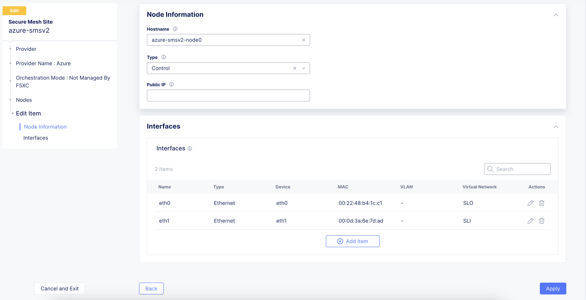
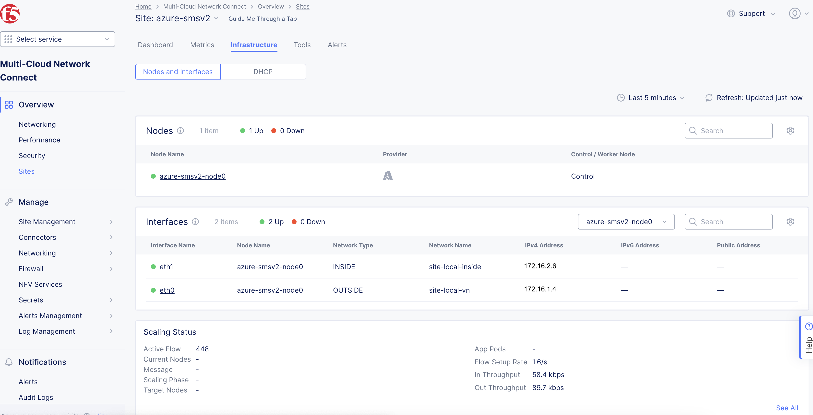

F5 Distributed Cloud Workload Deployments on Azure
#########################################################
This article serves as the initial setup for the Azure platform in “F5 Distributed Cloud Application Delivery and Security for Scalable Enterprise Workload Deployments across Heterogeneous Environments” scenario. This document covers:

- Customer Edge (CE) Setup
- Client VM(Ubuntu) Installation
- Application Access via Load Balancers

For this demo Azure was chosen for deploying SMSv2 CE site. In the same resource group where CE VM is deployed, VM running application workloads are also deployed and connected to CE using Site Local Inside (SLI) subnet and interface, so that applications are not exposed directly.

*Note: Similarly, this deployment can be achieved in GCP and AWS using the links below.*

- AWS -> `Deploy Secure Mesh Site v2 on AWS <https://docs.cloud.f5.com/docs-v2/multi-cloud-network-connect/how-to/site-management/deploy-sms-aws-clickops>`__
- Azure -> `Deploy Secure Mesh Site v2 on Azure <https://docs.cloud.f5.com/docs-v2/multi-cloud-network-connect/how-to/site-management/deploy-sms-az-clickops>`__
- GCP -> `Deploy Secure Mesh Site v2 on GCP <https://docs.cloud.f5.com/docs-v2/multi-cloud-network-connect/how-to/site-management/deploy-sms-gcp-clickops>`__

Steps to Deploy Secure Mesh Site v2 on Azure
--------------
*Note 1: Resources required to create CE VM: Minimum 8 vCPUs, 32 GB RAM, and 80 GB disk storage, please refer below link for more details on sizing and resources:*

`Customer Edge Site Sizing Reference <https://docs.cloud.f5.com/docs-v2/multi-cloud-network-connect/reference/ce-site-size-ref>`__

Create Site Object
--------------
Create a secure mesh site object in the Distributed Cloud Console and select Azure as the provider.

**Step 1: Enter metadata information for site.**

- Login to **Distributed Cloud Console**
- In Distributed Cloud Console, select **Multi-Cloud Network Connect**
- Navigate to **Manage > Site Management > Secure Mesh Sites v2**
- Select **Add Secure Mesh Site** to open the configuration form.
- In the **Metadata** section, enter a name for the site.
- Optionally, select labels and add a description.

**Step 2: Select the provider name as Azure.**

- Set the Provider Name option to Azure. Keep all other default values.

- Click **Add Secure Mesh Site**

Create Network Security Group
--------------
The CE site’s instance security is internally managed by the CE data path. Therefore, you must configure a Network Security Group with allow-all rules for both inbound and outbound traffic to be used with the Site deployment.

**Step 1: Navigate to security group creation page.**

- In Azure Console, navigate to the Network security groups service.

**Step 2: Create and configure security group.**

- Click Create.

- Assign the new security group to your resource group. This procedure uses f5xc-ce-resource-group as an example.

- Give the network security group an indicative name. In this procedure, it is f5-ce-external-network-security-group.

- Click Review + create.

- After you create the network security group, click on it to set up the inbound and outbound rules.

**Step 3: Create inbound rules.**

Make sure you add rules for the following:

- Allowed SSH from the instance. Azure will figure out the public IP address that a user is configuring from and allows it. You can also use the custom option and enter your corporate public address space.

- Allowed ICMP for troubleshooting.

- Allowed TCP Port 65500 for the local UI on the CE.

- For three-node clusters, ensure that traffic is allowed between the nodes.

**Step 4: Create outbound rules.**

- Create an allow-all policy for egress traffic. This is the default configuration.

**Step 5: Verify rules created.**

- In the overview section for your network security group, you can see all the rules that have been created. Confirm the rules are as desired.

Create SSH Key Pair
--------------
You need to create a key pair for SSH login into the virtual machine for troubleshooting purposes.

**Step 1: Navigate to SSH key creation page.**

- In Azure Console, navigate to the SSH keys service.

- Click Create.

**Step 2: Configure key pair.**

- Verify Subscription and Resource group are correctly selected.

- In the Key pair name field, enter a name.

- Click Review + create.

- After successful validation, click Create.

- Click Download private key and create resource to download the key pair locally to your machine since the pair will not be saved in Azure. You will need the key pair to log into the CE Site node. The private key pair file is named f5xc-ce-ssh-keys.pem as an example.

Existing Resource Group Details
--------------
In this procedure, dual interface single-node and multi-node CE sites are being deployed. Therefore, you need two subnets: SLI (Site Local Inside) and SLO (Site Local Outside). Note that workload subnets are generally used but are not a requirement to deploy a CE Site.

Create Public IP Address
--------------
In Azure Console, create a public IP address. You will need to create one public IP address for each node that is being deployed for the CE site. In other words, for a single-node CE Site, you will create one public IP and for a CE Site with high availability (HA), you will need to create three public IP addresses.

- Navigate to the Public IP addresses creation page and click Create.

- Under Configuration details, in the Name field, enter a name for the public IP.

- Leave the remaining options with their default values.

- Click Review + create.

- After validation passes, click Create.

Generate Node Token
--------------
A one-time node token is required to register a CE Site node to the Distributed Cloud Console. A new token must be generated for every new node in a CE Site. A token is valid for 24 hours. Make sure that the CE node is deployed soon after the token is generated.

- In Distributed Cloud Console, select the Multi-Cloud Network Connect workspace.

- Navigate to Manage > Site Management > Secure Mesh Sites v2.

- For your Site, click ... > Generate Node Token.

- Click Copy.

- Save the value locally. This token will be used later. The token value is hidden for security purposes.

- Click Close.

Create Azure Virtual Machine
--------------
Create the instance virtual machine (VM) using the parameters previously created.

This section guides you through the procedure to deploy directly from Azure Marketplace using an image.

This procedure uses Standard_D8_v4 as an example. To find your right size and requirements, refer to the Customer Edge Site Sizing Reference guide.

**Step 1: Create new virtual machine.**

- In Distributed Cloud Console, select the Multi-Cloud Network Connect workspace.

- Navigate to Manage > Site Management > Secure Mesh Sites v2.

- For your Site, click ... > Launch Instance. This action will open the CE image listing on Azure Marketplace in a new browser tab.

- Click Create to launch a new CE virtual machine.

**Step 2: Configure new virtual machine.**

- Enter a VM name.

- Ensure the correct region and availability zone are selected.

- From the Size menu, choose the instance type. This procedure uses Standard_D8_v4 as an example.

- From the SSH public key source menu, assign the previously created SSH key pair.

- In the Username field, enter cloud-user as the default user to SSH log into the CE instance.

- Click Next:Disk.

- From the OS disk size menu, select 128 GiB (P10). The minimum disk requirement is 80 GB. However, for Azure, we are using the 128 GB option as there is no 80 GB option available by default.

**Step 3: Configure virtual machine networking.**

- Click Next: Networking.

- Ensure the following parameters for network interface configuration:

- From the Virtual network menu, select the network.

- From the Subnet menu, select the external interface.

- From the Public IP menu, select the IP address previously created.

- For the NIC network security group option, select Advanced. This option is needed so that you can select the network security group.

- From the Configure network security group menu, select the security group previously created.

- Select the Delete NIC when VM is deleted option.

**Step 4: Configure advanced settings.**

- Click the Advanced tab to skip the management and monitoring configuration.

- In the Custom data field, paste the cloud-init information (which includes the Site token) copied from the Generate Node Token section.

**Step 5: Complete creation.**

- Click Review + create. After validation process completes successfully, click Create.

Verify CE Site Registration
--------------
- In Distributed Cloud Console, navigate to Multi-Cloud Network Connect > Overview > Infrastructure > Sites.

- Select your Site. The Dashboard tab should clearly show that the CE Site has registered successfully with the System Health of 100% as well as Data Plane/Control Plane both being up.

Add New Interface
--------------
- In Azure portal, select your VM and click Stop.

- After the VM stops, click Network settings. Then click Attach network interface.

- Click Create and attach the network interface.

- Select the resource group previously created for this VM.

- In the Name field, enter a new name for this second interface.

- In the Subnet field, select the internal subnet created earlier. Make sure to reference that this is an internal interface since the external interface was previously created.

- Click Create.

- After the second interface is attached to your VM, start the VM.

- Use the steps above to create and attach additional interfaces to this VM.

- After the Site is back online, click Manage Configuration. Then, in the wizard, click Edit Configuration.

- Under the Interfaces subsection, click the pencil icon under Actions to edit. In the current release, additional interfaces, including SLI interface, need to be configured with a static IP address which in this case must be same as that allocated by Azure.

- Select Static IP as the IPv4 Interface Address Method.

- Enter the IPv4 address with prefix length. This must be same as that allocated by Azure.

- Click Apply.

- Click Save Secure Mesh Site.

- Visually verify the same information from the Distributed Cloud Console by navigating to Multi-Cloud Network Connect > Overview > Infrastructure > Sites and selecting your Site name. Select the Infrastructure tab and view the Interfaces table.

Steps to install VM (Client VM) running application workloads
--------------
1. Login to Azure portal

2. Search for “Virtal Machines” in search bar and click “Create”

3. Provide the required basic details for creating VM under “Basics” tab
    - Select the resource group already created for CE
    - Provide a name for the client VM
    - Select the region where you want to deploy
    - Select the OS image to be deployed in VM
    - Choose VM size based on requirements
    - Enter username and SSH key details to access the VM
    - Click “Next : Disks >”
.. image:: ./assets/assets-azure/smsv2-azure-cvm-1.png
.. image:: ./assets/assets-azure/smsv2-azure-cvm-2.png

4. Provide OS disk details under “Disks” tab based on requirement and click “Next : Networking >”

.. image:: ./assets/assets-azure/smsv2-azure-cvm-3.png

5. Under “Networking” tab:
    - Choose the “Virtual Network” created earlier for the CE
    - Select the same “SLI” subnet which is attached to the CE
    - Create a “Public IP” to access the VM and deploy applications
    - Choose the “Network Security Group” created for this VM which has minimal access based on rules created
    .. image:: ./assets/assets-azure/azure-client-nsg.png
    - Click “Review + create”
    .. image:: ./assets/assets-azure/smsv2-azure-cvm-4.png

6. Under “Review + create” tab, wait for the “Validation passed” message, review the configurations and click “Create”

.. image:: ./assets/assets-azure/smsv2-azure-cvm-5.png

7. Wait for a few minutes for the deployment to succeed and VM to start running.
    - Public IP should be available, which is used for accessing the VM through SSH
    - Private IP should be assigned from SLI subnet selected
.. image:: ./assets/assets-azure/smsv2-azure-cvm-6.png

8. Navigate to the CE site in F5 Distributed Cloud and ping the client VM private IP, it should be reachable

.. image:: ./assets/assets-azure/smsv2-azure-cvm-7.png

9. Once the connection is established between CE site and VM, connect to the VM through SSH to deploy application. Execute below commands to deploy a vulnerable application (here “JuiceShop” is used)

    - $ sudo apt update
    - $ sudo apt install docker.io
    - $ sudo docker run -d -p 3000:3000 bkimminich/juice-shop

Accessing applications through Load Balancers
--------------
To access the applications installed in the Client machine through SMSv2 Customer Edge (CE), below configurations needs to be followed:

- Creating “Origin Pool”
- Creating “LB”

Creating Origin Pool
--------------
1. Under “Multi-Cloud App Connect”, select Load Balancers-> Origin Pools. Click “Add Origin Pool

.. image:: ./assets/assets-azure/smsv2-azure-op1.png

2. Provide a name to the Origin Pool and click “Add Item” under Origin Servers

.. image:: ./assets/assets-azure/smsv2-azure-op2.png

3. Select Origin Server Type IP address of Origin Server on given Sites and provide IP, select VMware site created from the dropdown and make sure Select Network on the site is set to “Inside Network” and click “Apply”

*Note : IP address and Site or Virtual Site might vary based on your configuration*

4. Origin Server details will populate in the Origin Pool page, provide the port of the Ubuntu machine where the application is exposed (in this case 3000)

5. After creating the Origin Pool, this can be used in Load Balancer to access the application.

Creating Load Balancer
--------------
1. Under “Multi-Cloud App Connect”, select Load Balancers-> HTTP Load Balancers. Click “Add HTTP Load Balancer”

.. image:: ./assets/assets-azure/smsv2-azure-lb1.png

2. Provide name for LB and domain with valid sub-domain

*Note: You should be having domain to use for LB and it should be able to resolve for the FQDN to be accessible*

3. Click on “Add Item” under Origin Pool

.. image:: ./assets/assets-azure/smsv2-azure-lb3.png

4. Select the origin pool created earlier and click “Apply”

.. image:: ./assets/assets-azure/smsv2-azure-lb4.png

5. Enable “Web Application Firewall (WAF)” and click “Add item”

.. image:: ./assets/assets-azure/smsv2-azure-lb5.png

6. Create a new WAF with below configurations and click “Add App Firewall”

.. image:: ./assets/assets-azure/smsv2-azure-lb6.png

7. Select the WAF added and verify the Origin Pool and WAF in LB configuration

.. image:: ./assets/assets-azure/smsv2-azure-lb7.png

8. Click “Add HTTP Load Balancer” and wait for around ~5 minutes for LB to provision and come up completely.

9. Access the LB URL and Juice-Shop application should be available which is deployed in port 3000 in Ubuntu VM using docker

Adding new application and accessing through Load Balancers
--------------
Once the LB URL is verified and application is accessible, we can start scaling by installing one more new application in another port using the docker command in Ubuntu machine.

    **$ sudo docker run -d -p 3001:80 vulnerables/web-dvwa**

By following the same steps mentioned earlier for creating Origin Pool and LB, we need to create one more new Origin pool and LB for the new application.

1. Create a new Origin pool with the port (3001) where new application is exposed, same Origin Servers settings are used in this Origin Pool as well.

2. Create a new LB with a distinct Domain URL and select the Origin Pool created in above step

*Note: Other settings like WAF remains same used earlier*

3. Click “Add HTTP Load Balancer” and wait for around ~5 minutes for LB to provision and come up completely

4. Access the LB URL and DVWA application should be available which is deployed in port 3001 in Ubuntu VM using docker

References:
--------------
`Deploy Secure Mesh Site v2 on Azure (ClickOps) <https://docs.cloud.f5.com/docs-v2/multi-cloud-network-connect/how-to/site-management/deploy-sms-az-clickops>`__

`Create Origin Pools <https://docs.cloud.f5.com/docs-v2/multi-cloud-app-connect/how-to/create-manage-origin-pools>`__

`Create HTTP Load Balancer <https://docs.cloud.f5.com/docs-v2/multi-cloud-app-connect/how-to/load-balance/create-http-load-balancer>`__
