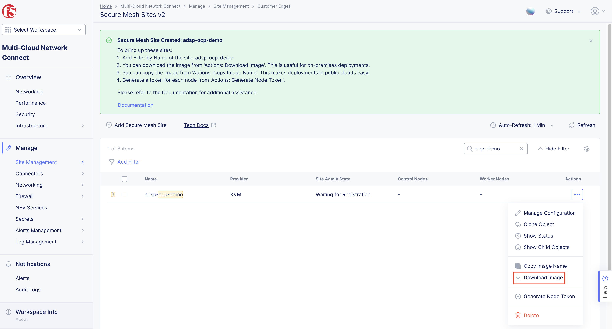

F5 Distributed Cloud Workload Deployments on OCP
#########################################################
This article serves as the initial setup for the OCP platform in “F5 Distributed Cloud Application Delivery and Security for Scalable Enterprise Workload Deployments across Heterogeneous Environments” scenario. This document covers:

- Customer Edge (CE) Setup
- Client VM(Ubuntu) Installation
- Application Access via Load Balancers

OCP cluster used in this demonstration is deployed on VMware ESXi hypervisor. Once the OCP cluster is up and running, the next step is to deploy SMSv2 CE.

Steps to Deploy Secure Mesh Site v2 on OCP
--------------
*Note 1: KVM image is used for this demonstration of OCP*

*Note 2: Resources required to create CE VM: Minimum 8 vCPUs, 32 GB RAM, and 80 GB disk storage, please refer below link for more details on sizing and resources:*

`Customer Edge Site Sizing Reference <https://docs.cloud.f5.com/docs-v2/multi-cloud-network-connect/reference/ce-site-size-ref>`__

Create Site Object
--------------
Create a secure mesh site object in the Distributed Cloud Console and select VMware as the provider.

**Step 1: Enter metadata information for site.**

- Login to **Distributed Cloud Console**
- In Distributed Cloud Console, select **Multi-Cloud Network Connect**
- Navigate to **Manage > Site Management > Secure Mesh Sites v2**
- Select **Add Secure Mesh Site** to open the configuration form.
- In the **Metadata** section, enter a name for the site.
- Optionally, select labels and add a description.

**Step 2: Select the provider name as KVM (EA).**

- Set the Provider Name option to KVM (EA). Keep all other default values.

- Click **Add Secure Mesh Site**

Download Node Image
--------------

KVM uses qcow2 file to store various files associated with a Virtual Machine (VM). F5 Distributed Cloud packages Customer Edge node software in a qcow2 template file that lets you add a pre-configured virtual machine in the OCP cluster.

- Navigate to Manage > Site Management > Secure Mesh Sites v2.

- From the Secure Mesh Sites page, for your site, click ... > Download Image and then save the image locally.

Create Nodes (Virtual Machines)
--------------
Follow the steps below to deploy a CE node as a virtual machine (VM) using the qcow2 software image that was downloaded in the previous section.

**Generate Node Token**

A node token is required to register a CE Site node to the Distributed Cloud Console.

- In Distributed Cloud Console, select the **Multi-Cloud Network Connect** workspace
- Navigate to **Manage > Site Management > Secure Mesh Sites v2**
- For your site, click ... > **Generate Node Token**

- Click Copy cloud-init.

- Save the value locally. This token is used later. The token value is hidden for security purposes.

- Click Close

**Create a CE Node (Virtual Machine)**

- SMSv2 CE VM will be created using the .qcow2 image file downloaded earlier from F5 Distributed Cloud Console after creating site object.

Once the image is downloaded follow the below steps:

1. Create Persistent Volumes with 100GB capacity and local storage (so that image gets stored in the node path given)
	- Save the below configuration as f5-ce-pv.yaml

.. code-block:: python
   :name: this-py

    apiVersion: v1
    kind: PersistentVolume
    metadata:
      name: f5-xc-sms-pv1
    spec:
      capacity:
        storage: 100Gi
      accessModes:
        - ReadWriteOnce
      persistentVolumeReclaimPolicy: Retain
      storageClassName: tme-storage
      local:
        path: /mnt/data/v1  # Change this to your actual local storage path
      nodeAffinity:
        required:
          nodeSelectorTerms:
            - matchExpressions:
                - key: kubernetes.io/hostname
                  operator: In
                  values:
                    - aa-bb-cc-dd-ee-01  # The node you want to use
      volumeMode: Filesystem

    ---

    apiVersion: v1
    kind: PersistentVolume
    metadata:
      name: f5-xc-sms-pv2
    spec:
      capacity:
        storage: 100Gi
      accessModes:
        - ReadWriteOnce
      persistentVolumeReclaimPolicy: Retain
      storageClassName: tme-storage
      local:
        path: /mnt/data/v1  # Change this to your actual local storage path
      nodeAffinity:
        required:
          nodeSelectorTerms:
            - matchExpressions:
                - key: kubernetes.io/hostname
                  operator: In
                  values:
                    - aa-bb-cc-dd-ee-01  # The node you want to use
      volumeMode: Filesystem

2. Before creating PV, login to node

- oc debug node/<node-name>
	- chroot /host

	Create new interface for SLI
	- sudo ip link add name br-extvm-1 type bridge
	- sudo ip link set dev br-extvm-1 up

*Note – Interface was already added, so “File exists” is showing, when executed for the first time you won’t see this*

.. image::

Create a directory and provide necessary permission (777) for PV to write content in the node directory
	- mkdir -p /mnt/data/v1
	- chmod 777 /mnt/data/v1
	- exit
	- exit

3. After creating bridge interface and storage for CE VM in the node, exit the node and apply the OC apply command to create PV using the above .yaml file “oc apply –f f5-ce-pv.yaml”

