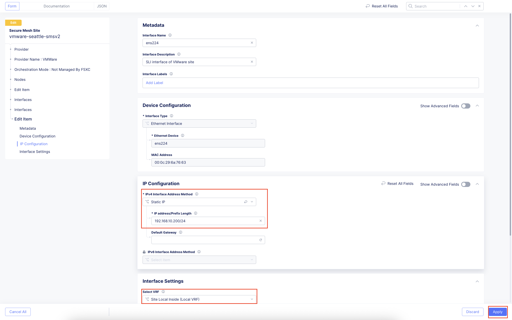
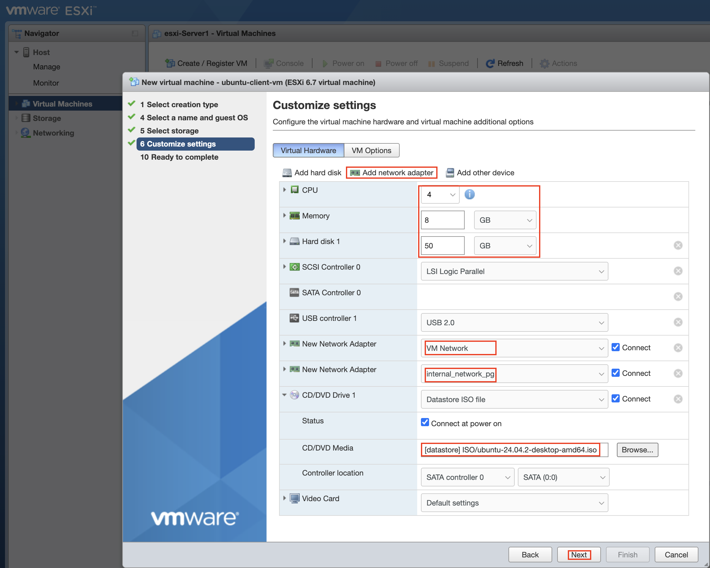
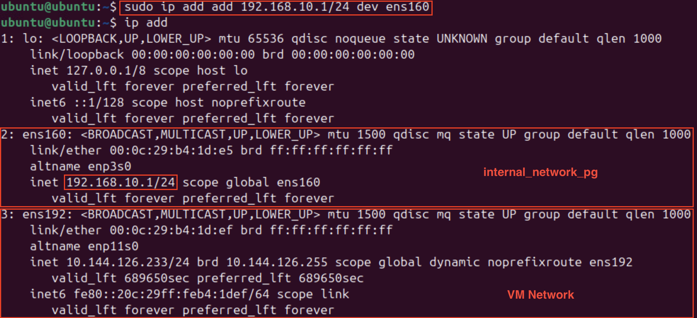

F5 Distributed Cloud Workload Deployments on VMware
#########################################################
This article serves as the initial setup for the VMware platform in “F5 Distributed Cloud Application Delivery and Security for Scalable Enterprise Workload Deployments across Heterogeneous Environments” scenario. This document covers:

- Customer Edge (CE) Setup
- Client VM(Ubuntu) Installation
- Application Access via Load Balancers

VMware ESXi used in this demonstration is deployed on Dell PowerEdge-R640 bare metal. The CE VM is booted using the OVF image of SMSv2 CE downloaded from F5 Distributed Cloud. Once the CE VM is up and site is online, VM running application workloads (Ubuntu VM) is also deployed in the same ESXi and connected to CE using Site Local Inside (internal_network_pg) interface, so that applications are not exposed directly.

*Note: This scenario uses VMware On-Prem, but it can also be deployed on GCP and Azure.*

VMware Architecture
--------------

Steps to Deploy Secure Mesh Site v2 on VMware
--------------
*Note 1: Resources required to create CE VM: Minimum 8 vCPUs, 32 GB RAM, and 80 GB disk storage, please refer below link for more details on sizing and resources:*
`Customer Edge Site Sizing Reference <https://docs.cloud.f5.com/docs-v2/multi-cloud-network-connect/reference/ce-site-size-ref>`__

*Note 2: For this demonstration ESXi 6.7.0 is used, if vSphere is being used, please refer the below link:*
`Deploy Secure Mesh Site v2 on VMware (ClickOps) <https://docs.cloud.f5.com/docs-v2/multi-cloud-network-connect/how-to/site-management/deploy-sms-vmw-clickops>`__

Create Site Object
--------------
Create a secure mesh site object in the Distributed Cloud Console and select VMware as the provider.

**Step 1: Enter metadata information for site.**

- Login to **Distributed Cloud Console**
- In Distributed Cloud Console, select **Multi-Cloud Network Connect**
- Navigate to **Manage > Site Management > Secure Mesh Sites v2**
- Select **Add Secure Mesh Site** to open the configuration form.
- In the **Metadata** section, enter a name for the site.
- Optionally, select labels and add a description.

**Step 2: Select the provider name as VMware.**

- Set the Provider Name option to VMware. Keep all other default values.

- Click **Add Secure Mesh Site**

Download Node Image
--------------
VMWare uses OVA (Open Virtualization Appliance) file to store various files associated with a Virtual Machine (VM). This file is stored in the Open Virtualization Format (OVF) as a TAR archive.

F5 Distributed Cloud packages Customer Edge node software in an OVA template file that lets you add a pre-configured virtual machine to the vCenter Server or ESXi inventory. Using vApps properties of the OVA template, you can configure the Site and specify metadata, such as the node token required to register the CE Site nodes.

- Navigate to **Manage > Site Management > Secure Mesh Sites v2**
- From the Secure Mesh Sites page, for your site, click ... > **Download Image** and then save the image locally.

- Ensure that you validate the **MD5SUM** of the image for an integrity check.

Create Nodes (Virtual Machines)
--------------
Follow the steps below to deploy a CE node as a virtual machine (VM) using the OVA software image that was downloaded in the previous section.

**Generate Node Token**

A node token is required to register a CE Site node to the Distributed Cloud Console.

- In Distributed Cloud Console, select the **Multi-Cloud Network Connect** workspace
- Navigate to **Manage > Site Management > Secure Mesh Sites v2**
- For your site, click ... > **Generate Node Token**

- Click Copy.
- Save the value locally. This token is used later. The token value is hidden for security purposes.
.. image:: ./assets/assets-vmware/6.png
- Click Close

**Create a CE Node (Virtual Machine)**

- SMSv2 CE VM will be created using the .ova image file downloaded earlier from F5 Distributed Cloud Console after creating site object.

- Provide a new for VM and select the .ova file from the directory
.. image:: ./assets/assets-vmware/8.png
- Select “datastore” having sufficient space to run VM

- In “Network”, interface port group having internet connectivity needs to be selected

- Provide a hostname and paste the “Node token” obtainer earlier after creating site object
*Note: VM Network (OUTSIDE) port group selected in earlier step has DHCP enabled, so DHCP is marked as “yes” here, which will be default*

- Review and click “Finish”

- VM will boot-up and establish a connection with F5 Distributed Cloud for provisioning and registration. Once all the process is complete (usually it’ll take ~30 minutes) for the site to come up “Online” comprehensively
*Note: Site name is different in consecutive screenshots, please ignore this mismatch*

- Select the site. The Dashboard tab should clearly show that the CE Site has registered successfully with the System Health of 100% as well as Data Plane/Control Plane both being up

Creating New Port Group
--------------
Once the VM is up and online in F5 Distributed Cloud, we need to add internal local interface to communicate with Client VM locally, to achieve this new “Virtual switch” and “Port group” needs to be created.

1. Create a “Virtual switch” by Navigating to “Networking” -> “Virtual switches” tab

2. Now create a “Port group” using the earlier created “Virtual switch”. Provide VLAN ID so that interfaces using this port group will be distinct.

3. Attach this new port group to the CE VM

4. Save and Restart the CE site VM in VMware. The site will go down in F5 Distributed Cloud Console and will come up again (~5-10 minutes) with new interface detected, IP address needs to be assigned for the new interface.

5. Click “Manage Configuration” once the site is up after restarting from VMware ESXi

6. Click “Edit Configuration”

7. Click on pencil icon beside node hostname under Actions

8. A new interface will be visible with MAC address assigned, click pencil icon

9. Select “Static IP” and provide the IP address in a chosen subnet (192.168.10.0 is chosen for this demo) and select “Site Local Inside (Local VRF)” under Interface Settings and click “Apply”

10. Interfaces and IP address assigned can be verified under “Infrastructure” tab of site

Steps to install VM (Client VM) running application workloads
--------------
1. Login to VMware ESXi client

*Note: UI in below screenshots might change based on version being used*

2. Click “Create/Register VM” and select “Create a new virtual machine” and proceed “Next”

3. Provide a name and select “OS family” and “OS version”

4. Select “datastore” having sufficient storage to run VM

5. Choose desired configuration (CPU, Memory, Disk space) for your VM. In network adapter, two adapters are required, one connected to the Internet (VM Network) and another created locally (internal_network_pg) to connect CE VM and Client VM (ubuntu). Select the “Ubuntu (or any linux image) ISO” in Datastore through which you want the Client VM to boot-up.

6. Review and click **Finish**

7. Once the VM is created in ESXi, select the VM and click “Power on”

8. Open the VM in Web Console through VMware and complete the installation process of Ubuntu.

9. Now interfaces need to be verified, execute “ip add” in Ubuntu CLI. Observe two interfaces(excluding “lo”) should be there, which were attached during VM creation in ESXi.
    A) Interface connected to “VM Network” port group will get IP from DHCP(if configured), which in this demonstration DHCP is present and an IP address with internet connectivity is allocated.
    B) Interface connected to “internal_network_pg” port group won’t be having any IP by default, we need to provide

10. Select a IP subnet which you want to use for communication (Here 192.168.10.0/24 subnet is used).

11. Execute the ip assigning commands for “ens160” interface and set IP in desired subnet

12. Verify the connectivity from CE site by pinging to this new IP from F5 Distributed Cloud Console

13. Now we need to deploy applications in Ubuntu. For this demo docker is used to deploy multiple applications. Execute below commands to install “docker” in Ubuntu.

- **$ sudo apt update**
- **$ sudo apt install docker.io**

14. Once docker is installed, for this demo “Juice-shop” application is being installed using below docker command

- **$ sudo docker run -d -p 3000:3000 bkimminich/juice-shop**

Accessing applications through Load Balancers
--------------
To access the applications installed in the Client machine through SMSv2 Customer Edge (CE), below configurations needs to be followed:

- Creating “Origin Pool”
- Creating “LB”

Creating Origin Pool
--------------
1. Under “Multi-Cloud App Connect”, select Load Balancers-> Origin Pools. Click “Add Origin Pool

.. image:: ./assets/assets-vmware/35.png

2. Provide a name to the Origin Pool and click “Add Item” under Origin Servers

3. Select Origin Server Type IP address of Origin Server on given Sites and provide IP, select VMware site created from the dropdown and make sure Select Network on the site is set to “Inside Network” and click “Apply”

*Note : IP address and Site or Virtual Site might vary based on your configuration*

4. Origin Server details will populate in the Origin Pool page, provide the port of the Ubuntu machine where the application is exposed (in this case 3000)

5. After creating the Origin Pool, this can be used in Load Balancer to access the application.

Creating Load Balancer
--------------
1. Under “Multi-Cloud App Connect”, select Load Balancers-> HTTP Load Balancers. Click “Add HTTP Load Balancer”

.. image:: ./assets/assets-vmware/39.png

2. Provide name for LB and domain with valid sub-domain

*Note: You should be having domain to use for LB and it should be able to resolve for the FQDN to be accessible*

3. Click on “Add Item” under Origin Pool

.. image:: ./assets/assets-vmware/41.png

4. Select the origin pool created earlier and click “Apply”

5. Enable “Web Application Firewall (WAF)” and click “Add item”

.. image:: ./assets/assets-vmware/43.png

6. Create a new WAF with below configurations and click “Add App Firewall”

7. Select the WAF added and verify the Origin Pool and WAF in LB configuration

8. Click “Add HTTP Load Balancer” and wait for around ~5 minutes for LB to provision and come up completely.

.. image:: ./assets/assets-vmware/46.png

9. Access the LB URL and Juice-Shop application should be available which is deployed in port 3000 in Ubuntu VM using docker

Adding new application and accessing through Load Balancers
--------------
Once the LB URL is verified and application is accessible, we can start scaling by installing one more new application in another port using the docker command in Ubuntu machine.

- **$ sudo docker run -d -p 3001:80 vulnerables/web-dvwa**

.. image:: ./assets/assets-vmware/48.png

By following the same steps mentioned earlier for creating Origin Pool and LB, we need to create one more new Origin pool and LB for the new application.

1. Create a new Origin pool with the port (3001) where new application is exposed, same Origin Servers settings are used in this Origin Pool as well.

2. Create a new LB with a distinct Domain URL and select this Origin Pool.
*Note: Other settings like WAF remains same used earlier*

3. Click “Add HTTP Load Balancer” and wait for around ~5 minutes for LB to provision and come up completely

4. Access the LB URL and DVWA application should be available which is deployed in port 3001 in Ubuntu VM using docker

References:
--------------
`Deploy Secure Mesh Site v2 on VMware (ClickOps) <https://docs.cloud.f5.com/docs-v2/multi-cloud-network-connect/how-to/site-management/deploy-sms-vmw-clickops>`__

`Create Origin Pools <https://docs.cloud.f5.com/docs-v2/multi-cloud-app-connect/how-to/create-manage-origin-pools>`__

`Create HTTP Load Balancer <https://docs.cloud.f5.com/docs-v2/multi-cloud-app-connect/how-to/load-balance/create-http-load-balancer>`__

