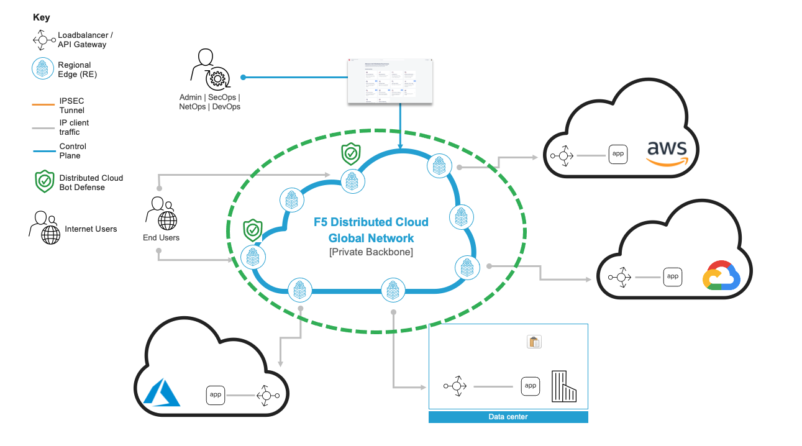

Deploying F5 XC Bot Defense on Regional Edge
=============================

--------------

.. contents:: **Table of Contents**

Overview
#########

This demo guide provides step-by-step walkthrough for deploying Bot Defense on an RE site manually using XC console along with terraform scripts to automate the deployment. For more information on different WAAP deployment modes, refer to the devcentral article: `Deploy Bot Defense Anywhere with F5
Distributed Cloud <https://community.f5.com/t5/technical-articles/deploy-bot-defense-on-any-edge-with-f5-distributed-cloud-saas/ta-p/323272>`__

**Note:** Even though the scenario here focuses on XC Bot Defense customers can enable any security services in the same setup, such as API Security, Bot Defense, DoS/DDOS and Fraud, as per their needs.

Setup Diagram
#############

Workflow Instructions
######################

`F5 Distributed Cloud Console Workflow <./xc-console-demo-guide.rst>`__

`COMING SOON** F5 Distributed Cloud Automation Workflow <./automation-demo-guide.rst>`__
