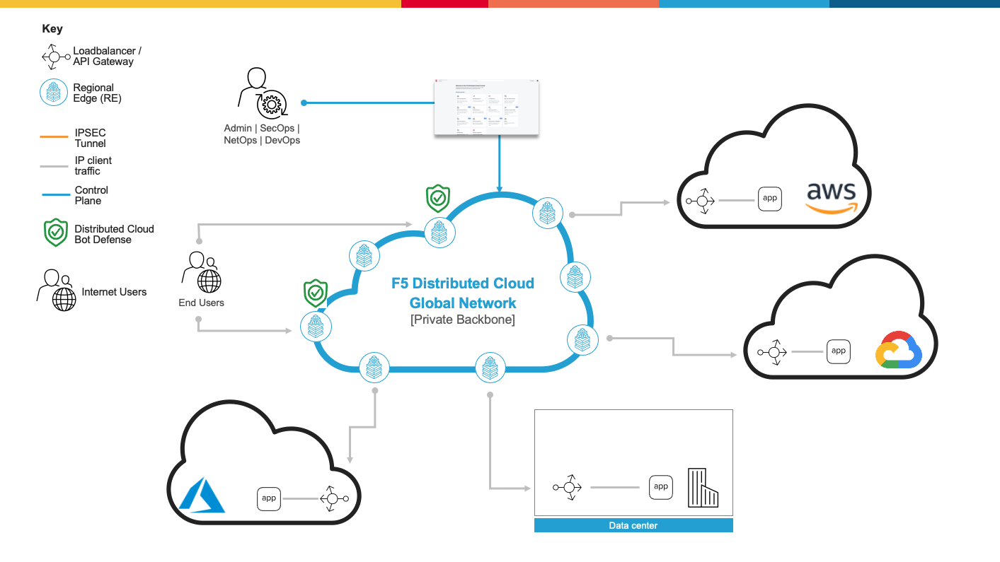
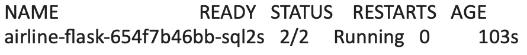

Deploy Bot Defense against Automated Threats on Regional Edges with F5 XC
===========================================

Objective :
-----------

Use this repo and work-flow guide for deploying XC Bot Defense via our WAAP Connector
on Kubernetes. This guide will outline the steps for implementing this infrastructure via Console Steps as well as Automated method using Terraform

Architectural diagram :
-----------------------

Manual step by step process for deployment:
-------------------------------------------

Console Deployment Prerequisites:
^^^^^^^^^^^^^^

1. F5 Distributed Cloud Account (F5XC)
2. kubectl already configured in a linux
   instance
3. Access to F5 XC account
4. You will need to download the Kubernetes manifest called airflask.yaml located in the `airline-app directory <https://github.com/f5devcentral/f5-xc-waap-terraform-examples/tree/main/workflow-guides/bot/deploy-botdefense-against-automated-threats-on-regional-edges-with-f5xc/airline-app>`__ to bring up the pod in your vk8s environment

Steps:
^^^^^^
 
Creating your Namespace:
================

1. Logging into your tenant via https://console.ves.volterra.io ensure you have a unique namespace configured. If not, navigate to Administration --> My Namespaces --> Add New
2. Switch into your newly created namespace

Setting up VK8's
================

1. Navigate to *Distributed Apps > Applications > Virtual K8s*.
2. Create a site.

After the site is created:
---------------------------

1. Navigate to *Actions > Kubeconfig* to download the kubeconfig, which allows `kubectl` to control the vk8s cluster.
2. If you don't already have kubectl, download it from `Kubernetes Tools <https://kubernetes.io/docs/tasks/tools/>`_
3. Move the downloaded file into `~/.kube/config`.
4. Validate your ability to communicate with vk8s using the command "kubectl get pods". This should show no pods but should not produce an error.

Setting up the Airline app in vk8s:
====================================

1. Run the following command to apply the configuration from the previously downloaded `airflask.yaml <https://github.com/f5devcentral/f5-xc-waap-terraform-examples/tree/main/workflow-guides/bot/deploy-botdefense-against-automated-threats-on-regional-edges-with-f5xc/airline-app>`__ in your working directory: "kubectl apply -f airflask.yaml"
2. Run `kubectl get pods` to verify that an airline pod has been created. The output should resemble the following:

Setting up an HTTP load balancer to front-end the airline app:
------------------------------------------------------

1. Navigate to *App > Manage > LoadBalancers > Origin Pool*.
2. Click on *Add Origin Pool*.
3. Name it "airline-origin."
4. Under *Origin Servers*, click on *Add*.
5. In the dropdown menu labeled "type of origin server," select the Kubernetes service name of the origin server on the specified sites.
6. Set the service name to "airline-flask.your-namespacename" (e.g., for my namespace "k-rob," it would be "airline-flask.k-rob"). You can find your namespace name in the top right of the XC GUI.
7. Select "Site" under "Site or Virtual Site."
8. Choose "sj10-sjc" as the site (limiting the pod to run only on the SJC edge).
9. Select "vk8s networks on site" as the site network.

Verifying Application Availability via DNS:
====================================
1. Verify access to your newly deployed container application by navigating to Web App & API Protection > your-namespace > Manage > Load Balancers and click on Virtual Host Ready under DNS Info Column
2. Copy the CNAME with the "ves-" prefix and paste it into your web browser to verify the airline application loads appropriately. 

Setting up an HTTP load balancer to configure XC Bot Defense:
-------------------------------------------------------------

1. Navigate to Web App & API Protection > Manage > Load Balancers > HTTP Load Balancers
2. Next to your newly created HTTP Load Balancer click on the elipses under "actions" and select "manage configuration"
3. In the upper right corner of the window click on "edit configuration"
4. In the left nagivation go to "Bot Protection"
5. Enable the Bot Defense Configuration under the drop down menu. (By default, the service is disabled)
6. Set the Bot Defense Region to "US"
7. Under Bot Defense Policy select "Edit Configuration" 
8. Under Protected App Endpoints select "Configure" and then select "add item"
9. Give your policy a name of "protect-signin"
10. Define a description as "credential stuffing protection on login"
11. Under HTTP Methods add "Put" and "Post"
12. Under Endpoint Label select "Specify Endpoint Label Category" and set the flow label category to "Authentication" and set the flow label to "login"
13. Make sure that the Protocol is set to "BOTH" for both HTTP and HTTPS
14. In the Domain Matcher field select "Any Domain".
15. Under Path we'll set the Path Match to "Prefix" and in the Prefix field we'll enter "/user/signin" without quotes
16. In the Traffic Channel section we'll set this to "Web Traffic" since there is no mobile application for this use case
17. Under Bot Traffic Mitigation Action we'll set this to "Flag" for now to provide insights in the dashboard. Also ensure the Include Mitigation headers is set to "No Headers"
18. Under Good Bot Detection settings set this to "Allow All Good Bots to Continue to Origin"
19. Click Apply, and Apply again to bring you back to the Javascript insertion section. Leave the Javascript download path as /common.js
20. Set the Web Client Javascript Mode to "Async JS with no-Caching"
21. Set the Javascript Insertion to "Insert Javascript in All Pages"
22. Set the Javascript location to "After <head> tag"
23. Leave the Mobile SDK section at default of "Disable Mobile SDK"
24. Click Apply and then Save and Exit

Simulating Bot Traffic with CURL:
---------------------------------------
1. Within this repo you can download the `curl-stuff.sh <https://github.com/f5-xc-waap-terraform-examples/tree/main/workflow-guides/bot/deploy-botdefense-against-automated-threats-on-regional-edges-with-f5xc/bot/deploy-botdefense-against-automated-threats-on-regional-edges-with-f5xc/validation-tools/curl-stuff%20copy.sh>`__ Bash script in the validation-tools directory to run it against your web application to generate some generic Bot Traffic
2. After you've downloaded the curl-stuff.sh script you can edit the file using a text editor and replace the domain name on line 3 with the DNS name of your application. For example, curl -s ves-io-your-domain.ac.vh.ves.io/user/signin -i -X POST -d "username=1&password=1" you would replace the "ves-io-your-domain.ac.vh.ves.io" hostname with the DNS name for your newly deployed application. Note** Make sure to keep the /user/signin path of the URI as this is the protected endpoint we configured in the Bot Defense Policy.

3. Run the CURL script using "sh curl-stuff.sh" once or twice to generate bot traffic

Viewing the Results in the Overview Security Dashboard:
-------------------------------------------------------
1. Navigate to Overview > Dashboards > Security Dashboard. This dashboard provides and consolidated view of all of your load balancers and their security events. If you refresh the page you will see the bot traffic detection results.
2. If you scroll down you can see the Top Attack Sources which will contain the source IP Address of your host running the CURL Script
3. If you look at the Top Attack Paths you can see the /user/signin Path and the Domain of your Application behind the load balancer as well as some other information
4. Let's dive in deeper by drilling down into your specific load balancer that we've deployed by scrolling to the bottom of this page and selecting the load balancers. This will take you into the WAAP Dashboard for that particular load balancer. 

Viewing the Results in your Load Balancer Security Dashboard:
-------------------------------------------------------
1. From here you will see many of the same statistics related to Security Events. We can drill down further by selecting the Bot Defense Tab on the top right 
2. In this Bot Defense view you will see a breakdown of the different traffic types from Good Bots, to Malicious Bots, Human Traffic etc...
3. To see even more Bot Defense information you can click on the "View in Bot Defense" Button in the top right corner with lots of great information there. 

Step by step process using automation scripts:
----------------------------------------------

**Coming soon**

Development
-----------

Outline any requirements to setup a development environment if someone
would like to contribute. You may also link to another file for this
information.

Support
-------

For support, please open a GitHub issue. Note, the code in this
repository is community supported and is not supported by F5 Networks.

