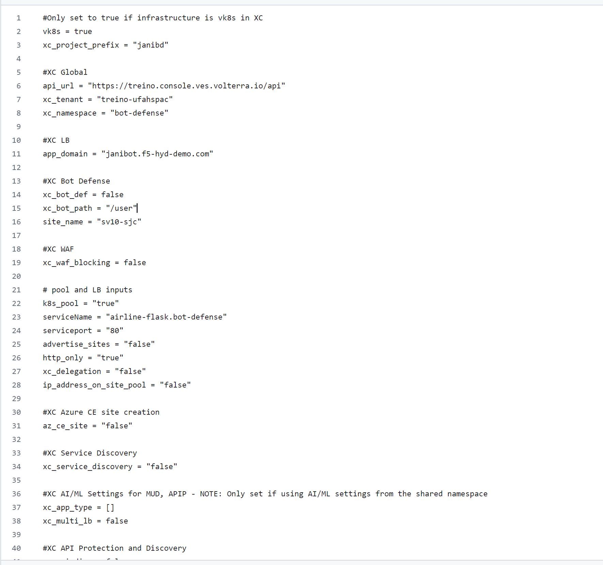
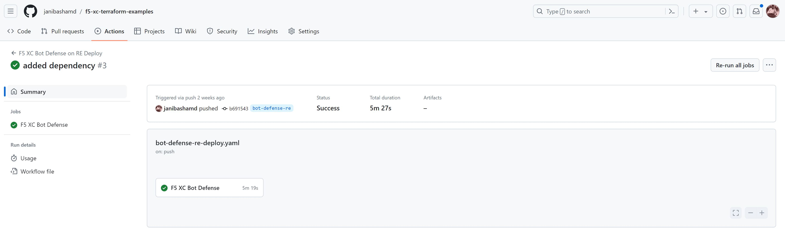
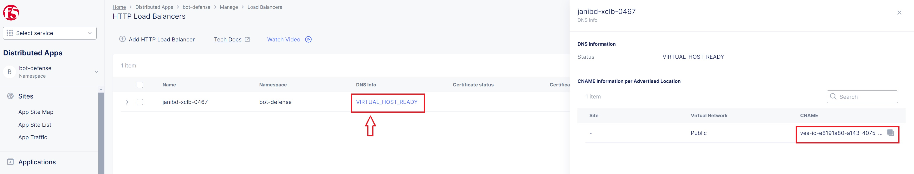
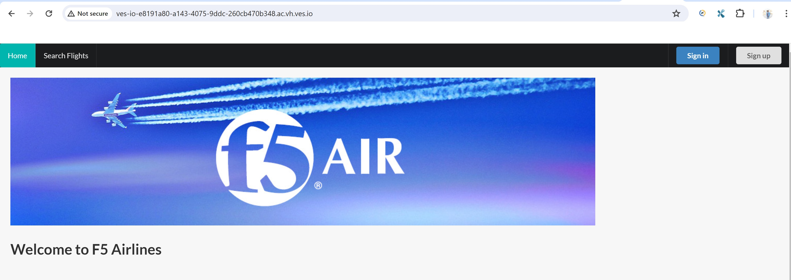

Getting started with Bot Defense RE terraform automation
#########################################################

Prerequisites
--------------

-  `F5 Distributed Cloud (F5 XC) Account <https://console.ves.volterra.io/signup/usage_plan>`__
-  `Terraform Cloud Account <https://developer.hashicorp.com/terraform/tutorials/cloud-get-started>`__
-  `GitHub Account <https://github.com>`__
-  `SSH key pair <https://cloud.google.com/compute/docs/connect/create-ssh-keys>`__

List of Existing Assets
------------------------

-  **xc:** F5 Distributed Cloud WAF and Bot Defense configurations
-  **infra:** F5 XC vk8s
-  **App:** F5 Air demo application

Tools
------

-  **IAC:** Terraform
-  **IAC State:** Terraform Cloud
-  **CI/CD:** GitHub Actions

Terraform Cloud
----------------

-  **Workspaces:** Create CLI or API workspaces for each asset in the workflow. ``NOTE: Please use unique workspaces for each work-flow and don't club them with other use cases as you may run into conflicting cloud resource and provider errors.``

   +---------------------------+-------------------------------------------+
   |         **Workflow**      |  **Assets/Workspaces**                    |
   +===========================+===========================================+
   |      bot-defense-re       |             xc                            |
   +---------------------------+-------------------------------------------+

-  **Workspace Sharing:** Under the settings for each Workspace, set the **Remote state sharing** to share with each Workspace created.

-  **Variable Set:** Create a Variable Set with the following values and mark them as sensitive:

   +------------------------------------------+--------------+------------------------------------------------------+
   |         **Name**                         |  **Type**    |      **Description**                                 |
   +==========================================+==============+======================================================+
   | VES_P12_PASSWORD                         | Environment  | Password set while creating F5XC API certificate     |
   +------------------------------------------+--------------+------------------------------------------------------+
   | VOLT_API_P12_FILE                        | Environment  | Your F5XC API certificate. Set this to **api.p12**   |
   +------------------------------------------+--------------+------------------------------------------------------+
   | ssh_key                                  | TERRAFORM    | Your ssh key for accessing the created resources     |
   +------------------------------------------+--------------+------------------------------------------------------+
   | tf_cloud_organization                    | TERRAFORM    | Your Terraform Cloud Organization name               |
   +------------------------------------------+--------------+------------------------------------------------------+

GitHub
-------

-  Fork and Clone Repo. Navigate to ``Actions`` tab and enable it.

-  **Actions Secrets:** Create the following GitHub Actions secrets in your forked repo

   -  P12: The linux base64 encoded F5XC P12 certificate without spaces. NOTE: you can run `base64 <file-name>` to get this output
   -  TF_API_TOKEN: Your Terraform Cloud API token
   -  TF_CLOUD_ORGANIZATION: Your Terraform Cloud Organization name
   -  TF_CLOUD_WORKSPACE_XC : xc

Workflow Runs
--------------

**STEP 1:** Check out a branch with the branch name as suggested below for the workflow you wish to run using
the following naming convention.

**DEPLOY**

================================               =======================
Workflow                                       Branch Name
================================               =======================
F5 XC Bot Defense on RE Deploy                 bot-defense-re
================================               =======================

Workflow File: `bot-defense-re-deploy.yaml  </.github/workflows/bot-defense-re-deploy.yaml>`__

**DESTROY**

================================               =======================
Workflow                                       Branch Name
================================               =======================
F5 XC Bot Defense on RE Destroy                destroy-bot-defense-re
================================               =======================

Workflow File: `bot-defense-re-destroy.yaml </.github/workflows/bot-defense-re-destroy.yaml>`__

**STEP 2:** Rename ``xc/terraform.tfvars.examples`` to ``xc/terraform.tfvars`` and add the following data:

-  vk8s = “true”

-  xc_project_prefix = "prefix of your choice"

-  api_url = “Your F5XC tenant”

-  xc_tenant = “Your tenant id available in F5 XC ``Administration`` section ``Tenant Overview`` menu”

-  xc_namespace = “The existing XC namespace where you want to deploy resources”

-  app_domain = “the FQDN of your app (cert will be autogenerated)”

-  xc_waf_blocking = “Set to true to enable blocking”

-  k8s_pool = "true"

-  serviceName = "airline-flask.<namespace-name>".. NOTE: Please make sure your namespace `xc_namespace` and this variable is same

-  advertise_sites = "set to false"

-  http_only = "set to true"

-  xxx_ce_site = "set to false"

-  xc_bot_def = "set to true"

-  xc_bot_path = "/user"

-  site_name = "sv10-sjc"

**STEP 4:** Commit and push your build branch to your forked repo

- Build will run and can be monitored in the GitHub Actions tab and TF Cloud console. ``If CICD failed because of intermittent timing issue, rerun the work-flow again.``

**STEP 5:** Once the pipeline completes, verify your Origin Pool and LB were deployed.

**STEP 6:** Once Load Balancer is online, copy the cname of the load balancer from UI and send a request to this cname. You should be able to view the demo application as shown in the image below:

   

**STEP 7:** If you want to destroy the entire setup, checkout a branch with name ``destroy-bot-defense-re`` (using current ``bot-defense-re`` branch) which will trigger destroy workflow and will remove all created resources

.. image:: assets/destroy.png
