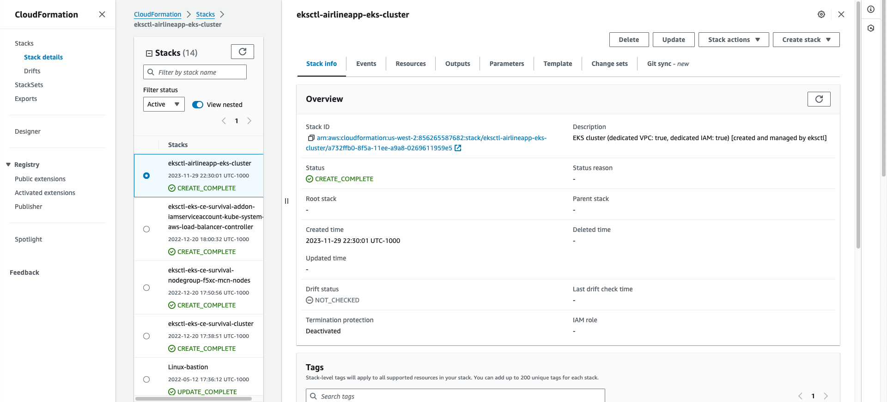
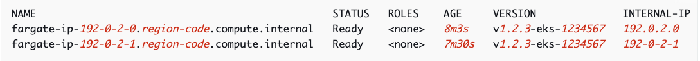
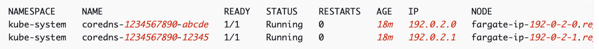
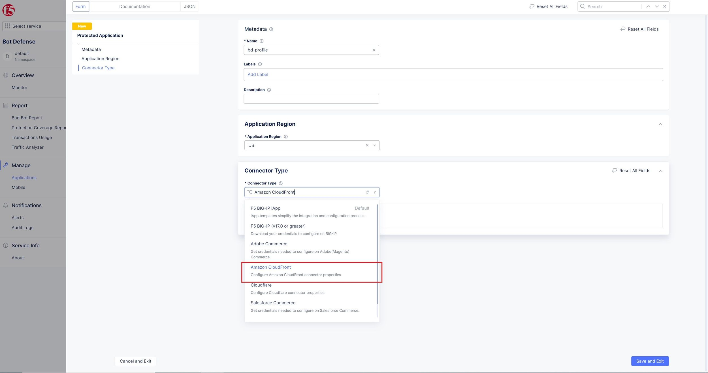
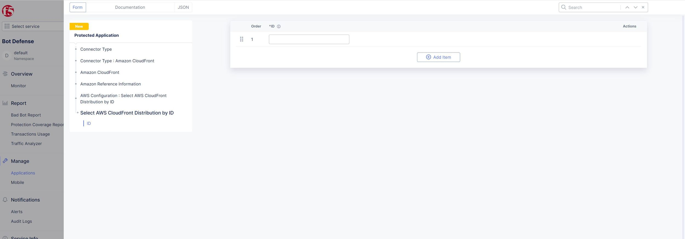
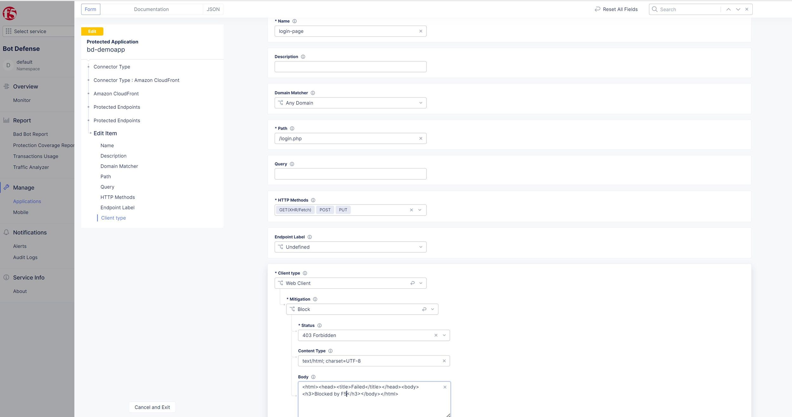

Deploy Bot Defense against for AWS Cloudfront Distributions with F5 XC
===========================================

Objective :
-----------

This guide will outline the steps for implementing F5 XC Bot Defense to protect your AWS CloudFront distributions. We will take advantage of AWS Lambda Edge and the AWS Serverless Application Repository (SAR). This guide will outline the steps for implementing this infrastructure via Console Steps as well as Automated method using Terraform. This guide also provides a sample application that we will  to protect with F5 XC Bot Defense

Bot Defense on RE Architectural Diagram :
-----------------------
.. image:: assets/awscfdiag.png
   :width: 100%

Manual step by step process for deployment:
-------------------------------------------

Console Deployment Prerequisites:
^^^^^^^^^^^^^^

1. F5 Distributed Cloud Account (F5XC)
2. AWS Cloud Account
3. eksctl – already installed on your machine. See Installing or updating `eksctl <https://eksctl.io/installation/>`_
4. kubectl already installed on your machine
5. AWS CLI already installed on your machine. See documentation `here <https://docs.aws.amazon.com/cli/latest/userguide/getting-started-install.html>`_
6. Required IAM permissions

Steps:
^^^^^^

Create your Amazon EKS cluster and nodes:
=========================================

1. First we'll start out with the AWS CLI configured locally on your machine. To check the current user, run the following command: "aws sts get-caller-identity"
2. Create your Amazon EKS cluster with the following command "eksctl create cluster --name airlineapp-eks --region us-west-2 --fargate"
3. For the sake of our lab we'll be using the us-west-2 region for our EKS cluster 
4. Cluster creation takes several minutes. During creation you'll see several lines of output. The last line of output is similar to the following example line.

6. eksctl created a kubectl config file in ~/.kube or added the new cluster's configuration within an existing config file in ~/.kube on your computer.
7. After cluster creation is complete, view the AWS CloudFormation stack named "eksctl-airlineapp-eks-cluster" in the AWS `CloudFormation console <https://console.aws.amazon.com/cloudformation>`_ to see all of the resources that were created.

View Kubernetes Resources:
==========================
1. View your cluster nodes with "kubectl get nodes -o wide". An example output is as follows

2. View the workloads running on your cluster with "kubectl get pods -A -o wide"

Deploy a Sample Airline Application to the EKS Cluster:
=======================================================
1. Create a namespace using the "kubectl create namespace eks-airline-app"
2. Download the Kubernetes Manifest for our sample Airline application here 

Creating your Namespace in F5 XC:
=================================

1. Logging into your tenant via https://console.ves.volterra.io ensure you have a unique namespace configured. If not, navigate to Administration --> My Namespaces --> Add New
2. Switch into your newly created namespace

.. image:: assets/addnamespace.png
   :width: 50%

Create a new Bot Defense application for AWS CloudFront
=======================================================

1. Log in to your F5 Distributed Cloud Console
2. Go to the Dashboard page of XC console and click Bot Defense

.. image:: assets/bdtile.jpeg
   :width: 100%

3.  Verify you are in the correct Namespace. Click Add Application at the top-left of the page.

.. image:: assets/add-app.jpeg
   :width: 100%

4. Add a Name for the Application, and a Description
5. Select a region (US, EMEA, or APJC)
6. For Connector Type, select AWS CloudFront
7. Add a Name for the Application, and a Description
8. Select a region (US, EMEA, or APJC)
9. For Connector Type, select AWS CloudFront
10. Once AWS CloudFront is selected, options appear to configure AWS reference details

Add AWS Reference Information:
==============================

1. Enter your AWS 12-digit Account Number.
2. Specify your AWS Configuration and add your CloudFront distribution; a Distribution ID and/or a Distribution Tag. You can add one or more distributions. This information is needed to associate your newly created protected application to your AWS distribution(s).

Add Protected Endpoints:
========================

1. Click Configure to define your protected endpoints
2. Click Add Item
3. Enter a name and a description to the specific endpoint.​
4. Specify the Domain Matcher. You can choose any domain or specify a specific host value.​
5. Specify the Path to the endpoint (such as /login).​
6. Choose the HTTP Methods for which request will be analyzed by Bot Defense. Multiple methods can be selected.
7. Select the Client type that will access this endpoint (Web Client).​
8. Select the Mitigation action to be taken for this endpoint:
9. Continue (request continues to origin)​
10. Redirect​. Provide the appropriate Status Code and URI​
11. Block. Provide the Status Code, Content Type, and Response message

12. When done configuring the endpoint, click Apply
13. To continue, click Apply at the bottom of the page

Define Continue Global Mitigation Action:
=========================================

1. The Header Name for Continue Mitigation Action field is the header that is added to the request when the Continue mitigation action is selected and Add A Header was selected in the endpoint mitigation configuration screen.

Define Web Client JavaScript Insertion Settings:
================================================

1. JS Location - Choose the location where to insert the JS in the code:
   1a. Just After <head> tag​.
   1b. Just After </title> tag​.
   1c. Right Before <script> tag.​

2. Under Java Script Insertions.  Select Configure.

.. image:: assets/java-rules.jpeg
   :width: 100%

3. Click Add Item
4. Add the Web Client JavaScript Path. You should select paths to HTML pages that end users are likely to visit before they browse to any protected endpoint.
5. Click Apply
6. Click Save & Exit to save your protected application configuration.

.. image:: assets/java-rules-saved.jpeg
   :width: 100%

Download Config File and AWS Installer Tool:
====================================
1. In the Actions column of the table, click the 3 ellipses (…) on your application. Download both the Config File and the AWS Installer.

.. image:: assets/awscfg.jpeg
   :width: 100%

Log in to your AWS Console:
===========================

1. Login to AWS Console home page.​
2. Select your preffered AWS Region. In this example we use Northern Virginia (US-EAST-1).

.. image:: assets/aws-login.png
   :width: 100%

3. Use the search to find Serverless Application Repository and click it
4. Click Available Applications and search with "F5"

.. image:: assets/f5search.png
   :width: 100%

5. Click the F5BotDefense tile. This will take you to the Lambda page. Here you will be creating and deploying a Lambda Function
6. Click Deploy to install the F5 Connector for CloudFront
7. Deploying the F5 Connector creates a new Lambda Application in your AWS Account.​ AWS sets the name of the new Lambda Application to start with "serverlessrepo-" It is complete when you see the serverlessrepo-F5BotDefense-* of type Lambda Function.​

.. image:: assets/available-lambdas.jpeg
   :width: 100%

8. You can click on the name to review contents of the installed Lambda Function.​

.. image:: assets/lambda-details.jpeg
   :width: 100%

Switch to AWS Cloudshell:
=========================

1. Configuration of the F5 Connector in AWS is best done via the F5 CLI tool. It is recommended to use the AWS CloudShell in your specified region to avoid any issues.
2. After starting AWS CloudShell, click Actions and Upload file.

.. image:: assets/awsshell.png
   :width: 100%

3. Upload the files you downloaded from the F5 XC Console, config.json and f5tool. (Only one file at a time can be uploaded)

.. image:: assets/upload.png
   :width: 50%

4. Run bash f5tool --install <config.json>. Installation can take up to 5 minutes. Note: Copy pasting the command may not work and so type it manually.

.. image:: assets/f5tool.png
   :width: 50%

5. The installation tool saves the previous configuration of each CloudFront Distribution in a file. You can use the F5 tool to restore a saved Distribution config (thus removing F5 Bot Defense).​

Note**
Your F5 XC Bot Defense configuration, such as protected endpoints, is sensitive security info and is stored in AWS Secrets Manager. You should delete config.json after CLI installation

Validate CloudFront Distribution Functions:
===========================================
1. Navigate to CloudFront > Distributions and select the distribution you are protecting
2. Go to Behaviors

.. image:: assets/awsbehaviors.png
   :width: 50%

3. Here under Behaviors is where you specify which request/response is forwarded to the Lambda@Edge Function to process with F5 XC Bot Defense.

Note** 
F5 XC Bot Defense requires us to leverage Viewer Request and Origin Request events. These events need to be available for user to use (IE they have not assigned other Functions)
The AWS Installer tool that we downloaded from Distributed Cloud Console and ran in the AWS CloudShell configured this for us.

AWS CloudWatch:
===============

1. AWS CloudWatch contains logs for Lambda function deployed by F5BotDefense serverless application.​
2. ​The Log group name starts with /aws/lambda/us-east-1.serverlessrepo-F5BotDefense-F5BotDefense-*.​
3. The logs of lambda function can be found in the region closest to the location where the function executed
For troubleshooting, look for error messages contained in the links under Log steams.

View Bot Traffic​:
=================

1. Now let’s return to F5 XC Console and show the monitoring page
2. Log in to your F5 Distributed Cloud Console
3. Go to the Dashboard page of XC console and click Bot Defense.
4. Make sure you are in the correct Namespace
5. Under Overview click Monitor

.. image:: assets/bd-monitor.jpeg
   :width: 50%

6. Here you can monitor and respond to events that are identified as Bot traffic

Step by step process using automation scripts:
----------------------------------------------

**Coming soon**

Development
-----------

Outline any requirements to setup a development environment if someone
would like to contribute. You may also link to another file for this
information.

Support
-------

For support, please open a GitHub issue. Note, the code in this
repository is community supported and is not supported by F5 Networks.

