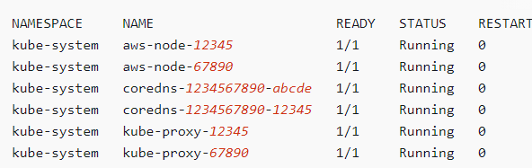
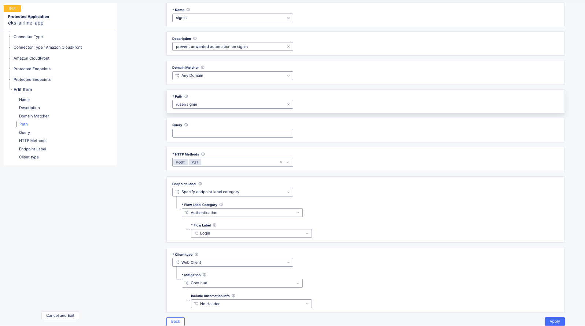

Deploy Bot Defense against for AWS Cloudfront Distributions with F5 XC
===========================================

Objective :
-----------

This guide will outline the steps for implementing F5 XC Bot Defense to protect your AWS CloudFront distributions. We will be deploying our sample application into AWS EKS (Elastic Kubernetes Service) which we will then front-end this application with AWS Cloudfront. We'll leverage F5 XC to setup and download our Bot Defense Connector which will be deployed via an AWS Lambda Edge and the AWS Serverless Application Repository (SAR). This guide will outline the steps for implementing this infrastructure via Console Steps as well as Automated method using Terraform.

Bot Defense on RE Architectural Diagram :
-----------------------
.. image:: assets/awscfdiag.png
   :width: 100%

Manual step by step process for deployment:
-------------------------------------------

Console Deployment Prerequisites:
^^^^^^^^^^^^^^

1. F5 Distributed Cloud Account (F5XC)
2. AWS Cloud Account
3. eksctl – already installed on your machine. See Installing or updating `eksctl <https://eksctl.io/installation/>`_
4. kubectl already installed on your machine
5. AWS CLI already installed on your machine. See documentation `here <https://docs.aws.amazon.com/cli/latest/userguide/getting-started-install.html>`_
6. Required IAM permissions

Steps:
^^^^^^

Create your Amazon EKS cluster and nodes:
=========================================

1. First we'll start out with the AWS CLI configured locally on your machine. To check the current user, run the following command: "aws sts get-caller-identity". If you get any errors when running this command you'll need to login to your Account and click on CLI or Programatic Access. You'll need to paste the credentials into your CLI. Once you've refreshed your credentials frun the "aws sts get-caller-identity" command again. 

2. Next, lets use the "aws configure" command to specify our region as us-west-2. You can just use the enter key to maintain the key values but when it gets to the aws region make sure you change it to us-west-2.
3. Create your Amazon EKS cluster with the following command "eksctl create cluster --name airlineapp-eks --region us-west-2" 
4. For the sake of our lab we'll be using the us-west-2 region for our EKS cluster 
5. Cluster creation takes several minutes. During creation you'll see several lines of output. The last line of output is similar to the following example line.

6. eksctl created a kubectl config file in ~/.kube or added the new cluster's configuration within an existing config file in ~/.kube on your computer.
7. After cluster creation is complete, view the AWS CloudFormation stack named "eksctl-airlineapp-eks-cluster" in the AWS `CloudFormation console <https://console.aws.amazon.com/cloudformation>`_ to see all of the resources that were created.

View Kubernetes Resources:
==========================
1. View your cluster nodes with "kubectl get nodes -o wide". An example output is as follows

2. View the workloads running on your cluster with "kubectl get pods -A -o wide"

Deploy our Sample Airline Application to the EKS Cluster:
=======================================================
1. Create a namespace using the "kubectl create namespace eks-airline-app"
2. Download the Kubernetes Manifest made custom for AWS EKS using our sample Airline application `here <https://github.com/karlbort/fork-f5-xc-waap-terraform-examples/blob/main/workflow-guides/bot/deploy-botdefense-for-awscloudfront-distributions-with-f5-distributedcloud/airline-app/eks-airflask.yaml>`_ and save it to a directory
3. From CLI Navigate to the directory containing the container image YAML file and run the command "kubectl apply -f eks-airflask.yaml -n eks-airline-app".
4. Once this command has finished executing you can find the externally available Elastic Load Balancer's external IP by running the command "kubectl get services -n eks-airline-app". Copy the external dns name and paste it into a browser to ensure the eks application is available via the ELB

.. image:: assets/getservice.png
   :width: 100%

Create CloudFront Distribution:
===============================
1. Go to the AWS Console, search the services for CloudFront and create a new distribution.  (Unless specified below leave at default configuration value) 
2. Origin Domain Name: Your ELB DNS name displayed from the "kubectl get services -n eks-airline-app" command
3. Origin Protocol: HTTP Only (since ELB communicates over HTTP with your pods)
4. HTTP Port: 80
5. Name your distribution cloudfront-eks-airline
6. Set the "allowed HTTP Options to "GET, HEAD, OPTIONS, PUT, POST, PATCH, DELETE
7. Under Cache key and Origin requests select cache policy and origin request policy
8. Select the pre-built cache policy of "caching disabled". Do not configure and origin request policy
9. Under Web Application Firewall select "Do not enable"
10. Under "settings" for the price class choose North America and Europe Only
11. Supported HTTP Versions choose HTTP2 and HTTP3
12. Click "Create Distribution"
13. Once your Cloudfront Distribution is complete you will see you newly created distribution ID as well as the cloudfront domain name assigned to it. Ensure the application is available via the new Cloudfront domain name. 

.. image:: assets/cloudfront.png
   :width: 100%

Creating your Namespace in F5 XC:
=================================

1. Logging into your tenant via https://console.ves.volterra.io ensure you have a unique namespace configured. If not, navigate to Administration --> My Namespaces --> Add New
2. Switch into your newly created namespace

.. image:: assets/addnamespace.png
   :width: 50%

Create a new Bot Defense application for AWS CloudFront
=======================================================

1. Log in to your F5 Distributed Cloud Console
2. Go to the Dashboard page of XC console and click Bot Defense

3.  Verify you are in the correct Namespace. Under Manage > Applications > click on "Add Application" at the top-left of the page.

.. image:: assets/add-app.jpeg
   :width: 100%

4. Add a Name for the Application of eks-airline-app, and a Description of "bot defense for cloudfront distribution of eks-airline-app"
5. For Connector Type, select AWS CloudFront
6. Under Amazon Cloudfront click "edit configuration"
7. Once AWS CloudFront is selected, click configure to add the configure AWS reference details

Add AWS Reference Information:
==============================

1. Specify your AWS Configuration and select AWS CloudFront by Distribution ID. Then click "edit configuration" and add your distribution ID then click Apply. Your ID can be obtained via the AWS Console under the cloudfront service. This information is needed to associate your newly created protected application to your AWS distribution(s).

Add Protected Endpoints:
========================

1. Under "Protected Endpoint" click configure to define your protected endpoints
2. Click Add Item
3. Enter sigin for the Name​
4. For the Domain Matcher we'll choose any domain
5. Specify the Path to the endpoint as /user/signin
6. Choose the HTTP Methods of POST and PUT
7. Endpoint Label should specify endpoint label with a category of authentication and a flow label of login
7. Select the Client type that will access this endpoint as Web Client
8. Select the Mitigation action to be taken for this endpoint as "Continue" to flag but not block the traffic
9. Leave include automation info at "no-header"

12. When done configuring the endpoint, click Apply
13. To continue, click Apply at the bottom of the page

Define Web Client JavaScript Insertion Settings:
================================================

1. JS Location - Choose the location where to insert the JS in the code:
   1a. Leave the default of /common.js for the path
   1b. Leave web client JS mode at default Async JS without caching
   1c. JS Location should be "after <head> tag
   

2. Under Java Script Insertions.  Select Configure.

.. image:: assets/java-rules.jpeg
   :width: 100%

3. Click Add Item
4. Add the Web Client JavaScript Path and we'll insert the JS on all pages with the following configuration

5. Click Apply
6. Click Save & Exit to save your protected application configuration.

.. image:: assets/java-rules-saved.jpeg
   :width: 100%

Download Config File and AWS Installer Tool:
====================================
1. In the Actions column of the table, click the 3 ellipses (…) on your application. Download both the Config File and the AWS Installer.

.. image:: assets/awscfg.jpeg
   :width: 100%

Log in to your AWS Console:
===========================

1. Login to AWS Console home page.​
2. Select your preffered AWS Region. In this example we use Northern Virginia (US-EAST-1).

3. Use the search to find Serverless Application Repository and click it
4. Click Available Applications and search with "F5"

.. image:: assets/f5search.png
   :width: 100%

5. Click the F5BotDefense tile. This will take you to the Lambda page. Here you will be creating and deploying a Lambda Function
6. Click Deploy to install the F5 Connector for CloudFront
7. Deploying the F5 Connector creates a new Lambda Application in your AWS Account.​ AWS sets the name of the new Lambda Application to start with "serverlessrepo-" It is complete when you see the serverlessrepo-F5BotDefense-* of type Lambda Function.​

.. image:: assets/available-lambdas.jpeg
   :width: 100%

8. You can click on the name to review contents of the installed Lambda Function.​

.. image:: assets/lambda-details.jpeg
   :width: 100%

Switch to AWS Cloudshell:
=========================

1. Configuration of the F5 Connector in AWS is best done via the F5 CLI tool. It is recommended to use the AWS CloudShell in your specified region to avoid any issues.
2. After starting AWS CloudShell, click Actions and Upload file.

.. image:: assets/awsshell.png
   :width: 100%

3. Upload the files you downloaded from the F5 XC Console, config.json and f5tool. (Only one file at a time can be uploaded)

.. image:: assets/upload.png
   :width: 50%

4. Run bash f5tool --install <config.json>. Installation can take up to 5 minutes. Note: Copy pasting the command may not work and so type it manually.

.. image:: assets/f5tool.png
   :width: 50%

5. The installation tool saves the previous configuration of each CloudFront Distribution in a file. You can use the F5 tool to restore a saved Distribution config (thus removing F5 Bot Defense).​

Note**
Your F5 XC Bot Defense configuration, such as protected endpoints, is sensitive security info and is stored in AWS Secrets Manager. You should delete config.json after CLI installation

Validate CloudFront Distribution Functions:
===========================================
1. Navigate to CloudFront > Distributions and select the distribution you are protecting
2. Go to Behaviors

.. image:: assets/awsbehaviors.png
   :width: 50%

3. Here under Behaviors is where you specify which request/response is forwarded to the Lambda@Edge Function to process with F5 XC Bot Defense.

Note** 
F5 XC Bot Defense requires us to leverage Viewer Request and Origin Request events. These events need to be available for user to use (IE they have not assigned other Functions)
The AWS Installer tool that we downloaded from Distributed Cloud Console and ran in the AWS CloudShell configured this for us.

AWS CloudWatch:
===============

1. AWS CloudWatch contains logs for Lambda function deployed by F5BotDefense serverless application.​
2. ​The Log group name starts with /aws/lambda/us-east-1.serverlessrepo-F5BotDefense-F5BotDefense-*.​
3. The logs of lambda function can be found in the region closest to the location where the function executed
For troubleshooting, look for error messages contained in the links under Log steams.

View Bot Traffic​:
=================

1. Now let’s return to F5 XC Console and show the monitoring page
2. Log in to your F5 Distributed Cloud Console
3. Go to the Dashboard page of XC console and click Bot Defense.
4. Make sure you are in the correct Namespace
5. Under Overview click Monitor

6. Here you can monitor and respond to events that are identified as Bot traffic

Step by step process using automation scripts:
----------------------------------------------

**Coming soon**

Development
-----------

Outline any requirements to setup a development environment if someone
would like to contribute. You may also link to another file for this
information.

Support
-------

For support, please open a GitHub issue. Note, the code in this
repository is community supported and is not supported by F5 Networks.

