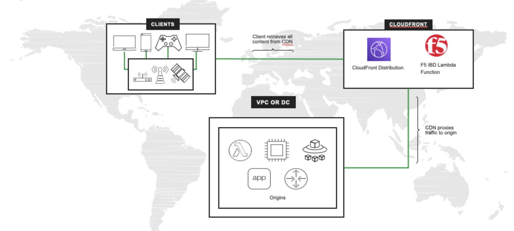

Deploy Bot Defense against for AWS Cloudfront Distributions with F5 XC
===========================================

Objective :
-----------

This guide will outline the steps for implementing F5 XC Bot Defense to protect your AWS CloudFront distributions. We will take advantage of AWS Lambda Edge and the AWS Serverless Application Repository (SAR). This guide will outline the steps for implementing this infrastructure via Console Steps as well as Automated method using Terraform.

Bot Defense on RE Architectural Diagram :
-----------------------

Manual step by step process for deployment:
-------------------------------------------

Console Deployment Prerequisites:
^^^^^^^^^^^^^^

1. F5 Distributed Cloud Account (F5XC)
2. AWS Cloud Account
3. Access to F5 XC account

Steps:
^^^^^^
 
Creating your Namespace:
=======================

1. Logging into your tenant via https://console.ves.volterra.io ensure you have a unique namespace configured. If not, navigate to Administration --> My Namespaces --> Add New
2. Switch into your newly created namespace

.. image:: assets/addnamespace.png
   :width: 50%

Create a new Bot Defense application for AWS CloudFront
=======================================================

1. Log in to your F5 Distributed Cloud Console
2. Go to the Dashboard page of XC console and click Bot Defense

.. image:: assets/bdtile.jpeg
   :width: 100%

3.  Verify you are in the correct Namespace. Click Add Application at the top-left of the page.

4. Add a Name for the Application, and a Description
5. Select a region (US, EMEA, or APJC)
6. For Connector Type, select AWS CloudFront
7. Add a Name for the Application, and a Description
8. Select a region (US, EMEA, or APJC)
9. For Connector Type, select AWS CloudFront
10. Once AWS CloudFront is selected, options appear to configure AWS reference details

.. image:: assets/app-drop-down.jpeg
   :width: 100%

Add AWS Reference Information:
==============================

1. Enter your AWS 12-digit Account Number.
2. Specify your AWS Configuration and add your CloudFront distribution; a Distribution ID and/or a Distribution Tag. You can add one or more distributions. This information is needed to associate your newly created protected application to your AWS distribution(s).

Add Protected Endpoints:
========================

1. Click Configure to define your protected endpoints
2. Click Add Item
3. Enter a name and a description to the specific endpoint.​
4. Specify the Domain Matcher. You can choose any domain or specify a specific host value.​
5. Specify the Path to the endpoint (such as /login).​
6. Choose the HTTP Methods for which request will be analyzed by Bot Defense. Multiple methods can be selected.
7. Select the Client type that will access this endpoint (Web Client).​
8. Select the Mitigation action to be taken for this endpoint:
9. Continue (request continues to origin)​
10. Redirect​. Provide the appropriate Status Code and URI​
11. Block. Provide the Status Code, Content Type, and Response message

12. When done configuring the endpoint, click Apply
13. To continue, click Apply at the bottom of the page

Define Continue Global Mitigation Action:
=========================================

1. The Header Name for Continue Mitigation Action field is the header that is added to the request when the Continue mitigation action is selected and Add A Header was selected in the endpoint mitigation configuration screen.

Define Web Client JavaScript Insertion Settings:
================================================

1. JS Location - Choose the location where to insert the JS in the code:
   1a. Just After <head> tag​.
   1b. Just After </title> tag​.
   1c. Right Before <script> tag.​

2. Under Java Script Insertions.  Select Configure.

.. image:: assets/java-rules.jpeg
   :width: 100%

3. Click Add Item
4. Add the Web Client JavaScript Path. You should select paths to HTML pages that end users are likely to visit before they browse to any protected endpoint.
5. Click Apply
6. Click Save & Exit to save your protected application configuration.

.. image:: assets/java-rules-saved.jpeg
   :width: 100%

Download Config File and AWS Installer Tool:
====================================
1. Verify access to your newly deployed container application by navigating to Web App & API Protection > your-namespace > Manage > Load Balancers and click on Virtual Host Ready under DNS Info Column
2. Copy the CNAME with the "ves-" prefix and paste it into your web browser to verify the airline application loads appropriately. 

.. image:: assets/airlineapp2.png
   :width: 100%

Setting up an HTTP load balancer to enable XC Bot Defense:
-------------------------------------------------------------

1. Navigate to Web App & API Protection > Manage > Load Balancers > HTTP Load Balancers
2. Next to your newly created HTTP Load Balancer click on the elipses under "actions" and select "manage configuration"
3. In the upper right corner of the window click on "edit configuration"
4. In the left nagivation go to "Bot Protection"
5. Enable the Bot Defense Configuration under the drop down menu. (By default, the service is disabled)
6. Set the Bot Defense Region to "US"

.. image:: assets/bdenable.png
   :width: 100%

Setting up an HTTP load balancer to configure the XC Bot Defense endpoint policy:
-------------------------------------------------------------
1. Under Bot Defense Policy select "Edit Configuration" 
2. Under Protected App Endpoints select "Configure" and then select "add item"
3. Give your policy a name of "protect-signin"
4. Define a description as "credential stuffing protection on signin"
5. Under HTTP Methods add "Put" and "Post"
6. Under Endpoint Label select "Specify Endpoint Label Category" and set the flow label category to "Authentication" and set the flow label to "login"
7. Make sure that the Protocol is set to "BOTH" for both HTTP and HTTPS
8. In the Domain Matcher field select "Any Domain".
9. Under Path we'll set the Path Match to "Prefix" and in the Prefix field we'll enter "/user/signin" without quotes
10. In the Traffic Channel section we'll set this to "Web Traffic" since there is no mobile application for this use case
11. Under Bot Traffic Mitigation Action we'll set this to "Flag" for now to provide insights in the dashboard. Also ensure the Include Mitigation headers is set to "No Headers"
12. Under Good Bot Detection settings set this to "Allow All Good Bots to Continue to Origin"
13. Click Apply, and Apply again to bring you back to the Javascript insertion section. Leave the Javascript download path as /common.js

.. image:: assets/bdpolicy2.png
   :width: 100%

Setting up an HTTP load balancer to configure the XC Bot Defense Javascript Insertion:
-------------------------------------------------------------
1. Set the Web Client Javascript Mode to "Async JS with no-Caching"
2. Set the Javascript Insertion to "Insert Javascript in All Pages"
3. Set the Javascript location to "After <head> tag"
4. Leave the Mobile SDK section at default of "Disable Mobile SDK"
5. Click Apply and then Save and Exit

.. image:: assets/bdjsinsertion.png
   :width: 100%

Simulating Bot Traffic with CURL:
---------------------------------------
1. Within this repo you can download the `curl-stuff.sh <https://github.com/f5-xc-waap-terraform-examples/tree/main/workflow-guides/bot/deploy-botdefense-against-automated-threats-on-regional-edges-with-f5xc/bot/deploy-botdefense-against-automated-threats-on-regional-edges-with-f5xc/validation-tools/curl-stuff%20copy.sh>`__ Bash script in the validation-tools directory to run it against your web application to generate some generic Bot Traffic
2. After you've downloaded the curl-stuff.sh script you can edit the file using a text editor and replace the domain name on line 3 with the DNS name of your application. For example, curl -s ves-io-your-domain.ac.vh.ves.io/user/signin -i -X POST -d "username=1&password=1" you would replace the "ves-io-your-domain.ac.vh.ves.io" hostname with the DNS name for your newly deployed application. Note** Make sure to keep the /user/signin path of the URI as this is the protected endpoint we configured in the Bot Defense Policy.

3. Run the CURL script using "sh curl-stuff.sh" once or twice to generate bot traffic

.. image:: assets/bdcurl2.png
   :width: 100%

Viewing the Results in the Overview Security Dashboard:
-------------------------------------------------------
1. Navigate to Overview > Dashboards > Security Dashboard. This dashboard provides and consolidated view of all of your load balancers and their security events. If you refresh the page you will see the bot traffic detection results.
2. If you scroll down you can see the Top Attack Sources which will contain the source IP Address of your host running the CURL Script
3. If you look at the Top Attack Paths you can see the /user/signin Path and the Domain of your Application behind the load balancer as well as some other information
4. Let's dive in deeper by drilling down into your specific load balancer that we've deployed by scrolling to the bottom of this page and selecting the load balancers. This will take you into the WAAP Dashboard for that particular load balancer. 

.. image:: assets/overviewdashboard.png
   :width: 100%

Viewing the Results in your Load Balancer Security Dashboard:
-------------------------------------------------------
1. From here you will see many of the same statistics related to Security Events. We can drill down further by selecting the Bot Defense Tab on the top right 
2. In this Bot Defense view you will see a breakdown of the different traffic types from Good Bots, to Malicious Bots, Human Traffic etc...

.. image:: assets/lbbddashboard.png
   :width: 100%

Step by step process using automation scripts:
----------------------------------------------

**Coming soon**

Development
-----------

Outline any requirements to setup a development environment if someone
would like to contribute. You may also link to another file for this
information.

Support
-------

For support, please open a GitHub issue. Note, the code in this
repository is community supported and is not supported by F5 Networks.

