Steps to Deploy/Destroy Bot Defense for Azure with F5 XC BIG-IP Connector using automation
#########################################################

Prerequisites
--------------

-  `F5 Distributed Cloud (F5 XC) Account <https://console.ves.volterra.io/signup/usage_plan>`__
-  `Azure Account <https://azure.microsoft.com/en-in/get-started/azure-portal/>`__ 
-  `Terraform Cloud Account <https://developer.hashicorp.com/terraform/tutorials/cloud-get-started>`__
-  `GitHub Account <https://github.com>`__

List of Existing Assets
------------------------

-  **azure-infra:** Azure Infrastructure
-  **aks-cluster:** Azure Kubernetes service
-  **bigip:** Bigip in Azure
-  **bigip-botdefense:** Botdefense with XC Bot connector

Tools
------

-  **IAC:** Terraform
-  **IAC State:** Terraform Cloud
-  **CI/CD:** GitHub Actions

Create Bot Defense Connector in Distributed Cloud
-------------------------------------------------
Let us start by creating a bot defense connector for Big-IP in F5 Distributed Cloud.

1. Log into F5 Distributed cloud account.

2. From home page, Navigate to Bot Defense workspace.

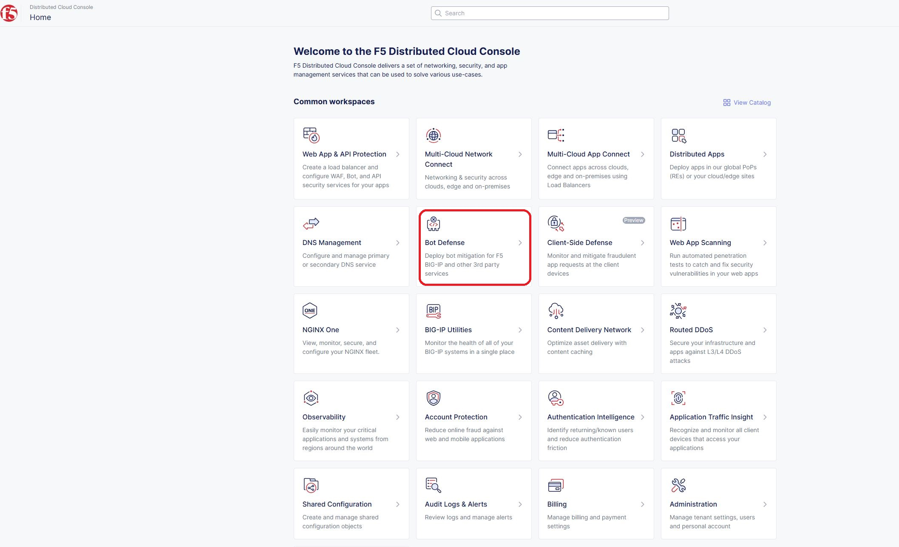

3. Select your namespace and navigate to Manage > Applications.

4. Click on Add Application.

5. Provide name and description. 

6. Select the Application region from the drop down (In this demo, we are using ASIA as our test application resides in Southeastasia).

7. Set the Connector Type as "F5 BIG-IP iApp (v17.0 or greater).

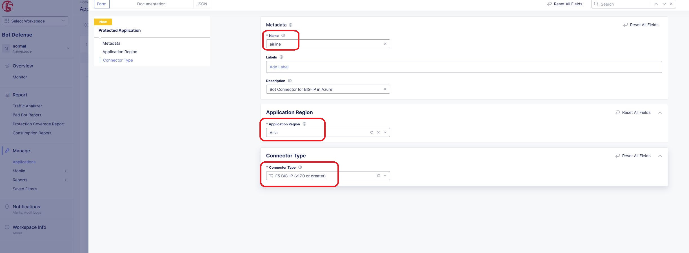

8. Click on Save and Exit.

9. Once the application is added successfully, Copy and make a note of all of the ID's, keys, hostnames, and headers as shown below.

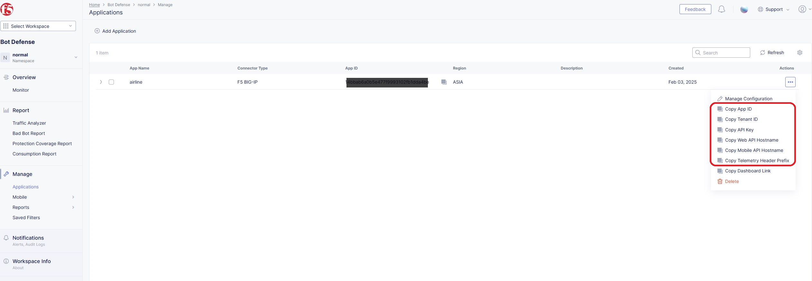

Terraform Cloud
----------------

-  **Workspaces:** Create CLI or API workspaces for each asset in the workflow.

   +---------------------------+----------------------------------------------------+
   |         **Workflow**      |  **Assets/Workspaces**                             |
   +===========================+====================================================+
   |az-botdefense-deploy       | azure-infra, aks-cluster, bigip, bigip-botdefense  |
   +---------------------------+----------------------------------------------------+

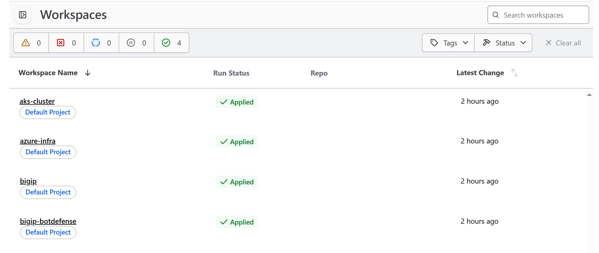

-  **Workspace Sharing:** Under the settings for each Workspace, set the **Remote state sharing** to share with each Workspace created.

-  **Variable Set:** Create a Variable Set with the following values and mark them as sensitive.

   +------------------------------------------+--------------+------------------------------------------------------+
   |         **Name**                         |  **Type**    |      **Description**                                 |
   +==========================================+==============+======================================================+
   | ssh_key                                  | TERRAFORM    | Your public ssh key to access the created resources  |
   +------------------------------------------+--------------+------------------------------------------------------+
   | tf_cloud_organization                    | TERRAFORM    | Your Terraform Cloud Organization name               |
   +------------------------------------------+--------------+------------------------------------------------------+
   | TF_VAR_azure_service_principal_appid     | Environment  | Service Principal App ID                             |
   +------------------------------------------+--------------+------------------------------------------------------+
   | TF_VAR_azure_service_principal_password  | Environment  | Service Principal Secret                             |
   +------------------------------------------+--------------+------------------------------------------------------+
   | TF_VAR_azure_subscription_id             | Environment  | Your Subscription ID                                 |
   +------------------------------------------+--------------+------------------------------------------------------+
   | TF_VAR_azure_subscription_tenant_id      | Environment  | Subscription Tenant ID                               |
   +------------------------------------------+--------------+------------------------------------------------------+
   | TF_VAR_xc_application_id                 | Environment  | Application ID fetched from BOT Connector in XC      |
   +------------------------------------------+--------------+------------------------------------------------------+
   | TF_VAR_xc_tenant_id                      | Environment  | Tenant ID of BOT Connector in XC                     |
   +------------------------------------------+--------------+------------------------------------------------------+
   | TF_VAR_api_key                           | Environment  | API Key of Bot Conenctor in XC                       |
   +------------------------------------------+--------------+------------------------------------------------------+
   | TF_VAR_xc_web_api_hostname               | Environment  | Web API hostname of Bot connector in XC              |
   +------------------------------------------+--------------+------------------------------------------------------+

-  Variable set created in terraform cloud:

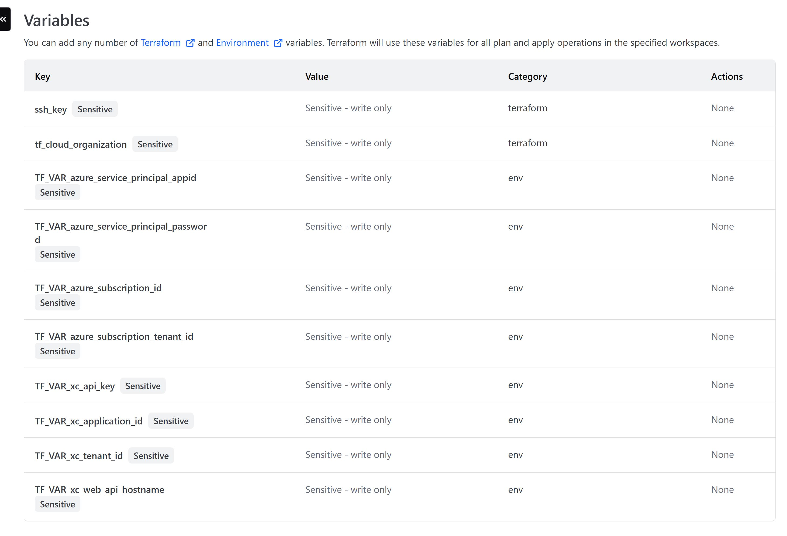

GitHub
-------

-  Fork and Clone Repo. Navigate to ``Actions`` tab and enable it.

-  **Actions Secrets:** Create the following GitHub Actions secrets in
   your forked repo

   -  TF_API_TOKEN: Your Terraform Cloud API token
   -  TF_CLOUD_ORGANIZATION: Your Terraform Cloud Organization name
   -  TF_CLOUD_WORKSPACE\_\ *<Workspace Name>*: Create for each
      workspace in your workflow per each job

      -  EX: TF_CLOUD_WORKSPACE_AKS_CLUSTER would be created with the
         value ``aks-cluster``

-  Created GitHub Action Secrets:

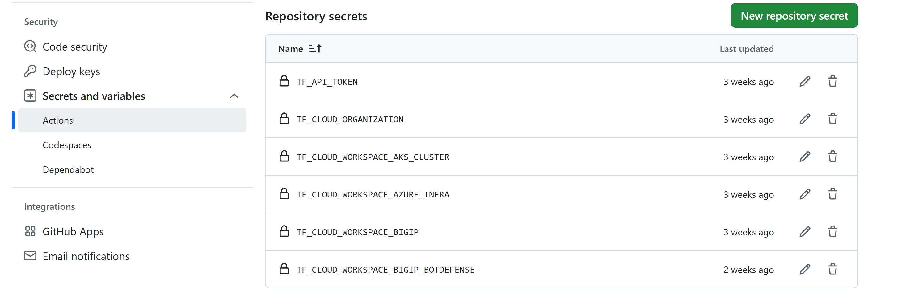

Workflow Runs
--------------
**STEP 1:** Check out a branch with the branch name as suggested below for the workflow you wish to run using
the following naming convention.

**DEPLOY**

========================== =======================
Workflow                   Branch Name
========================== =======================
az-botdefense-bigip-deploy az-botdefense-deploy
========================== =======================

Workflow File: `az-botdefense-bigip-deploy.yml </.github/workflows/az-botdefense-bigip-deploy>`__

**DESTROY**

=========================== ========================
Workflow                    Branch Name
=========================== ========================
az-botdefense-bigip-destroy az-botdefense-destroy
=========================== ========================

Workflow File: `az-botdefense-bigip-destroy.yml </.github/workflows/az-botdefense-bigip-destroy.yml>`__

**Note:** Make sure to comment line no. 16 (# *.tfvars) in ".gitignore" file

**STEP 2:** Rename ``azure/azure-infra/terraform.tfvars.examples`` to ``azure/azure-infra/terraform.tfvars`` and add the following data: 

-  project_prefix = “Your project identifier name in **lower case** letters only - this will be applied as a prefix to all assets”.

-  azure_region = “Azure Region/Location” ex. "southeastasia".

-  aks-cluster = Set this value to true as we need AKS cluster in our use-case.

-  Also update assets boolean value as per your workflow. (for this use-case set all remaining values as false)

**STEP 3:** Rename ``azure/aks-cluster/terraform.tfvars.examples`` to ``azure/aks-cluster/terraform.tfvars`` and update the following:

- use_new_vnet = Set the value to true 

**STEP 4:** Commit and push your build branch to your forked repo 

- Build will run and can be monitored in the GitHub Actions tab and TF Cloud console

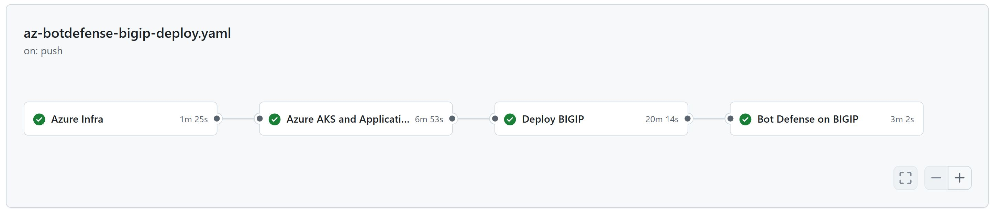

**STEP 5:** Once the pipeline completes, fetch the public IP under "Deploy BIGIP" Job as shown below.

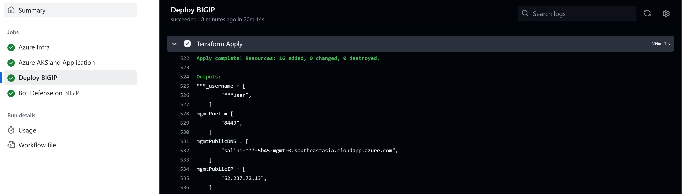

To verify the access of airline demo application using BIGIP public IP, open a web browser and try to access the application as http://<<public_ip>>. APplication should be accessible.

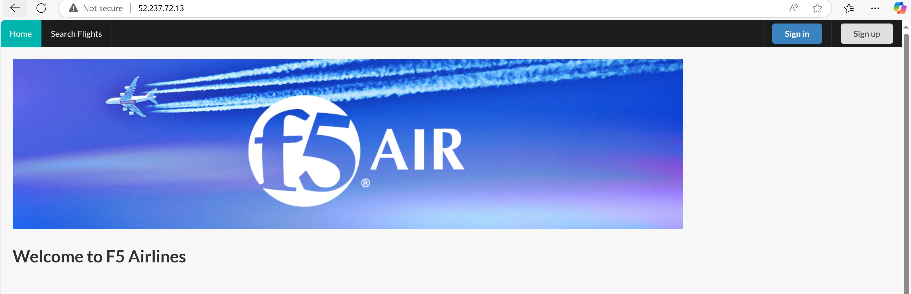

**STEP 5:** Verify the JavaScript injection into the application via the BIG-IP. Make sure you see the below three lines.

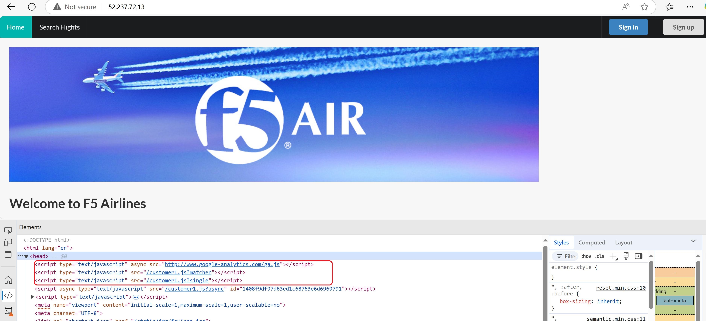

**STEP 6:** Go to "Bot Defense on BIGIP" job and Expand the Run Traffic section. You should be seeing "Failure" message that confirms the blocking of the Bot Traffic by the XC Bot Connector.

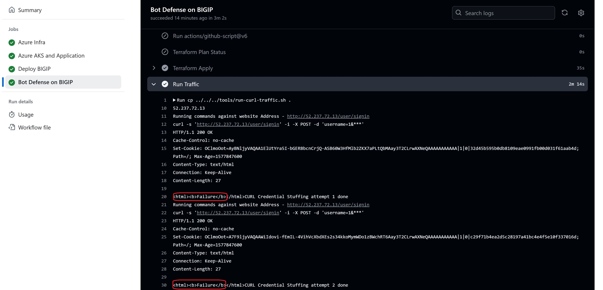

**STEP 7:** To monitor the bot traffic, In F5 XC Console, Navigate to Overview > Monitor section. You can see the bot detections of our newly protected Cloudfront Application. Here you can monitor and respond to events that are identified as Bot traffic

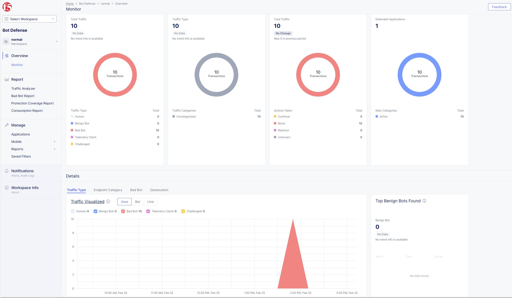

**STEP 8:** If you want to destroy the entire setup, checkout a branch with name ``az-botdefense-destroy`` which will trigger destroy workflow and will remove all created resources.

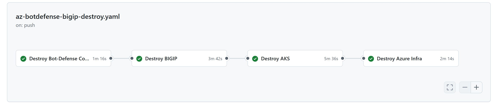
