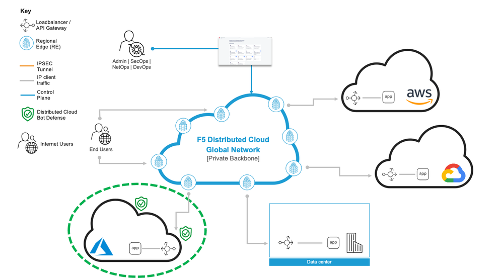
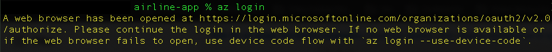
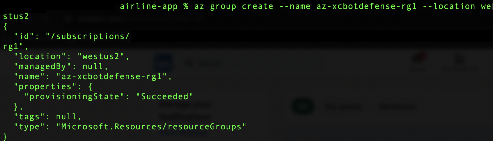
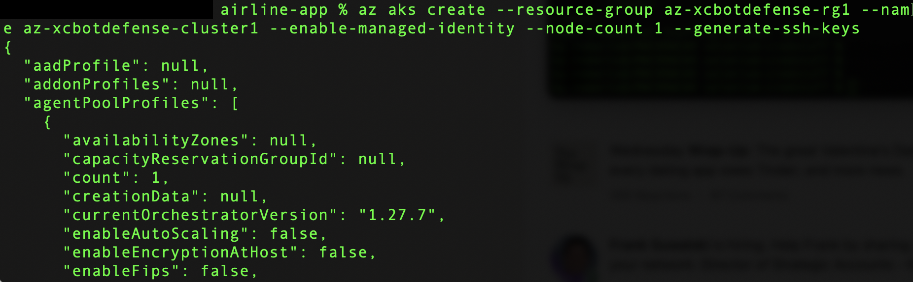
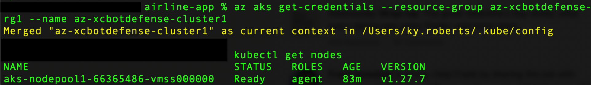

Deploy Bot Defense for Azure with F5 XC BIG-IP Connector
========================================================

Objective :
-----------

This guide will outline the steps for implementing F5 XC Bot Defense to protect your Azure Kubernetes workloads using our BIG-IP Connector. First we will be deploying our sample application into Azure AKS (Azure Kubernetes Service). Then we will deploy into Azure and front-end this application with F5's BIG-IP virtual appliance configured with our XC Bot Defense Connector. We'll leverage F5 XC to setup and download our Bot Defense Connector which will be deployed directly to the BIG-IP virtual appliance. This guide will outline the steps for implementing this infrastructure via Console Steps as well as Automated method using Terraform.

Bot Defense for Azure Architectural Diagram :
-----------------------

Manual step by step process for deployment:
-------------------------------------------

Console Deployment Prerequisites:
^^^^^^^^^^^^^^

1. F5 Distributed Cloud Account (F5XC)
2. Azure Cloud Account (If you don't have an Azure subscription, create an Azure free account before you begin `here <https://portal.azure.com/>`_) 
3. Azure CLI: Install the Azure CLI on your local machine. You can download it from the official Azure `CLI website <https://learn.microsoft.com/en-us/cli/azure/install-azure-cli>`_
4. kubectl: Install kubectl on your local machine. You can find installation instructions on the `kubectl installation page <https://kubernetes.io/docs/tasks/tools/>`_

Steps:
^^^^^^

Signing into Azure CLI
======================

1. From CLI run the "az login" command
2. If the Azure CLI can open your default browser, it initiates authorization code flow and opens the default browser to load an Azure sign-in page
3. Sign in with your account credentials in the browser
4. If you have multiple Azure subscriptions, select the appropriate subscription ID in which the resources should be billed using the az account set command

Create Azure Resource Group and Networks
=========================================

1. Create resource group from CLI using the "az group create --name az-xcbotdefense-rg1 --location westus2" command
2. Create our vnet and subnet resources in that group using the following command "az network vnet create --resource-group az-xcbotdefense-rg1 --name az-xcbotdefense-vnet1  --address-prefixes 10.248.0.0/16 --subnet-name az-xcbotdefense-subnet1 --subnet-prefix 10.248.1.0/24"

Create the AKS (Azure Kubernetes Service) Cluster
=================================================

1. To create an AKS cluster, we'll use the az aks create command. The following example creates a cluster named "az-xcbotdefense-cluster1" with one node and enables a system-assigned managed identity
2. Copy paste the command "az aks create --resource-group az-xcbotdefense-rg1 --name az-xcbotdefense-cluster1 --enable-managed-identity --node-count 1 --generate-ssh-keys" 
3. After a few minutes, the command completes and returns JSON-formatted information about the cluster

Connect to the Cluster:
==========================

1. Configure kubectl to connect to your Kubernetes cluster using the az aks get-credentials command. This command downloads credentials and configures the Kubernetes CLI to use them.
2. Copy paste the following command into cli "az aks get-credentials --resource-group az-xcbotdefense-rg1 --name az-xcbotdefense-cluster1"
3. Verify the connection to your cluster using the "kubectl get nodes" command. This command returns a list of the cluster nodes.
4. The following sample output shows the single node created in the previous steps. Make sure the node status is Ready.

Deploy our Sample Airline Application to the AKS Cluster:
=========================================================

1. Create a namespace using "kubectl create namespace az-xcbotdefense-namespace1"
2. Download the Kubernetes .yaml file for AKS using our sample Airline application `here <https://github.com/karlbort/f5-xc-waap-terraform-examples/blob/main/workflow-guides/bot/deploy-botdefense-in-azure-with-f5xc-bigip-connector/airline-app/az-xcbotdefense-app.yaml>`_ and save it to a working directory
3. From CLI Navigate to the directory containing the container image YAML file and run the command "kubectl apply -f az-xcbotdefense-app.yaml -n az-xcbotdefense-namespace1".
4. Check the status of the deployed pods using the "kubectl get pods -n az-xcbotdefense-namespace1" command. Make sure all pods are Running before proceeding.
5. Once this command has finished executing you can find the ingress IP by running the command "kubectl get services -n az-xcbotdefense-namespace1". Copy the external dns name as we'll be using this as the backend of our BIG-IP Virtual Server.

Create VNET Peering:
====================

1. Navigate to the Azure Portal and in the upper left hamburger menu click on "Resource Groups". Then create a Filter of "az-xcbotdefense-rg1" so that we can see the resource group we created manually as well as the resource group automatically created by the aks cluster deployment.
2. Let's start with our configuration in the "MC_az-xcbotdefense-rg1_az-xcbotdefense-cluster2_westus2" cluster created resource group. Within the resource group navigate to the aks-vnet-123xxx > settings > peerings > add 
3. Starting with "This Virtual Network" and enter the Peering link name of "aks-vnet-to-az-xcbotdefense-vnet1" 
4. Check "allow aks-vnet-123xxx to access the peered virtual network"
5. Check "allow aks-vnet-123456 to receive forwarded traffic from the peered virtual network"
6. Under "Remote virtual network" enter the peering link name of "az-xcbotdefense-vnet1-to-aks-vnet" 
7. Make sure you have the correct subsription selected and then find the remote virtual network in the dropdown by typing "az-xcbotdefense-vnet1"
8. select "allows az-xcbotdefense-vnet1" to access aks-vnet and "allow az-xcbotdefense-vnet1 to receive forwarded traffic from aks-vnet"
9. Click Add and refresh the peerings page until the peering status shows "connected"
10. Navigate to your other resource group az-xcbotdefense-rg1 > az-xcbotdefense-vnet1 > peerings > and confirm it shows peerings status "connected". If not, you will need to configure the same on this vnet side but in reverse.

Create BIG-IP VM:
=================

1. Go to the Azure Console, search the services for "Marketplace" then search for "F5" and select "F5 BIG-IP Virtual Edition - BEST"
2. This will open the "Create a virtual machine" page where we need to fill out the required information.
3. Under the Resource Group select from the drop-down menu the same resource group that we created "az-xcbotdefense-rg1"
4. For the instance details "virtual machine name" we'll name it "az-xcbotdefense-bigip1"
5. Make sure that the region is set to "(US) West US 2"
6. Set "Availability Options" to "No infrastructure redundancy required"
7. Set the "security type" to standard and leave the image as the "F5 BIG-IP Best" image. Also keep the VM architecture at x64
8. Set the VM Size to "Standard_D4s_v3"
9. For the administrator account select "password", set the username to f5admin, choose a password for the account
10. Under inbound rules, select "none", we'll add some additional ports in future steps
11. Click next, and accept the defaults under "disks" and hit next again to the networking tab
12. Your virtual network and subnet should be pre-populated with az-xcbotdefense-vnet1 and az-xcbotdefense-subnet1 respectively. If not, please select them now. 
13. Public IP setting should be "(new) f5xc-bigip-botdefense-ip"
14. Set the NIC network security group to "basic". We'll go into the network security group after and add the required ports.
15. Under public inbound ports leave it set to "none"
16. Leave the defaults and load balancing options to "none"
17. Accept all other defaults and click next through the remaining options and select "create"
18. Once the vm resources are done provisioning click on the "go to resource" button and review the BIG-IP resources that have been created

Create NSG for AZ-XCBOTDEFENSE-SUBNET1:
======================================= 

1. Navigate to resource groups > az-xcbotdefense-rg1 > az-xcbotdefense-bigip1-nsg > settings > inbound security rules
2. Add Source "myipaddress" destination "any" service, custom, destination port ranges 8443, protocol tcp, action allow, save 
3. Repeat the process and add Source "myipaddress" destination "any" service, SSH, action allow, save
4. Repeat the process and add Source "any" destination "any" service, HTTP, action allow, save
5. Repeat the process and add Source IP Address "10.224.0.0/16" Destination IP Address, 10.248.1.0/24, service "custom", destination port ranges *, protocol any, action allow, Save
6. Repeat the process and add Source "Any", Destination "Any", Service "HTTPS", Action allow, Save
7. ***NOTE Update NSG WITH SPECIFIC IP's

Create Route Table for BIG-IP to AKS:
=====================================

1. Now let's create the route-table for the BIG-IP to reach AKS using the following command "az network route-table create --name az-xcbotdefense-rt1 --resource-group az-xcbotdefense-rg1 --location westus2".
2. We'll add a route to get to the aks cluster vnet "az network route-table route create --name az-xcbotdefense-aks-route --resource-group az-xcbotdefense-rg1 --route-table-name az-xcbotdefense-rt1 --address-prefix 10.224.0.0/24 --next-hop-type VirtualAppliance --next-hop-ip-address 10.224.0.5"
3. Add a route for outbound internet traffic "az network route-table route create --name az-xcbotdefense-inet-route --resource-group az-xcbotdefense-rg1 --route-table-name az-xcbotdefense-rt1 --address-prefix 0.0.0.0/0 --next-hop-type Internet"
4. Now browse to the resource group az-xcbotdefense-rg1 > az-xcbotdefense-vnet1 > settings > subnets > az-xcbotdefense-subnet1 > route table > az-xcbotdefense-rt1 > save

Add Route Table Entry For AKS to BIG-IP:
========================================

1. We are going to configure this route entry from the Azure Portal. Navigate to resource groups > MC_az-xcbotdefense-rg1_az-xcbotdefense-cluster_westus2 > aks-agentpool-123xxx-routetable > settings > routes > add 
2. Route name "aks-to-bigip", Destination type "IP Addresses", Destination IP "10.248.1.0/24", Next hop type, "virtual appliance", Next hop address "10.248.1.10"
3. Click Add

Add Port:80 NSG Entry To AKS NSG:
=================================

1. Browse to resource MC_az-xcbotdefense-rg1_az-xcbotdefense-cluster_westus2 > aks-agentpool-123456-nsg > settings > inbound security virtualNetworks
2. Add source any, destination IP Addresses > 10.224.0.5 , service HTTP, and click add

Create BIG-IP Service Pool :
============================

1. Navigate to resource group az-xcbotdefense-rg1 > az-xcbotdefense-bigip1 and note the public IP Address on the overview page in the networking section
2. Open a browser and enter Log in with https://<external-ip-address>:8443 (replacing "external-ip-address" with you guessed it... your pub BIG-IP... IP")
3. Login with the credentials your provided for username "f5admin"
4. Under the Main tab go to local traffic > pools > create 
5. Name "az-xcbotdefense-app1", Health Monitors "tcp"
6. Leave the default load balancing method at "Round Robin", add the node name of "az-xcbotdefense-app1", address paste the external ip from previous steps "10.224.0.5", set service port to "80 HTTP", Add, finished
7. If you refresh your page the status should turn green indicating successful health monitor to the aks app. 

Create BIG-IP Virtual Server:
=============================

1. First thing you will need to grab here is the private address in that's been assigned to your BIG-IP. Navigate to resource groups > az-xcbotdefense-rg1 > az-xcbotdefense-bigip1 and not the private IP address under the networking section. 
2. Within the BIG-IP navigate to Local traffic > virtual servers > CREATE
2. Name "az-xcbotdefense-vip1", source address, 0.0.0.0/0, Destination Address/Mask, 10.248.1.10/32 (Private IP of BIG-IP from previous step), service port 80 http 
3. set the HTTP Profile (Client) to "http", HTTP Profile (server) "use client profile"
4. set "Source Address Translation to "AutoMap" 
5. Under resources set the Default Pool to "az-xcbotdefense-app1" and click finished
6. Verify you can access your AKS App through the BIG-IP by going to http://bigippublicip and it should load the F5 Airline Application 

Creating the XC Bot Defense Profile on BIG-IP:
==============================================

1. Login to your XC Console at https://login.ves.volterra.io/
2. Click on the Bot Defense Tile and go to manage > applications > add application 
3. Name az-xcbotdefense-connector1, Description, 
4. Application Region, US, Connector Type, F5 BIG-IP iApp (v17.0 or greater) 
5. Click the Elipses and copy all of the ID's, keys, hostnames, and headers and save them into a file 
6. Login to the BIG-IP and click on the distributed Cloud services > Bot Defense > Create
7. Enter profile name "az-xcbotdefense-connector1"
8. Paste Application ID, Tenant ID, API Hostname, API Key, and Telemetry Header Prefix from XC Console 
9. Leave the default JS Insertion Configuration settings of /customer.js, After <head>, Async with no caching
10. Under protected endpoints, enter the private IP you used for your virtual server destination 10.248.1.x, set the path to /user/signin, set the endpoint label to Login, and check "ANY Method" checkbox with mitigation action of "block", click Add to add the rule
11, Under the Advanced Features, click the plus sign next to "protection pool" and name it "az-xcbotdefense-ibd1"
12. add a health monitor of https, under node name call it ibd-webus.fastcache.net, address ibd-webus.fastcache.net, service port 443 https, click add and finished
13. Back on the Bot Defense profile page set the ssl profile to "serverssl" and click finished

Binding the XC Bot Profile to the Virtual Sever:
================================================
 
1. Within the BIG-IP navigate to Local Traffic > Virtual Servers > az-xcbotdefense-vip1 > and click on the tab at the top called "distributed Cloud Services"
2. Change the Bot Defense drop down from "disabled" to "enabled" then select the "az-xcbotdefense-connector1" profile and click update 
3. Now that we've applied the Bot Defense Connector to our Virtual Server Lets test it out. 

Validating the Java Script Injection:
=====================================

1. Open a browser and load the app through the BIG-IP by going to http://bigippublicip and it should load the F5 Airline Application
2. Right click anywhere on the page and click "inspect"
3. This opens the developer tools on the right. Under the "elements" tab expand the <head> tag
4. Within the <head> tag you should see three lines containing the following: 1) src="/customer1.js?matcher", 2) src="/customer1.js?single"></script>, 3) src="/customer1.js?async"
5. This confirms that the Javascript is being injected appropriately into your aks application via the BIG-IP

Simulating Bot Traffic with CURL:
=================================

1. Within this repo you can download the `curl-stuff.sh <https://github.com/karlbort/f5-xc-waap-terraform-examples/tree/main/workflow-guides/bot/deploy-botdefense-for-awscloudfront-distributions-with-f5-distributedcloud/validation-tools/curl-stuff.sh>`_ Bash script in the validation-tools directory to run it against your web application to generate some generic Bot Traffic
2. After you've downloaded the curl-stuff.sh script you can edit the file using a text editor and replace the domain name on line 3 with the public IP Address of your BIG-IP. For example, curl -s http://x.x.x.x/u

View Bot Traffic​:
=================

1. Now let’s return to F5 XC Console and show the monitoring page over Overview > Monitor
2. Log in to your F5 Distributed Cloud Console
3. Go to the Dashboard page of XC console and click Bot Defense.
4. Make sure you are in the correct Namespace
5. Under Overview click Monitor and you can see our the bot detections of our newly protected Cloudfront Application. 
6. Here you can monitor and respond to events that are identified as Bot traffic

Step by step process using automation scripts:
----------------------------------------------

**Coming soon**

Development
-----------

Outline any requirements to setup a development environment if someone
would like to contribute. You may also link to another file for this
information.

Support
-------

For support, please open a GitHub issue. Note, the code in this
repository is community supported and is not supported by F5 Networks.

