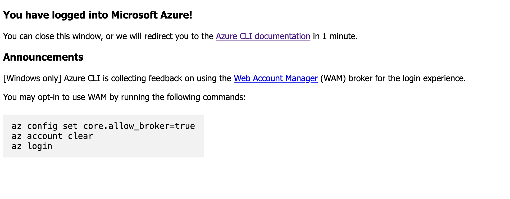
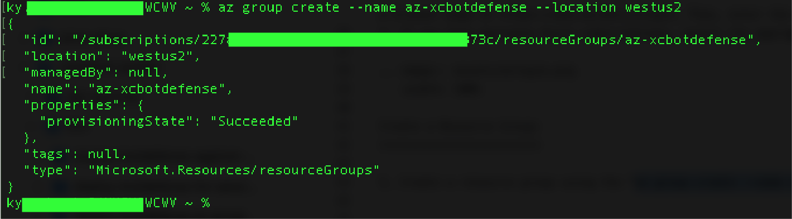
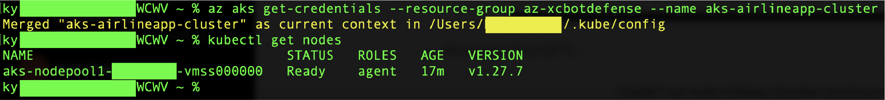
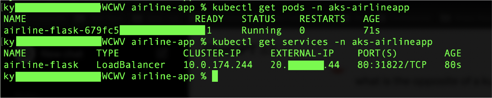
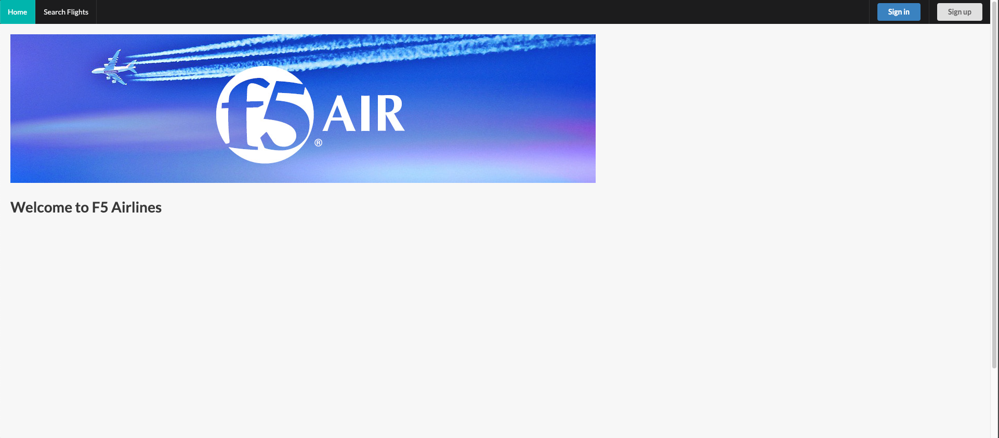

Deploy Bot Defense for Azure with F5 XC BIG-IP Connector
========================================================

Objective :
-----------

This guide will outline the steps for implementing F5 XC Bot Defense to protect your Azure Kubernetes workloads using our BIG-IP Connector. First we will be deploying our sample application into Azure AKS (Azure Kubernetes Service). Then we will deploy into Azure and front-end this application with F5's BIG-IP virtual appliance configured with our XC Bot Defense Connector. We'll leverage F5 XC to setup and download our Bot Defense Connector which will be deployed directly to the BIG-IP virtual appliance. This guide will outline the steps for implementing this infrastructure via Console Steps as well as Automated method using Terraform.

Bot Defense for Azure Architectural Diagram :
-----------------------
.. image:: assets/azurebd.png
   :width: 100%

Manual step by step process for deployment:
-------------------------------------------

Console Deployment Prerequisites:
^^^^^^^^^^^^^^

1. F5 Distributed Cloud Account (F5XC)
2. Azure Cloud Account (If you don't have an Azure subscription, create an Azure free account before you begin `here <https://portal.azure.com/>`_) 
3. Azure CLI: Install the Azure CLI on your local machine. You can download it from the official Azure `CLI website <https://learn.microsoft.com/en-us/cli/azure/install-azure-cli>`_
4. kubectl: Install kubectl on your local machine. You can find installation instructions on the `kubectl installation page <https://kubernetes.io/docs/tasks/tools/>`_

Steps:
^^^^^^

Signing into Azure CLI
======================

1. From CLI run the "az login" command
2. If the Azure CLI can open your default browser, it initiates authorization code flow and opens the default browser to load an Azure sign-in page
3. Sign in with your account credentials in the browser
4. If you have multiple Azure subscriptions, select the appropriate subscription ID in which the resources should be billed using the az account set command

Create an Azure Resource Group
==============================

1.Create a resource group using the "az group create --name az-xcbotdefense --location westus2" command

Create an AKS (Azure Kubernetes Service) Cluster
===============================================

1. To create an AKS cluster, use the az aks create command. The following example creates a cluster named "aks-airlineapp-cluster" with one node and enables a system-assigned managed identity
2. Copy paste the command "az aks create --resource-group az-xcbotdefense --name aks-airlineapp-cluster --enable-managed-identity --node-count 1" 
3. After a few minutes, the command completes and returns JSON-formatted information about the cluster

Connect to the Cluster:
==========================

1. Configure kubectl to connect to your Kubernetes cluster using the az aks get-credentials command. This command downloads credentials and configures the Kubernetes CLI to use them.
2. Copy paste the following command into cli "az aks get-credentials --resource-group az-xcbotdefense --name aks-airlineapp-cluster"
3. Verify the connection to your cluster using the "kubectl get nodes" command. This command returns a list of the cluster nodes.
4. The following sample output shows the single node created in the previous steps. Make sure the node status is Ready.

Deploy our Sample Airline Application to the AKS Cluster:
=========================================================
1. Create a namespace using the "kubectl create namespace aks-airlineapp"
2. Download the Kubernetes Manifest made custom for AKS using our sample Airline application `here <https://github.com/karlbort/f5-xc-waap-terraform-examples/blob/main/workflow-guides/bot/deploy-botdefense-in-azure-with-f5xc-bigip-connector/airline-app/aks-airflask.yaml>`_ and save it to a directory
3. From CLI Navigate to the directory containing the container image YAML file and run the command "kubectl apply -f aks-airflask.yaml -n aks-airlineapp".
4. Check the status of the deployed pods using the "kubectl get pods -n aks-airlineapp" command. Make sure all pods are Running before proceeding.
5. Once this command has finished executing you can find the externally available Load Balancer's IP by running the command "kubectl get services -n aks-airlineapp". Copy the external dns name and paste it into a browser to ensure the eks application is available via the LB

Deploy F5 BIG-IP Virtual Appliance:
==================================
1. Go to the Azure Console, search the services for Marketplace then search for "F5" and select "F5 BIG-IP Virtual Edition - BEST"
2. This will open the "Create a virtual machine" page where we need to fill out the required information. 
3. Under the Resource Group select from the drop-down menu the same resource group that we deployed our AKS application into "az-xcbotdefense"
4. For the instance details "virtual machine name" we'll name it "f5xc-bigip-botdefense"
5. Make sure that the region is set to "(US) West US 2"
6. Set "Availability Options" to "No infrastructure redundancy required"
7. Set the "security type" to standard and leave the image as the one we've selected. Also keep the VM architecture at x64
8. Set the VM Size to "Standard_B2s"
9. For the administrator account select "password", set the username to "admin", choose a password for your admin account
10. Under inbound rules, select none, we'll allow the necessary mgmt traffic later.
11. Click next, and accept the defaults under "disks" and hit next again
12. Here on the networking tab, 

.. image:: assets/cloudfront.png
   :width: 50%

Creating your Namespace in F5 XC:
=================================

1. Logging into your tenant via https://console.ves.volterra.io ensure you have a unique namespace configured. If not, navigate to Administration --> My Namespaces --> Add New
2. Switch into your newly created namespace

.. image:: assets/addnamespace.png
   :width: 50%

Create a new Bot Defense application for AWS CloudFront
=======================================================

1. Log in to your F5 Distributed Cloud Console
2. Go to the Dashboard page of XC console and click Bot Defense

.. image:: assets/bdtile.jpeg
   :width: 100%

3.  Verify you are in the correct Namespace. Under Manage > Applications > click on "Add Application" at the top-left of the page.

.. image:: assets/add-app.jpeg
   :width: 100%

4. Add a Name for the Application of eks-airline-app, and a Description of "bot defense for cloudfront distribution of eks-airline-app"
5. For Connector Type, select AWS CloudFront
6. Under Amazon Cloudfront click "edit configuration"
7. Once AWS CloudFront is selected, click configure to add the configure AWS reference details

.. image:: assets/connectortype.png
   :width: 100%

Add AWS Reference Information:
==============================

1. Specify your AWS Configuration and select AWS CloudFront by Distribution ID. Then click "edit configuration" and add your distribution ID then click Apply. Your ID can be obtained via the AWS Console under the cloudfront service. This information is needed to associate your newly created protected application to your AWS distribution(s).

.. image:: assets/distid.png
   :width: 100%

Add Protected Endpoints:
========================

1. Under "Protected Endpoint" click configure to define your protected endpoints
2. Click Add Item
3. Enter sigin for the Name​
4. Add a description of "prevent unwanted automation on signin"
5. For the Domain Matcher we'll choose any domain
6. Specify the Path to the endpoint as /user/signin
7. Choose the HTTP Methods of POST and PUT
8. Endpoint Label should specify endpoint label with a category of "Authentication" and a flow label of "login"
9. Select the Client type that will access this endpoint as Web Client
10. Select the Mitigation action to be taken for this endpoint as "Continue" to flag but not block the traffic
11. Leave "Include Automation" info at no-header

.. image:: assets/endpoints.png
   :width: 100%

12. To continue, click Apply at the bottom of the page

Define Web Client JavaScript Insertion Settings:
================================================

1. Under Java Script Insertions.  Select Configure.
   
.. image:: assets/jsinsertion.png
   :width: 100%

2. Web client Javascript Path: Leave the default of /common.js for the path
3. Web client Javascript Mode: Leave web client JS mode at default Async JS without caching
4. Javascript Location: JS Location should be "after <head> tag"

3. Javascript Insertion Paths: Click Add Item
4. Name: All Pages
5. Description: "inject js on all pages"
6. Domain Matcher: "any domain"
7. Path: Select "prefix" with a path of "/"

.. image:: assets/jsinjectpath.png
   :width: 100%

5. Click Apply
6. Click Save & Exit to save your protected application configuration.

Download Config File and AWS Installer Tool:
====================================
1. Back in the Bot Defense Dashboard under  Manage > Applications In the Actions column next to your newly created Cloudfront Connector, click the 3 ellipses (…) on your application. Download both the Config File and the AWS Installer.

.. image:: assets/download.png
   :width: 100%

Log in to your AWS Console:
===========================

1. Login to AWS Console home page.​
2. Select your preffered AWS Region. In this example we use Northern Virginia (US-EAST-1).

.. image:: assets/aws-login.png
   :width: 100%

3. Use the search to find Serverless Application Repository and click it
4. Click Available Applications and search with "F5"

.. image:: assets/f5search.png
   :width: 100%

5. Click the F5BotDefense tile. This will take you to the Lambda page. Here you will be creating and deploying a Lambda Function
6. Click Deploy to install the F5 Connector for CloudFront
7. Deploying the F5 Connector creates a new Lambda Application in your AWS Account.​ AWS sets the name of the new Lambda Application to start with "serverlessrepo-" It is complete when you see the serverlessrepo-F5BotDefense-* of type Lambda Function.​

.. image:: assets/available-lambdas.jpeg
   :width: 100%

8. You can click on the name to review contents of the installed Lambda Function.​

.. image:: assets/lambda-details.jpeg
   :width: 100%

Switch to AWS Cloudshell:
=========================

1. Configuration of the F5 Connector in AWS is best done via the F5 CLI tool. It is recommended to use the AWS CloudShell in your specified region to avoid any issues.
2. After starting AWS CloudShell, click Actions and Upload file.

.. image:: assets/awsshell.png
   :width: 100%

3. Upload the files you downloaded from the F5 XC Console, config.json and f5tool. (Only one file at a time can be uploaded)

.. image:: assets/upload.png
   :width: 50%

4. Run bash f5tool --install <config.json>. Installation can take up to 5 minutes. Note: Copy pasting the command may not work and so type it manually.

.. image:: assets/f5tool.png
   :width: 50%

Validate CloudFront Distribution Functions:
===========================================
1. Navigate to CloudFront > Distributions and select the distribution you are protecting
2. Go to Behaviors and you should see the JS injection at /common.js, and the endpoint we are protecting /user/signin

.. image:: assets/cloudfront-behaviors.png
   :width: 100%

AWS CloudWatch:
===============

1. AWS CloudWatch contains logs for Lambda function deployed by F5BotDefense serverless application.​
2. ​The Log group name starts with /aws/lambda/us-east-1.serverlessrepo-F5BotDefense-F5BotDefense-*.​ if you search for "F5BotDefense" it will populate with the log group
3. The logs of lambda function can be found in the region closest to the location where the function executed
For troubleshooting, look for error messages contained in the links under Log steams.

.. image:: assets/cloudwatchlogs.png
   :width: 100%

Simulating Bot Traffic with CURL:
=================================

1. Within this repo you can download the curl-stuff.sh Bash script in the validation-tools directory to run it against your web application to generate some generic Bot Traffic
2. After you've downloaded the `curl-stuff.sh <https://github.com/karlbort/f5-xc-waap-terraform-examples/tree/main/workflow-guides/bot/deploy-botdefense-for-awscloudfront-distributions-with-f5-distributedcloud/validation-tools/curl-stuff.sh>`__ bash script you can edit the file using a text editor and replace the ".cloudfront.net" domain name on line 3 with the DNS name and path of your actual Cloudfront Distribution for your application. For example, curl -s https://abcdefg.cloudfront.net/user/signin -i -X POST -d "username=1&password=1" you would replace the "abcdefg.cloudfront.net" hostname with the DNS name for your newly deployed Cloudfront protected application. Note** Make sure to keep the /user/signin path of the URI as this is the protected endpoint we configured in the Bot Defense Policy.
3. Run the CURL script using "sh curl-stuff.sh" once or twice to generate bot traffic. Or you can always just copy the CURL command out of the script and manually enter it into a command prompt a few times.

.. image:: assets/cloudfront-curl.png
   :width: 75%

View Bot Traffic​:
=================

1. Now let’s return to F5 XC Console and show the monitoring page over Overview > Monitor
2. Log in to your F5 Distributed Cloud Console
3. Go to the Dashboard page of XC console and click Bot Defense.
4. Make sure you are in the correct Namespace
5. Under Overview click Monitor and you can see our the bot detections of our newly protected Cloudfront Application. 

.. image:: assets/bd-mon.png
   :width: 100%

6. Here you can monitor and respond to events that are identified as Bot traffic

Step by step process using automation scripts:
----------------------------------------------

**Coming soon**

Development
-----------

Outline any requirements to setup a development environment if someone
would like to contribute. You may also link to another file for this
information.

Support
-------

For support, please open a GitHub issue. Note, the code in this
repository is community supported and is not supported by F5 Networks.

