Getting started with Bot Defense in GCP with F5XC BIGIP Connector terraform automation
#########################################################

Prerequisites
--------------

-  `F5 Distributed Cloud (F5 XC) Account <https://console.ves.volterra.io/signup/usage_plan>`__
-  `Terraform Cloud Account <https://developer.hashicorp.com/terraform/tutorials/cloud-get-started>`__
-  `GitHub Account <https://github.com>`__
-  `Google Cloud Account <https://console.cloud.google.com/>`__

List of Existing Assets
------------------------

-  **xc:** F5 Distributed Cloud Bot Defense configurations
-  **infra:** F5 BIGIP and Google Cloud Platform
-  **App:** F5 Air demo application

Tools
------

-  **IAC:** Terraform
-  **IAC State:** Terraform Cloud
-  **CI/CD:** GitHub Actions

Create the XC Bot Defense Connector
----------------
1: Log into your tenant via https://console.ves.volterra.io ensure you have a unique namespace configured. If not, navigate to Administration --> My Namespaces --> Add New

.. image:: assets/xc-bot-tile.png

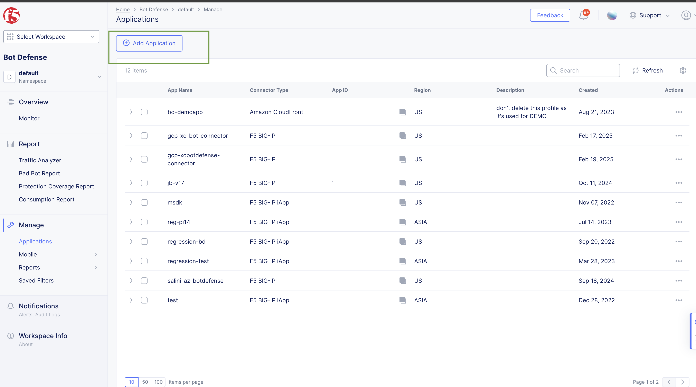
  
2: Switch into your newly created namespace
  
3: Click on the Bot Defense Tile and go to manage > applications > add application
  
4: Use any name and a description for "XC Bot Defense Connector for BIG-IP in GCP". For example, here "gcp-xcbotdefense-connector" is used.
  
5: Set the Application Region to "US", Connector Type "F5 BIG-IP iApp (v17.0 or greater) > save and exit

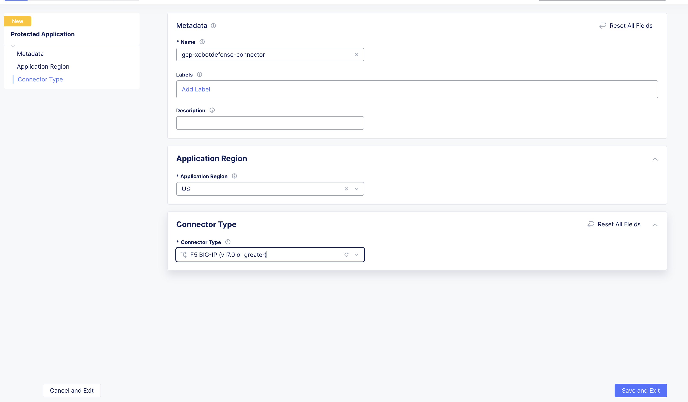

6: Click the ellipses and copy all of the ID's, keys, hostnames, and headers and save them into a file 

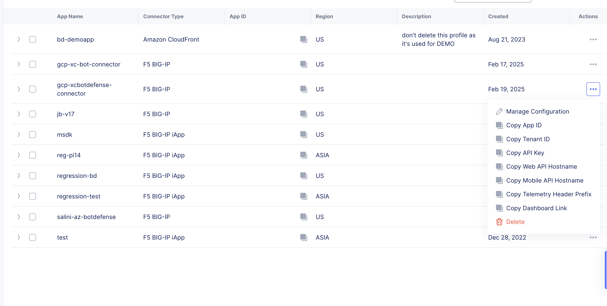

Terraform Cloud
----------------

-  **Workspaces:** Create CLI or API workspaces for each asset in the workflow. ``NOTE: Please use unique workspaces for each work-flow and don't club them with other use cases as you may run into conflicting cloud resource and provider errors.``

   +---------------------------+-----------------------------------------+
   |         **Workflow**      |  **Assets/Workspaces**                  |
   +===========================+=========================================+
   |bot-defense-gcp            | gcp-infra, gke, f5air, bigip, bigip-bd  |
   +---------------------------+-----------------------------------------+

-  **Workspace Sharing:** Under the settings for each Workspace, set the **Remote state sharing** to share with each Workspace created.

-  **Variable Set:** Create a Variable Set with the following values and mark them as sensitive:

   +------------------------------------------+--------------+------------------------------------------------------+
   |         **Name**                         |  **Type**    |      **Description**                                 |
   +==========================================+==============+======================================================+
   | VES_P12_PASSWORD                         | Environment  | Password set while creating F5XC API certificate     |
   +------------------------------------------+--------------+------------------------------------------------------+
   | VOLT_API_P12_FILE                        | Environment  | Your F5XC API certificate. Set this to **api.p12**   |
   +------------------------------------------+--------------+------------------------------------------------------+
   | ssh_key                                  | TERRAFORM    | Your ssh key for accessing the created resources     |
   +------------------------------------------+--------------+------------------------------------------------------+
   | tf_cloud_organization                    | TERRAFORM    | Your Terraform Cloud Organization name               |
   +------------------------------------------+--------------+------------------------------------------------------+
   | GOOGLE_CREDENTIALS                       | ENVIRONMENT  | GCP Credentials in JSON format (in a single line)    |
   +------------------------------------------+--------------+------------------------------------------------------+
   | TF_VAR_api_key                           | ENVIRONMENT  | XC Bot Defense Connector API Key                     |
   +------------------------------------------+--------------+------------------------------------------------------+
   | TF_VAR_application_id                    | ENVIRONMENT  | XC Bot Defense Connector Application ID              |
   +------------------------------------------+--------------+------------------------------------------------------+
   | TF_VAR_tenant_id                         | ENVIRONMENT  | XC Bot Defense Connector Tenant ID                   |
   +------------------------------------------+--------------+------------------------------------------------------+

  Note: Follow https://community.f5.com/kb/technicalarticles/creating-a-credential-in-f5-distributed-cloud-for-gcp/298290 to know more on how to Create GCP Service Account and get the credentials.

GitHub
-------

-  Fork and Clone Repo. Navigate to ``Actions`` tab and enable it.

-  **Actions Secrets:** Create the following GitHub Actions secrets in your forked repo

   -  P12: The linux base64 encoded F5XC P12 certificate without spaces. NOTE: you can run `base64 <file-name>` to get this output
   -  TF_API_TOKEN: Your Terraform Cloud API token
   -  TF_CLOUD_ORGANIZATION: Your Terraform Cloud Organization name
   -  SSH_KEY : Your ssh key for accessing the created resources 
   -  GOOGLE_CREDENTIALS : Your GCP Credentials
   -  TF_CLOUD_WORKSPACE_APP : f5air
   -  TF_CLOUD_WORKSPACE_BIGIP : bigip
   -  TF_CLOUD_WORKSPACE_BOTDEFENSE : bigip-bd
   -  TF_CLOUD_WORKSPACE_INFRA : gcp-infra
   -  TF_CLOUD_WORKSPACE_GKE : gke

Workflow Runs
--------------

**STEP 1:** Check out a branch with the branch name as suggested below for the workflow you wish to run using
the following naming convention.

**DEPLOY**

================================               =========================
Workflow                                       Branch Name
================================               =========================
F5 XC Bot Defense on GCP Deploy                 deploy-bot-defense-gcp
================================               =========================

Workflow File: `bot-defense-gcp.yaml  </.github/workflows/bot-defense-gcp-deploy.yaml>`__

**DESTROY**

================================               =========================
Workflow                                       Branch Name
================================               =========================
F5 XC Bot Defense on GCP Destroy                destroy-bot-defense-gcp
================================               =========================

Workflow File: `bot-defense-gcp-destroy.yaml </.github/workflows/bot-defense-gcp-destroy.yaml>`__

**STEP 2:** Rename ``gcp/infra/terraform.tfvars.examples`` to ``gcp/infra/terraform.tfvars`` and add the following data:

-  project_prefix = "prefix of your choice"

-  gcp_region = “us-west1”

-  gcp_project_id = “Project ID”

-  service_account = “GCP Service Account Username”

-  nic = “false”

-  nap = "false"

-  bigip = "true"

-  bigip-cis = "false"

-  aks-cluster = "false"

-  azure-vm = "false"

**STEP 3:** Commit and push your build branch to your forked repo

- Build will run and can be monitored in the GitHub Actions tab and TF Cloud console. ``If CICD failed because of intermittent timing issue, rerun the work-flow again.``

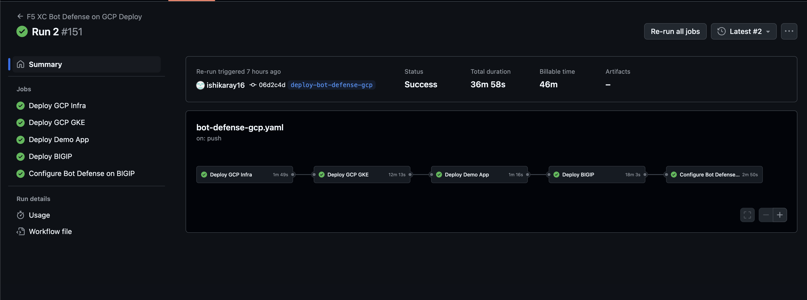

**STEP 4:** Once the pipeline completes, verify your BIGIP instance is accessible and Virtual Server is created under Distributed Cloud Services > Bot Defense. Public IP can be found under Deploy BIGIP Apply pipeline run as shown below.

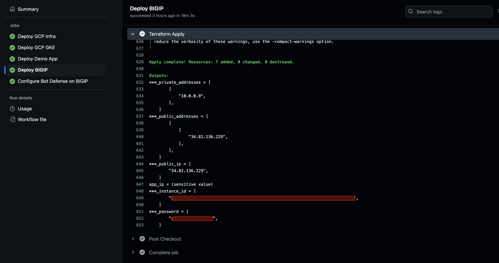

BIGIP instance is accessible at https://<Public-IP-address-BIGIP>:8443

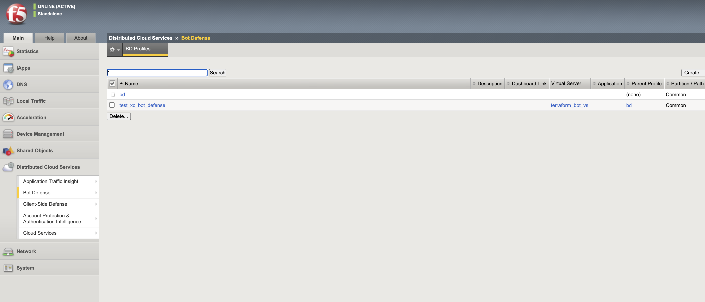

**STEP 5:** Verify the JavaScript injection in the GKE application via the BIG-IP.

Airline demo application is accessible at http://<Public-IP-address-BIGIP>

Within the <head> tag you should see three lines containing the following: 1) src="/customer1.js?matcher", 2) src="/customer1.js?single"></script>, 3) src="/customer1.js?async

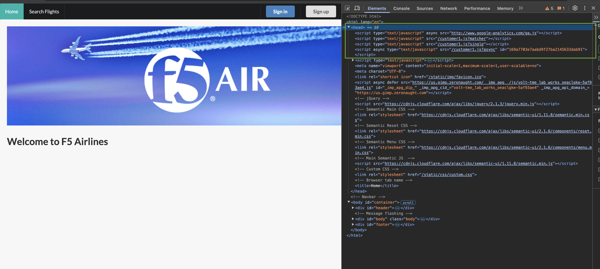

**STEP 6:** As shown below, "Failure" message in the Configure Bot Defense on BIGIP, under Run Traffic confirms the blocking of the Bot Traffic by XC Bot Connector.

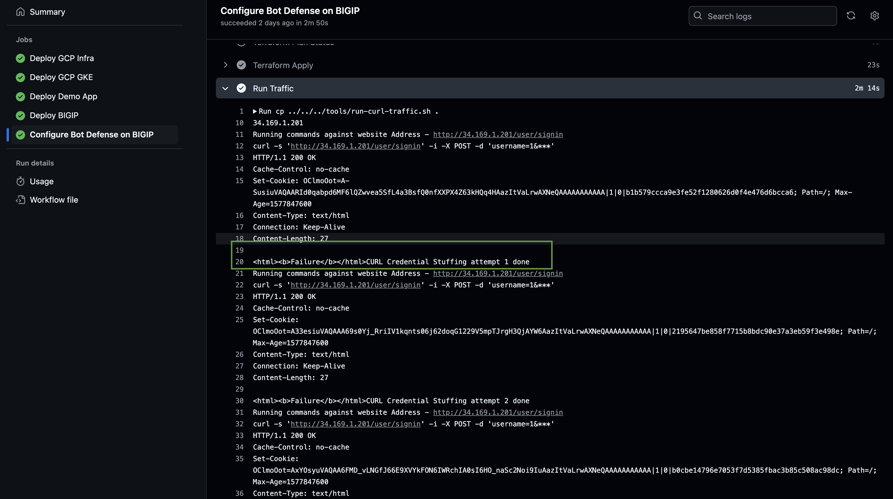

**STEP 7:** Now, return to the F5 XC Console and verify the monitoring page over Overview > Monitor. You can see the bot detections of our newly protected Cloudfront Application. Here you can monitor and respond to events that are identified as Bot traffic

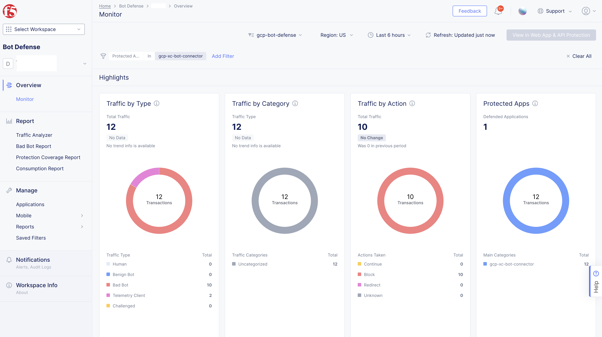

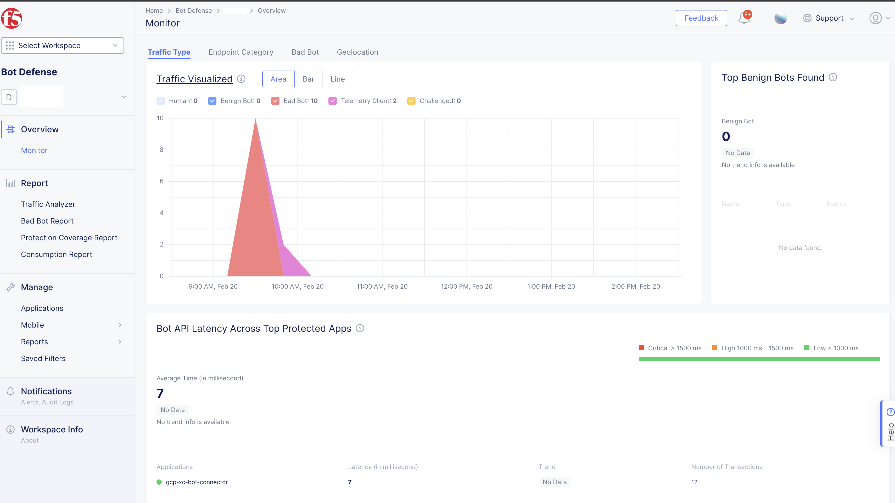

**STEP 8:** If you want to destroy the entire setup, checkout a branch with name ``destroy-bot-defense-gcp`` which will trigger destroy workflow and will remove all created resources.

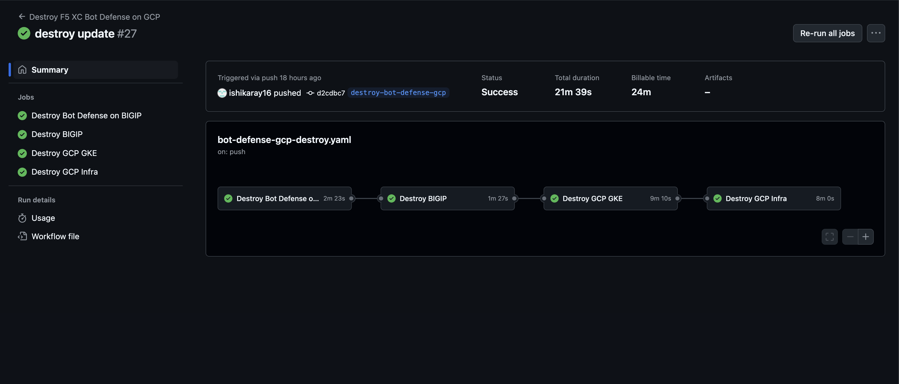
