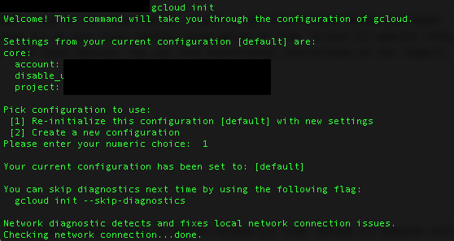
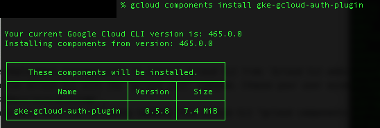

Deploy Bot Defense for GCP with F5 XC BIG-IP Connector
========================================================

Objective :
-----------

This guide will outline the steps for implementing F5 XC Bot Defense to protect your GKE Kubernetes workloads in GCP using our BIG-IP Connector. First we will be deploying our sample application into GKE (Google Kubernetes Engine). Then we will front-end this application with F5's BIG-IP virtual appliance in GCP configured with our XC Bot Defense Connector. We'll leverage F5 XC to setup and download our Bot Defense Connector which will be deployed directly to the BIG-IP virtual appliance. This guide will outline the steps for implementing this infrastructure via Console Steps as well as Automated method using Terraform.

Bot Defense for GCP Architectural Diagram :
-----------------------
.. image:: assets/bot-gcp.png
   :width: 100%

Manual step by step process for deployment:
-------------------------------------------

Console Deployment Prerequisites:
^^^^^^^^^^^^^^

1. F5 Distributed Cloud Account (F5XC)
2. GCP Cloud Account (If you don't have an GCP subscription, create an GCP free account before you begin `here <https://console.cloud.google.com/freetrial/signup/>`_)
3. Gcloud CLI: Install the Gcloud CLI on your local machine using option b) from `Gcloud CLI website <https://cloud.google.com/sdk/docs/install>`_
4. kubectl: Install kubectl on your local machine. You can find installation instructions on the `kubectl installation page <https://kubernetes.io/docs/tasks/tools/>`_

Steps:
^^^^^^

Signing into Gcloud CLI
======================

1. Ensure you've followed the deployment prerequisites to install Gcloud CLI from `Gcloud CLI website <https://cloud.google.com/sdk/docs/install>`_ using option b)
2. After installation, initialize Gcloud CLI with the "gcloud init" command. Choose your user account, project, and set the default compute/region to us-west1. `Initializing Gcloud Documentation <https://cloud.google.com/sdk/docs/initializing>`_
3. Install the gke-cloud-auth-plugin with the following command from Gcloud CLI "gcloud components install gke-gcloud-auth-plugin"

Create a new Google Cloud Project
==================================

1. Browse to the `Google Cloud Console <https://console.cloud.google.com/>`_ 
2. In the Google Cloud console, on the project selector page, select or create a `Google Cloud project <https://cloud.google.com/resource-manager/docs/creating-managing-projects>`_

Create the GCP VPC and Subnets
===============================

1. gcloud compute networks create gcp-xcbotdefense-vpc1 --subnet-mode=custom
2. gcloud compute networks subnets create gcp-xcbotdefense-subnet1  --network=gcp-xcbotdefense-vpc1 --region=us-west1 --range=10.252.1.0/24

Create the GKE (Google Kubernetes Engine) Cluster
=================================================

1. Create the cluster and deploy into the vpc and subnet we created. Use the following command to create a cluster named gcp-xcbotdefense-cluster1 "gcloud container clusters create gcp-xcbotdefense-cluster1 --network=gcp-xcbotdefense-vpc1 --subnetwork=gcp-xcbotdefense-subnet1"
2. Once the cluster has been created, use the following command to get the credentials to communicate with the cluster "gcloud container clusters get-credentials gcp-xcbotdefense-cluster1 --location us-west1" 
3. Verify the connection to your cluster using the "kubectl get nodes" command. This command returns a list of the cluster nodes.

.. image:: assets/az-aks-create-2.png
   :width: 100%

Deploy our Sample Airline Application to the GKE Cluster:
=========================================================

1. Create a namespace using "kubectl create namespace gcp-xcbotdefense-namespace1"
2. Download the Kubernetes .yaml file for GKE using our sample Airline application `here <https://github.com/karlbort/f5-xc-waap-terraform-examples/blob/main/workflow-guides/bot/deploy-botdefense-in-gcp-with-f5xc-bigip-connector/airline-app/gcp-xcbotdefense-app.yaml>`_ and save it to a working directory
3. From CLI Navigate to the directory containing the container image YAML file and run the command "kubectl apply -f gcp-xcbotdefense-app.yaml -n gcp-xcbotdefense-namespace1".
4. Check the status of the deployed pods using the "kubectl get pods -n gcp-xcbotdefense-namespace1" command. Make sure all pods are Running before proceeding.
5. Once this command has finished executing you can find the ingress IP by running the command "kubectl get services -n gcp-xcbotdefense-namespace1". Note that the external IP is in the gcp-xcbotdefense-subnet1 (10.252.1.0/24) that we created. Make a note of this address as we'll be using this as the backend of our BIG-IP Virtual Server.

.. image:: assets/kubectl-apply3.png
   :width: 100%

Deploy F5 BIG-IP VM:
====================

1. Navigate to the GCP Console and in the search menu click search for "marketplace" and click on the marketplace result. 
2. From the GCP Marketplace search for "F5" then open the "F5 BIG-IP BEST with IPI and Threat Campaigns (PAYG, 1 Gbps) and click "Launch"
3. The Deployment Name should be "gcp-xcbotdefense-bigip1"
4. The Zone should be us-west-1-a
5. Leave the Machine Type at "General purpose, N1 Series, n1-standard-4"
6. In the Networking section set the Network to "gcp-xcbotdefense-vpc1", Subnetwork "gcp-xcbotdefense-subnet1", External IP "Ephemeral".
7. Under the firewall section uncheck both "Allow TCP port 22 form the internet" and TCP port 8443. We'll create our own and attach it to the BIG-IP. 
8. Click "Deploy"

.. image:: assets/az-rg1-2.png
   :width: 75%

Create Inbound Firewall Policy and Rules for BIGIP:
===================================================

1. These inbound firewall rules will allow traffic to the 
2. From CLI copy/paste the command "gcloud compute firewall-rules create gcp-xcbotdefense-fwrule8443 --network=gcp-xcbotdefense-vpc1 --direction=INGRESS --allow=tcp:8443 --source-ranges=0.0.0.0/0 --target-tags=gcp-xcbotdefense-bigip1-deployment"
3. From CLI copy/paste the command "gcloud compute firewall-rules create gcp-xcbotdefense-fwrule22 --network=gcp-xcbotdefense-vpc1 --direction=INGRESS --allow=tcp:22 --source-ranges=0.0.0.0/0 --target-tags=gcp-xcbotdefense-bigip1-deployment"
4. From CLI copy/paste the command "gcloud compute firewall-rules create gcp-xcbotdefense-fwrule80 --network=gcp-xcbotdefense-vpc1 --direction=INGRESS --allow=tcp:80 --source-ranges=0.0.0.0/0 --target-tags=gcp-xcbotdefense-bigip1-deployment"

.. image:: assets/bigip-nsg2-2.png
   :width: 100%

Connect to BIG-IP:
==================

1. The first time you boot BIG-IP VE, you must connect to the instance and create a strong admin password. You will use the admin account and password to access the BIG-IP Configuration utility
2. In the Google Console, SSH -> View Gcloud Command > Copy to Clipboard > Paste into local Gcloud CLI. Type admin@ before the instance name, for example: gcloud compute ssh --zone "us-west1-a" "admin@gcp-xcbotdefense-bigip1-vm" --project "myprojectname"
3. Occassionally, SSH will ask for a passphrase even when one hasn't been created, if SSH key is password protected "cd ~/.ssh", "sudo ssh-keygen -t rsa -f ~/.ssh/google_compute_engine -C username@myemail.com"
4. Once you have access to the BIG-IP CLI, to ensure you are at the tmsh command prompt, type tmsh
5. Change the admin password with the command "modify auth password admin" and press enter, type the password and then confirm. 
6. Ensure that the system retains the password change with the command "save sys config"
7. Open a web browser and log in to the BIG-IP Configuration utility by using https with the external IP address and port 8443, for example: https://<external-ip-address>:8443. The username is admin and the password is the one you set previously. You can find the external ip address with "gcloud compute instances describe --zone=us-west1-a gcp-xcbotdefense-bigip1-vm --format='get(networkInterfaces[0].accessConfigs[0].natIP)' or with "gcloud compute instances list" and find gcp-xcbotdefense-bigip1-vm.

Create BIG-IP Service Pool :
============================

1. NOTE** You will need the external IP Address of your cluster from "kubectl get services -n gcp-xcbotdefense-namespace1". It should be a 10.252.1.x/24 IP address
2. Open a web browser and log in to the BIG-IP Configuration utility by using https with the external IP address and port 8443, for example: https://<external-ip-address>:8443. The username is admin and the password is the one you set previously. You can find the external ip address with "gcloud compute instances describe --zone=us-west1-a gcp-xcbotdefense-bigip1-vm --format='get(networkInterfaces[0].accessConfigs[0].natIP)' or with "gcloud compute instances list" and find gcp-xcbotdefense-bigip1-vm
3. Under the Main tab go to local traffic > pools > create 
4. Name "gcp-xcbotdefense-app1", Health Monitors "tcp"
5. Leave the default load balancing method at "Round Robin", add the node name of "gcp-xcbotdefense-app1", in the address field, paste the external ip from previous steps "10.252.1.x", set service port to "80 HTTP", Add, finished
6. If you refresh your page the status should turn green indicating successful health monitor to the aks app.

.. image:: assets/bigip-pool.png
   :width: 100%

Create BIG-IP Virtual Server:
=============================

1. First thing you will need to grab here is the private address in that's been assigned to your BIG-IP. Navigate to resource groups > az-xcbotdefense-rg1 > az-xcbotdefense-bigip1 and not the private IP address under the networking section. 
2. Within the BIG-IP navigate to Local traffic > virtual servers > CREATE
3. Name "az-xcbotdefense-vip1", source address, 0.0.0.0/0, Destination Address/Mask, enter "<bigip-private-ip>/32" (Private IP of BIG-IP from previous step), service port 80 http 
4. set the HTTP Profile (Client) to "http", HTTP Profile (server) "use client profile"

.. image:: assets/bigip-vip1-1.png
   :width: 100%

Create Route Table for BIG-IP to AKS:
=====================================

1. Now let's create the route-table for the BIG-IP to reach AKS using the following command "az network route-table create --name az-xcbotdefense-rt1 --resource-group az-xcbotdefense-rg1 --location westus2".
2. We'll add a route to get to the aks cluster vnet "az network route-table route create --name az-xcbotdefense-aks-route --resource-group az-xcbotdefense-rg1 --route-table-name az-xcbotdefense-rt1 --address-prefix 10.224.0.0/24 --next-hop-type VirtualAppliance --next-hop-ip-address 10.224.0.5"
3. Add a route for outbound internet traffic "az network route-table route create --name az-xcbotdefense-inet-route --resource-group az-xcbotdefense-rg1 --route-table-name az-xcbotdefense-rt1 --address-prefix 0.0.0.0/0 --next-hop-type Internet"
4. Now browse to the resource group az-xcbotdefense-rg1 > az-xcbotdefense-vnet1 > settings > subnets > az-xcbotdefense-subnet1 > route table > az-xcbotdefense-rt1 > save

.. image:: assets/rt1-subnet1.png
   :width: 100%

Add Route Table Entry For AKS to BIG-IP:
========================================

1. NOTE*** You will need the internal ip-address (10.248.1.x) of your big-ip which can be found from > resource groups > az-xcbotdefense-rg1 > az-xcbotdefense-bigip1 > networking > Private ip-address
2. We are going to configure this route entry from the Azure Portal. Navigate to resource groups > MC_az-xcbotdefense-rg1_az-xcbotdefense-cluster_westus2 > aks-agentpool-123xxx-routetable > settings > routes > add 
3. Route name "aks-to-bigip", Destination type "IP Addresses", Destination IP "10.248.1.0/24", Next hop type, "virtual appliance", Next hop address "<use-internal-bigip-address>"
4. Click Add

.. image:: assets/route-aks-to-bigip.png
   :width: 100%

Add Inbound HTTP Rule to AKS NSG:
=================================

1. Browse to resource MC_az-xcbotdefense-rg1_az-xcbotdefense-cluster_westus2 > aks-agentpool-123456-nsg > settings > inbound security rules
2. Add source "ip addresses", source ip addresses/cidr 10.248.1.0/24, destination "IP Addresses", destination ip addresses/cidr "10.224.0.0/16" , service HTTP, and click add

.. image:: assets/aks-nsg1.png
   :width: 100%

Create BIG-IP Service Pool :
============================

1. NOTE** You will need the external IP Address of your cluster from "kubectl get services -n az-xcbotdefense-namespace1"
2. Navigate to resource group az-xcbotdefense-rg1 > az-xcbotdefense-bigip1 and note the public IP Address on the overview page in the networking section
3. Open a browser and access big-ip with https://<external-ip-address>:8443 (replacing "external-ip-address" with you guessed it... your pub BIG-IP... IP")
4. Login with the credentials your provided for username "f5admin"
5. Under the Main tab go to local traffic > pools > create 
6. Name "az-xcbotdefense-app1", Health Monitors "tcp"
7. Leave the default load balancing method at "Round Robin", add the node name of "az-xcbotdefense-app1", in the address field, paste the external ip from previous steps "10.224.0.5", set service port to "80 HTTP", Add, finished
8. If you refresh your page the status should turn green indicating successful health monitor to the aks app. 

.. image:: assets/bigip-pool.png
   :width: 100%

.. image:: assets/bigip-pool-green.png
   :width: 100%

Create BIG-IP Virtual Server:
=============================

1. First thing you will need to grab here is the private address in that's been assigned to your BIG-IP. Navigate to resource groups > az-xcbotdefense-rg1 > az-xcbotdefense-bigip1 and not the private IP address under the networking section. 
2. Within the BIG-IP navigate to Local traffic > virtual servers > CREATE
3. Name "az-xcbotdefense-vip1", source address, 0.0.0.0/0, Destination Address/Mask, enter "<bigip-private-ip>/32" (Private IP of BIG-IP from previous step), service port 80 http 
4. set the HTTP Profile (Client) to "http", HTTP Profile (server) "use client profile"

.. image:: assets/bigip-vip1-1.png
   :width: 100%

5. set "Source Address Translation to "AutoMap" 
6. Under resources set the Default Pool to "az-xcbotdefense-app1" and click finished
7. Verify you can access your AKS App through the BIG-IP by going to http://bigippublicip and it should load the F5 Airline Application 

.. image:: assets/bigip-vip1-2.png
   :width: 100%

.. image:: assets/f5air.png
   :width: 100%

Creating the XC Bot Defense Profile:
==============================================

1. Logging into your tenant via https://console.ves.volterra.io ensure you have a unique namespace configured. If not, navigate to Administration --> My Namespaces --> Add New
2. Switch into your newly created namespace
3. Click on the Bot Defense Tile and go to manage > applications > add application 

.. image:: assets/xc-bot-tile.png
   :width: 100%

.. image:: assets/bot-manage.png
   :width: 100%

3. Use the name "az-xcbotdefense-profile1" and a description of "XC Bot Defense Connector for BIG-IP in Azure" 
4. Set the Application Region to "US", Connector Type "F5 BIG-IP iApp (v17.0 or greater) > save and exit

.. image:: assets/bigip-connector-add.png
   :width: 100%

5. Click the Elipses and copy all of the ID's, keys, hostnames, and headers and save them into a file 

.. image:: assets/connector-manage.png
   :width: 100%

6. Now Login to your BIG-IP and click on the distributed Cloud services > Bot Defense > Create

.. image:: assets/bigip-bdprofile1.png
   :width: 100%

7. Enter profile name "az-xcbotdefense-profile1"
8. Paste Application ID, Tenant ID, API Hostname, API Key, and Telemetry Header Prefix from XC Console 
9. Leave the default JS Insertion Configuration settings of /customer.js, After <head>, Async with no caching

.. image:: assets/bigip-bdprofile1-3.png
   :width: 100%

10. Under protected endpoints, enter the public IP for your BIG-IP/Application, set the path to /user/signin, set the endpoint label to Login, and check "PUT" and "POST" checkbox with mitigation action of "block", don't forgest to click "Add" to add the rule

.. image:: assets/protected-endpoints.png
   :width: 100%

11, Under the Advanced Features, click the plus sign next to "protection pool" and name it "ibd-webus.fastcache.net"
12. add a health monitor of https, under node name call it ibd-webus.fastcache.net, address ibd-webus.fastcache.net, service port 443 https, click add and finished
13. Back on the Bot Defense profile page select the newly created profile from the menu and set the ssl profile to "serverssl" and click finished

.. image:: assets/bd-protection-pool1.png
   :width: 100%

.. image:: assets/bd-protectionpool1-1.png
   :width: 100%

.. image:: assets/bd-protectionpool1-2.png
   :width: 100%

Binding the XC Bot Profile to the Virtual Sever:
================================================
 
1. Within the BIG-IP navigate to Local Traffic > Virtual Servers > az-xcbotdefense-vip1 > and click on the tab at the top called "distributed Cloud Services"
2. Change the Bot Defense drop down from "disabled" to "enabled" then select the "az-xcbotdefense-connector1" profile and click update 
3. Now that we've applied the Bot Defense Connector to our Virtual Server Lets test it out. 

.. image:: assets/vip-bdprofile2.png
   :width: 100%

Validating the Java Script Injection:
=====================================

1. Open a browser and load the app through the BIG-IP by going to http://bigippublicip and it should load the F5 Airline Application
2. Right click anywhere on the page and click "inspect"
3. This opens the developer tools on the right. Under the "elements" tab expand the <head> tag
4. Within the <head> tag you should see three lines containing the following: 1) src="/customer1.js?matcher", 2) src="/customer1.js?single"></script>, 3) src="/customer1.js?async"
5. This confirms that the Javascript is being injected appropriately into your aks application via the BIG-IP

.. image:: assets/jsverification.png
   :width: 100%

Simulating Bot Traffic with CURL:
=================================

1. Within this repo you can download the `curl-stuff.sh <https://github.com/karlbort/f5-xc-waap-terraform-examples/blob/main/workflow-guides/bot/deploy-botdefense-in-azure-with-f5xc-bigip-connector/validation-tools/curl-stuff.sh>`_ Bash script in the validation-tools directory to run it against your web application to generate some generic Bot Traffic
2. After you've downloaded the curl-stuff.sh script you can edit the file using a text editor and replace the domain name on line 3 with the public IP Address of your BIG-IP. For example, curl -s http://x.x.x.x/user/signin NOTE*** ensure that you maintain the "/user/signin" path as this is the protected endpoint we configured in our profile.
3. Run the curl script with sh curl-stuff.sh. Note the failure response in the screenshot below

.. image:: assets/curl-stuff2.png
   :width: 100%

View Bot Traffic​:
=================

1. Now let’s return to F5 XC Console and show the monitoring page over Overview > Monitor
2. Log in to your F5 Distributed Cloud Console
3. Go to the Dashboard page of XC console and click Bot Defense.
4. Make sure you are in the correct Namespace
5. Under Overview click Monitor and you can see our the bot detections of our newly protected Cloudfront Application. 
6. Here you can monitor and respond to events that are identified as Bot traffic

.. image:: assets/bdmonitor2.png
   :width: 100%

Step by step process using automation scripts:
----------------------------------------------

**Coming soon**

Development
-----------

Outline any requirements to setup a development environment if someone
would like to contribute. You may also link to another file for this
information.

Support
-------

For support, please open a GitHub issue. Note, the code in this
repository is community supported and is not supported by F5 Networks.

