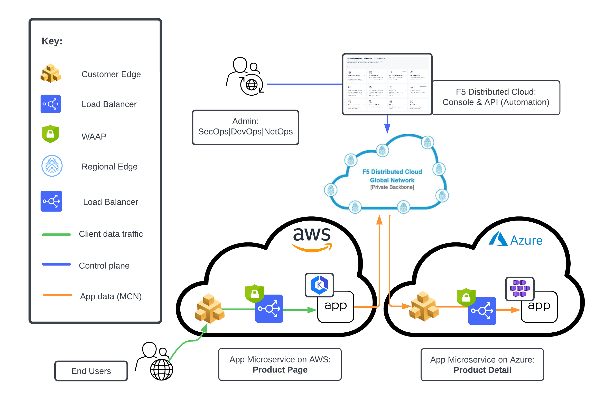

App Delivery Fabric (Secure Multi-Cloud Networking)
--------------------------------------------------------

.. contents:: Table of Contents

Overview
#########

This guide provides both the manual and automated steps for secure app-to-app Multi-Cloud Networking (MCN) connectivity between distributed apps and microservices running in different F5 Distributed Cloud (XC) Customer Edge (CE) deployments. 

Specifically, it showcases two common MCN tasks:

* Deployment of XC CE in two multiple clouds, including set-up of app infrastructure and services deployment;
* Configuration of Load Balancers (LB), advertising options & WAF for secure networking to complete app delivery.

This demonstrates the time-to-value and speed of MCN connectivity for app delivery across different clouds and the configuration of security for distributed apps, independently of where they are running, all managed via a single solution: F5 Distributed Cloud.

Setup Diagram
##############

Workflow Instructions
######################

The pre-requisite for this guide is having accounts in Amazon AWS and Microsoft Azure where you will set up the F5 CEs, and of course an F5 XC subscription for both Console and API automated configuration of MCN and Security. 

You can follow the steps in the manual or automated guides below:

`App Delivery Fabric: SaaS Console Workflow <https://github.com/f5devcentral/f5-xc-terraform-examples/blob/main/workflow-guides/waf/f5-xc-waf-on-ce-multicloud/MCN-without-SMG/xc-console-demo-guide.rst>`__

`App Delivery Fabric: API Workflow <./terraform/>`__

Additional Related Resources
#############################
Secure MCN `DevCentral Article <https://www.f5.com/solutions/use-cases/multi-cloud-networking>`__
