# Secure DMZ Setup with F5 Enterprise Networking and Application Security

# Table of Contents

- [DMZ Setup in XC Cloud](#dmz-setup-in-xc-cloud)
- [Table of Contents](#table-of-contents)
- [Overview](#overview)
- [Setup Diagram](#setup-diagram)
- [1. Configure Environment](#1-configure-environment)
  - [1.1 Prerequisites](#11-prerequisites)
  - [1.2 Create Secure Mesh Site in XC Cloud](#12-create-secure-mesh-site-in-xc-cloud)
  - [1.3 Deploy Secure Mesh Site](#13-deploy-secure-mesh-site)
  - [1.4 Create Application VM](#14-create-application-vm)
- [2. Expose Application to the Internet](#2-expose-application-to-the-internet)
  - [2.1 Configure Virtual Site](#21-configure-virtual-site)
  - [2.2 Create HTTP Load Balancer](#22-create-http-load-balancer)
- [3. Protect Application](#3-protect-application)
  - [3.1 Configure WAF](#31-configure-waf)
  - [3.2 Configure Bot Protection](#32-configure-bot-protection)
  - [3.3 Configure API Discovery](#33-configure-api-discovery)
  - [3.4 Configure DDoS Protection](#34-configure-ddos-protection)
  - [3.5 Configure Malicious User and IP Reputation](#35-configure-malicious-user-and-ip-reputation)
  - [3.6 Verify Application](#36-verify-application)
- [4. Extend Solution with Additional Data Center](#4-extend-solution-with-additional-data-center)
  - [4.1 Configure Second Data Center](#41-configure-second-data-center)
  - [4.2 Configure Second Virtual Site](#42-configure-second-virtual-site)
  - [4.3 Setup DMZ Configuration](#43-setup-dmz-configuration)

# Overview

This guide provides the steps for a comprehensive [demilitarized zone (DMZ)](<https://en.wikipedia.org/wiki/DMZ_(computing)>) setup with **F5 Distributed Cloud Services** [XC Cloud](https://cloud.f5.com). The services utilize **F5 Distributed Cloud** for:

**Application Delivery**
- *App Connect*

**Application Security**
- *WAF*,
- *Bot Defense*,
- *DDoS Mitigation*,
- *API Security*
  
The setup includes the following components:

- Configuration of VMWare Data Center with two CE Sites for failover;
- Demo application deployment in the VMware Data Center;
- XC Cloud Secure Mesh Site configuration and combining them into a single Virtual Site;
- Application exposure to the Internet using HTTP Load Balancer;
- Application protection with Web Application Firewall (WAF), DDoS Protection, Bot Protection, and API Discovery;
- Upgrading the solution with a second Data Center and configuring HTTP Load Balancer for a complete DMZ configuration.

# Setup Diagram

The objective of this setup is to create a secure DMZ environment for the application. The diagram below shows high-level components and their interactions. The setup includes two Data Centers, each with two Secure Mesh Sites for failover, and a Virtual Site that combines both Secure Mesh Sites. The Virtual Site is exposed to the Internet using an HTTP Load Balancer. The application is protected by Web Application Firewall (WAF), DDoS Protection, Bot Protection, and API Discovery.


# 1. Configure Environment

## 1.1 Prerequisites

The following components are required to complete the setup:

- Access to the [XC Cloud](https://cloud.f5.com) with the following services enabled:
  - ability to create Sites
  - Bot Protect
  - DDoS Protect
  - Api Protect
  - Api Discovery
- VMware vCenter or ESXi
  - ability to create at least two VMs
  - two networks (internal and external)

## 1.2 Create Secure Mesh Site in XC Cloud

We will start with creating a Secure Mesh Site that will later be combined with the second one by a Virtual Site and exposed to the Internet. You can see the setup in the diagram below.

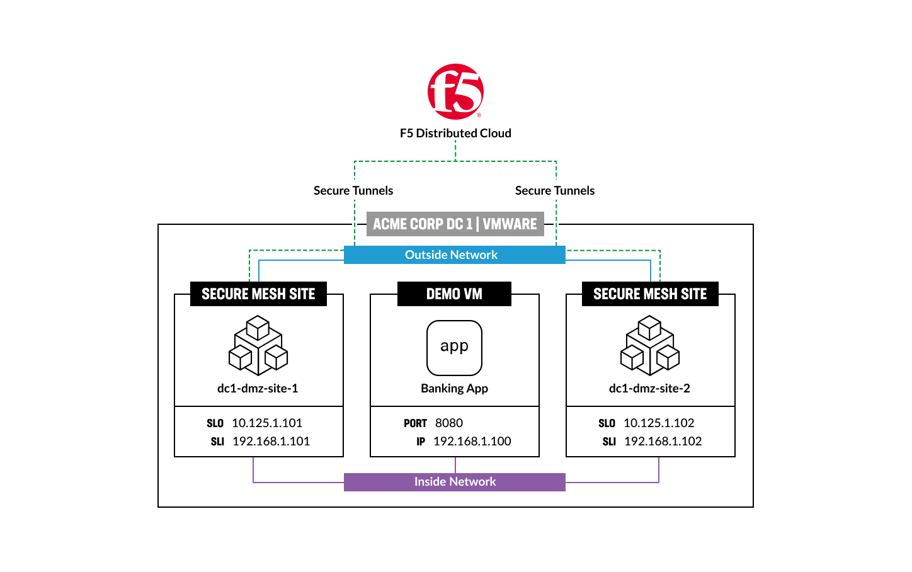

Log into F5 Distributed Cloud Console and select **Multi-Cloud Network Connect** service. Navigate to **Site Management** and select **Secure Mesh Sites**. Click **Add Secure Mesh Site**.


First, give it a name. Then click **Add Label** and type in a custom key, then a custom value. Keep in mind that custom value is the name of Virtual Site you will configure later in order to connect Secure Mesh Sites.


Next, move on to the **Provider** configuration. Select the **VMWare** provider name and **Not Managed By F5XC** orchestration mode.


Take a look at the default settings and click the **Save and Exit** button to complete the creation of the first Secure Mesh Site.

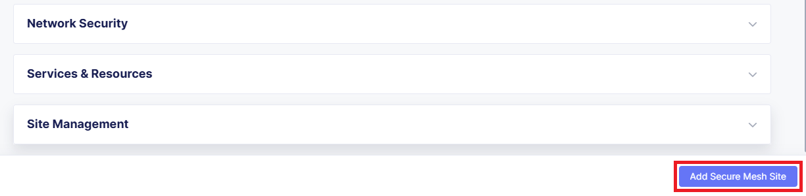

You will see the created Secure Mesh Site. After that we will need to generate a node token that will be used for its deployment later. Open Secure Mesh Site service menu and select **Generate Node Token**. This will open the token creation page.


You will see the generated token. Copy and save it to use later. Close the token page.

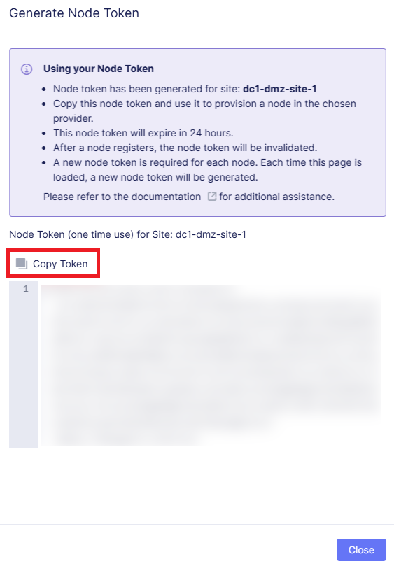

Finally, let's download the image for VMWare. In the Secure Mesh Site service menu select **Download Image**. This will start the download.


## 1.3 Deploy Secure Mesh Site

Now that we have created the first Secure Mesh Site, we will deploy it using its image we downloaded in the step before.

If you are using VMware vShpere Client, navigate to **Hosts and Clusters**. Right-click on the **Cluster** and select **Deploy OVF Template**.

If you are using VMware ESXI, navigate to **Virtual Machines** and select **Create/Register VM**, then select **Deploy a virtual machine from an OVF or OVA file**.


Fill in virtual machine name and upload the downloaded Secure Mesh Site image to deploy the VM. Click **Next**.


Select the storage type and datastore. Click **Next**.


Select the network for the VM. Make sure to select the External Network for the outside network adapter and move on.


Complete the **Additional settings** section where:

- hostname: node-0
- token: your Secure Mesh Site [node token](#12-create-secure-mesh-site-in-xc-cloud) generated earlier
- password: your password to access the Secure Mesh Site

Take a look at the settings and click **Next** to proceed.


Review the settings and click **Finish** to deploy the VM.


As soon as the site is deployed, add an **Internal Network** interface and save the settings.


Optionally you can configure Static IP address for the Secure Mesh Site.

To do that, click on the **Manage Configuration** menu item in the Secure Mesh Site actions menu.


Then click on the **Edit Configuration** button to enable editing mode.


Find your node in the list and click on the **Edit** button.


From the network list, select the **Internal interface (SLI)** and click **Edit**.


In the IP Configuration section, select **Static** and type in the IP address. Click **Apply** to save the settings. Then click **Save and Exit** to complete the configuration.


Once the Secure Mesh Site is deployed, we can proceed to the F5 Distributed Cloud Console, navigate to **Sites** and verify the created site status. As you can see in the image below, site health score is 100 and the state is online. The deployed site is up and running.

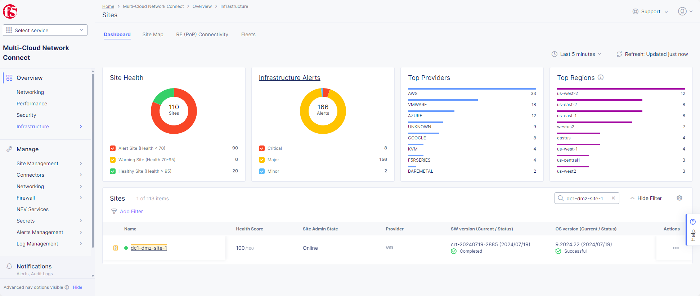

We have just created and deployed the first Secure Mesh Site for the first Data Center. For the failover setup, we will need to create and deploy the second Secure Mesh Site. Follow the steps [1.2](#12-create-secure-mesh-site-in-xc-cloud) and [1.3](#13-deploy-the-secure-mesh-site) above to do that.

## 1.4 Create Application VM

As an example, we will deploy a simple web application in the VMware Data Center. The application is a simple banking that listens on port 8080. The application contains core module, transaction module and reverse proxy module. The reverse proxy module is responsible for routing requests to the core module or transaction module based on the request path. The core module is responsible for serving the main application, while the transaction module is responsible for processing transactions and needed for API Discovery.

To deploy the application, follow the steps below:

- Create a new Ubuntu VM in the VMware Data Center
- Install docker and docker-compose
- Clone the repository
- Run `docker-compose up -d` from the `docker/application` directory
- Verify that the application is running by accessing `http://{{your_vm_ip}}:8080` in the browser or using curl command


# 2. Expose Application to the Internet

## 2.1 Configure Virtual Site

In order to expose our application with two Secure Mesh Sites for failover to the internet, we need to combine them using Virtual Site and then add an HTTP Load Balancer. You can see the setup in the diagram below.

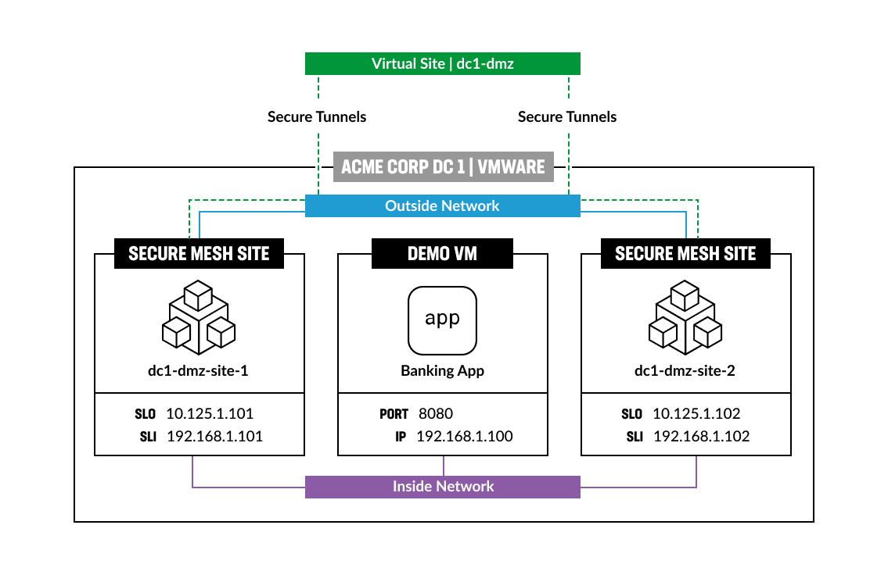

Let's start with adding a virtual site. Back in the F5 Distributed Cloud Console, navigate to the **Shared Configuration** service. From there, select **Virtual Sites** and click the **Add Virtual Site** button.


In the opened form give virtual site a name that we specified as [label](#12-create-secure-mesh-site-in-xc-cloud) for Secure Mesh Sites. Then make sure to select the **CE** site type. After that add selector expression specifying its name as value and complete by clicking the **Save and Exit** button.


## 2.2 Create HTTP Load Balancer

Next, we will configure HTTP Load Balancer to expose the created Virtual Site connecting two Secure Mesh Sites to the Internet.

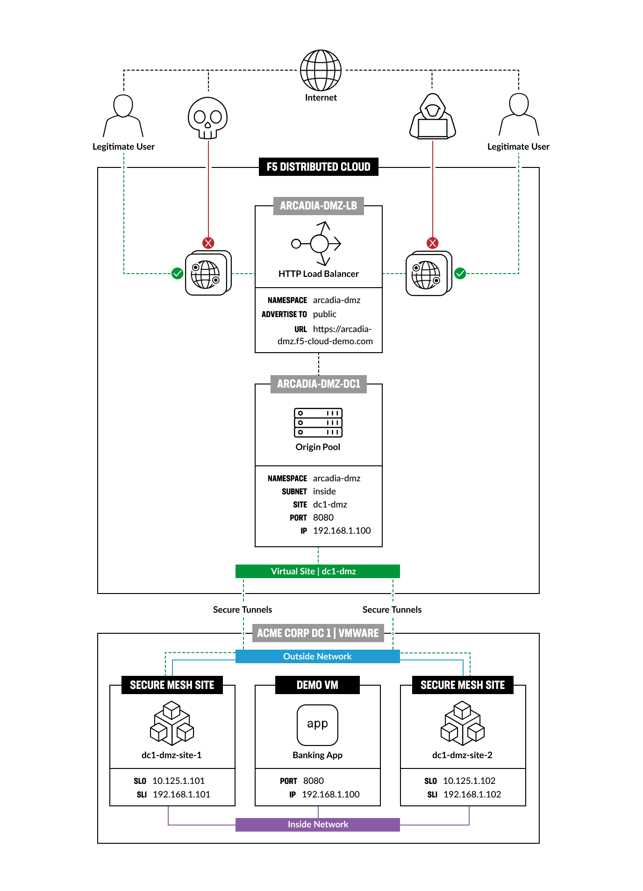

Proceed to the **Multi-Cloud App Connect** service => **Load Balancers** => **HTTP Load Balancers**. Click the **Add HTTP Load Balancer** button.


First, give HTTP Load Balancer a name.


Then we will configure **Domains and LB Type** section. Type in the **arcadia-dmz.f5-cloud-demo.com** domain and select **HTTPS with Automatic Certificate** as Load Balancer Type. Make sure to enable HTTP redirect to HTTPS and add HSTS header.


Scroll down to the **Origins** section and add an origin pool by clicking the **Add Item** button.


Open the **Origin Pool** drop-down menu and click **Add Item** to add an origin pool.


Give origin pool a name.


Then click **Add Item** to add an origin server.


Select **IP address of Origin Server on given Sites** as Origin Server type and type in the **192.168.1.100** private IP. Then in the drop-down menu select the [Virtual Site](#21-configure-virtual-site) we created earlier. Complete the configuration by clicking the **Apply** button.

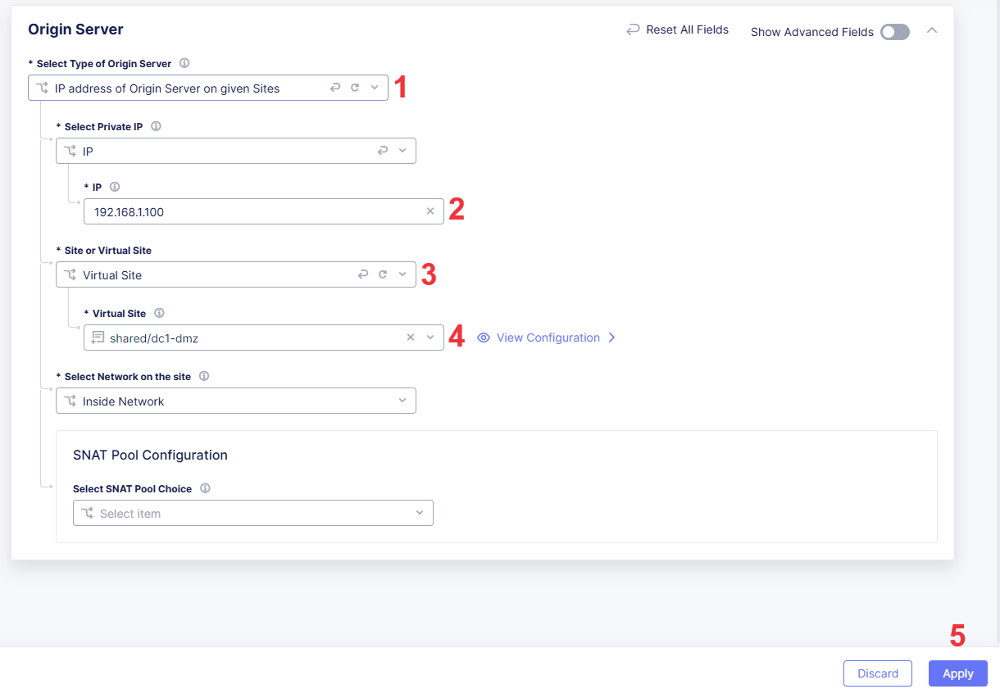

Type in the **8080** origin server port.

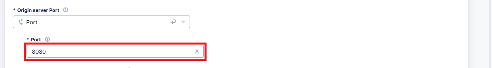

Scroll down to the **Health Checks** section and click the **Add Item** button to add a health check.

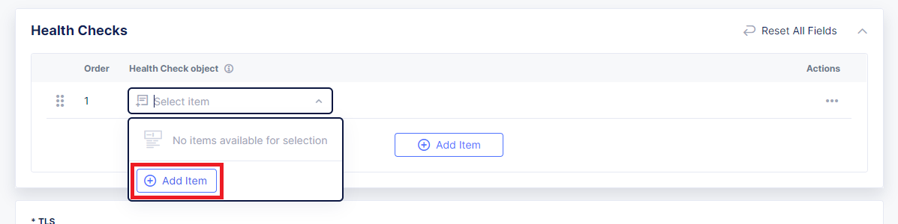

Give health check a name and leave the default settings. Then click **Continue** to save the health check configuration.


Scroll down and click **Continue**.


**Apply** origin pool configuration.


Now that the HTTP Load Balancer is configured, click **Save and Exit** to save it.


# 3. Protect Application

Now that we have exposed the Virtual Site with two Secure Mesh Sites to the Internet using an HTTP Load Balancer, we will configure protection for the deployed application: WAF, Bot Protect, API Discovery, DDoS Protection, and Malicious User and IP Reputation.


To do that go back to the F5 Distributed Cloud Console and select **Manage Configuration** in the service menu of the created HTTP Load Balancer.

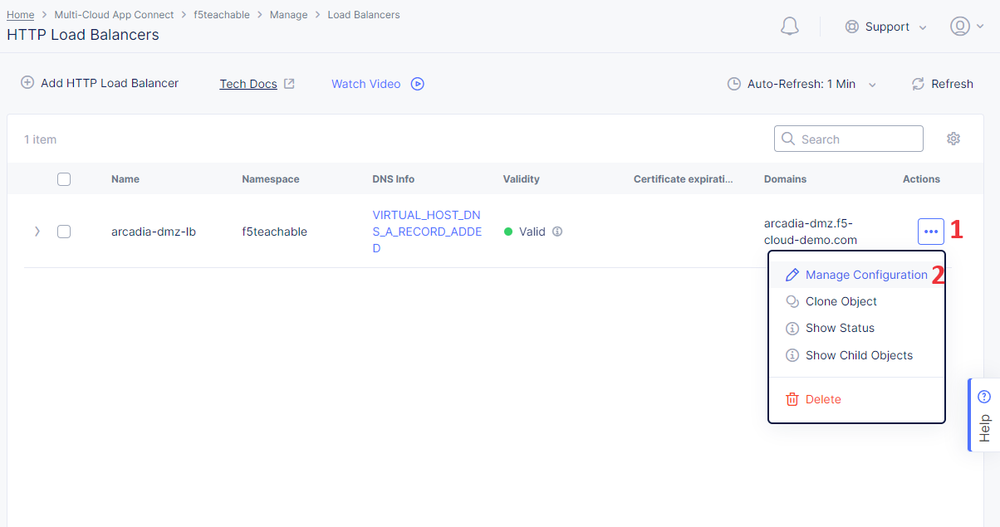

Click the **Edit Configuration** button to enable the editing mode.


## 3.1 Configure WAF

First, let's configure WAF protection. Scroll down to the **Web Application Firewall** section and enable WAF. Open the dropdown menu and click **Add Item**.


Give WAF a name and move on to **Enforcement Mode** configuration.


Select **Blocking** mode in the drop-down menu to log and block threats.


Proceed to **Detection Settings**. Select **Custom** Security Policy and take a look at its settings. Then scroll down to the **Signature-Based Bot Protection** and select **Custom**.


Finally, let's configure **Blocking Response Page** in **Advanced configuration**. Select **Custom** and configure as needed. Click **Continue** to complete WAF configuration and go back to the HTTP configuration page.


## 3.2 Configure Bot Protection

Next, we will configure Bot Protection. Scroll to the **Bot Protection** section and select **Enable Bot Defense Standard** in the drop-down menu. Move on by clicking **Configure**.


Proceed to configure Protected App Endpoint.

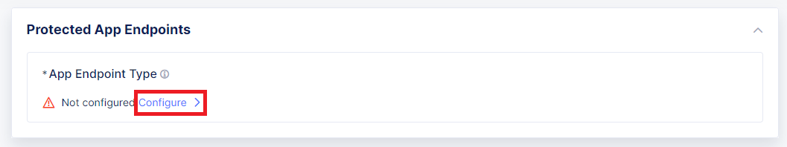

Click the **Add Item** button which will open the creation form.


Let's configure the endpoint. First, give it a name. Then select HTTP methods and choose specifying endpoint label category. Specify **Authentication** as flow label category and select **Login** for flow label. Move on and specify path prefix - **/trading/auth**. Select **Block** for the Bot Mitigation action and save the configuration by clicking **Apply**.


Take a look at the created App Endpoint and apply its configuration.


You will see Bot Defense Policy settings. Click the **Apply** button to proceed.

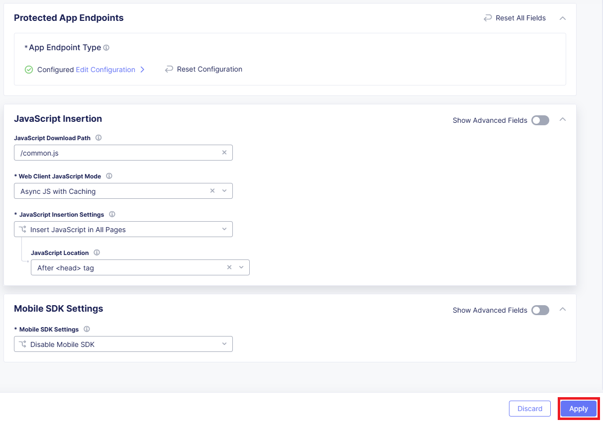

Now that the Bot Protection is configured for the HTTP Load Balancer, we can move on to API Discovery.


## 3.3 Configure API Discovery

In the **API Protection** part enable API Discovery and enable learning fom redirect traffic. Once the configuration is ready, proceed to the DDoS settings.


## 3.4 Configure DDoS Protection

Go to the **DoS Protection** section and select serving JavaScript challenge to suspicious sources. Proceed and select **Custom** for Slow DDoS Mitigation.


## 3.5 Configure Malicious User and IP Reputation

In the **Common Security Controls** section enable IP Reputation service and Malicious User Detection. Then select **JavaScript Challenge** for this HTTP LB.


The whole safety configuration is done. Take a look at it and click **Save and Exit**.


## 3.6 Verify Application

Now that all the protection is configured, we can verify the application. To do that access the application using the domain name specified in the [HTTP Load Balancer configuration](#22-create-http-load-balancer).

To verify the WAF protection, try to access the application using a browser or curl command and check if the request is blocked by WAF. Let's simulate a simple XSS attack by adding a script tag to the request. Open the browser console and navigate to the application URL `https://arcadia-dmz.f5-cloud-demo.com?param=<script>alert('XSS')</script>`. You should see the WAF blocking page.


To verify the Bot Protection, try to access the application using a browser or curl command and check if the request is blocked by Bot Protection. Let's simulate a bot attack by sending a request to the protected endpoint. Open the Terminal and run the following command `curl -i -X POST https://arcadia-dmz.f5-cloud-demo.com/trading/auth`. You should see the Bot Protection blocking page in the response.

```bash
curl -i -X POST https://arcadia-dmz.f5-cloud-demo.com/trading/auth

HTTP/2 403
server: volt-adc
strict-transport-security: max-age=31536000
cache-control: no-cache
content-type: text/html; charset=UTF-8
pragma: no-cache
x-volterra-location: pa4-par
content-length: 71
date: Wed, 31 Jul 2024 23:00:45 GMT

The requested URL was rejected. Please consult with your administrator.
```

To verify the API Discovery, open the `docker-compose.yml` file and replace the `BASE_URL` variable with the application URL. Then run `docker-compose up -d` from the `docker/api_discovery` directory.
This will send a request to the application and trigger the API Discovery. It will take some time for the API Discovery to learn the traffic. After that, you can check the API Discovery dashboard in the F5 Distributed Cloud Console.

```bash
version: '3'
services:
  openbanking-traffic:
    image: ghcr.io/yoctoalex/arcadia-finance/openbanking-traffic:v0.0.2
    environment:
      BASE_URL: https://{{your-domain-here}}/openbanking
```

Navigate to the **Applications** tab and select your HTTP Load Balancer. Then click on the **API Endpoints** tab to see the learned API endpoints. Change view to **Graph** to see the API endpoints graph.


# 4. Extend Solution with Additional Data Center

Now that we have setup the first Data Center with two Secure Mesh Sites for failover, and a Virtual Site exposed to the Internet using an HTTP Load Balancer, we can extend the use-case and add the second Data Center with the same configuration. The diagram below shows the described setup.


## 4.1 Configure Second Data Center

First, we will need to create and deploy two Secure Mesh Sites for the second Data Center. Follows steps [1.2](#12-create-secure-mesh-site-in-xc-cloud) and [1.3](#13-deploy-the-secure-mesh-site) above to do that. Specify the name of the Virtual Site that we will create in the next step as Secure Mesh Sites' label.


## 4.2 Configure Second Virtual Site

In this step we will configure the second Virtual Site that will combine both Secure Mesh Sites for the second Data Center.

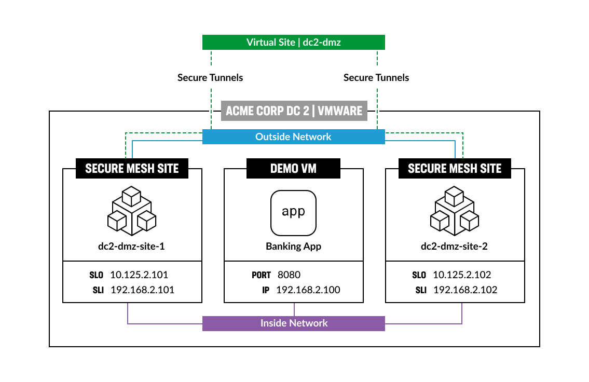

In the F5 Distributed Cloud Console, navigate to the **Shared Configuration** service. From there, select **Virtual Sites** and click the **Add Virtual Site** button.

In the opened form fill in a name specified as label for Secure Mesh Sites of this Data Center. Then make sure to select the **CE** site type. After that add selector expression specifying its name as value and complete by clicking the **Save and Exit** button.


## 4.3 Setup DMZ Configuration

Finally, we will configure HTTP Load Balancer by creating the second origin pool for the second Data Center and configuring it.

To do that go to the F5 Distributed Cloud Console and select **Manage Configuration** in the service menu of the earlier [created HTTP Load Balancer](#22-create-http-load-balancer).

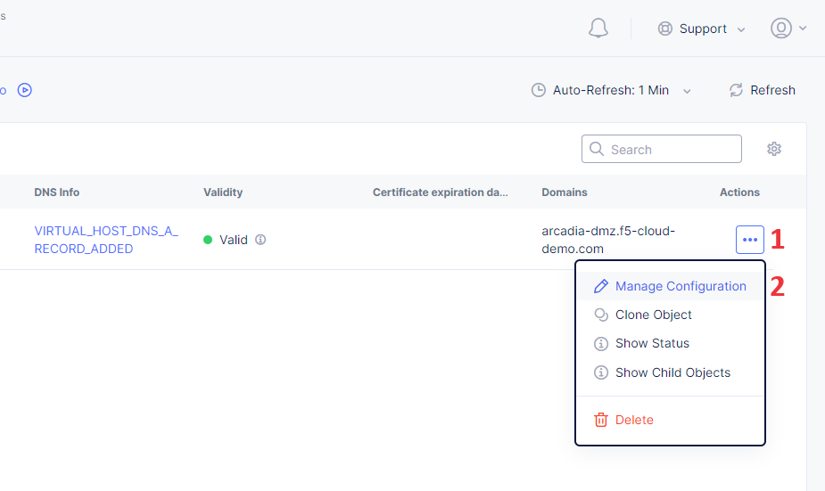

Click the **Edit Configuration** button to enable the editing mode.

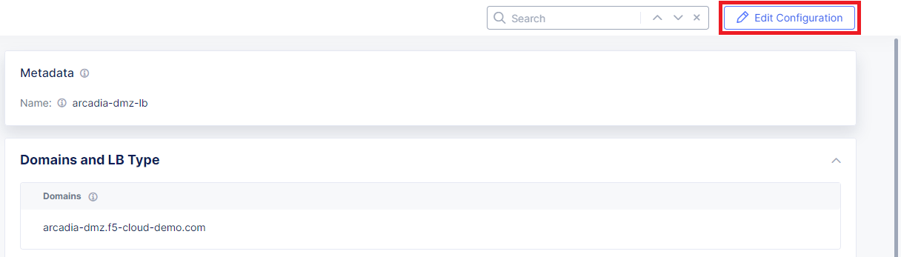

Scroll to the **Origins** section and click the **Add Item** button. This will open origin pool creation form.

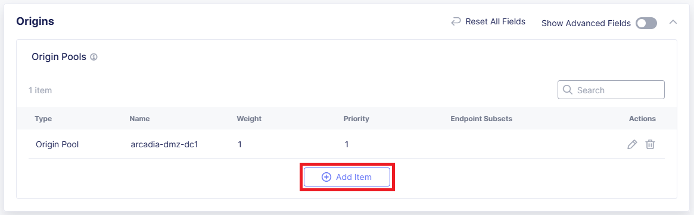

Open the **Origin Pool** drop-down menu and click **Add Item** to add an origin pool.


Give origin pool a name.


Then click **Add Item** to add an origin server.


Select **IP address of Origin Server on given Sites** as Origin Server type and type in the **192.168.2.100** private IP. Then in the drop-down menu select the [Virtual Site](#42-configure-second-virtual-site) we created earlier. Complete the configuration by clicking the **Apply** button.

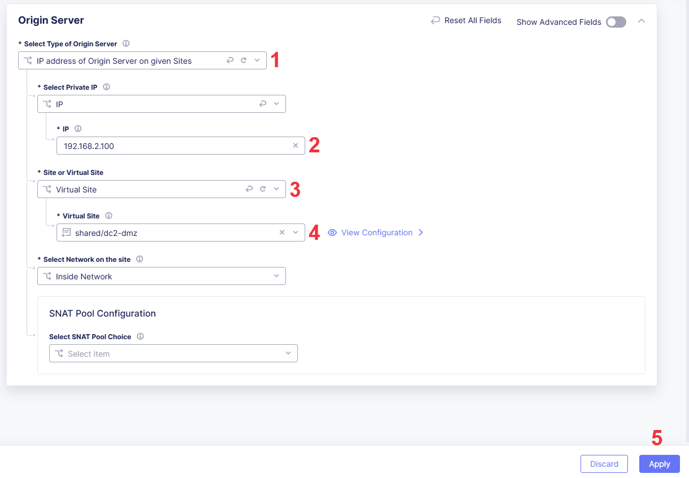

Type in the **8080** origin server port.

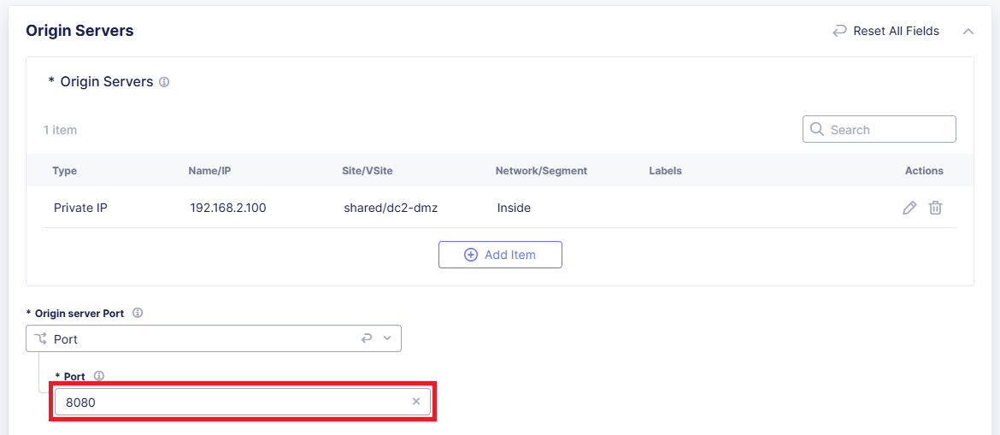

Scroll down and click **Continue**.

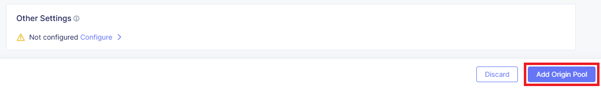

Change the **Priority** of the origin pool to **0**. This will make the second origin pool backup for the first one. **Apply** origin pool configuration.

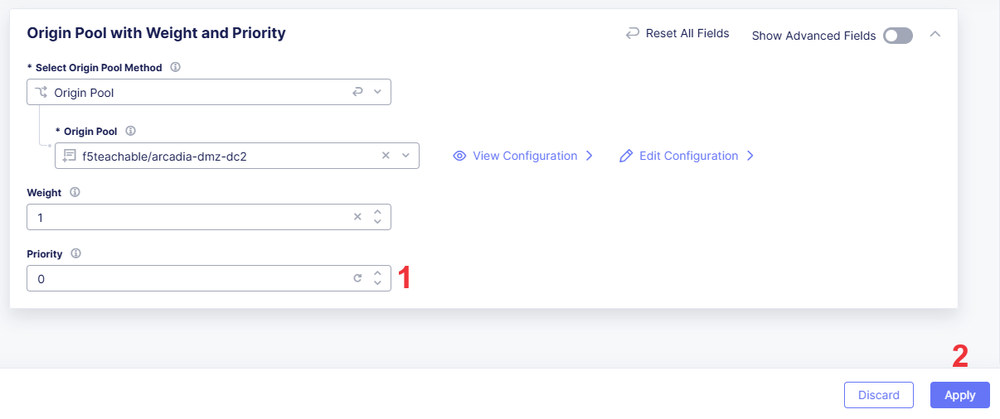

The second configured origin pool will appear on the list.


Now that we have added and configured the second origin pool of the HTTP Load Balancer for the second Data Center, click **Save and Exit** to save it.

Congrats! You've just completed the extended use-cases with two Data Centers exposed to the Internet and protected by Web Application Firewall (WAF), DDoS Protection, Bot Protection, and API Discovery.
