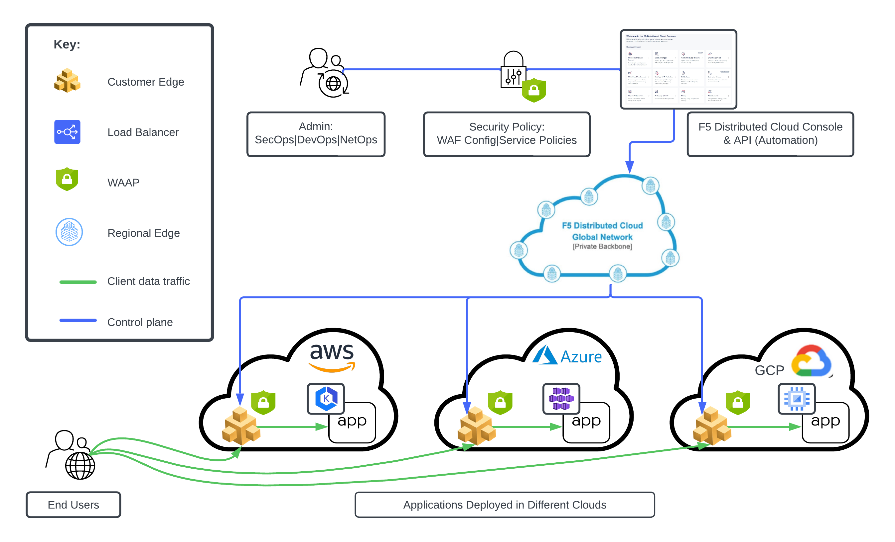

# Distributed Cloud WAAP (Secure Multi-Cloud Networking)

## Overview

This guide provides both the manual and automated steps for configuring Web App & API Protection (WAAP) security for distributed app deployments that use F5 Distributed Cloud (XC) Multi-Cloud Networking (MCN). 

Specifically, it addresses two related app security tasks:

* apply a single WAAP configuration to multiple Load Balancers (LBs) for different apps running in multiple clouds;
* apply a configuration to enable API discovery on an F5 XC load-balanced endpoint.

This is done on different F5 CE (Customer Edge) sites across multiple clouds, demonstrating how a consistent security policy can be easily applied to different applications independent of where they are running, all managed via a single solution: F5 Distributed Cloud.

## Setup Diagram

## Workflow Instructions

### PRE-REQUISITE

The pre-requisite for this guide is a working F5 XC CE configured in one or more public clouds. You can follow the steps in the following guides to configure a CE, deploy a demo app, and set up a Load Balancer -- for each of the public clouds below:

[Deploy F5 XC WAF on XC Customer Edge in *AWS* (SaaS Console, Automation)](https://github.com/f5devcentral/f5-xc-waap-terraform-examples/blob/main/workflow-guides/waf/f5-xc-waf-on-ce/aws/README.rst)

[Deploy F5 XC WAF on XC Customer Edge in *Azure* (SaaS Console, Automation)](https://github.com/f5devcentral/f5-xc-waap-terraform-examples/blob/main/workflow-guides/waf/f5-xc-waf-on-ce/azure/README.rst)

[Deploy F5 XC WAF on XC Customer Edge in *GCP* (SaaS Console, Automation)](https://github.com/f5devcentral/f5-xc-waap-terraform-examples/blob/main/workflow-guides/waf/f5-xc-waf-on-ce/gcp/README.rst)

The end result of this configuration should be one or more working XC CEs, with a simple application that can now be protected with a uniform security policy.

### DEPLOYMENT WORKFLOW

The next step is to apply a single security policy (collection of WAAP-related config) to applications in different clouds by updating the configuration of the Load Balancers within XC configuration.

The following can be performed as manual steps within XC Console or automated via GitHub Actions after a few configuration steps of variables. This can be executed multiple times for each CE if you have different XC CEs.

#### **STEP 1:** Configure or Assign a WAF Object to LB

[Manual: XC Console Workflow](./apply-waf-policy/README-manual.md)

[Automation: API Workflow](./apply-waf-policy/README-automation.md)

#### **STEP 2:** Configure API Discovery on LB

[Manual: XC Console Workflow](./enable-api-discovery/README-manual.md)

[Automation: API Workflow](./enable-api-discovery/README-automation.md)

## Additional Related Resources

[Secure MCN Distributed App Sec Article (DevCentral)](https://community.f5.com/kb/TechnicalArticles/using-distributed-application-security-policies-in-secure-multicloud-networking-/328803)
