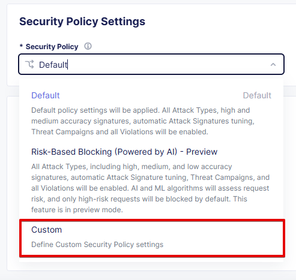
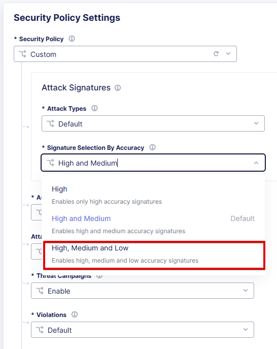
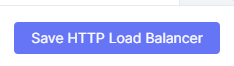

# Apply Custom F5 Distributed Cloud WAF Policy

This manual describes how to apply a custom F5 WAF policy to an F5 Distributed Cloud HTTP Load Balancer using the F5 Distributed Cloud Console.

## Prerequisites

- [F5 Distributed Cloud Account (F5XC)](https://console.ves.volterra.io/signup/usage_plan)
- [HTTP Load Balancer](https://docs.cloud.f5.com/docs/how-to/app-networking/http-load-balancer)

## F5 Distributed Cloud Console Configuration Instructions

### Create WAF Configuration Object

1. Navigate to the Console and sign in:

2. Start creating a new WAF Configuration Object

   - For a configuration available to all namespaces, create the WAF Configuration Object in the `Shared Configuration` service. From the main menu, navigate to `Shared Configuration`.

   

   Then click on `App Firewall` menu item under `Security` service.

   

   - For a configuration available to a specific namespace, navigate to the `Web App & API Protection` section:

   

   Then click on `App Firewall` menu item under `Manage` section. Select the namespace where the WAF Configuration Object should be created.

   

3. Click on `Add App Firewall` to create a new WAF Configuration Object

4. Specify the `Name` and `Description` for the WAF Configuration Object

5. Select `Blocking` enforcement mode

6. In the `Security Policy Settings` section, select the `Custom` security policy

7. Review the configuration, change `Signature Selection By Accuracy` to `High, Medium and Low`

8. Change `Signature-Based Bot Protection` to `Custom` and `Block` Suspicious Bots

9. In the `Advanced configuration` change `Blocking Response Page` to `Custom`, then change `Response Code` to `403`.

10. Click `Add App Firewall` to create the WAF Configuration Object

### Assign WAF Configuration Object to HTTP Load Balancer

1. From the main menu, navigate to `Web App & API Protection` and click on `Load Balancers` -> `HTTP Load Balancers` menu item under `Manage` section

2. Switch to the namespace where the HTTP Load Balancer is located

3. To edit your HTTP Load Balancer, click on the three dots on the right side of the HTTP Load Balancer and select `Manage Configuration`

4. Click `Edit Configuration` to enter the configuration mode

5. In the `Web Application Firewall` section, `Enable` the `Web Application Firewall (WAF)`

6. In the `Enable` dropdown, select the WAF Configuration Object created in the previous section

7. Click `Save HTTP Load Balancer` to apply the WAF Configuration Object to the HTTP Load Balancer

### Test WAF Configuration

1. Execute a simple XSS attack on the web application behind the HTTP Load Balancer. Use `http://your_domain.example.com?param=` to test the WAF configuration. The WAF should block the request and return a `403` response code.

2. Check the WAF logs in the Console to verify the WAF configuration is working as expected. From the main menu, navigate to `Web App & API Protection` and click on `Security` menu item under `Overview` section. Select the namespace where the WAF Configuration Object is located. Scroll down and open your HTTP Load Balancer to view the WAF Dashboard and Logs.

3. Check that the log is present on the WAF Dashboard.

