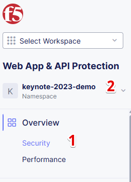

# Enable F5 Distributed Cloud API Security for HTTP Load Balancer

This manual describes how to enable API discovery for an HTTP Load Balancer using the F5 Distributed Cloud Console.

## Prerequisites

- [F5 Distributed Cloud Account (F5XC)](https://console.ves.volterra.io/signup/usage_plan)
- [HTTP Load Balancer](https://docs.cloud.f5.com/docs/how-to/app-networking/http-load-balancer)

## F5 Distributed Cloud Console Configuration Instructions

### Enable API Discovery for HTTP Load Balancer

1. From the main menu, navigate to `Web App & API Protection` and click on `Load Balancers` -> `HTTP Load Balancers` menu item under `Manage` section

2. Switch to the namespace where the HTTP Load Balancer is located

3. To edit your HTTP Load Balancer, click on the three dots on the right side of the HTTP Load Balancer and select `Manage Configuration`

4. Click `Edit Configuration` to enter the configuration mode

5. In the `API Protection` section, `Enable` the `API Discovery`

6. Select `Enable Learning From Redirect Traffic` in the `Learn From Traffic With Redirect Response` section

7. Click `Save HTTP Load Balancer` to apply the configuration to the HTTP Load Balancer

### Review API Discovery Dashboard

1. Start sending traffic to the HTTP Load Balancer. The API discovery feature will start learning the API endpoints and traffic patterns.
2. Check the Discovery in the Console,

   - From the main menu, navigate to `Web App & API Protection`

   

   - Click on `Security` menu item under `Overview` section. Select the namespace where the WAF Configuration Object is located.

   

   - Scroll down and open your HTTP Load Balancer in the `Delivery Resources` section.

   

   - Click on `API Endpoints` to view the API Discovery Dashboard.

   

3. It takes a couple of hours for the API discovery feature to learn the API endpoints and traffic patterns. Once the learning is complete, the API endpoints will be visible in the API Discovery Dashboard.
