Getting Started With Terraform Automation of connecting and securing distributed Generative AI applications with F5 XC AppConnect and XC WAF
#########################################################################################################################################

Prerequisites
--------------

-  `F5 Distributed Cloud Account
   (F5XC) <https://console.ves.volterra.io/signup/usage_plan>`__

   -  `F5XC API
      certificate <https://docs.cloud.f5.com/docs/how-to/user-mgmt/credentials>`__
   -  `User Domain
      delegated <https://docs.cloud.f5.com/docs/how-to/app-networking/domain-delegation>`__

   -  2 Site tokens created as shown below for deploying CE sites in AWS and GCP

   .. image:: /workflow-guides/smcn/genai-appconnect-waf/assets/site-tokens.jpg

-  `AWS Account <https://aws.amazon.com>`__ 
   - Due to the assets being created, free tier will not work.
   - Please make sure resources like VPC and Elastic IP’s are below the threshold limit in that aws region.

-  `GCP Service Account <https://console.cloud.google.com/>`__
   - Please follow `devcentral article <https://community.f5.com/kb/technicalarticles/creating-a-credential-in-f5-distributed-cloud-for-gcp/298290>`__ to generate GCP Service account
   - Make sure Editor, K8s admin roles are enabled to this account as shown below

   .. image:: /workflow-guides/smcn/genai-appconnect-waf/assets/gcp-role.jpg

-  `Terraform Cloud
   Account <https://developer.hashicorp.com/terraform/tutorials/cloud-get-started>`__

-  `GitHub Account <https://github.com>`__

-  `SSH key pair <https://cloud.google.com/compute/docs/connect/create-ssh-keys>`__

Tools
------

-  **Cloud Providers:** AWS and GCP
-  **IAC:** Terraform
-  **IAC State:** Terraform Cloud
-  **CI/CD:** GitHub Actions

Terraform Cloud
----------------

-  **Workspaces:** Create CLI or API workspaces for each asset in the
   workflow.

   +---------------------------------+------------------------------------------------------------------------+
   |         **Workflow**            |  **Assets/Workspaces**                                                 |
   +=================================+========================================================================+
   | F5XC + Gen AI + WAF Apply       | infra, gcp-infra, eks, gke, genai, gcp-genai, ce, gcp-ce, xc           |
   +---------------------------------+------------------------------------------------------------------------+

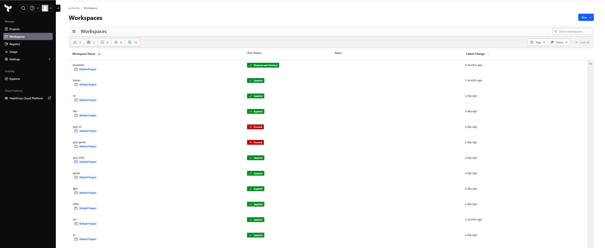

-  **Workspace Sharing:** Under the settings for each Workspace, set the
   **Remote state sharing** to share with all Workspaces created.

-  **Variable Set:** Create a Variable Set with the following values:

   +------------------------------------------+--------------+------------------------------------------------------+
   |         **Name**                         |  **Type**    |      **Description**                                 |
   +==========================================+==============+======================================================+
   | AWS_ACCESS_KEY_ID                        | Environment  | Your AWS Access Key ID                               |
   +------------------------------------------+--------------+------------------------------------------------------+
   | AWS_SECRET_ACCESS_KEY                    | Environment  | Your AWS Secret Access Key                           |
   +------------------------------------------+--------------+------------------------------------------------------+
   | AWS_SESSION_TOKEN                        | Environment  | Your AWS Session Token                               |
   +------------------------------------------+--------------+------------------------------------------------------+
   | GOOGLE_CREDENTIALS                       | Environment  | Your Google Service account credential               |
   +------------------------------------------+--------------+------------------------------------------------------+
   | VES_P12_PASSWORD                         | Environment  | Password set while creating F5XC API certificate     |
   +------------------------------------------+--------------+------------------------------------------------------+
   | VOLT_API_P12_FILE                        | Environment  | Your F5XC API certificate. Set this to **api.p12**   |
   +------------------------------------------+--------------+------------------------------------------------------+
   | ssh_key                                  | TERRAFORM    | Your ssh key for accessing the created resources     |
   +------------------------------------------+--------------+------------------------------------------------------+
   | tf_cloud_organization                    | TERRAFORM    | Your Terraform Cloud Organization name               |
   +------------------------------------------+--------------+------------------------------------------------------+

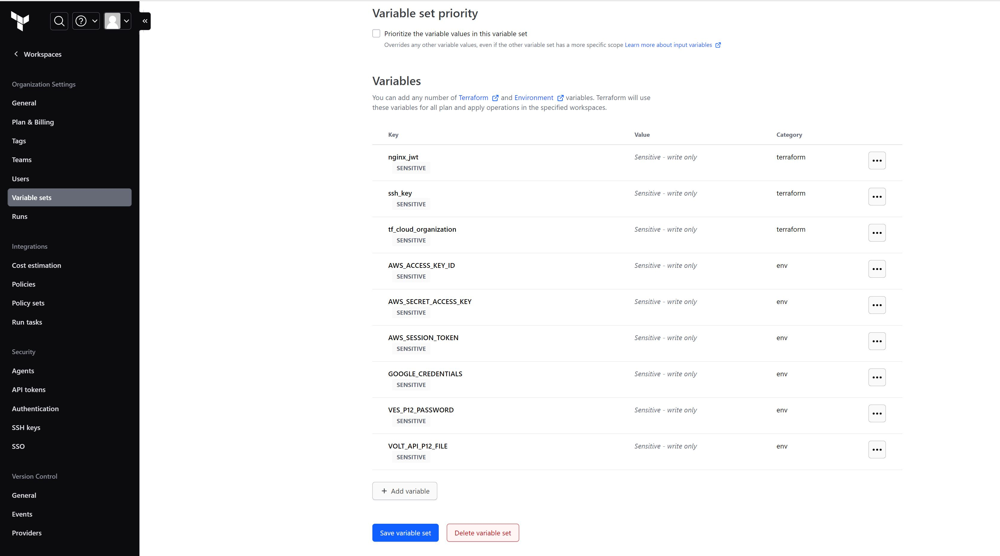

GitHub
-------

-  Fork and Clone Repo. Navigate to ``Actions`` tab and enable it.

-  **Actions Secrets:** Create the following GitHub Actions secrets in
   your forked repo

   -  P12: The linux base64 encoded F5XC P12 certificate
   -  TF_API_TOKEN: Your Terraform Cloud API token
   -  TF_CLOUD_ORGANIZATION: Your Terraform Cloud Organization name
   -  TF_CE_LATITUDE: Your CE latitude location
   -  TF_CE_LONGITUDE: Your CE longitude location
   -  TF_CE_TOKEN: CE token ID generated in Distributed Cloud
   -  TF_CE_TOKEN2: 2ND CE token ID generated in Distributed Cloud
   -  TF_VAR_SITE_NAME: CE site name to be registered in EKS
   -  TF_VAR_GKE_SITE_NAME: CE site name to be registered in GKE
   -  TF_CLOUD_WORKSPACE\_\ *<Workspace Name>*: Create for each
      workspace in your workflow per each job

-  Check below image for details on GitHub Action Secrets:

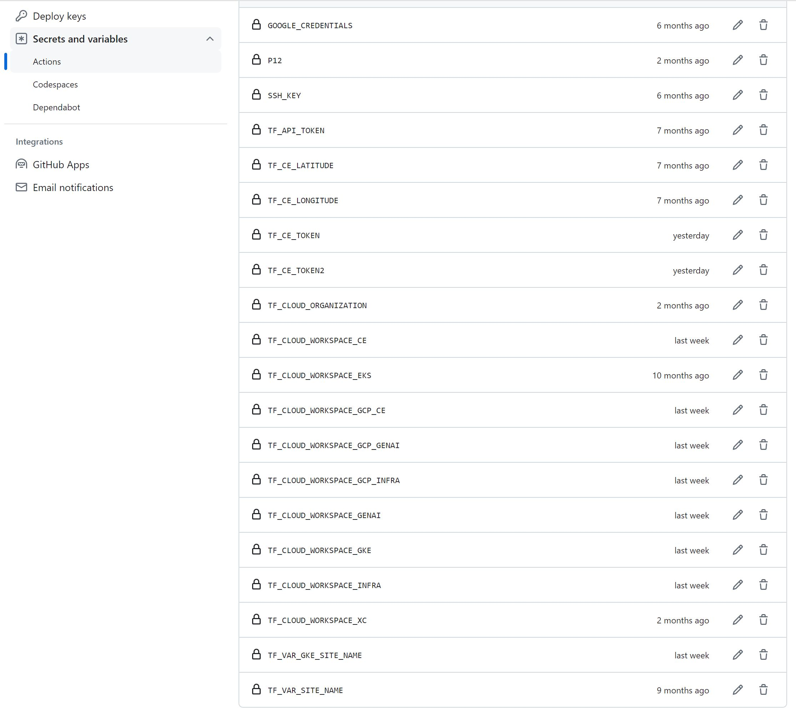

Workflow Runs
--------------

**STEP 1:** Check out a branch with the branch name as suggested below for the workflow you wish to run using
the following naming convention.

**DEPLOY**

============================= =======================
Workflow                      Branch Name
============================= =======================
F5XC + Gen AI + WAF Apply     deploy-genai
============================= =======================

Workflow File: `genai-apply.yml </.github/workflows/genai-apply.yaml>`__

**DESTROY**

=============================== ========================
Workflow                        Branch Name
=============================== ========================
F5XC + Gen AI + WAF Destroy     destroy-genai
=============================== ========================

Workflow File: `genai-destroy.yml </.github/workflows/genai-destroy.yaml>`__

**STEP 2:** Rename ``aws/aws-infra/terraform.tfvars.examples`` to ``aws/aws-infra/terraform.tfvars`` and add the following data:

-  Set project_prefix = “Your project identifier name in **lower case** letters only - this will be applied as a prefix to all assets”

-  Set resource_owner = "Set reource owner name"

-  Set aws_region = "AWS Region" ex. "ap-south-1"

-  Set azs = "Set availability zones" ex. ["ap-south-1a", "ap-south-1b"]

-  Also update assets boolean value as per your workflow (for this use-case set all remaining values as false as shown below)

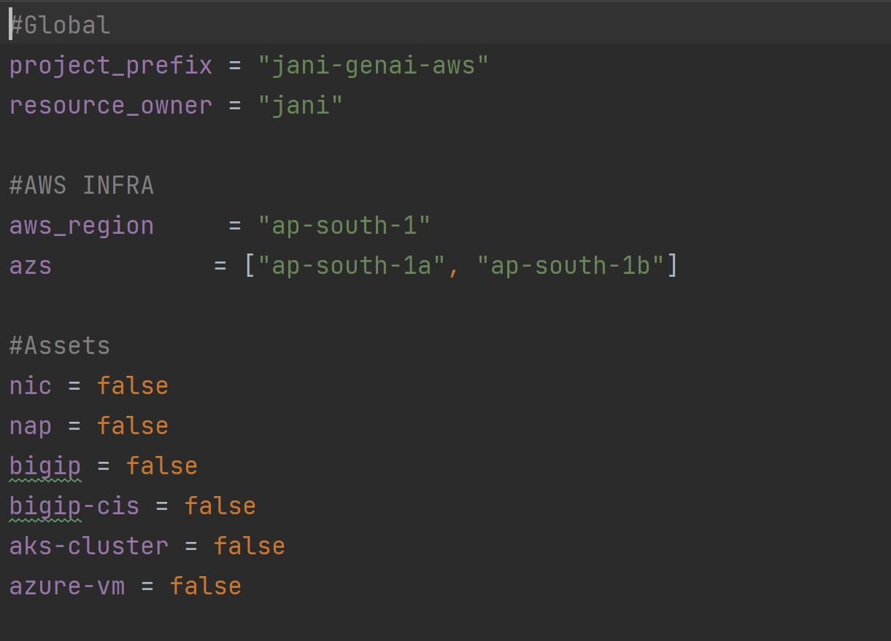

**STEP 3:** Rename ``gcp/gcp-infra/terraform.tfvars.examples`` to ``gcp/gcp-infra/terraform.tfvars`` and add the following data:

-  Set project_prefix = “Your project identifier name in **lower case** letters only - this will be applied as a prefix to all assets”

-  Set project_id = "Your project's unique identifier"

-  Set region = "GCP Region" ex. "us-central1"

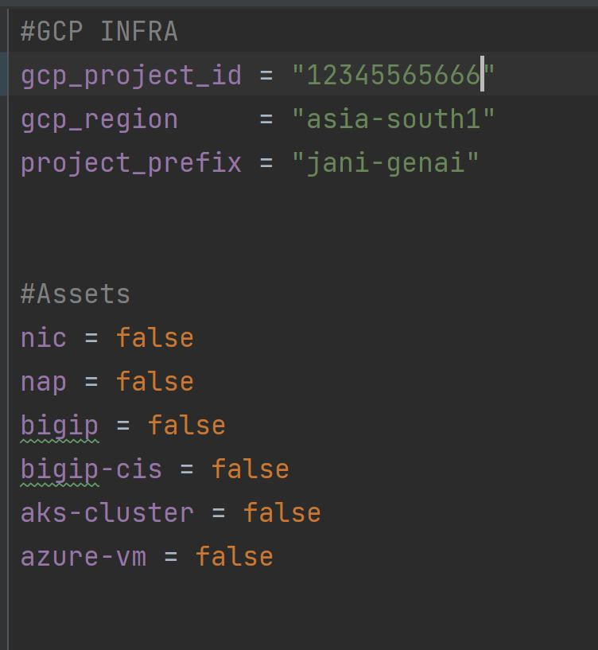

**Step 4:** Rename ``xc/terraform.tfvars.examples`` to ``xc/terraform.tfvars`` and add the following data:

-  api_url = “Your F5XC tenant”

-  xc_tenant = “Your tenant id available in F5 XC ``Administration`` section ``Tenant Overview`` menu”

-  xc_namespace = “The existing XC namespace where you want to deploy resources”

-  app_domain = “the FQDN of your app (for this use case set it to "llama.llm")”

-  xc_waf_blocking = “Set to true to configure waf in blocking mode”

-  k8s_pool = "set to true if application is residing in k8s environment"

-  serviceName = "k8s service name" (for this use case set it to "llama.llm")

-  serviceport = "k8s service port of frontend microservice" (for this use case set it to "8000")

-  advertise_sites = "set to false if want to advertise on public (for this use case set it to true)"

-  http_only = "set to true if want to deploy a http loadbalancer, for https lb set it to false (for this use case set it to true)"

-  xc_data_guard = "Data guard feature for masking sensitive fields (for this use case set it to true"

-  aws  = "workspace name of AWS Infra (for this use-case set it to aws-infra)"

-  hybrid_genai = "Set it to true for this use-case"

Keep rest of the values as they are set by default in terraform.tfvars.examples file as shown below

**STEP 5:** Commit and push your build branch to your forked repo

- Build will run and can be monitored in the GitHub Actions tab and TF Cloud console

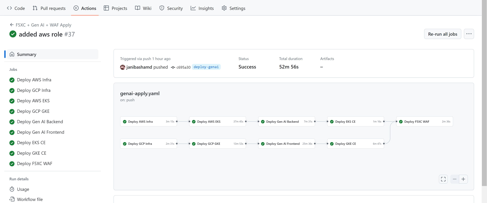

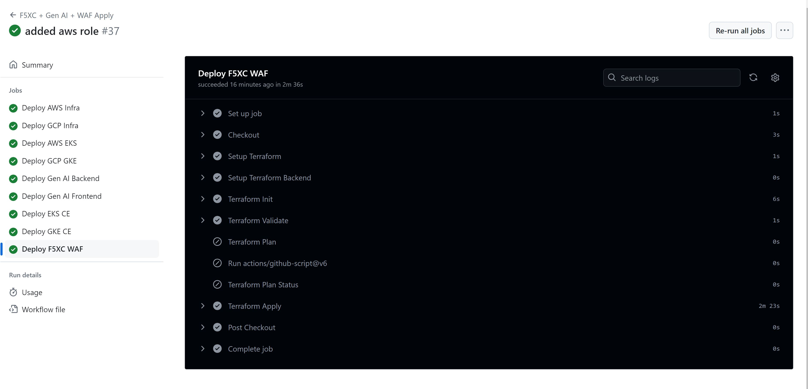

**STEP 6:** Once the pipeline completes, verify your CE sites, WAF, Origin Pool and LB were deployed or destroyed based on your workflow. (**Note:** CE sites will take some time to come online)

.. image:: assets/sites-online.JPG

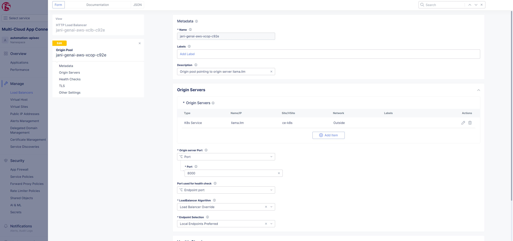

.. image:: assets/load-balancers.JPG

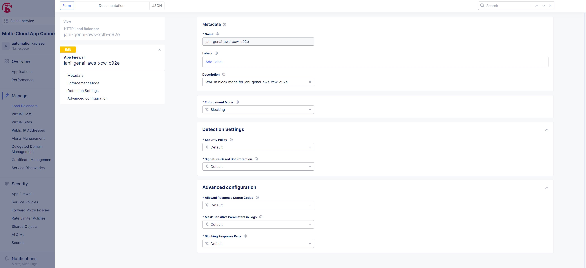

**STEP 7:** Once all resources are created successfully, wait for few mins and to validate the test infra, login to GCP console and navigate to load balancers menu. Copy the public IP of LB and access it in a browser using port 80 as shown below

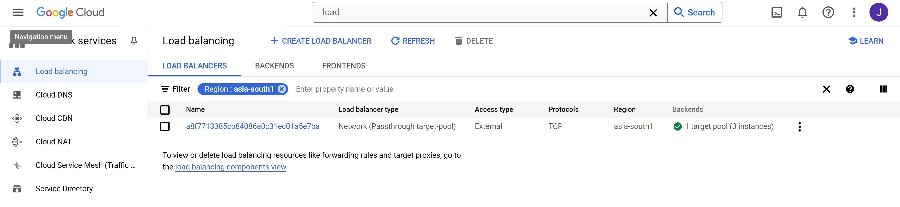

.. image:: assets/cloud-nlb-ip.JPG

.. image:: assets/lb-access.JPG

**STEP 8:** To validate logs, login to F5 XC console and navigate to distributed apps section. Select your load balancer and make sure requested are logged as shown below

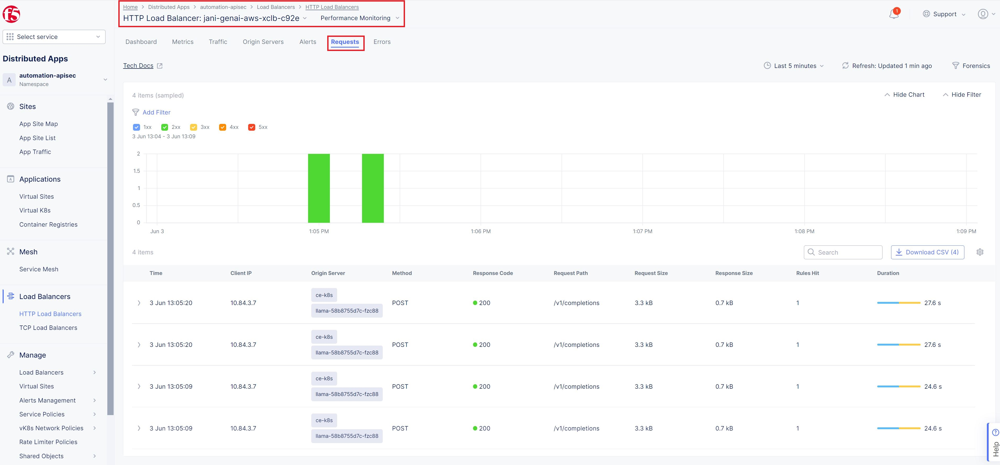

.. image:: assets/request-logs.JPG

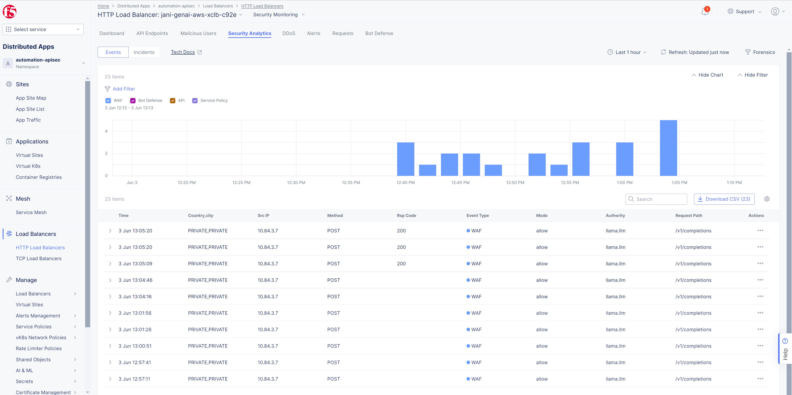

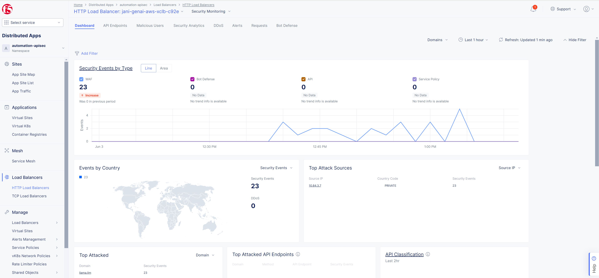

**Note:** If you want to destroy the entire setup, checkout a branch with name ``destroy-genai`` using source as ``deploy-genai`` which will trigger destroy workflow.
Even though some jobs have failed you can ignore it as all created resources will be deleted as part of k8s clusters deletion.

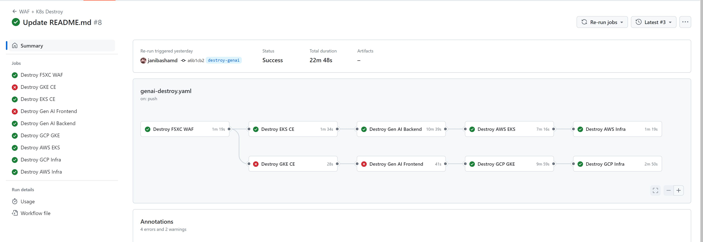

