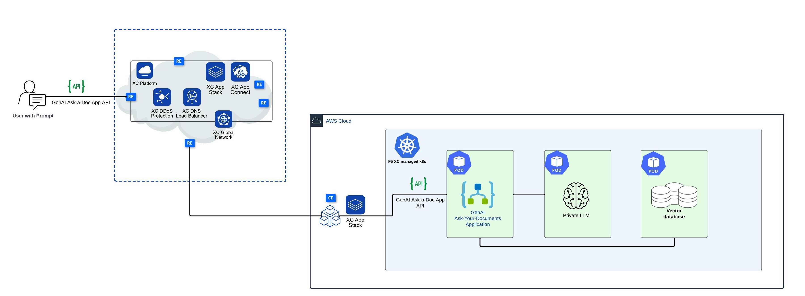

Deploying and securing Generative AI applications at the Edge with F5 XC AppStack and XC WAF
============================================================================================

Overview
#########

This demo guide provides step-by-step walkthrough for deploying GenAI applications at the Edge (customer on-prem, public or private cloud) and securing them with XC WAF, using XC console along with terraform scripts to automate the deployment. For more information on different WAAP deployment modes, refer to the devcentral article: `
Deploy WAF on any Edge with F5 Distributed Cloud <https://community.f5.com/t5/technical-articles/deploy-waf-anywhere-with-f5-distributed-cloud/ta-p/313079>`__.

**Note:** Even though the scenario here focuses on XC WAF, customers can enable any security services in the same setup, such as API Security, Bot Defense, DoS/DDOS and Fraud, as per their needs.

Setup Diagram
#############

Workflow Instructions
######################

`F5 Distributed Cloud Console Workflow <./xc-console-demo-guide.rst>`__

`F5 Distributed Cloud Automation Workflow <./automation-demo-guide.rst>`__

Additional Related Resources
############################
