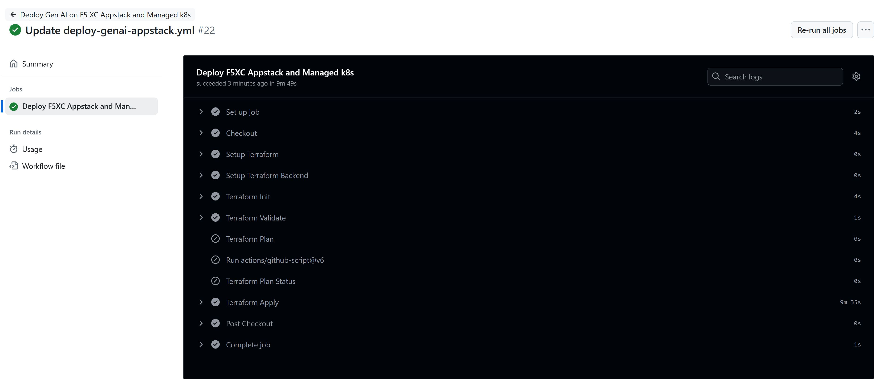
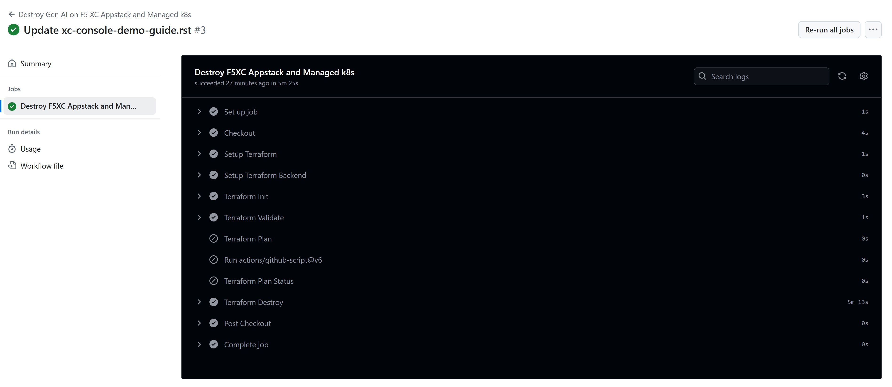

Steps to deploy/protect/destroy Generative AI applications at the Edge with F5 XC AppStack mk8s and XC WAFs setup using automation:
===================================================================================================================================

Prerequisites
#############

-  `F5 Distributed Cloud (F5 XC) Account <https://console.ves.volterra.io/signup/usage_plan>`__
-   Above account should have access to ``system`` namespace
-  `AWS Account <https://azure.microsoft.com/en-in/get-started/azure-portal/>`__ 
-  `Terraform Cloud Account <https://developer.hashicorp.com/terraform/tutorials/cloud-get-started>`__
-  `GitHub Account <https://github.com>`__

List of Created Assets
#######################

-  **xc:** F5 Distributed Cloud WAF
-  **infra:** AWS Infrastructure
-  **LangServe GenAI App:** LangServe GenAI Application

Tools
#####

-  **Cloud Provider:** AWS
-  **IAC:** Terraform
-  **IAC State:** Terraform Cloud
-  **CI/CD:** GitHub Actions

Terraform Cloud
###############

-  **Workspaces:** Create below CLI or API workspace in the terraform cloud.

   +---------------------------+-------------------------------------------+
   |         **Workflow**      |  **Assets/Workspaces**                    |
   +===========================+===========================================+
   |  deploy-genai-appstack    |         appstack                          |
   +---------------------------+-------------------------------------------+

-  **Variable Set:** Create a Variable Set with the following values:

   +------------------------------------------+--------------+------------------------------------------------------+
   |         **Name**                         |  **Type**    |      **Description**                                 |
   +==========================================+==============+======================================================+
   | VES_P12_PASSWORD                         | Environment  |  Password set while creating F5XC API certificate    |
   +------------------------------------------+--------------+------------------------------------------------------+
   | VOLT_API_P12_FILE                        | Environment  |  Your F5XC API certificate. Set this to **api.p12**  |
   +------------------------------------------+--------------+------------------------------------------------------+
   | ssh_key                                  | TERRAFORM    |  Your ssh key for accessing the created resources    | 
   +------------------------------------------+--------------+------------------------------------------------------+
   | tf_cloud_organization                    | TERRAFORM    |  Your Terraform Cloud Organization name              |
   +------------------------------------------+--------------+------------------------------------------------------+

GitHub
######

-  Fork and Clone Repo. Navigate to ``Actions`` tab and enable it.

-  **Actions Secrets:** Create the following GitHub Actions secrets in
   your forked repo

   -  P12: The linux base64 encoded F5XC P12 certificate
   -  TF_API_TOKEN: Your Terraform Cloud API token
   -  TF_CLOUD_ORGANIZATION: Your Terraform Cloud Organization name
   -  TF_CLOUD_WORKSPACE_APPSTACK should be created with the value ``appstack``

Workflow Runs
#############

**STEP 1:** Check out a branch with the branch name as suggested below for the workflow you wish to run using
the following naming convention.

**DEPLOY**

=============================================== =======================
Workflow                                           Branch Name
=============================================== =======================
Deploy Gen AI on F5 XC Appstack and Managed k8s  deploy-genai-appstack
=============================================== =======================

Workflow File: `deploy-genai-appstack.yml </.github/workflows/deploy-genai-appstack.yml>`__

**DESTROY**

================================================ =======================
Workflow                                           Branch Name
================================================ =======================
Destroy Gen AI on F5 XC Appstack and Managed k8s  destroy-genai-appstack
================================================ =======================

Workflow File: `destroy-genai-appstack.yml </.github/workflows/destroy-genai-appstack.yaml>`__

**STEP 2:** Rename ``/workflow-guides/smcn/genai-inference-at-the-edge/terraform/terraform.tfvars.examples`` to ``terraform.tfvars`` and add the following data:

-  project_prefix = “Your project identifier name in **lower case** letters only - this will be applied as a prefix to all assets”

-  api_url = “Your F5XC tenant” 

-  xc_tenant = “Your tenant id available in F5 XC ``Administration`` section ``Tenant Overview`` menu” 

-  xc_namespace = “The existing XC namespace where you want to deploy resources” 

-  app_domain = “the FQDN of your app (cert will be autogenerated)” 

-  servicename = "set to k8s backend service of your aplication. For demo you can set to ``langchain-doc-qa-api.llm``."

- serviceport = "set to your app port number. For existing demo use 8501"

- Also add aws access key and secret key in your env vars (recommended) or in this tfvars (not recommended)

Check the rest of the values in variables.tf and you can update if need any changes.

**STEP 4:** Commit and push your build branch to your forked repo 

- Build will run and can be monitored in the GitHub Actions tab and TF Cloud console

**STEP 5:** Once the pipeline completes, verify your CE, Origin Pool and LB were deployed or destroyed based on your workflow. (**Note:** CE sites will take 15-20 mins to come online)

**STEP 6:** To validate the test infra, follow below steps
       a. Navigate to ``Select the Distributed Apps`` Service, next select ``system`` workspace and in overview section download global kubeconfig file
       b. You can use this config file to connect to managed k8s and deploy your application using your app related yaml files

        .. image:: assets/app-deploy.JPG

       c. Once deployed make sure all pods/service are running and online (Please note GenAI app deployment will take around 20 mins and k8s service discovery takes around 10-15 mins)

        .. image:: assets/pods-online.JPG

       d. Open the load balancer domain in a browser and validate your AI application works as expected (Please check manual guide for this app verification)

        .. image:: assets/postman.JPG

**Note:** If you want to destroy the entire setup, checkout a branch with name ``destroy-genai-appstack`` and push the repo code to it which will trigger destroy workflow and will remove all created resources.

