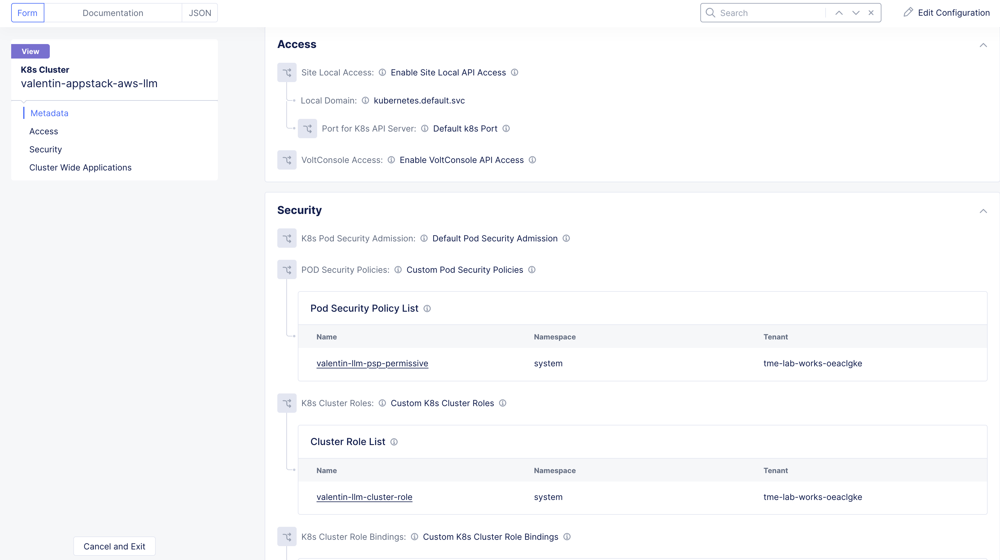
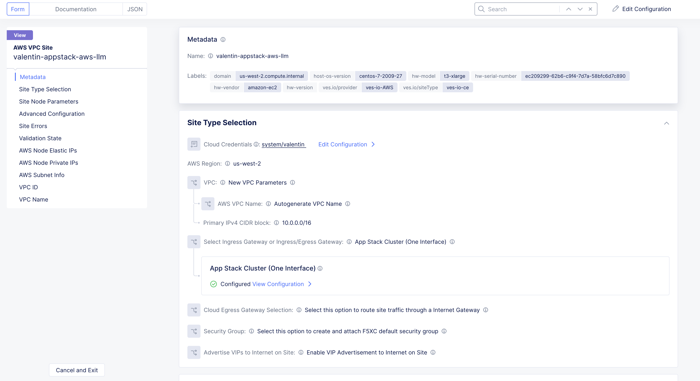
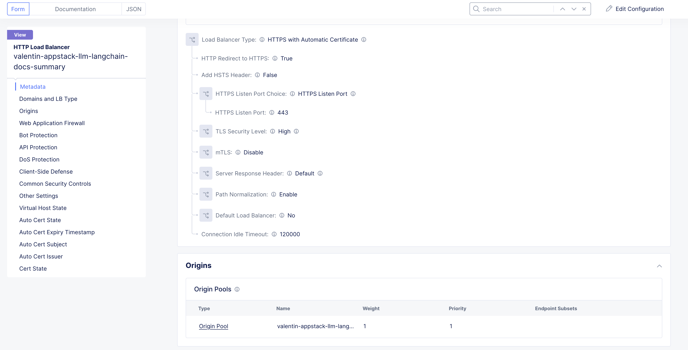

Manual step by step process to deploy and secure Generative AI applications at the Edge with F5 XC AppStack mk8s and XC WAF
============================================================================================================================

Prerequisites
**************
- F5 Distributed Cloud Console SaaS account
- Access to Amazon Web Service (AWS) Management console & Command Line
- Install Kubectl command line tool to connect and push the app manifest file to mk8s cluster
- Install Postman for verifying the deployment

Create AWS credentials in XC by following the steps mentioned in this `Devcentral article <https://community.f5.com/kb/technicalarticles/creating-a-credential-in-f5-distributed-cloud-to-use-with-aws/298111>`_ 

Deployment Steps
*****************
To deploy an AppStack mk8s cluster on an AWS CE Site, steps are categorized as mentioned below.

1. Create mk8s cluster
2. Create AWS VPC Site and attach the mk8s cluster
3. Deploy the App to mk8s cluster
4. Configure Origin Pool and HTTPS LB 

Below we shall take a look into detailed steps as mentioned above.

1.   Creating mk8s cluster from F5 XC Console:
      **Step 1.1**: Login to F5 XC Console
            a. From the F5 XC Home page, ``Select the Distributed Apps`` Service
            b. Select Manage > Manage K8s > K8s clusters in the configuration menu. Click on Add K8s cluster.

Fig : mk8s cluster

2.   Creating AWS VPC Site object from F5 XC Console:
      **Step 1.1**: Login to F5 XC Console
            a. From the F5 XC Home page, ``Select the Multi-Cloud Network Connect`` Service
            b. Select Manage > Site Management > AWS VPC Sites in the configuration menu. Click on Add AWS VPC Site.
            c. Enter a name of your VPC site in the metadata section.
      **Step 1.2**: Configure site type selection
            a. Select a region in the AWS Region drop-down field. 
            b. Create New VPC by selecting New VPC Parameters from the VPC drop-down. Enter the CIDR in the ``Primay IPv4 CIDR blocks`` field. 
            c. Select Ingress Gateway (One Interface) for the ``Select Ingress Gateway or Ingress/Egress Gateway`` field.
      **Step 1.3**: Configure ingress/egress gateway nodes
            a. Click on configure  to open the One-interface node configuration wizard.
            b. Click on Add Item button in the Ingress Gateway (One Interface) Nodes in AZ.
                 a. Select an option for the AWS AZ Name from the given suggestions that matches the configured AWS regsion.
                 b. Select New subnet from the Subnet for the local interface drop-down and enter the subnet address in the IPv4 Subnet text field.
      **Step 1.4**: Complete AWS VPC site object creation
            a. Select the AWS credentials object from the Cloud Credentials drop-down.
            b. Enter public key for remote SSH to the VPC site.
            c. Click on Save and Exit at the bottom right to complete creating the AWS VPC object.
      **Step 1.5**: Deploy AWS VPC site
            a. Click on the Apply button for the created AWS VPC site object.
            b. After a few minutes, the Site Admin State shows online and Status shows as Applied.

Fig : AWS VPC Site

3.     Deploy the App to mk8s cluster
4.     Configuring Origin Pool and HTTPS LB in F5 XC Console
        **Step 4.1**: Creating Origin Pool
               In this process, we configure Origin pool with server as AWS VPC site and Advertise in HTTP Load Balancer.

               a. Log into F5 XC Console and Click on Multi-Cloud App Connect.
               b. Click Manage > Load Balancers > Origin Pools and Click ``Add Origin Pool``.
               c. In the name field, enter a name. Click on Add Item button in Origin Servers section.
               d. From the ``Select type of Origin Server`` menu, select ``IP address of Origin Server on given Sites`` to specify the node with its private IP address.
               e. Select ``Site`` from the ``Site or Virtual Site`` drop-down and select the AWS VPC site created in step 1.
               f. Select ``Outside Network`` for ``Select Network on the Site`` drop-down. Click on Apply.
               g. In ``Origin server Port`` enter the port number of the frontend service from step 3.1
               h. Click on Save and Exit.

          .. figure:: assets/origin-pool.png
          Fig : Origin Pool

        **Step 4.2**: Creating HTTPS Load Balancer with VIP advertisement
               a. Log into F5 XC Console and Click on Multi-Cloud App Connect.
               b. Click Manage > Load Balancers > HTTP Load Balancers and Click ``Add HTTP Load Balancer``.
               c. In the name field, enter the name of the LB, In the Domains field, enter a domain name.
               d. From the Load Balancer Type drop-down menu, Select HTTPS to create HTTPS load balancer.
               e. From the Origins sections, Click on Add Item to add the origin pool created in step 4.1 under ``Select Origin Pool Method`` drop-down menu. Click on Apply.
               f. Navigate to Other Setting section, From the VIP Advertisement  drop-down menu, Select Custom. Click  Configure in the Advertise Custom field to perform the configurations and click on Add Item.
               g. From ``Select Where to Advertise`` menu, select Site. From the ``Site Network`` menu, select Outside Network from the drop-down.
               h. From the Site Referrence menu, Select the AWS VPC site created in step 1. Click on Apply.
               i. Click on Apply and ``Save and Exit``.

Fig : HTTPS LB

Deployment Verification
************************
To verify the deployment we shall follow the below steps to make sure users can able to access the application deployed,

1. Open the Postman
2. Enter the domain name of the HTTPS Load Balancer in the URL field.
3. Update the Host header as the domain name of the Load Balancer from the F5 XC Console.
4. Generate a GET request and monitor the request logs from F5 XC Console.
5. Create WAF Firewall and assign it to LB to verify blocking of WAF attacks.

.. figure:: Assets/testing.jpg
Fig: Accessing CE site deployed in AWS

.. figure:: Assets/req_logs.jpg
Fig: Accessing log requests from F5 XC Console

Applying the **WAF Firewall** to the Load Balancer and generating Cross Site Scripting attack to CE deployed on AWS to block the attack request

.. figure:: Assets/attack-block.jpg
Fig: Attack request getting rejected and generated support ID

.. figure:: Assets/waf-xc-logs.jpg
Fig: Observed WAF event logs from F5 XC Console

Conclusion
#########
With the deployment of F5 XC's Customer Edge on AWS Public Cloud Platform provides protection to the application from WAF attacks as well as Telemetry of request logs.

