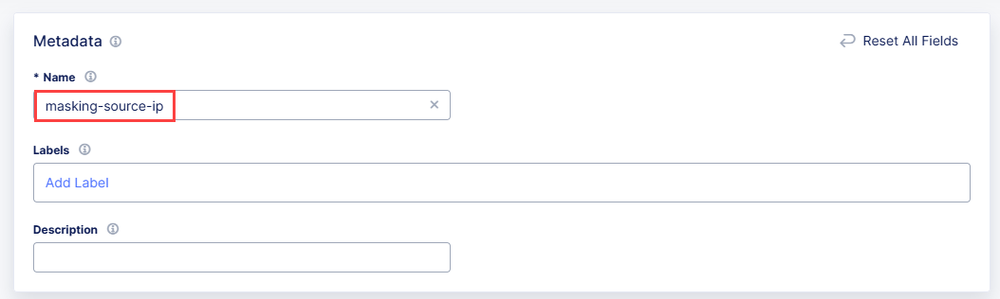
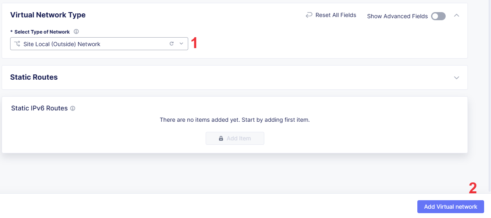

# Addressing IP overlaps & optimizing Application Delivery with F5 Enterprise Networking

# Table of Contents

- [Addressing IP overlaps \& optimizing Application Delivery with F5 Enterprise Networking](#addressing-ip-overlaps--optimizing-application-delivery-with-f5-enterprise-networking)
- [Table of Contents](#table-of-contents)
  - [Prerequisites](#prerequisites)
  - [Solution 1: Resolving Overlapping IPs](#solution-1-resolving-overlapping-ips)
  - [Solution 2: Masking the Source IP Address](#solution-2-masking-the-source-ip-address)
  - [Solution 3: SNAT for Internet Access](#solution-3-snat-for-internet-access)
  - [Conclusion](#conclusion)

The guide provides three solutions to solve networking challenges that are connected via F5 Multi-Cloud Network (MCN) using **F5 Hybrid Multicloud Application Delivery** and **Secure Multicloud Networking** solutions. The first solution demonstrates how to use Virtual Subnets to solve the IP overlapping issue (1). The second solution demonstrates how to mask the source IP address (2) of the traffic that is sent from an AWS to VMware. The third solution demonstrates how to configure SNAT for internet access (3). The traffic will be sent from an AWS using an Elastic IP address assigned to the AWS TGW site. The source IP address of the traffic will be translated to the Elastic IP address before it is sent to the internet.


## Prerequisites

This guide assumes that you have already completed the [Secure Network Fabric (SMCN) Workflow Guide](https://github.com/f5devcentral/f5-xc-terraform-examples/tree/main/workflow-guides/smcn/secure-network-fabric)

To complete this guide, you will need the following:

- [F5 Distributed Cloud Account](https://cloud.f5.com/)
- [AWS Cloud Account](https://aws.amazon.com/)
- [Deployed AWS TGW Site, 3 VPCs with subnets and a test VM in each VPC](https://github.com/f5devcentral/f5-xc-terraform-examples/tree/main/workflow-guides/smcn/secure-network-fabric#1-configure-environment)
- [VMware environment with a test VM](https://github.com/f5devcentral/f5-xc-terraform-examples/tree/main/workflow-guides/smcn/secure-network-fabric#15-secure-mesh-site)
- [Connect VPCs to the AWS TGW Site with Cloud Connect](https://github.com/f5devcentral/f5-xc-terraform-examples/tree/main/workflow-guides/smcn/secure-network-fabric#2-cloud-connect)
- [3 Network Segments: prod-segment, dev-segment, shared-segment](https://github.com/f5devcentral/f5-xc-terraform-examples/tree/main/workflow-guides/smcn/secure-network-fabric#3-segment-connector)
- [Connect VMware Data Center](https://github.com/f5devcentral/f5-xc-terraform-examples/tree/main/workflow-guides/smcn/secure-network-fabric#4-connect-vmware-data-center)

The following table shows the network configuration for the AWS and VMware environments. The IP addresses are used for demonstration purposes only and may not be used in your environment.

AWS Network Configuration:

| VPC Name   | CIDR        | Subnet       | VM IP Address | Segment Name   |
| ---------- | ----------- | ------------ | ------------- | -------------- |
| vpc-prod   | 10.1.0.0/16 | 10.1.10.0/24 | 10.1.10.100   | prod-segment   |
| vpc-dev    | 10.2.0.0/16 | 10.2.10.0/24 | 10.2.10.100   | dev-segment    |
| vpc-shared | 10.1.0.0/16 | 10.1.10.0/24 | 10.1.10.100   | shared-segment |

VMware Network Configuration:

| Subnet CIDR   | VM IP        | Segment      | Vlan (optional) |
| ------------- | ------------ | ------------ | --------------- |
| 10.5.200.0/24 | 10.5.200.100 | prod-segment | vlan200         |

## Solution 1: Resolving Overlapping IPs

This solution demonstrates how to solve the IP overlapping issue between two networks that are connected via F5 Multi-Cloud Network (MCN). Typically, the IP overlapping issue occurs when two networks have the same IP address range. This can occur when two CE Sites have the same CIDR's behind them or within a single CE Site where multiple overlapping CIDRs could be. In the case below, we have two network segments, `prod-segment` and `shared-segment`, that are connected via Cloud Connect to the same AWS TGW Site. Both segments have the same IP address range, `10.1.0.0/16`. To solve this issue, we will use the Virtual Subnets (Static NAT) whereby each of those VPCs with the overlapping CIDRs will be mapped to a Virtual Subnet.

When this happens we need to define the native VPC i.e. the VPC that we would still want to communicate with its real address (10.1.0.0/16) and the other VPC will always need to be masked. The reason is that when a packet is destined to 10.1.0.0/16 we need to know where it needs to be forwarded.

VPC-PROD will be configured to be the native network i.e. it will only be translated when it talks to VPC-SHARED. All other communications from VPC-PROD continue to use the native or real address. VPC-SHARED on the other hand will always be masked.


Virtual Subnet for `vpc-prod`: 100.100.0.0/16

Virtual Subnet for `vpc-shared`: 100.101.0.0/16

First, we need to create a NAT Policy with two rules. One rule will be for the `vpc-prod` and the another one for the `vpc-shared`. The rule for the `vpc-prod` will have the source IP address. Log into F5 Distributed Cloud Console and select `Multi-Cloud Network Connect` service. Navigate to `Networking` and select `NAT Policies`. Click `Add NAT Policy`.


Give NAT policy a name.


Next, assign NAT policy to the site by opening the drop-down menu and selecting one.


Finally, move on to creating the rule. Click `Configure` under the `Rule` section.


Click `Add Item` to add the first rule.


First, we will add a rule for the production VPC. In the opened form give rule a name.


Select the site as `Cloud Connect`.


Specify the source `10.1.0.0/16` and destination `100.101.0.0/16` IPs, where `Source` is the source IP address of the traffic that will be NATed, and `Destination` is the destination IP address of the traffic that will be NATed.


Next, scroll down to configure `Action` to `Virtual Subnet NAT` with `100.100.0.0/16`. Apply the configuration.


Now we will create the second rule - for the shared vpc. Click the `Add Item` button.


Give rule a name.


Select the site as `Cloud Connect`.


Specify the source `10.1.0.0/16` IP.


Next, scroll down to configure `Action` to `Virtual Subnet NAT` with `100.101.0.0/16`. Apply the configuration.


You will see two rules created. Click `Apply` to save the rules. After that, click `Save` to save the NAT policy.


To test the NAT rule, SSH into the VM in the `vpc-prod` and try to ping the VM in the `vpc-shared`.

On the first VM (vpc-prod), ping the second VM (vpc-shared) using the translated IP address:

```bash
ping 100.101.10.100

PING 100.101.10.100 (100.101.10.100) 56(84) bytes of data.
64 bytes from 100.101.10.100: icmp_seq=1 ttl=64 time=115 ms
64 bytes from 100.101.10.100: icmp_seq=2 ttl=64 time=116 ms
64 bytes from 100.101.10.100: icmp_seq=3 ttl=64 time=116 ms
64 bytes from 100.101.10.100: icmp_seq=4 ttl=64 time=115 ms
```

In the output, you will see that the ping is successful and VM can communicate with the VM in the `vpc-shared` using the translated IP address.

## Solution 2: Masking the Source IP Address

This solution demonstrates how to mask the source IP address of the traffic that is sent from an AWS to VMware connected via F5 Multi-Cloud Network (MCN) and joined into a single network using a `prod-segment`. The source IP address (AWS) of the traffic will be translated to `192.168.100.xxx` before it is sent to the destination (VMware).


This is a simple example of how to create a NAT rule using the F5 Multi-Cloud NAT (MCN) API.

We start by creating a NAT Policy. Log into F5 Distributed Cloud Console and select `Multi-Cloud Network Connect` service. Navigate to `Networking` and select `NAT Policies`. Click `Add NAT Policy`.


Give NAT policy a name.



Next, assign NAT policy to the site by opening the drop-down menu and selecting one.


Click `Configure` under the `Rule` section to start creating a rule.


Click `Add Item` to add a new rule.


Give rule a name.


Choose `Segment` as the Scope and `system/prod-segment` as the Segment.


Specify the source `10.1.10.0/24` and destination `10.5.200.0/24` IPs, where `Source` is the source IP address of the traffic that will be NATed, and `Destination` is the destination IP address of the traffic that will be NATed.


Next, make sure `Source NAT` is specified for `NAT` with `SNAT Pool` selected. Add `192.168.100.0/24` as the address range. Click `Apply` to save the rule. After that, click `Add Nat policy` to save the NAT policy.


To test the NAT rule, SSH into the VM in the AWS TGW site and try to ping the VMware VM IP address. The source IP address should be translated to `192.168.100.xxx`.

On the first VM (AWS), ping the second VM (VMware):

```bash
ping 10.5.200.100

PING 10.5.200.100 (10.5.200.100) 56(84) bytes of data.
64 bytes from 10.5.200.100: icmp_seq=1 ttl=64 time=118 ms
64 bytes from 10.5.200.100: icmp_seq=2 ttl=64 time=119 ms
64 bytes from 10.5.200.100: icmp_seq=3 ttl=64 time=118 ms
64 bytes from 10.5.200.100: icmp_seq=4 ttl=64 time=119 ms
```

On the second VM (VMware), start a `tcpdump` to capture the traffic and check the source IP address:

```bash
sudo tcpdump -n -i any icmp

tcpdump: data link type LINUX_SLL2
tcpdump: verbose output suppressed, use -v or -vv for full protocol decode
listening on any, link-type LINUX_SLL2 (Linux cooked v2), snapshot length 262144 bytes
15:44:32.779920 ens192 In IP 192.168.100.25 > 10.5.200.100: ICMP echo request, id 15141, seq 1, length 64
15:44:32.779957 ens192 Out IP 10.5.200.100 > 192.168.100.25: ICMP echo reply, id 15141, seq 1, length 64
```

As you can see, the IP address is translated to `192.168.100.25`. This means that the NAT rule is working as expected.

## Solution 3: SNAT for Internet Access

This solution demonstrates how to configure SNAT for internet access. Traffic flows from the VM through the AWS TGW CE site, where the CE instance is assigned a private IP. SNAT translates the VM’s private IP to the private IP of the AWS TGW CE. For internet-bound traffic, this private IP is mapped to an Elastic IP, ensuring seamless internet egress. The solution is useful when you want to mask the source IP address of traffic sent from AWS to the internet, which can enhance security, simplify network management, and ensure compliance with policies that require a consistent public-facing IP.


Log into the Console and select `Multi-Cloud Network Connect` service. Navigate to `Networking` and select `Cloud Elastic IPs`. Click `Add Cloud Elastic IP`.


First, give it a name. Then, select your AWS TGW Site as reference and click the `Add Cloud elastic IP` button.


To view the created cloud Elastic IP, open `Actions` menu and click `Show Status`.


Open details.


In the `Elastic IP Status` section, you will see the `public_ip_address` property that was assigned to the AWS TGW Site.


Before we proceed with the NAT Policy, we need to create a new Virtual Network for Outside Interface. This is required to create a NAT Policy with a rule where the destination is the internet.

To create a new Virtual Network, navigate to `Networking` and select `Virtual Networks`. Click `Add Virtual Network`.


Give the Virtual Network a name.


Select `Site Local (Outside) Network` as the Virtual Network Type. Then click `Add Virtual network` to save the Virtual Network.



Now that we created the cloud elastic IP, let's add a NAT Policy with a rule.


Give NAT policy a name.


Next, assign NAT policy to the AWS TGW site by opening the drop-down menu and selecting one. Then start creating a rule by clicking `Configure` under the `Rule` section.


Give rule a name.


Select your vpc-shared as Cloud Connect.


First, enable showing advanced fields. Then specify the source `10.1.0.0/16` IP where `Source` is the source IP address of the traffic that will be NATed.


In the `Destination Network` section, select the `outside-network` Virtual Network that we created in the previous step.


Lastly, configure `Action` to `Source NAT` with `Cloud Elastic IP Object`. In the dropdown menu select the cloud Elastic IP we created in the previous step.

Click `Apply` to save the rule. After that, click `Add Nat policy` to save the NAT policy.


To test the NAT rule, SSH into the VM in the `shared-segment` and try to ping the internet. The source IP address should be translated to the Elastic IP address. The Elastic IP address should be the same as the one assigned to the AWS TGW Site.

```bash
curl ifconfig.me

203.0.113.15
```

## Conclusion

With F5 Multi-Cloud Network (MCN), you can easily solve the IP overlapping issue between two networks that are connected via F5 Multi-Cloud Network (MCN), mask the source IP address of the traffic, and configure SNAT for internet access.
