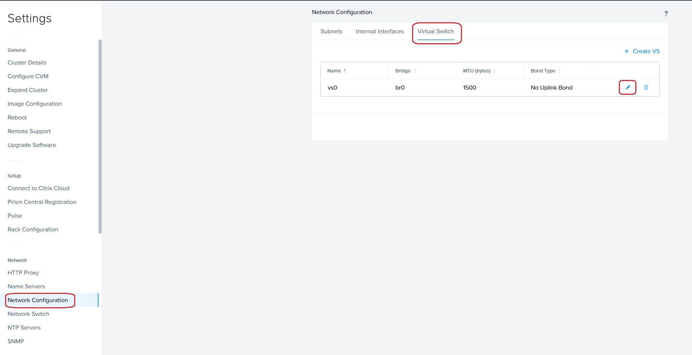
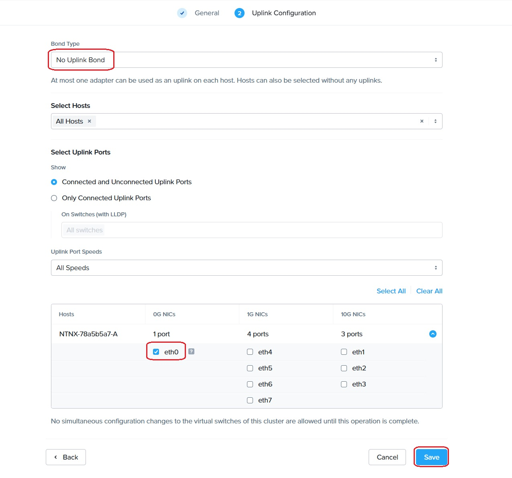
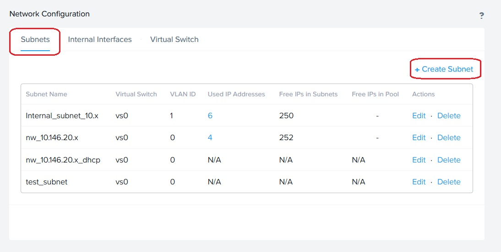
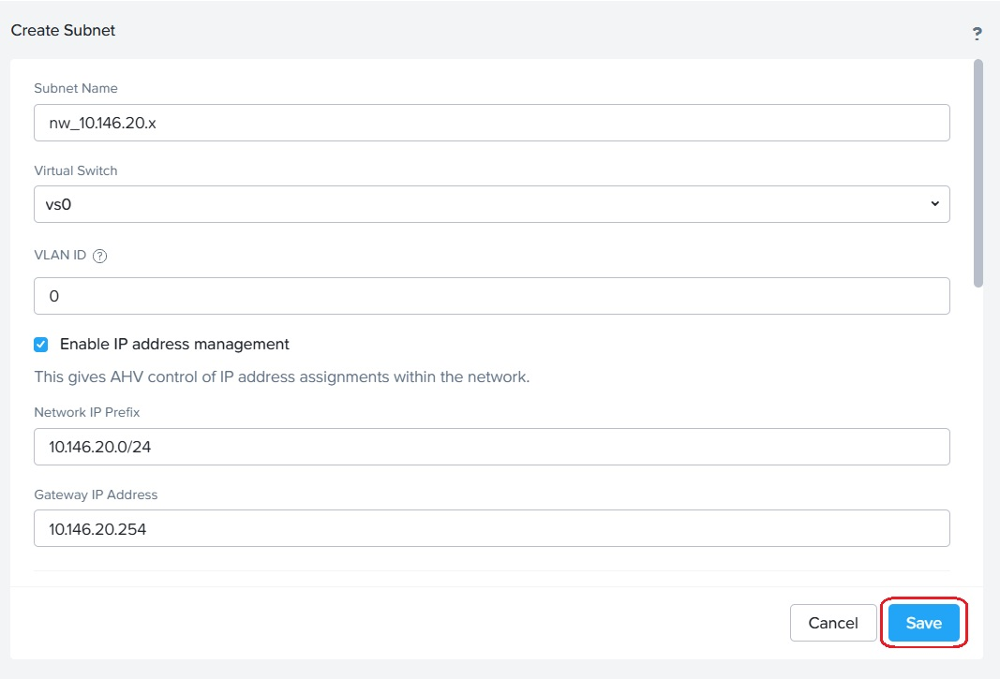

Deploy Secure Mesh Site v2 in Nutanix 
==========================================================================

F5 and Nutanix:
***************
F5 and Nutanix are collaborating to deliver customers’ need on applications deployed on Nutanix Acropolis Hypervisor (AHV) and Nutanix Cloud Cluster (NC2) platform with robust security. F5 simplifies VMware Migration to Nutanix without compromising on application availability and security during the migration process. With F5 Distributed Cloud (F5 XC) integrating with Nutanix ensures seamless application connectivity across different infrastructure. Using F5 XC’s multicloud networking provides secure extended network and security policies across AHV and NC2 with on-premises and multiple cloud environments.

F5 XC uses Customer Edge (CE) software seamlessly connect applications and provide consistent security policy enforcement across hybrid cloud environments and can be controlled by F5 XC console. With one of the modes of CE deployment as Mesh site, CE deployment creates a secure network to connect different environments over the internet or a private network with centralized management.

CE deployment using Secure Mesh Site:
***************
Deploying CE as Secure Mesh Site version 2 (SMSv2) makes deployment and operations faster, simpler and more reliable.

In the article, we explain detail steps to deploy F5 XC CE site as SMSv2 on Nutanix platform. 

Below are the steps to deploy CE on Nutanix, 

1.  Prerequisites on Nutanix platform 
2.  Deploy F5 XC CE on Nutanix 
3.  Deploy Ubuntu VM along with an application 
4.  Add SLI interface to CE node in XC 
5.  LB configuration 

**Step 1: Prerequisites on Nutanix platform**

To successfully create a virtual machine in Nutanix, you must complete following prerequisites, 

As mentioned in `the Installation of Nutanix Community Edition 2.1 on Bare Metal | F5 XC Learn <https://github.com/f5devcentral/f5-xc-terraform-examples/blob/main/workflow-guides/application-delivery-security/Nutanix/nutanix_community_edition_2.1_installation.rst>`__, bare metal you choose to install Nutanix Community Edition requires internet connection and a Nutanix Community account. 

    
Before proceeding to install VM on Nutanix, we need to make sure subnet is created to deploy VMs in that subnet and that subnet should be associated to the Ethernet Interface with internet connectivity to the Bare Metal server.

In my setup, Eth0 is connected to network with internet connectivity and hence I’ll assign Eth0 alone interface to virtual switch and later create a subnet with this virtual switch.

**Step 1.1: Updating virtual switch (vs0) configs in Nutanix Console**

After logging to Nutanix Console, Click on Setting icon to navigate to Global Settings.

* Go to Network > Network configuration. The Network Configuration window appears. 

* Click on Virtual Switch to update the **virtual switch** configurations and click on pencil icon to edit the configs. 

 * Under Uplink Configuration tab, make sure Bond Type is set as **No Uplink Bond** and select the interface that is connected to Bare Metal’s NIC **(eth0 in my case)** and click on Save. Respective interface will be associated to virtual switch vs0. Rest of the configs were set to default. 

        
Interface Eth0 is successfully associated to virtual switch vs0. Now, we can go ahead to configure subnet. 

**Step 1.2: creating a subnet**

* From the Nutanix console, Go to Network > Network configuration. Click on Subnet and click on Create Subnet. 

        
* Provide the necessary information such as DHCP etc, according to the network infrastructure available and click on Save button. 

I have provided details as per my network infrastructure.

With subnet being created to host the VMs, we are good to go for CE node creation in Nutanix console. 

