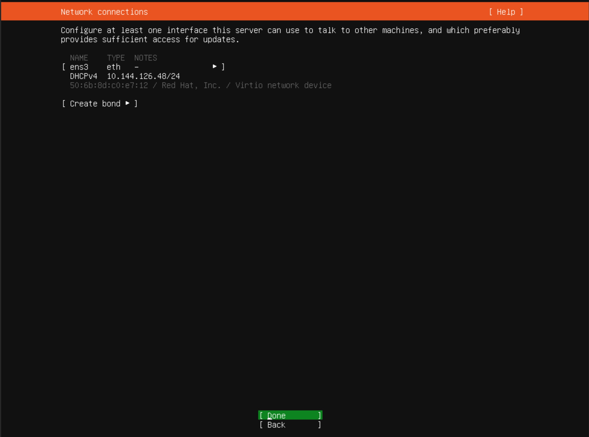

Deploy Secure Mesh Site v2 in Nutanix 
==========================================================================

F5 and Nutanix:
***************
F5 and Nutanix are collaborating to deliver customers’ need on applications deployed on Nutanix Acropolis Hypervisor (AHV) and Nutanix Cloud Cluster (NC2) platform with robust security. F5 simplifies VMware Migration to Nutanix without compromising on application availability and security during the migration process. With F5 Distributed Cloud (F5 XC) integrating with Nutanix ensures seamless application connectivity across different infrastructure. Using F5 XC’s multicloud networking provides secure extended network and security policies across AHV and NC2 with on-premises and multiple cloud environments.

F5 XC uses Customer Edge (CE) software seamlessly connect applications and provide consistent security policy enforcement across hybrid cloud environments and can be controlled by F5 XC console. With one of the modes of CE deployment as Mesh site, CE deployment creates a secure network to connect different environments over the internet or a private network with centralized management.

CE deployment using Secure Mesh Site v2:
***************
Deploying CE as Secure Mesh Site version 2 (SMSv2) makes deployment and operations faster, simpler and more reliable.

In the article, we explain detailed steps to deploy F5 XC CE site as SMSv2 on th Nutanix platform. 

Below are the steps to deploy CE on Nutanix, 

1.  Prepare prerequisites on Nutanix platform 
2.  Deploy F5 XC CE on Nutanix 
3.  Deploy Ubuntu VM along with an application 
4.  Add the SLI interface to CE node in XC 
5.  Configure the Load balancer

**Step 1: Prepare prerequisites on Nutanix platform**

To successfully create a virtual machine in Nutanix, you must complete following prerequisites, 

As mentioned in `the Installation of Nutanix Community Edition 2.1 on Bare Metal | F5 XC Learn <https://github.com/f5devcentral/f5-xc-terraform-examples/blob/main/workflow-guides/application-delivery-security/Nutanix/nutanix_community_edition_2.1_installation.rst>`__, bare metal you choose to install Nutanix Community Edition requires internet connection and a Nutanix Community account. 

    
Before proceeding to install VM on Nutanix, we need to make sure subnet is created to deploy VMs in that subnet and it should be associated to the Ethernet Interface with internet connectivity to the Bare Metal server.

In my setup, Eth0 is connected to network with internet connectivity and hence I’ll assign Eth0 alone interface to virtual switch and later create a subnet with this virtual switch.

**Step 1.1: Updating virtual switch (vs0) configs in Nutanix Console**

After logging to Nutanix Console, Click on Setting icon to navigate to Global Settings.

* Go to Network > Network configuration. The Network Configuration window appears. 

* Click on Virtual Switch to update the **virtual switch** configurations and click on pencil icon to edit the configs. 

.. figure:: Assets/virtual_switch_configs.jpg

 * Under Uplink Configuration tab, make sure Bond Type is set as **No Uplink Bond** and select the interface that is connected to Bare Metal’s NIC **(eth0 in my case)** and click on Save. Respective interface will be associated to virtual switch vs0. Rest of the configs were set to default. 

        
Interface Eth0 is successfully associated to virtual switch vs0. Now, we can go ahead to configure subnet. 

**Step 1.2: creating a subnet**

**Note:** A Static IP should not be assigned to the CE node; instead, DHCP should be used to assign an IP to the CE node. Ensure the subnet is created accordingly to allign this configuration.

* From the Nutanix console, Go to Network > Network configuration. Click on Subnet and click on Create Subnet. 

.. figure:: Assets/subnet_configs.jpg
        
* Provide the necessary information such as DHCP etc, according to the network infrastructure available and click on Save button. 

I have provided details as per my network infrastructure.

With subnet being created to host the VMs, we are good to go for CE node creation in Nutanix console. 

**Step 2: Deploying F5 XC CE on Nutanix**

Below are the series of steps explains the creation of F5 XC CE node in Nutanix console,

**Step 2.1: Create SMSv2 site in F5 XC console**

* From the F5 XC console, select **Multi-Cloud Network connect**.
* Navigate to Manage > Site Management > Secure Mesh Sites v2. Click on **Add Secure Mesh Site**.

* In the Metadeta section, enter a name for the site.

* From the provider section, select Nutanix from the Provider Name dropdown. Keep all other default values.

* Click on Add Secure Mesh Site button. 
* Site object is created successfully and status show waiting for registation.

**Step 2.2: Download node image**

To bring up F5 XC CE node in Nutanix, we need to download the image from the site object created above. Click … > Download Image and save the image locally. 

* Ensure that you validate the MD5SUM of the image for an integrity check. 

**Step 2.3: Generate Node Token**

A one-Time node token is required to register a CE site to the F5 XC console. A new token must be generated for every node in a CE site. A token is valid for 24 hours and hence make sure CE node is deployed soon after token generation. 

* Click Copy cloud-init. 

* Save the value locally and click close. Token is used during CE image boot up process. 

**Step 2.4: Uploading CE image in Nutanix**

* Login to Nutanix console and navigate to Settings, and then click Image configuration on the left pane. 
* Click upload image and browse the image location to upload it. 

* Click on Save to start uploading the image. 

**Step 2.5: Create a VM with the CE image**

Once the image is uploaded successfully, select VM from the upper left bar, and then click Create VM on the upper right side to create a new VM. Make sure VM follows the node requirements mentioned `here <https://docs.cloud.f5.com/docs-v2/multi-cloud-network-connect/how-to/site-management/deploy-sms-nutanix>`__.

.. figure:: Assets/CE_creation_resource_selection.jpg

* Enter a name and set vCPUs as 8 and Memory as 32 GiB. 
* Scroll down to edit the Disks section and remove CD-ROM and add new disk via Clone from Image Service. 
* Select the image from the Image Services created in the previous section. 

* Add a network interface that is connected to an existing IPv4 subnet with internet connectivity as mentioned in step 1.2 
* Scroll down further and click Custom script. 

* In the Type and Past Script field, past the cloud-init information containing site token copied from the Generate Node Token mentioned at step 2.3 

* Click on save to save the VM configs.

.. figure:: Assets/deploy_test_new.jpg

* Power on the VM.

**Step 2.6: Verifying CE site registration**

After powering on the VM in Nutanix console, let’s verify the site status from F5 XC console. It takes around 30 min. for the site to come online.

* In XC console, navigate to Multi-Cloud Network connect > manage > Site Management 
* Site status updates from Waiting for Registration to Provisioning 

* Navigate to Multi-Cloud Network connect > Overview > Infrastructure > Sites.
* SW version shows completed from in progress. Wait till the Site Admin state shows online and Health Score shows 100/100. 

From the above screenshot, you can also see health score shows 100, Data plane and control plane shows up in Site status tile and connectivity to the RE’s also shows up from connectivity tile. This confirms site is up and good to proceed for further process. 

**Step 3: Deploying Ubuntu VM along with an application**

Download Ubuntu Linux version and create a VM in Nutanix to deploy an application in it. This is to access XC CE to the demo application deployed in docker format in Ubuntu machine. 

**Step 3.1: Downloading Ubuntu Linux**

Download the latest version of Ubuntu server version from `here <https://ubuntu.com/download/server>`__. Once download complete, upload the ISO file Nutanix as mentioned in step 2.4 

Once upload is successful. Launch a VM with it and power on the instance, which is similar to the steps followed at section 2.5 

**Step 3.2: Ubuntu boot up process**

Below are the steps followed to bring up Ubuntu image in Nutanix,

.. figure:: Assets/bootup_logs_1.jpg

* Select the language of your choice. 

* Continue the installation without updating to later version of Ubuntu server.

* Select the necessary layout and variant as needs. 

* Configure the network configurations as per your LAN and click on Done to navigate further.

* If proxy is required, configure otherwise move to next step.

* No further modification at Mirror address step. 

* I have provided 35 GB as a storage for this instance.

* Verify the storage configuration details and click on done to proceed further.

* Click on Done and click on continue.

* Provide your profile setup details. 

.. figure:: Assets/ubuntu_installation_ssh_setup.jpg

Installation begins and click on reboot now after completion. 

Login with profile credentials, 

Install prerequisites such as apt update, docker etc. and deploy a demo application.

I have deployed Juice shop demo app. 

**Step 3.3: Adding Data plane interface to the Ubuntu machine**

In this step, we will configure additional interface to the Ubuntu machine to accept user traffic via XC CE,

Below are the steps to get it configured, 

At first, we assign a custom interface to the vm instance in Nutanix console followed by Linux interface configurations, 

**Note:** Make sure you create a custom subnet for data plane interface by following similar steps mentioned in step 1.2 

I have created a custom subnet with IP address 10.10.10.0/24 

* Under Network Adapter (NIC) section, click on **+ Add New NIC**,

* Select the subnet in which interface should be configured and provide the IP address as shown below, 

* Click on Add button to add the interface. 

* Click on Save.

VM Details tile of this instance shows the IP address that was added,

* Using Linux commands add the IP address and perform the self ping.

This confirms internal IP address is added successfully to the VM instance. 

**Step 4: Adding SLI interface to XC CE node**

Adding Site Local Inside (SLI) interface to the CE node acts as a gateway for traffic destined for backend servers and resources within a private network.

At first, we need to attach an interface of same subnet to the XC CE vm instance in Nutanix console. Followed by IP configuration in XC console.

**Step 4.1: Attaching an interface to the CE VM instance**

* Scroll down to the Network Adapters (NIC) section. Click on **+ Add New NIC**.

* Click on Save to save the changes.

VM Details tile of this instance shows the IP address that was added, 

Now, can need to configure the same IP address in XC console as well.

**Step 4.2: Configure SLI interface to CE node**

Below are the steps mentioned to configure SLI in CE node, 

From the XC console, select the site to which SLI interface will be added, 

* Click on Edit configuration. 

* Click on pencil icon for the node under Provider section. 

* Select pencil icon of the SLI interface to add IP address to it.

* Provide the necessary details.

* Click on Apply.

* Click on Save Secure Mesh Site.

You can also see from the site infrastructure, shows the interface that was recently added.

Let’s perform the self ping to the IP address attached to the CE node.

To do that, click on Tools option, enter the IP address 10.10.10.100 in Destination text bar and click on Call ping button.

Result shows ping is successful.

Similarly, ping the IP address assigned to servers’ interface i.e Ubuntu VM data interface. 

This confirms connectivity between CE node and the web server si good, and with this we can proceed to configure Load Balance configuration in XC console.

**Step 5: Configure the Load balancer**

In this step, we configure Origin Pool and Load Balancer and create a WAF policy and generate an attack and observe its behavior,

**Step 5.1: Configuring Origin Pool**

Configure Origin pool by providing the details of the web server with IP address as 10.10.10.200 and Select Network on the Site as **Inside Network**. Click on Apply.

* Enter the port number in which application is running and click on Add Origin Pool button at the bottom to create this origin pool.

**Step 5.2: Creating a Load Balancer**

Provide the necessary domain name to the Load balancer and add the Origin Pool created in above step. Click on Add HTTP Load Balancer.

Load Balancer is up and shows status valid as shown below,

On accessing the domain name in web browser, we can see juice shop app getting displayed, 

.. figure:: Assets/domain_access.jpg

Step 5.3: Create a WAF Policy 

Create a WAF policy and assign to the LB.

Once waf policy is created, assign the WAF policy to the LB.

On accessing test.exe file, which generates an attack of file type violation on applicable, request gets blocked due to WAF firewall,

From the XC console dashboard, we can see the request getting blocked,

This confirms that the application is being protected by F5 XC’s WAF firewall using SMSv2 CE node deployment. 

Conclusion:
***************
Protecting an application residing in Nutanix is seamlessly done by F5 XC services. Deploying CE using SMSv2 and protects the web servers behind them with WAAP capabilities of F5 XC and this deployment also provides a path to connecting the services residing in multiple cloud platforms with on-premises using F5 XC with consistent security and performance. 

Additional Links: 
***************
https://docs.cloud.f5.com/docs-v2/multi-cloud-network-connect/how-to/site-management/deploy-sms-nutanix

https://docs.cloud.f5.com/docs-v2/multi-cloud-app-connect/how-to/create-manage-origin-pools 

https://docs.cloud.f5.com/docs-v2/multi-cloud-app-connect/how-to/load-balance/create-http-load-balancer 

https://docs.cloud.f5.com/docs-v2/web-app-and-api-protection/how-to/app-security/application-firewall 

https://next.nutanix.com/

https://github.com/f5devcentral/f5-xc-terraform-examples/blob/main/workflow-guides/application-delivery-security/Nutanix/nutanix_community_edition_2.1_installation.rst

https://github.com/f5devcentral/f5-xc-terraform-examples/blob/main/workflow-guides/application-delivery-security/Nutanix_on_VMware/Nutanix_CE_2.1_installation_on_VMware.rst

