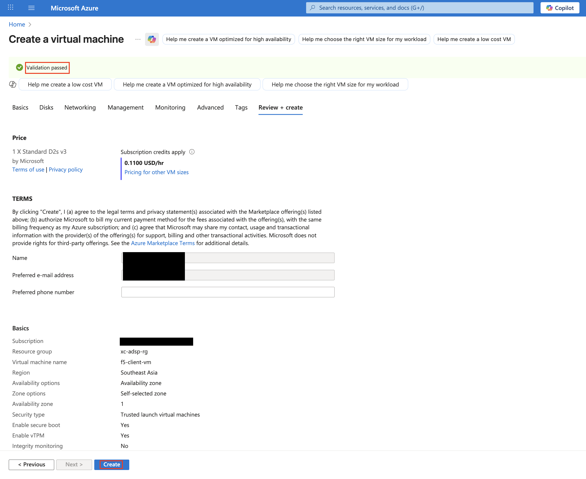
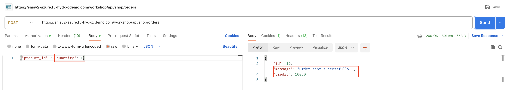

F5 Distributed Cloud SMSv2 CE on Azure with API Protection
#########################################################
Introduction
--------------
This demo guide provides step-by-step walkthrough for enabling API Protection on Secure Mesh Site v2 (SMSv2) Customer Edge (CE) site manually using F5 Distributed Cloud (XC) console.

Contents
--------------
- Deploying SMSv2 CE in Azure
- Deploying Ubuntu VM and applications for testing
- Verifying Connectivity between CE site and Ubuntu VM through SLI
- Creating Origin Pool in Distributed Cloud
- Creating Load Balancer in Distributed Cloud
- Creating WAF configuration and assigning it to LB
- Creating API Protection configuration and assigning it to LB
- Verifying API Protection with tampered requests
- Enabling API Discovery and checking the API discovery graph

Prerequisites
--------------
✅ Access to Azure portal

✅ Access to F5 Distributed Cloud (XC) account

Steps to deploy Secure Mesh Site v2 in Azure
--------------
To deploy Secure Mesh Site v2 (SMSv2) in Azure, follow this `link <https://docs.cloud.f5.com/docs-v2/multi-cloud-network-connect/how-to/site-management/deploy-sms-az-clickops>`__

Steps to deploy VM running application workloads
--------------

1. Login to Azure portal

2. Search for “Virtual Machines” in search bar and click “Create”

3. Provide the required basic details for creating VM under “Basics” tab
    - Select the resource group already created for CE
    - Provide a name for the Ubuntu VM
    - Select the region where you want to deploy
    - Select the OS image to be deployed in VM
    - Choose VM size based on requirements
    - Enter username and SSH key details to access the VM
    - Click “Next : Disks >”

.. image:: ./assets/azure-api/3-smsv2-azure-cvm-2.png

4. Provide OS disk details under “Disks” tab based on requirement and click “Next : Networking >”

5. Under “Networking” tab:
    - Choose the “Virtual Network” created earlier for the CE
    - Select the same “SLI” subnet which is attached to the CE
    - Create a “Public IP” to access the VM and deploy applications
    - Choose the “Network Security Group” created for this VM which has minimal access based on rules created

    .. image:: ./assets/azure-api/5-azure-client-nsg.png

    - Click “Review + create”

.. image:: ./assets/azure-api/6-smsv2-azure-cvm-4.png

6. Under “Review + create” tab, wait for the “Validation passed” message, review the configurations and click “Create”

7. Wait for a few minutes for the deployment to succeed and VM to start running.
    - Public IP should be available, which is used for accessing the VM through SSH
    - Private IP should be assigned from SLI subnet selected

8. Navigate to the CE site in F5 Distributed Cloud and ping the Ubuntu VM private IP, it should be reachable

.. image:: ./assets/azure-api/9-smsv2-azure-cvm-7.png

9. Once the connection is established between CE site and VM, connect to the VM through SSH to deploy application. Execute below commands to deploy a vulnerable application (here “JuiceShop” is used)

    - $ sudo apt update
    - $ sudo apt install docker.io
    - $ sudo  docker run -d -p 3000:3000 bkimminich/juice-shop

Accessing applications through Load Balancers
--------------
To access the applications installed in the Ubuntu machine through SMSv2 Customer Edge (CE), below configurations needs to be followed:

    1. Creating “Origin Pool”
    2. Creating “LB”
    3. Configuring “API Protection”
    4. Configuring “WAF” and applying on the load balancer

Creating Origin Pool
============
1. Under “Multi-Cloud App Connect”, select Load Balancers-> Origin Pools. Click “Add Origin Pool”

.. image:: ./assets/azure-api/10-smsv2-azure-op1.png

2. Provide a name to the Origin Pool and click “Add Item” under Origin Servers

.. image:: ./assets/azure-api/11-smsv2-azure-op2.png

3. Select Origin Server Type IP address of Origin Server on given Sites and provide IP, select VMware site created from the dropdown and make sure Select Network on the site is set to “Inside Network” and click “Apply”

*Note: IP address and Site might vary based on your configuration*

.. image:: ./assets/azure-api/12-1smsv2-azure-op3.png

4. Origin Server details will populate in the Origin Pool page, provide the port of the Ubuntu machine where the application is exposed (in this case 3000) and click “Add Origin Pool”

.. image:: ./assets/azure-api/13-smsv2-azure-op4.png

5. After creating the Origin Pool, this can be used in Load Balancer to access the application.

Creating Load Balancer
============
1. Under “Multi-Cloud App Connect”, select Load Balancers-> HTTP Load Balancers. Click “Add HTTP Load Balancer”

.. image:: ./assets/azure/smsv2-azure-lb1.png

2. Provide name for LB and domain with valid sub-domain

*Note: You should be having domain to use for LB and it should be able to resolve for the FQDN to be accessible*

.. image:: ./assets/azure/smsv2-azure-lb2.png

3. Click on “Add Item” under Origin Pool

.. image:: ./assets/azure/smsv2-azure-lb3.png

4. Select the origin pool created earlier and click “Apply”

5. Enable “Web Application Firewall (WAF)” and click “Add item”

.. image:: ./assets/azure/smsv2-azure-lb5.png

6. Create a new WAF with below configurations and click “Add App Firewall”

.. image:: ./assets/azure/smsv2-azure-lb6.png

7. Select the WAF added and verify the Origin Pool and WAF in LB configuration

8. Scroll down to API Protection and select “Enable” in API Definition field and click “Add Item”

9. Enter a name and click “Upload OpenAPI file”

10. Enter a name and upload the open API/ swagger file for your application (for this demonstration crAPI is used where “minimum” quantity is configured in OpenAPI file which was missing in original file causing the API issue)
GitHub link - https://github.com/OWASP/crAPI/blob/develop/openapi-spec/crapi-openapi-spec.json

11. Click “Add OpenAPI File”

12. Success message will be displayed after adding and the file will be available in the dropdown

13. Select the file from the dropdown and click “Add API Definition”

14. Now from your LB main config page, select “Custom List” for “Validation” field and click Configure

15. Click “Configure” under Validation List

16. Start configuring Validation List, click “Add Item”

17. Enter a name, select “Validate” for “OpenAPI Validation Request Processing Mode” field, select “Block” for field “Request Validation Enforcement Type” and select all available properties in “Request Validation Properties” field, below of the config page select “Base Path - /” for “Type” field and click “Apply”

.. image:: ./assets/azure-api/23-validation-configurations.png

18. Click “Apply” in “Validation List” and “Validation Rules” page as well

19. “API Discovery” is also enabled for this demonstration to showcase the Distributed Cloud’s ability to perform automation discovery of APIs exposed by the application and to generate swagger definition

20. Click “Add HTTP Load Balancer” and wait for around ~5 minutes for LB to provision and come up completely.

.. image:: ./assets/azure/smsv2-azure-lb8.png

21. Access the LB URL and crAPI application should be available which is deployed in Ubuntu VM using docker and exposed through port 8888

22. Create an account using “SignUp” and login using that account and navigate to “Shop” tab

23. Buy an item and observe the balance getting decreased, which is expected scenario

24. Now using the request details (URL, Method and Payload) craft a request with a negative quantity, observe the request is getting blocked by F5 Distributed Cloud, based on our minimum quantity configuration in OpenAPI file

25. If “API Protection” was not enabled and sending the request with negative quantity would trigger the credit to increase, which is a critical bug

26. “API Discovery” enabled in Step 19 will take some time based on application traffic and number of APIs, once the discovery process is done, below is the sample API graph output

Conclusion
--------------
This guide demonstrated how to enable WAF on an SMSv2 CE site using the F5 Distributed Cloud console. You deployed the CE in Azure, set up a test ubuntu, and configured origin pools and load balancers. WAF was successfully applied and verified with test attacks. This setup also supports additional security services like API Security, Bot Defense, and DDoS protection, allowing for flexible and robust application protection.