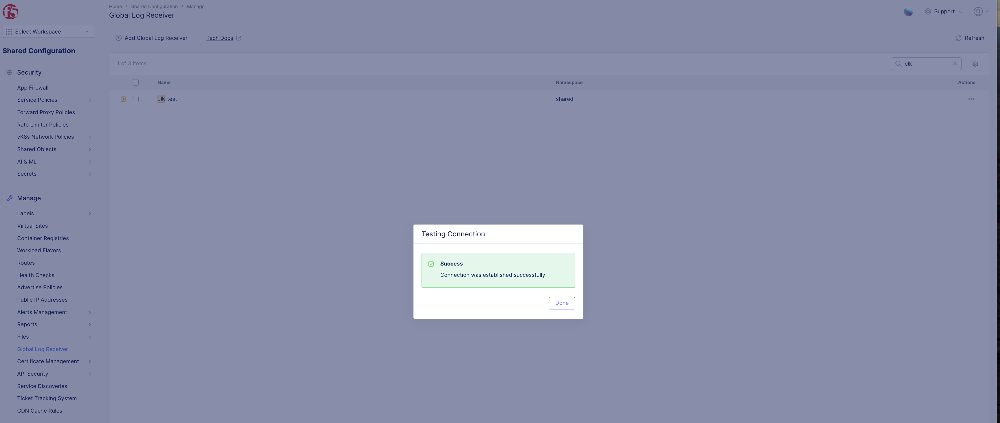
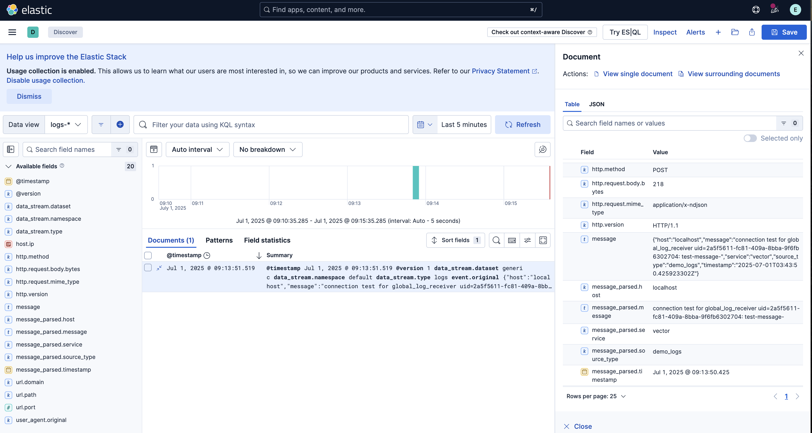

F5 Distributed Cloud WAAP Telemetry (ELK Stack) 
#########################################################

Prerequisites:
--------------

-  `F5 Distributed Cloud (F5 XC) Account <https://console.ves.volterra.io/signup/usage_plan>`__
-  `GCP Account <https://cloud.google.com/docs/get-started>`__
-  `SSH key pair <https://cloud.google.com/compute/docs/connect/create-ssh-keys>`__
-  `GCP Service Account <https://community.f5.com/kb/technicalarticles/creating-a-credential-in-f5-distributed-cloud-for-gcp/298290>`__
-  `Terraform <https://developer.hashicorp.com/terraform/tutorials/aws-get-started/install-cli>`__

List of Assets:
----------------

-  **Infra:** GCP VM
-  **SIEM tool:** ELK stack
-  **XC:** F5 Distributed Cloud GLR

Tools:
------

-  **Cloud Provider:** GCP
-  **IAC:** Terraform
-  **IAC State:** GCS Bucket

Environment Variables:
----------------------

   +------------------------------------------+--------------+------------------------------------------------------+
   |         **Name**                         |  **Type**    |      **Description**                                 |
   +==========================================+==============+======================================================+
   | GOOGLE_APPLICATION_CREDENTIALS           | Environment  | Google Service Account credentials file path.        |
   +------------------------------------------+--------------+------------------------------------------------------+
   | VES_P12_PASSWORD                         | Environment  | Password set while creating F5XC API certificate     |
   +------------------------------------------+--------------+------------------------------------------------------+

Terraform Variables (`gcs_bucket Folder <https://github.com/f5devcentral/f5-xc-terraform-examples/tree/main/telemetry/f5-xc-telemetry-elk/logs/gcs_bucket>`__):
----------------------------------------

   +------------------------------------------+--------------+------------------------------------------------------+
   |         **Name**                         |  **Type**    |      **Description**                                 |
   +==========================================+==============+======================================================+
   | project_id                               |    string    | GCP Project ID                                       |
   +------------------------------------------+--------------+------------------------------------------------------+
   | region                                   |    string    | Deployment Region                                    |
   +------------------------------------------+--------------+------------------------------------------------------+
   | bucket_name                              |    string    | GCS Bucket Name                                      |
   +------------------------------------------+--------------+------------------------------------------------------+
   | storage_location                         |    string    | GCS Bucket Location                                  |
   +------------------------------------------+--------------+------------------------------------------------------+ 

Terraform Variables (`elk_vm Folder <https://github.com/f5devcentral/f5-xc-terraform-examples/tree/main/telemetry/f5-xc-telemetry-elk/logs/elk_vm>`__):
------------------------------------

   +------------------------------------------+--------------+------------------------------------------------------+
   |         **Name**                         |  **Type**    |      **Description**                                 |
   +==========================================+==============+======================================================+
   | project_id                               |    string    | GCP Project ID                                       |
   +------------------------------------------+--------------+------------------------------------------------------+
   | region                                   |    string    | Deployment Region                                    |
   +------------------------------------------+--------------+------------------------------------------------------+
   | zone                                     |    string    | Deployment Zone                                      |
   +------------------------------------------+--------------+------------------------------------------------------+
   | fw                                       |    string    | Firewall Name                                        |
   +------------------------------------------+--------------+------------------------------------------------------+ 
   | vm                                       |    string    | VM Name                                              |
   +------------------------------------------+--------------+------------------------------------------------------+
   | vpc                                      |    string    | VPC Name                                             |
   +------------------------------------------+--------------+------------------------------------------------------+ 

Terraform Variables (`xc_glr Folder <https://github.com/f5devcentral/f5-xc-terraform-examples/tree/main/telemetry/f5-xc-telemetry-elk/logs/xc_glr>`__):
-----------------------------------

   +------------------------------------------+--------------+------------------------------------------------------+
   |         **Name**                         |  **Type**    |      **Description**                                 |
   +==========================================+==============+======================================================+
   | bucket_name                              |    string    | GCS Bucket Name                                      |
   +------------------------------------------+--------------+------------------------------------------------------+
   | xc_url                                   |    string    | F5 XC tenant api url                                 |
   +------------------------------------------+--------------+------------------------------------------------------+
   | api_p12                                  |    string    | F5XC API certificate                                 |
   +------------------------------------------+--------------+------------------------------------------------------+
   | all_namespaces                           |    boolean   | Set to collect logs from all namespaces              |
   +------------------------------------------+--------------+------------------------------------------------------+ 
   | namespace_list                           | list(string) | Set to collect logs from specific namespaces         |
   +------------------------------------------+--------------+------------------------------------------------------+
   | current_namespace                        |   boolean    | Set to collect logs from current namespace           |
   +------------------------------------------+--------------+------------------------------------------------------+ 

Steps of execution:
-------------------

**STEP 1:** Clone the Repo. Navigate to `gcs_bucket <https://github.com/f5devcentral/f5-xc-terraform-examples/tree/main/telemetry/f5-xc-telemetry-elk/logs/gcs_bucket>`__ folder

**STEP 2:** Update `terraform.tfvars` file with your input values.

**Note:** Set `GOOGLE_APPLICATION_CREDENTIALS` and `VES_P12_PASSWORD` as an environment variables

**STEP 3:** Run terraform commands:
   +----------------------------------------------------------------------------------------------------------------+
   |        - terraform init                                                                                        |
   |        - terraform plan                                                                                        |
   |        - terraform apply -auto-approve                                                                         |
   +----------------------------------------------------------------------------------------------------------------+

**STEP 4:** Switch to `elk_vm <https://github.com/f5devcentral/f5-xc-terraform-examples/tree/main/telemetry/f5-xc-telemetry-elk/logs/elk_vm>`__ folder.

**STEP 5:** Update `terraform.tfvars` file with your input values and set the bucket name in `backend.tfvars` file.

**STEP 6:** Run terraform commands:
   +----------------------------------------------------------------------------------------------------------------+
   |        - terraform init -backend-config=backend.tfvars                                                         |
   |        - terraform plan                                                                                        |
   |        - terraform apply -auto-approve                                                                         |
   +----------------------------------------------------------------------------------------------------------------+

**STEP 7:** Atlast visit to `xc_glr <https://github.com/f5devcentral/f5-xc-terraform-examples/tree/main/telemetry/f5-xc-telemetry-elk/logs/xc_glr>`__ folder.

**STEP 8:** Create public/private ssh keys to access the ELK VM and store them to this same folder.

**STEP 9:** Repeat `STEP 2 and STEP 3`.

**Note:** Bucket Name will be the same in all `.tfvars` files and it must be globally unique.

Validation:
------------

- Open F5 XC console and navigate to Shared Configuration > Manage > Global Log Receiver.

- Filter out your created GLR and click on the Actions ellipsis (...) present on the right of the UI.

- Select `Test Connection`. It will check the reachability to the ELK Stack.

- Confirm the same by visiting to ELK Stack UI console. Use default creds (Username: elastic, Password: changeme)

**Note:** This automation only deals with setting up of the ELK VM and GLR in XC, assuming there already exists LBs handling traffic in the namespace provided as variables

