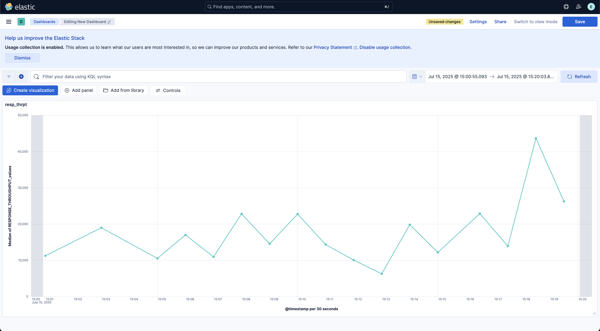

F5 Distributed Cloud Telemetry: Metrics (ELK Stack) 
#########################################################

Prerequisites:
--------------

-  `F5 Distributed Cloud (F5 XC) Account <https://console.ves.volterra.io/signup/usage_plan>`__
-  `GCP Account <https://cloud.google.com/docs/get-started>`__
-  `SSH key pair <https://cloud.google.com/compute/docs/connect/create-ssh-keys>`__
-  `ELK on docker <https://github.com/deviantony/docker-elk>`__

User Inputs:
------------

**For exporter script:**

   +------------------------------------------+--------------+-----------------------------------------------------------------------------------------------+
   |         **Name**                         |  **Type**    |      **Description**                                                                          |
   +==========================================+==============+===============================================================================================+
   | xc_api_token                             |    String    | Distributed Cloud API Token for accessing XC APIs                                             |
   +------------------------------------------+--------------+-----------------------------------------------------------------------------------------------+
   | http_lb_name                             |    String    | Load Balancer name (if empty means metrics data of all LBs in the namespace will be collected)|
   +------------------------------------------+--------------+-----------------------------------------------------------------------------------------------+
   | tenant_name                              |    String    | XC Tenant name                                                                                |
   +------------------------------------------+--------------+-----------------------------------------------------------------------------------------------+
   | namespace                                |    String    | XC Nampespace                                                                                 |
   +------------------------------------------+--------------+-----------------------------------------------------------------------------------------------+
   | elk_idx                                  |    String    | ELK Index name (XC metrics data will be exported here)                                        |
   +------------------------------------------+--------------+-----------------------------------------------------------------------------------------------+
   | es_url                                   |    String    | Elasticsearch URL/IP                                                                          |
   +------------------------------------------+--------------+-----------------------------------------------------------------------------------------------+

**For shell script:**

- Number of times metrics data endpoint needed to be called
- Flask webserver IP 
- Time duration after which XC metrics data needed to be fetched

Steps of execution:
-------------------

**Note:** Here we have assumed ELK Stack on docker is already deployed

**STEP 1:** Create a VM and clone the repo. Now, navigate to telemetry > f5-xc-telemetry-elk > metrics

**STEP 2:** Update `user_inputs.json` file and run the exporter script inside the VM:
   +----------------------------------------------------------------------------------------------------------------+
   |        - python3 exporter.py                                                                                   |
   +----------------------------------------------------------------------------------------------------------------+

**STEP 3:** Copy metrics.sh to your local machine, run the script and provide inputs from command line:
   +----------------------------------------------------------------------------------------------------------------+
   |        - sh metrics.sh                                                                                         |
   +----------------------------------------------------------------------------------------------------------------+

**STEP 4:** Open ELK dashboard, select your index name, use the gathered values to plot graphs/charts.

**Note:** This automation only deals with collecting metrics data from XC, assuming there already exists LBs handling traffic in the namespace provided as user input.