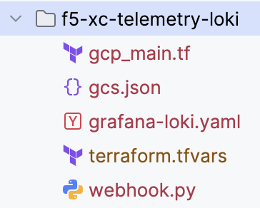
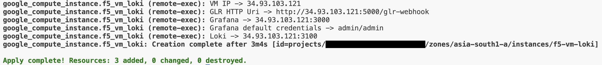
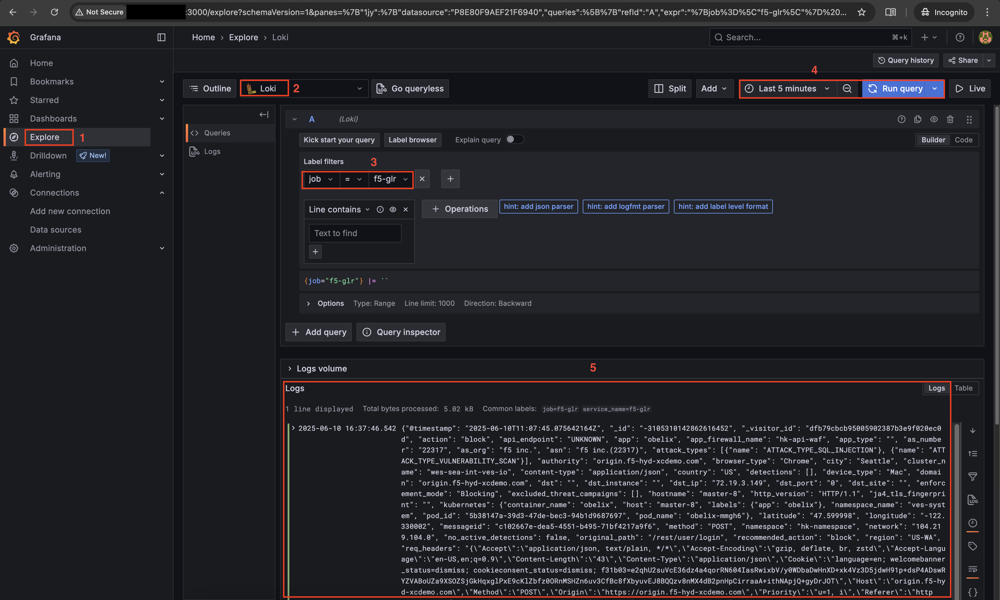

F5 Distributed Cloud Telemetry(Logs): Loki
#########################################################

Prerequisites
--------------
-  `F5 Distributed Cloud (F5 XC) Account <https://console.ves.volterra.io/signup/usage_plan>`__
-  `GCP Account <https://cloud.google.com/docs/get-started>`__
-  `SSH key pair <https://cloud.google.com/compute/docs/connect/create-ssh-keys>`__
-  `GCP Service Account <https://community.f5.com/kb/technicalarticles/creating-a-credential-in-f5-distributed-cloud-for-gcp/298290>`__
-  `Terraform <https://developer.hashicorp.com/terraform/tutorials/aws-get-started/install-cli>`__

Tools
----------------
- **Cloud Provider:** GCP
- **IAC:** Terraform

Terraform Variables (terraform.tfvars)
----------------------

   +------------------------------------------+--------------+-----------------------------------------------------------+
   |         **Variable Name**                |  **Type**    |      **Description**                                      |
   +==========================================+==============+===========================================================+
   | project_id                               |    string    | GCP Project ID                                            |
   +------------------------------------------+--------------+-----------------------------------------------------------+
   | region                                   |    string    | GCP Deployment Region                                     |
   +------------------------------------------+--------------+-----------------------------------------------------------+
   | zone                                     |    string    | GCP Deployment Zone                                       |
   +------------------------------------------+--------------+-----------------------------------------------------------+
   | gcp_credentials_file                     |    string    | Path of GCP json credentials file                         |
   +------------------------------------------+--------------+-----------------------------------------------------------+
   | ssh_key_path                             |    string    | Path of SSH key to access VM instance                     |
   +------------------------------------------+--------------+-----------------------------------------------------------+

Steps of execution
----------------------

**STEP 1:** Clone the repo and navigate to **telemetry -> f5-xc-telemetry-loki**

**Note:** "gcs.json" won't be available when cloned, I've added into the current directory for my ease and is private to me

**STEP 2:** Rename `terraform.tfvars.example` to `terraform.tfvars` and update all the variables as per your setup

**STEP 3:** Run terraform commands
   +----------------------------------------------------------------------------------------------------------------+
   |        - terraform init                                                                                        |
   |        - terraform plan                                                                                        |
   |        - terraform apply                                                                                       |
   +----------------------------------------------------------------------------------------------------------------+
**Note:** This complete execution will take around 5 minutes to complete and script will give you all the required URLs/IP for GLR HTTP URI and to access VM, Grafana, etc.

**STEP 4:** Access the Grafana URL and login using default credentials
- Navigate to **Explore** menu
- Select **“Loki”** in data source picker
- Choose appropriate label and value, in this case **label=job and value=f5-glr**
- Select desired time range and click **“Run query”**
- Observe logs will be displayed based on “Log Type” selected in F5 XC GLR Configuration
**Note: Some requests need to be generated for logs to be visible in Grafana based on Log Type selected**

**STEP 5:** If you want to destroy the entire setup, run terraform command
   +----------------------------------------------------------------------------------------------------------------+
   |        - terraform destroy                                                                                     |
   +----------------------------------------------------------------------------------------------------------------+

**Note: This automation only deals with receiving logs from F5 Distributed Cloud(XC) Global Log Receiver, assuming there already exists LBs handling traffic in the namespace provided in GLR configuration**
