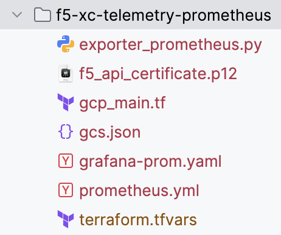
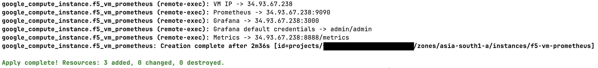
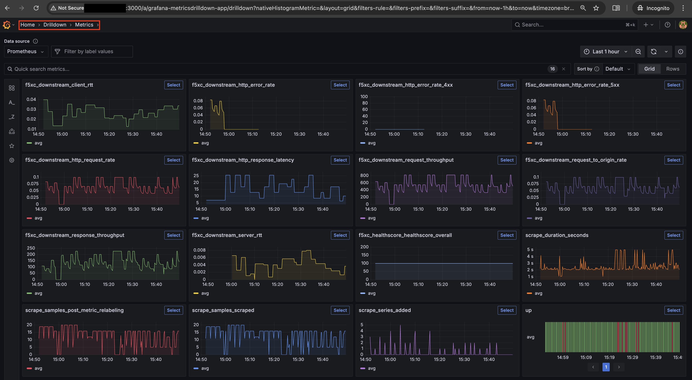

F5 Distributed Cloud Telemetry(Metrics) : Prometheus
#########################################################

Prerequisites:
--------------

-  `F5 Distributed Cloud (F5 XC) Account <https://console.ves.volterra.io/signup/usage_plan>`__
-  `GCP Account <https://cloud.google.com/docs/get-started>`__
-  `SSH key pair <https://cloud.google.com/compute/docs/connect/create-ssh-keys>`__
-  `GCP Service Account <https://community.f5.com/kb/technicalarticles/creating-a-credential-in-f5-distributed-cloud-for-gcp/298290>`__
-  `Terraform <https://developer.hashicorp.com/terraform/tutorials/aws-get-started/install-cli>`__

Tools:
------

-  **Cloud Provider:** GCP
-  **IAC:** Terraform

Terraform Variables (terraform.tfvars):
-----------------------------------

   +------------------------------------------+--------------+------------------------------------------------------+
   |         **Name**                         |  **Type**    |      **Description**                                 |
   +==========================================+==============+======================================================+
   | project_id                               |    string    | GCP Project ID                                       |
   +------------------------------------------+--------------+------------------------------------------------------+
   | region                                   |    string    | GCP region                                           |
   +------------------------------------------+--------------+------------------------------------------------------+
   | zone                                     |    string    | GCP zone in your region                              |
   +------------------------------------------+--------------+------------------------------------------------------+
   | gcp_credentials_file                     |    string    | Path of GCP json credentials file                    |
   +------------------------------------------+--------------+------------------------------------------------------+
   | ssh_key_path                             |    string    | Path of SSH key to access VM instance                |
   +------------------------------------------+--------------+------------------------------------------------------+
   | f5_api_cert_path                         |    string    | Path of F5 Distributed Cloud API certificate         |
   +------------------------------------------+--------------+------------------------------------------------------+
   | f5_api_cert_password                     |    string    | F5 Distributed Cloud API certificate password        |
   +------------------------------------------+--------------+------------------------------------------------------+
   | f5_tenant                                |    string    | F5 Distributed Cloud tenant name                     |
   +------------------------------------------+--------------+------------------------------------------------------+
   | f5_namespace                             |    string    | F5 Distributed Cloud namespace                       |
   +------------------------------------------+--------------+------------------------------------------------------+
   | f5_lb_name                               |    string    | F5 Distributed Cloud load balancer name(not LB domain URL)                 |
   +------------------------------------------+--------------+------------------------------------------------------+

Steps of execution:
-------------------

### STEP 1: Clone the repo. Now, navigate to telemetry > f5-xc-telemetry-prometheus

**Note:** `f5_api_certificate.p12` and `gcs.json` won't be available when cloned, I've added into the current directory for my ease and are private to me:

### STEP 2: Rename `terraform.tfvars.example` to `terraform.tfvars` and update all the variables as per your setup

### STEP 3: Run terraform commands
   +-------------------------------------------------------+
   |        - terraform init                               |
   |        - terraform plan                               |
   |        - terraform apply                              |
   +-------------------------------------------------------+
**Note:** This complete execution will take around 5 minutes to complete and script will give you all the required URLs to access Grafana, Prometheus, etc.

### STEP 4: Access the Grafana URL and login using default credentials
After logging in, in the Grafana left menu panel, expand "Drilldown" and select "Metrics"
You should be seeing different charts of all metrics

### STEP 5: If you want to destroy the entire setup, run terraform command
   +-------------------------------------------------------+
   |        - terraform destroy                            |
   +-------------------------------------------------------+

**Note:** This automation only deals with collecting metrics data from F5 Distributed Cloud(XC), assuming there already exists LBs handling traffic in the namespace provided as user input.
