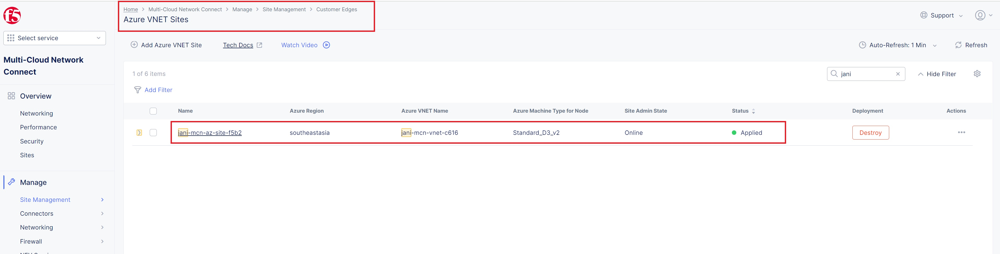
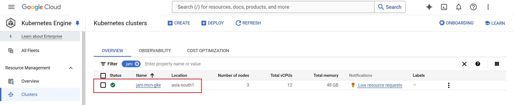

Getting started of MCN terraform automation using SMG
#########################################################

Prerequisites
--------------

-  `F5 Distributed Cloud (F5 XC) Account <https://console.ves.volterra.io/signup/usage_plan>`__
-  `GCP Account <https://cloud.google.com/docs/get-started>`__
-  `Azure Account <https://azure.microsoft.com/en-in/get-started/azure-portal/>`__
-  `Terraform Cloud Account <https://developer.hashicorp.com/terraform/tutorials/cloud-get-started>`__
-  `GitHub Account <https://github.com>`__
-  `SSH key pair <https://cloud.google.com/compute/docs/connect/create-ssh-keys>`__
-  `GCP Service Account <https://community.f5.com/kb/technicalarticles/creating-a-credential-in-f5-distributed-cloud-for-gcp/298290>`__

List of Existing Assets
------------------------

-  **xc:** F5 Distributed Cloud WAF
-  **infra:** GCP and Azure Infrastructure
-  **App:** Bookinfo demo application

Tools
------

-  **Cloud Provider:** GCP and Azure
-  **IAC:** Terraform
-  **IAC State:** Terraform Cloud
-  **CI/CD:** GitHub Actions

Terraform Cloud
----------------

-  **Workspaces:** Create CLI or API workspaces for each asset in the
   workflow. ``NOTE: Please use unique workspaces for each work-flow and don't club them with other use cases as you may run into conflicting cloud resource and provider errors.``

   +---------------------------+---------------------------------------------------------------+
   |         **Workflow**      |  **Assets/Workspaces**                                        |
   +===========================+===============================================================+
   | deploy-mcn-smg            | gcp-infra,azure-infra, aks-cluster, gke, product, details, xc                  |
   +---------------------------+---------------------------------------------------------------+

-  **Workspace Sharing:** Under the settings for each Workspace, set the
   **Remote state sharing** to share with each Workspace created.

-  **Variable Set:** Create a Variable Set with the following values and them as sensitive:

   +------------------------------------------+--------------+------------------------------------------------------+
   |         **Name**                         |  **Type**    |      **Description**                                 |
   +==========================================+==============+======================================================+
   | GOOGLE_CREDENTIALS                       | Environment  | Google credentials file content of Service Account   |
   +------------------------------------------+--------------+------------------------------------------------------+
   | VES_P12_PASSWORD                         | Environment  | Password set while creating F5XC API certificate     |
   +------------------------------------------+--------------+------------------------------------------------------+
   | VOLT_API_P12_FILE                        | Environment  | Your F5XC API certificate. Set this to **api.p12**   |
   +------------------------------------------+--------------+------------------------------------------------------+
   | ssh_key                                  | TERRAFORM    | Your ssh key for accessing the created resources     |
   +------------------------------------------+--------------+------------------------------------------------------+
   | tf_cloud_organization                    | TERRAFORM    | Your Terraform Cloud Organization name               |
   +------------------------------------------+--------------+------------------------------------------------------+
   | TF_VAR_azure_service_principal_appid     | TERRAFORM    | Your Azure Account credentials                       |
   +------------------------------------------+--------------+------------------------------------------------------+
   | TF_VAR_azure_service_principal_password  | TERRAFORM    | Your Azure Account credentials                       |
   +------------------------------------------+--------------+------------------------------------------------------+
   | TF_VAR_azure_subscription_id             | TERRAFORM    | Your Azure Account credentials                       |
   +------------------------------------------+--------------+------------------------------------------------------+
   | TF_VAR_azure_subscription_tenant_id      | TERRAFORM    | Your Azure Account credentials                       |
   +------------------------------------------+--------------+------------------------------------------------------+

GitHub
-------

-  Fork and Clone Repo. Navigate to ``Actions`` tab and enable it.

-  **Actions Secrets:** Create the following GitHub Actions secrets in
   your forked repo

   -  P12: The linux base64 encoded F5XC P12 certificate. NOTE: you can run `base64 <file-name>` to get this output
   -  TF_API_TOKEN: Your Terraform Cloud API token
   -  TF_CLOUD_ORGANIZATION: Your Terraform Cloud Organization name
   -  GOOGLE_CREDENTIALS: Your GCP credentials file content
   -  SSH_KEY: Your ssh key file without spaces
   -  TF_CLOUD_WORKSPACE\_\ *<Workspace Name>*: Create for each
      workspace in your workflow per each job

      -  TF_CLOUD_WORKSPACE_GCP_INFRA would be created with the
         value ``gcp-infra``

      -  TF_CLOUD_WORKSPACE_GKE would be created with the
         value ``gke``

      -  TF_CLOUD_WORKSPACE_PRODUCT would be created with the
         value ``product``

      -  TF_CLOUD_WORKSPACE_AZURE_INFRA would be created with the
         value ``azure-infra``

      -  TF_CLOUD_WORKSPACE_AKS_CLUSTER would be created with the
         value ``aks-cluster``

      -  TF_CLOUD_WORKSPACE_DETAILS would be created with the
         value ``details``

      -  TF_CLOUD_WORKSPACE_XC would be created with the
         value ``xc``

Workflow Runs
--------------

**STEP 1:** Check out a branch with the branch name as suggested below for the workflow you wish to run using
the following naming convention.

**DEPLOY**

================================               =======================
Workflow                                       Branch Name
================================               =======================
Deploy F5 XC MCN                                deploy-mcn-smg
================================               =======================

Workflow File: `mcn-smg-apply.yaml </.github/workflows/mcn-smg-deploy.yaml>`__

**DESTROY**

================================               =======================
Workflow                                       Branch Name
================================               =======================
Destroy F5 XC MCN                               destroy-mcn-smg
================================               =======================

Workflow File: `mcn-smg-destroy.yaml </.github/workflows/mcn-smg-destroy.yaml>`__

**Note:** Make sure to comment line no. 16 (# *.tfvars) in ".gitignore" file

**STEP 2:** Rename ``gcp/infra/terraform.tfvars.examples`` to ``gcp/infra/terraform.tfvars`` and add the following data:

-  project_prefix = “Your project identifier name in **lower case** letters only - this will be applied as a prefix to all assets”

-  gcp_region = “GCP Region/Location” ex. "asia-south1"

-  gcp_project_id = “User GCP project ID"

-  Also update assets boolean value to false

**STEP 3:** Rename ``azure/infra/terraform.tfvars.examples`` to ``azure/infra/terraform.tfvars`` and update the following data:
-  project_prefix = “Your project identifier name in **lower case** letters only - this will be applied as a prefix to all assets”

-  azure_region = “Azure Region/Location” ex. "southeastasia"

-  Also update Assets booleans value to false

**Step 4:** Rename ``workflow-guides/waf/f5-xc-waf-on-ce-multicloud/MCN-with-SMG/terraform/xc/terraform.tfvars.examples`` to ``terraform.tfvars`` and update the following data:

-  api_url = “Your F5XC tenant”

-  xc_tenant = “Your tenant id available in F5 XC ``Administration`` section ``Tenant Overview`` menu”

-  xc_namespace = “The existing XC namespace where you want to deploy resources”

-  app_domain = “the FQDN of your app (cert will be autogenerated)”

-  xc_waf_blocking = “Set to true to enable blocking”

**STEP 5:** Commit and push your build branch to your forked repo

- Build will run and can be monitored in the GitHub Actions tab and TF Cloud console. ``If CICD failed because of intermittent timing issue, rerun the work-flow again.``

**STEP 6:** Once the pipeline completes, verify your CE's, Origin Pools and LB's were deployed. (**Note:** CE sites will take 15-20 mins to come online)

**STEP 7:** Once CE sites are online, to validate the test infra & demo app accessibility, copy the public IP of CE site in `GCP CE Site View mode`. 

.. image:: assets/gcp-site-ip.jpg

Add this IP in your hosts file mapping to your product page load balancer domain name (or you can create A record in your domain registrar). You should be able to access the demo application and if you click on normal user in the UI, you should be able to see all micro services like reviews, details ( hosted in azure), etc as shown in the image below:

**STEP 8:** If you want to destroy the entire setup, checkout a branch with name ``destroy-mcn-smg`` (using current ``deploy-mcn-smg`` branch) which will trigger destroy workflow and will remove all created resources

